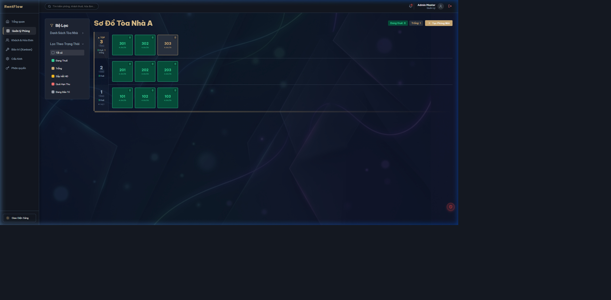
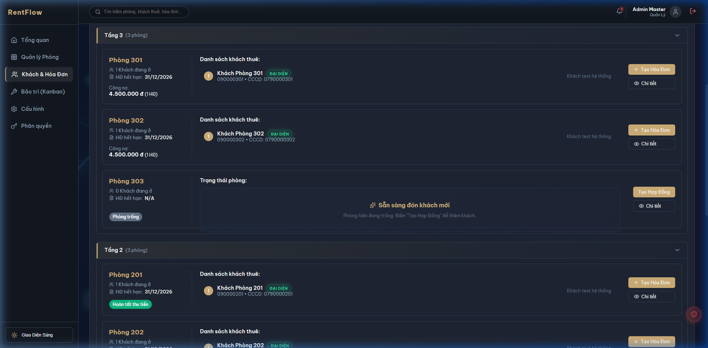
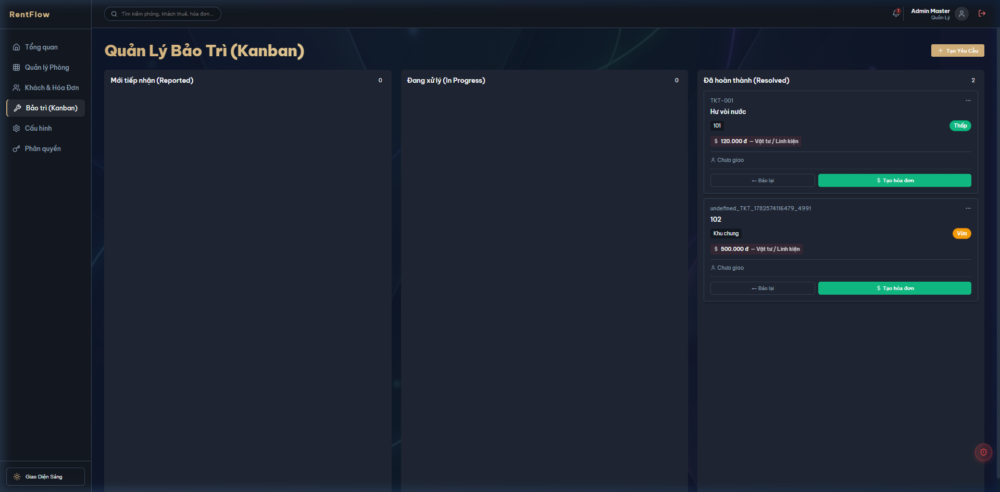

# 📖 HƯỚNG DẪN SỬ DỤNG PHẦN MỀM QUẢN LÝ CHDV (RENTFLOW)
*Tài liệu dành cho người mới bắt đầu*

---

## 🌟 1. Giới thiệu chung
Chào mừng bạn đến với hệ thống **Quản Lý CHDV (RentFlow)**! Đây là giải pháp phần mềm toàn diện giúp bạn tự động hóa hoàn toàn công việc vận hành căn hộ dịch vụ, nhà trọ. 
Thay vì phải dùng sổ sách hay Excel rườm rà, giờ đây mọi thông tin về Khách thuê, Hợp đồng, Hóa đơn (điện, nước), và Báo cáo tài chính đều được quản lý tập trung trên một giao diện hiện đại và trực quan.

---

## 🚀 2. Quy trình 4 bước cho người mới (Workflow)

Nếu bạn là người mới lần đầu sử dụng, hãy thao tác theo thứ tự sau để hệ thống hoạt động trơn tru nhất:

1. **Thiết lập cơ bản:** Vào menu `Cấu hình` -> Khai báo danh sách các Tòa nhà và thiết lập Đơn giá dịch vụ mặc định (Giá điện, giá nước, rác, wifi...).
2. **Khởi tạo không gian:** Vào menu `Quản lý Phòng` -> Tạo các phòng tương ứng cho từng Tòa nhà (Số phòng, diện tích, giá thuê).
3. **Đón khách mới:** Vào menu `Khách & Hóa Đơn` -> Bấm nút **Tạo Hợp Đồng** tại các phòng trống để điền thông tin khách thuê, số CCCD, tiền cọc và ngày hết hạn.
4. **Vận hành hàng tháng:** Cuối tháng, vào menu `Khách & Hóa Đơn` -> Chốt số điện/nước -> Bấm **Tạo Hóa Đơn** và gửi cho khách. Khi khách đóng tiền, chuyển trạng thái hóa đơn sang "Đã thu".

---

## 🛠 3. Giải thích các Menu Tính Năng

### 📊 3.1. Tổng Quan (Dashboard)

- Nơi cung cấp cái nhìn toàn cảnh về tình hình kinh doanh của bạn.
- Hiển thị biểu đồ **Doanh thu & Lợi nhuận**, Tỷ lệ lấp đầy phòng (Số phòng trống / đang thuê).
- Cung cấp các nút Thao tác nhanh: **Xuất Báo Cáo Tài Chính**, **Nhập Dữ Liệu**, và **Backup Dữ Liệu (Excel)**.

### 🏢 3.2. Quản Lý Phòng

- Trình bày toàn bộ danh sách phòng theo từng Tòa nhà (Nhà A, Nhà B...) dưới dạng thẻ thông tin.
- Có thể chỉnh sửa nhanh giá thuê, diện tích, tình trạng thiết bị trong phòng.

### 👥 3.3. Khách & Hóa Đơn

Đây là màn hình bạn sẽ làm việc nhiều nhất, chia làm 2 tab chính:
- **Tab Phòng & Khách Thuê:** Xem thông tin ai đang ở phòng nào, hợp đồng bao giờ hết hạn, tình trạng công nợ hiện tại. Hỗ trợ tạo hợp đồng mới và làm hóa đơn nhanh.
- **Tab Hóa Đơn:** Bảng tổng hợp toàn bộ hóa đơn của tất cả các phòng. Cung cấp bộ lọc theo tháng, tình trạng thanh toán (Chưa thu / Đã thu / Thu một phần). Nút xuất hóa đơn ra file Ảnh/PDF (In Biên Lai) cực kỳ chuyên nghiệp.

### 🔧 3.4. Bảo Trì (Kanban)

- Nơi quản lý các yêu cầu sửa chữa (Hư bóng đèn, kẹt ống nước...) của khách hàng.
- Giao diện kéo-thả (Kanban board) trực quan qua 3 cột: `Mới báo` -> `Đang xử lý` -> `Đã hoàn thành`.
- Ghi nhận chi phí sửa chữa để trừ vào lợi nhuận cuối tháng.

### ⚙️ 3.5. Phân Quyền & Cấu Hình
- **Phân quyền:** Dành cho chủ nhà (Admin) muốn cấp tài khoản cho Quản lý / Bảo vệ. Bạn có thể giới hạn quyền xem: VD: Quản lý A chỉ được xem dữ liệu của Tòa Nhà A, không được xem Tòa Nhà B.
- **Cấu hình:** Chỉnh sửa thông tin xuất hóa đơn (Tên tài khoản ngân hàng, Logo, Số điện thoại chủ nhà).

---

## 💡 4. Mẹo Sử Dụng (Tips)

> **Giao Diện Sáng/Tối:** Góc dưới cùng bên trái thanh menu có nút chuyển đổi Giao diện Sáng/Tối (Light/Dark mode) giúp bảo vệ mắt khi làm việc ban đêm.
> **Backup Dữ Liệu:** Đừng quên thường xuyên bấm nút `Backup Dữ Liệu (Excel)` ở trang Tổng quan. Hệ thống sẽ tự động tổng hợp toàn bộ hợp đồng, hóa đơn, thông số điện nước thành một file Excel có định dạng màu sắc chuyên nghiệp để bạn lưu trữ.
> **Chế độ In Ấn:** Biên lai hóa đơn được thiết kế tương thích hoàn hảo với máy in A4 và máy in nhiệt. Bạn chỉ cần bấm "In Biên Lai" (hoặc Ctrl + P).
