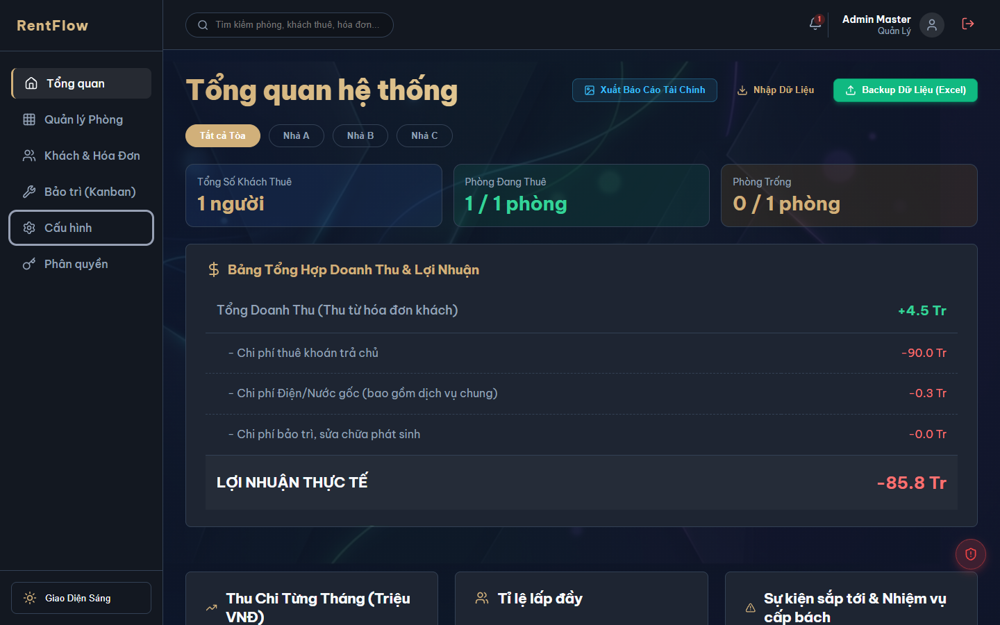
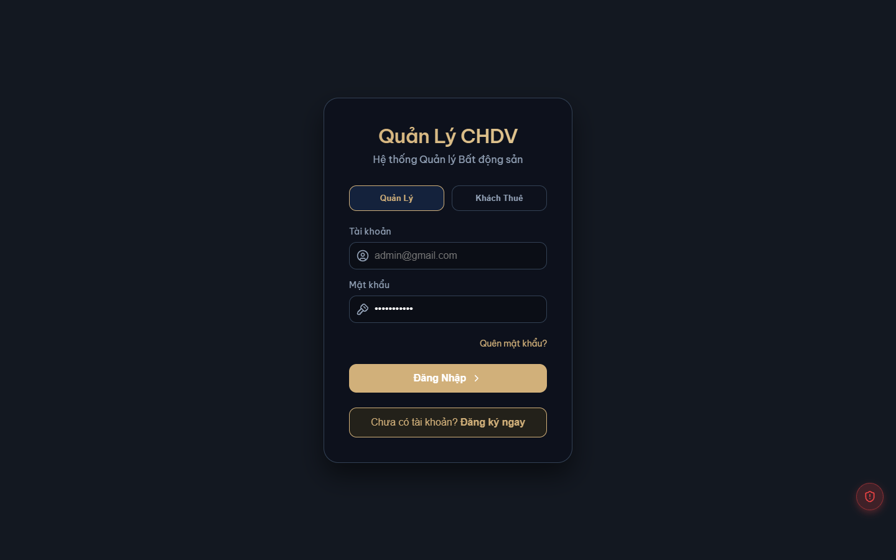
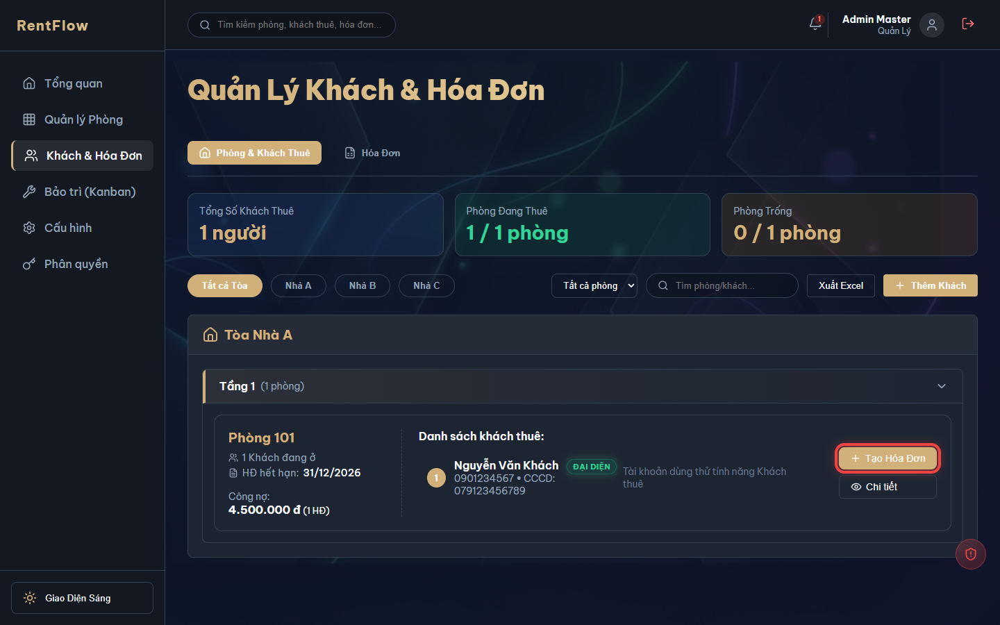
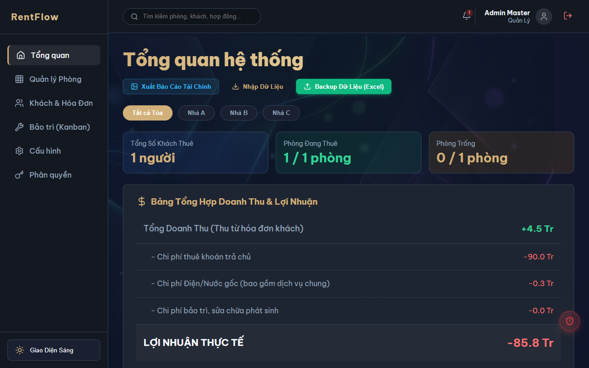
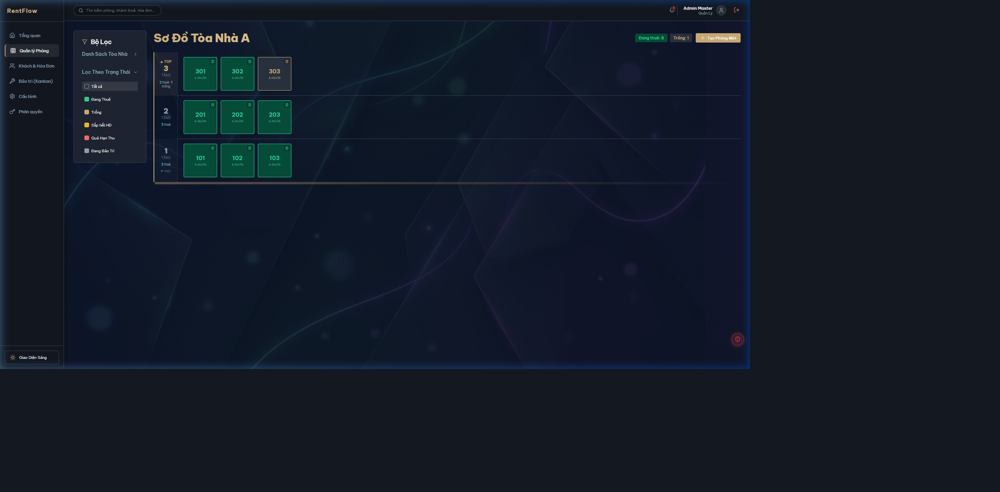
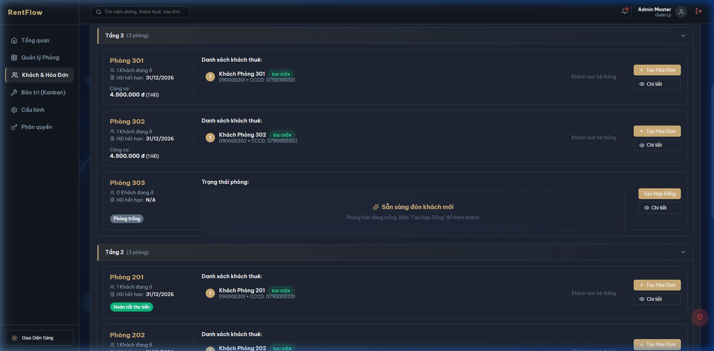
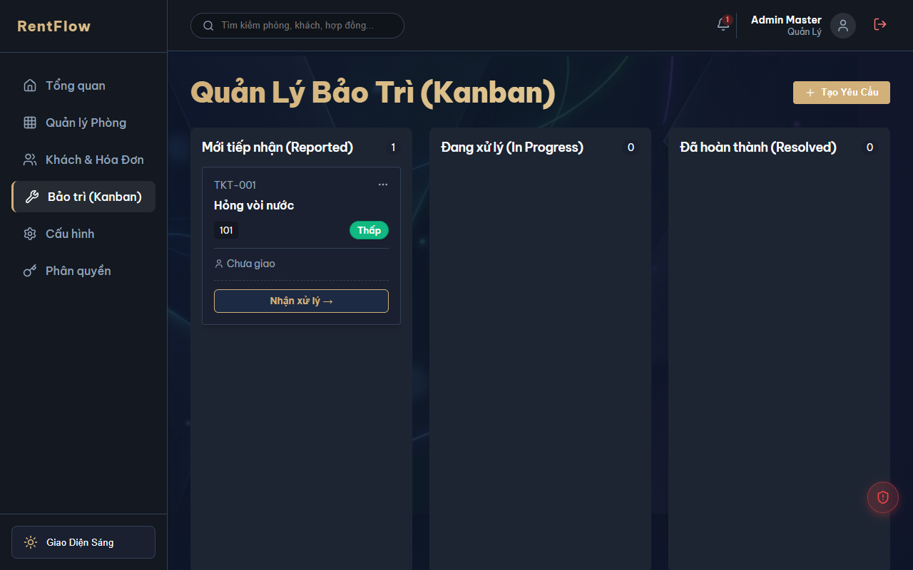

# Project Summary

## package.json
```
{
  "name": "quan-ly-chdv",
  "private": true,
  "version": "0.0.0",
  "type": "module",
  "scripts": {
    "dev": "vite",
    "build": "vite build",
    "lint": "eslint .",
    "preview": "vite preview"
  },
  "dependencies": {
    "@hello-pangea/dnd": "^18.0.1",
    "firebase": "^12.14.0",
    "html2canvas": "^1.4.1",
    "lucide-react": "latest",
    "react": "^19.2.6",
    "react-dom": "^19.2.6",
    "react-hot-toast": "^2.6.0",
    "react-router-dom": "latest",
    "recharts": "^3.9.2",
    "xlsx": "https://cdn.sheetjs.com/xlsx-0.20.3/xlsx-0.20.3.tgz",
    "xlsx-js-style": "^1.2.0"
  },
  "devDependencies": {
    "@eslint/js": "^10.0.1",
    "@types/react": "^19.2.14",
    "@types/react-dom": "^19.2.3",
    "@vitejs/plugin-react": "^6.0.1",
    "eslint": "^10.3.0",
    "eslint-plugin-react-hooks": "^7.1.1",
    "eslint-plugin-react-refresh": "^0.5.2",
    "globals": "^17.6.0",
    "vite": "^8.0.12"
  }
}

```

## vite.config.js
```
import { defineConfig } from 'vite'
import react from '@vitejs/plugin-react'

// https://vite.dev/config/
export default defineConfig({
  plugins: [react()],
})

```

## firebase.json
```
{
  "hosting": {
    "public": "dist",
    "ignore": [
      "firebase.json",
      "**/.*",
      "**/node_modules/**"
    ],
    "rewrites": [
      {
        "source": "**",
        "destination": "/index.html"
      }
    ]
  },
  "firestore": {
    "rules": "firestore.rules"
  }
}

```

## firestore.rules
```
rules_version = '2';
service cloud.firestore {
  match /databases/{database}/documents {
    
    // Helper: Is Super Admin
    function isSuperAdmin() {
      return request.auth != null && request.auth.token.email == 'nguyentienducbmt123@gmail.com';
    }
    
    // Helper: Safely get User Data
    function hasUserDoc() {
      return request.auth != null && exists(/databases/$(database)/documents/users/$(request.auth.token.email));
    }
    
    function getUserDoc() {
      return get(/databases/$(database)/documents/users/$(request.auth.token.email));
    }
    
    function getRole() {
      return hasUserDoc() ? getUserDoc().data.role : 'none';
    }
    
    function getOwnerId() {
      return hasUserDoc() ? getUserDoc().data.ownerId : null;
    }
    
    function getRoom() {
      return hasUserDoc() ? getUserDoc().data.room : null;
    }

    // Check if user belongs to this ownerId
    function belongsToOwner(oid) {
      return request.auth != null && (request.auth.uid == oid || getOwnerId() == oid);
    }
    
    // Check if user has Admin or Manager role for the ownerId
    function isAdminOrManager(oid) {
      return request.auth != null && (request.auth.uid == oid || getRole() == 'admin' || getRole() == 'manager');
    }

    // Check if user is a Tenant
    function isTenant() {
      return request.auth != null && getRole() == 'tenant';
    }

    // Users Collection
    match /users/{email} {
      allow read: if isSuperAdmin() || (request.auth != null && (
        request.auth.token.email == email || 
        (belongsToOwner(resource.data.ownerId) && isAdminOrManager(resource.data.ownerId))
      ));
      allow create: if isSuperAdmin() || (request.auth != null && (
        request.auth.token.email == email || 
        (belongsToOwner(request.resource.data.ownerId) && isAdminOrManager(request.resource.data.ownerId))
      ));
      allow update, delete: if isSuperAdmin() || (request.auth != null && (
        request.auth.token.email == email || 
        (belongsToOwner(resource.data.ownerId) && isAdminOrManager(resource.data.ownerId))
      ));
    }

    // Settings Collection
    match /settings/{docId} {
      // docId is the ownerId
      allow read: if isSuperAdmin() || belongsToOwner(docId);
      allow write: if isSuperAdmin() || (belongsToOwner(docId) && isAdminOrManager(docId));
    }

    // Rooms Collection
    match /rooms/{docId} {
      allow read: if isSuperAdmin() || 
                  (belongsToOwner(resource.data.ownerId) && 
                   (isAdminOrManager(resource.data.ownerId) || (isTenant() && getRoom() == resource.data.name))
                  );
      allow create: if isSuperAdmin() || (belongsToOwner(request.resource.data.ownerId) && isAdminOrManager(request.resource.data.ownerId));
      allow update, delete: if isSuperAdmin() || (belongsToOwner(resource.data.ownerId) && isAdminOrManager(resource.data.ownerId));
    }

    // Tenants Collection
    match /tenants/{docId} {
      allow read: if isSuperAdmin() || 
                  (belongsToOwner(resource.data.ownerId) && 
                   (isAdminOrManager(resource.data.ownerId) || (request.auth != null && request.auth.token.email == resource.data.email))
                  );
      allow create: if isSuperAdmin() || (belongsToOwner(request.resource.data.ownerId) && isAdminOrManager(request.resource.data.ownerId));
      allow update, delete: if isSuperAdmin() || (belongsToOwner(resource.data.ownerId) && isAdminOrManager(resource.data.ownerId));
    }

    // Contracts Collection
    match /contracts/{docId} {
      allow read: if isSuperAdmin() || 
                  (belongsToOwner(resource.data.ownerId) && 
                   (isAdminOrManager(resource.data.ownerId) || (isTenant() && getRoom() == resource.data.room))
                  );
      allow create: if isSuperAdmin() || (belongsToOwner(request.resource.data.ownerId) && isAdminOrManager(request.resource.data.ownerId));
      allow update, delete: if isSuperAdmin() || (belongsToOwner(resource.data.ownerId) && isAdminOrManager(resource.data.ownerId));
    }

    // Invoices Collection
    match /invoices/{docId} {
      allow read: if isSuperAdmin() || 
                  (belongsToOwner(resource.data.ownerId) && 
                   (isAdminOrManager(resource.data.ownerId) || (isTenant() && getRoom() == resource.data.room))
                  );
      allow create: if isSuperAdmin() || (belongsToOwner(request.resource.data.ownerId) && isAdminOrManager(request.resource.data.ownerId));
      allow update, delete: if isSuperAdmin() || (belongsToOwner(resource.data.ownerId) && isAdminOrManager(resource.data.ownerId));
    }

    // Tickets Collection
    match /tickets/{docId} {
      allow read: if isSuperAdmin() || belongsToOwner(resource.data.ownerId);
      allow create: if isSuperAdmin() || belongsToOwner(request.resource.data.ownerId);
      allow update: if isSuperAdmin() || belongsToOwner(resource.data.ownerId);
      allow delete: if isSuperAdmin() || (belongsToOwner(resource.data.ownerId) && isAdminOrManager(resource.data.ownerId));
    }
  }
}

```

## index.html
```
<!doctype html>
<html lang="en" data-theme="dark">
  <head>
    <meta charset="UTF-8" />
    <link rel="icon" type="image/svg+xml" href="/favicon.svg" />
    <meta name="viewport" content="width=device-width, initial-scale=1.0" />
    <meta name="robots" content="noindex, nofollow" />
    <meta http-equiv="X-Frame-Options" content="DENY" />
    <title>RentFlow - Apartment Management</title>
    <link rel="preconnect" href="https://fonts.googleapis.com">
    <link rel="preconnect" href="https://fonts.gstatic.com" crossorigin>
    <link href="https://fonts.googleapis.com/css2?family=Be+Vietnam+Pro:wght@300;400;500;600;700;800;900&family=JetBrains+Mono:wght@400;500;600;700&display=swap" rel="stylesheet">
  </head>
  <body>
    <div id="root"></div>
    <script type="module" src="/src/main.jsx"></script>
  </body>
</html>

```

## ROADMAP.md
```
# 🚀 Lộ Trình Phát Triển RentFlow (Roadmap & Backlog)

Tài liệu này lưu trữ các kế hoạch nâng cấp và các lỗi cần khắc phục trong tương lai để đưa ứng dụng đạt chuẩn thương mại hóa 100%.

## ✅ Phase A: Khắc phục lỗi nghiêm trọng (Đã hoàn thành 11/07/2026)
- Xóa thư viện `puppeteer` thừa khỏi production (Tiết kiệm ~25MB cài đặt).
- Áp dụng kỹ thuật `Dynamic Import / Lazy Load` cho thư viện xuất Excel `xlsx-js-style` (Tiết kiệm ~868KB tải trang ban đầu).
- Hủy bỏ chế độ Mock Login (Đăng nhập giả) trên môi trường Production để vá lỗ hổng bảo mật.
- Kết nối thành công Firebase API Keys thông qua Vercel CLI.

---

## 🟡 Phase B: Tối ưu Hóa Cơ Sở Dữ Liệu & Bảo Mật (Next Actions)

Đây là các vấn đề cần ưu tiên xử lý trong các lần cập nhật tiếp theo:

1. **Thêm Phân Trang (Pagination) cho Super Admin & Danh sách Khách:**
   - **Vấn đề:** Hiện tại hàm `getDocs(collection(...))` đang tải toàn bộ dữ liệu. Nếu có 10,000 khách, ứng dụng sẽ bị treo.
   - **Giải pháp:** Sử dụng hàm `limit()`, `startAfter()` của Firestore kết hợp UI phân trang.

2. **Thêm Composite Indexes cho Firestore:**
   - **Vấn đề:** Một số truy vấn gộp (ví dụ: `where('ownerId', '==', ...) + where('room', '==', ...)` ) đang hoạt động chậm nếu dữ liệu lớn.
   - **Giải pháp:** Cần triển khai các bộ chỉ mục (Indexes) trên Firebase Console.

3. **Rate Limiting (Chống Spam API):**
   - **Vấn đề:** Chưa có giới hạn số lần click/call API từ frontend. Kẻ xấu có thể spam tạo dữ liệu.
   - **Giải pháp:** Bật tính năng Firebase App Check (reCAPTCHA) để chặn bot.

4. **Bảo Mật Đăng Ký (Email Verification & Password Policy):**
   - **Vấn đề:** Mật khẩu đang quá dễ (123456) và email không cần xác minh.
   - **Giải pháp:** Ép độ dài mật khẩu (>= 8 ký tự), và gọi hàm `sendEmailVerification()` sau khi đăng ký.

5. **Gỡ bỏ hoàn toàn Dev Backdoor:**
   - **Giải pháp:** Đưa component `DevBackdoor.jsx` ra khỏi thư mục biên dịch của Production bằng Vite Configuration.

---

## 🟢 Phase C & D: Tính năng Thương Mại & Mở Rộng

1. **Tích hợp cổng thanh toán (MoMo / VNPay / ZaloPay):**
   - Xây dựng API trung gian (Cloud Functions) để nhận Webhook thanh toán từ ngân hàng khi người dùng mua Gói PRO.

2. **Tự động hóa bằng Cloud Functions:**
   - Gửi Email tự động cho khách thuê khi đến hạn đóng tiền.
   - Backup (Sao lưu) dữ liệu Firestore ra Google Cloud Storage mỗi đêm.

3. **Giao diện Skeleton Loading:**
   - Thay thế vòng xoay "Đang tải" (Spinner) bằng giao diện khung xương (Skeleton) để tạo cảm giác mượt mà hơn cho người dùng cuối.

4. **Audit Logs (Lịch sử thao tác):**
   - Lưu lại lịch sử chi tiết: Ai, ngày nào, đã sửa thông tin gì (để Admin dễ dàng truy vết).

```

## USER_MANUAL.md
```
# 📖 HƯỚNG DẪN SỬ DỤNG PHẦN MỀM QUẢN LÝ CHDV (RENTFLOW)
*Tài liệu hướng dẫn toàn diện dành cho Chủ nhà và Quản lý*

---

## 📑 Mục Lục
1. [Giới thiệu chung](#1-giới-thiệu-chung)
2. [Đăng nhập & Xác thực](#2-đăng-nhập--xác-thực)
3. [Quy trình 4 bước cho người mới (Workflow)](#3-quy-trình-4-bước-cho-người-mới-workflow)
4. [Giải thích các Menu Tính Năng](#4-giải-thích-các-menu-tính-năng)
5. [Dành Cho Khách Thuê (Tenant Portal)](#5-dành-cho-khách-thuê-tenant-portal)
6. [Quản lý Dữ liệu & Sao lưu (Excel Backup)](#6-quản-lý-dữ-liệu--sao-lưu-excel-backup)
7. [Mẹo Sử Dụng (Tips)](#7-mẹo-sử-dụng-tips)
8. [Câu Hỏi Thường Gặp (FAQ) & Hỗ Trợ](#8-câu-hỏi-thường-gặp-faq--hỗ-trợ)

---

## 🌟 1. Giới thiệu chung
Chào mừng bạn đến với hệ thống **Quản Lý CHDV (RentFlow)**! Đây là giải pháp phần mềm toàn diện giúp bạn tự động hóa hoàn toàn công việc vận hành căn hộ dịch vụ, nhà trọ. 
Thay vì phải dùng sổ sách hay bảng tính rườm rà, giờ đây mọi thông tin về Khách thuê, Hợp đồng, Hóa đơn (điện, nước), và Báo cáo tài chính đều được quản lý tập trung trên một giao diện hiện đại, trực quan và an toàn.

---

## 🔐 2. Đăng nhập & Xác thực
Hệ thống sử dụng cơ chế bảo mật xác thực tiên tiến của Firebase, mang lại trải nghiệm đăng nhập mượt mà:
- **Đăng nhập bằng Google (Khuyên dùng):** Chỉ với 1 cú click chuột vào nút "Đăng nhập bằng Google", bạn không cần phải nhớ mật khẩu. Hệ thống tự động nhận diện email của bạn để cấp quyền truy cập tương ứng (Admin, Quản lý, hoặc Khách thuê).
- **Tài khoản/Mật khẩu truyền thống:** Bạn vẫn có thể sử dụng Email và Mật khẩu mặc định do Quản trị viên cấp.

---

## 🚀 3. Quy trình 4 bước cho người mới (Workflow)
Nếu bạn là người mới lần đầu sử dụng, hãy thao tác theo thứ tự sau để hệ thống hoạt động trơn tru nhất:

1. **Thiết lập cơ bản:** Vào menu `Cấu hình` -> Khai báo danh sách các Tòa nhà và thiết lập Đơn giá dịch vụ mặc định (Giá điện, giá nước, rác, wifi...).
   
   

2. **Khởi tạo không gian:** Vào menu `Quản lý Phòng` -> Tạo các phòng tương ứng cho từng Tòa nhà (Số phòng, diện tích, giá thuê).
   
   

3. **Đón khách mới:** Vào menu `Khách & Hóa Đơn` -> Bấm nút **Tạo Hợp Đồng** tại các phòng trống để điền thông tin khách thuê, số điện thoại, CCCD, tiền cọc và ngày hết hạn.
   
   

4. **Vận hành hàng tháng:** Cuối tháng, vào menu `Khách & Hóa Đơn` -> Chốt số điện/nước -> Bấm **Tạo Hóa Đơn** và gửi cho khách. Khi khách đóng tiền, chuyển trạng thái hóa đơn sang "Đã thu".
   
   

---

## 🛠 4. Giải thích các Menu Tính Năng

### 📊 4.1. Tổng Quan (Dashboard)



- Nơi cung cấp cái nhìn toàn cảnh về tình hình kinh doanh của bạn.
- Hiển thị biểu đồ **Doanh thu & Lợi nhuận**, Tỷ lệ lấp đầy phòng (Số phòng trống / đang thuê / bảo trì).
- Cung cấp nút thao tác nhanh: **Backup Dữ Liệu (Excel)**.

### 🏢 4.2. Quản Lý Phòng



- Trình bày toàn bộ danh sách phòng theo từng Tòa nhà (Nhà A, Nhà B...) dưới dạng thẻ thông tin trực quan.
- Có thể tạo mới, chỉnh sửa nhanh giá thuê, diện tích, tình trạng thiết bị trong phòng.
- Bộ lọc thông minh giúp tìm nhanh các phòng "Trống", "Đang thuê" hoặc "Bảo trì".

### 👥 4.3. Khách & Hóa Đơn



Đây là màn hình bạn sẽ làm việc nhiều nhất, chia làm 2 tab chính:
- **Tab Phòng & Khách Thuê:** Xem thông tin ai đang ở phòng nào, hợp đồng bao giờ hết hạn, tình trạng công nợ hiện tại. Hỗ trợ tạo hợp đồng mới, xem hồ sơ chi tiết của từng khách.
- **Tab Hóa Đơn:** Bảng tổng hợp toàn bộ hóa đơn của tất cả các phòng. Cung cấp bộ lọc theo tháng, tình trạng thanh toán (Chưa thu / Đã thu / Thu một phần). Bấm vào Hóa đơn để xem chi tiết và in biên lai.

### 🔧 4.4. Bảo Trì & Sự Cố (Kanban)



- Nơi quản lý các yêu cầu sửa chữa (Hư bóng đèn, kẹt ống nước...) từ khách hàng hoặc người quản lý ghi nhận.
- Giao diện kéo-thả (Kanban board) trực quan qua 3 cột: `Mới báo` -> `Đang xử lý` -> `Đã hoàn thành`.
- Ghi nhận chi phí sửa chữa để hệ thống tự động hạch toán trừ vào biểu đồ lợi nhuận cuối tháng.

### ⚙️ 4.5. Phân Quyền & Cấu Hình
- **Cấu hình Hệ thống:** Chỉnh sửa thông tin Tòa nhà, Dịch vụ, Số tài khoản ngân hàng.
- **Quản lý Dữ liệu:** Hỗ trợ tính năng "Nạp Dữ Liệu Mẫu" (Mock Data) để người dùng mới dễ dàng làm quen với hệ thống, và "Xóa Trắng Dữ Liệu" khi cần làm lại từ đầu.
- **Phân quyền (Tùy chọn):** Dành cho chủ nhà (Super Admin) cấp tài khoản cho Quản lý / Bảo vệ, giới hạn quyền xem và thao tác.

---

## 📱 5. Dành Cho Khách Thuê (Tenant Portal)
Hệ thống không chỉ dành cho chủ nhà mà còn cung cấp cho mỗi khách thuê một không gian (Portal) riêng biệt. Khi khách thuê truy cập trang web và đăng nhập bằng **chính Email đã ghi trong hợp đồng** (bằng nút Đăng nhập Google), họ có thể:
- Xem chi tiết **Hợp đồng đang thuê** (Ngày bắt đầu, hết hạn, Tiền cọc).
- Theo dõi **Hóa đơn hàng tháng** và chi tiết các khoản phí (Điện, nước, rác...).
- Gửi **Yêu cầu bảo trì/sự cố** trực tiếp kèm hình ảnh cho ban quản lý. Ban quản lý sẽ nhận được thông báo ngay lập tức ở tab Bảo Trì.

---

## 💾 6. Quản lý Dữ liệu & Sao lưu (Excel Backup)
An toàn dữ liệu là ưu tiên hàng đầu của phần mềm.
- **Lưu trữ Cloud:** Mọi thao tác trên phần mềm đều được tự động lưu trữ lên máy chủ Đám mây (Firebase), không sợ mất dữ liệu khi hỏng máy tính hay mất điện.
- **Sao lưu Excel (Backup):** Tại trang Tổng Quan, bạn chỉ cần bấm nút `Backup Dữ Liệu (Excel)`. Hệ thống sẽ xuất toàn bộ dữ liệu (Danh sách phòng, Khách thuê, Hóa đơn, Báo cáo bảo trì...) thành một file Excel chuyên nghiệp. 
- **Thiết kế báo cáo chuẩn:** File Excel được thiết kế đẹp mắt với các tiêu đề báo cáo rõ ràng, số tiền định dạng chuẩn VNĐ và các trạng thái được hệ thống tự động tô màu (Xanh/Đỏ/Cam) giúp bạn dễ dàng in ấn, gửi đối tác hoặc nộp thuế.

---

## 💡 7. Mẹo Sử Dụng (Tips)
> **Giao Diện Sáng/Tối:** Ở góc dưới cùng bên trái thanh menu có biểu tượng Mặt trăng/Mặt trời để chuyển đổi Giao diện Sáng/Tối (Light/Dark mode) giúp bảo vệ mắt khi làm việc ban đêm.
> **Tìm Kiếm Nhanh:** Hầu hết các màn hình đều có thanh tìm kiếm (Ví dụ: Tìm tên khách, số điện thoại, mã phòng). Hãy tận dụng nó thay vì cuộn chuột.
> **Chế độ In Ấn:** Biên lai hóa đơn được thiết kế tương thích hoàn hảo với máy in A4 và máy in nhiệt. Khi xem chi tiết hóa đơn, bạn chỉ cần dùng lệnh In của trình duyệt (Ctrl + P).

---

## ❓ 8. Câu Hỏi Thường Gặp (FAQ) & Hỗ Trợ

**Q1: Dữ liệu của tôi có bị mất khi tắt trình duyệt không?**
- Hoàn toàn không. RentFlow đồng bộ hóa dữ liệu theo thời gian thực (Real-time). Bất kể bạn thao tác trên máy tính, điện thoại hay iPad, dữ liệu luôn được cập nhật và lưu trữ trên hệ thống.

**Q2: Làm sao để dùng thử các tính năng khi chưa có dữ liệu thực tế?**
- Vào menu `Cấu hình`, cuộn xuống phần **Quản lý dữ liệu** và bấm **"Nạp Dữ Liệu Mẫu"**. Hệ thống sẽ tạo ra một bộ dữ liệu giả lập sinh động (Phòng, khách, hóa đơn, sự cố) để bạn thoải mái vọc vạch. Khi đã hiểu cách dùng, bạn chỉ cần bấm **"Xóa Trắng Dữ Liệu"** để bắt đầu dọn dẹp và nhập dữ liệu thật của tòa nhà.

**Q3: Tôi có nhiều tòa nhà cách xa nhau, có quản lý chung được không?**
- Được. Ở phần `Cấu hình`, bạn hãy thêm tên tất cả các Tòa nhà. Sau đó khi tạo phòng, bạn gán phòng đó thuộc Tòa nhà tương ứng. Hệ thống tự động phân loại và báo cáo rành mạch.

**📞 Liên hệ Hỗ Trợ:**
- Email: support@rentflow.vn
- Hotline kỹ thuật: 1900.xxxx
- Website: www.rentflow.vn

```

## README.md
```
# QUAN-LY-CHDV (Property Management System)

A comprehensive property management SaaS application for managing rental properties, tenants, contracts, invoices, and maintenance requests.

## 🏢 Overview

QUAN-LY-CHDV is a Vietnamese property management system designed for building owners and property managers to efficiently manage multiple buildings, rooms, tenant contracts, billing, and maintenance operations.

**Current Status:** MVP (localStorage-based) - Production rebuild in progress

## ✨ Features

### Core Functionality
- **Building & Room Management** - Manage multiple buildings with customizable floor layouts
- **Tenant Management** - Track tenant information, move-in/move-out dates, and contact details
- **Contract Management** - Create and track lease agreements with expiration monitoring
- **Invoice Generation** - Automated billing with utility meter readings (electricity, water)
- **Maintenance Tracking** - Kanban-style ticket system (Reported → In Progress → Resolved)
- **Financial Dashboard** - Real-time revenue, expenses, and profit analytics
- **VietQR Integration** - Generate QR codes for instant payment via banking apps

### User Roles
- **Manager** - Full access to all buildings, rooms, financial data, and settings
- **Tenant** - Portal access to view personal invoices and submit maintenance requests

## 🛠️ Technology Stack

### Frontend (Current)
- **React 19** - UI framework with latest concurrent features
- **Vite 8** - Lightning-fast bundler and dev server
- **React Router** - Client-side routing
- **Recharts** - Data visualization for financial analytics
- **Lucide React** - Modern icon library
- **React Hot Toast** - Elegant notifications
- **XLSX** - Excel export functionality

### Backend (Planned)
- **Node.js 20** + **Express 5** - REST API server
- **PostgreSQL 16** - Relational database with multi-tenancy
- **JWT + bcrypt** - Custom authentication system
- **Docker Compose** - Containerized deployment

### Data Storage (Current)
- **localStorage** - Browser-based persistence (temporary MVP solution)
- **Firebase Auth** - User authentication (to be replaced)

## 🚀 Quick Start

### Prerequisites
- Node.js 20+ and npm

### Installation

```bash
# Clone the repository
git clone https://github.com/yourusername/quan-ly-chdv.git
cd quan-ly-chdv

# Install dependencies
npm install

# Start development server
npm run dev
```

The app will be available at `http://localhost:5173`

### Development Commands

```bash
npm run dev      # Start Vite dev server
npm run preview  # Preview production bundle
npm run lint     # Run ESLint
```

### Demo Credentials

**Manager Account:**
- Email: `admin@example.com`
- Password: `admin123`

**Tenant Account:**
- Email: Any registered tenant email
- Password: `tenant123`

## 📁 Project Structure

```
quan-ly-chdv/
├── src/
│   ├── components/       # Reusable UI components
│   ├── pages/            # Page-level components (10 routes)
│   ├── context/          # React Context (Auth + AppData)
│   ├── utils/            # Helper functions (Excel export, mock data)
│   ├── styles/           # Global styles
│   ├── App.jsx           # Main app component with routing
│   ├── main.jsx          # Entry point
│   └── firebase.js       # Firebase configuration
├── public/               # Static assets
├── docs/                 # Documentation (see below)
└── plans/                # Implementation plans
```

## 📚 Documentation

Comprehensive documentation is available in the `docs/` directory:

- **[Project Overview](docs/project-overview-pdr.md)** - Product vision, goals, and requirements
- **[System Architecture](docs/system-architecture.md)** - Current and planned architecture
- **[Project Roadmap](docs/project-roadmap.md)** - 5-phase production rebuild plan (10-12 weeks)
- **[Codebase Summary](docs/codebase-summary.md)** - Code structure and component overview
- **[Code Standards](docs/code-standards.md)** - Development conventions and patterns
- **[Deployment Guide](docs/deployment-guide.md)** - Docker deployment instructions

## 🔐 Security Notice

**⚠️ IMPORTANT:** This repository contains MVP code with known security issues:
- Firebase credentials in source code
- localStorage-only persistence (no backend)
- Client-side authentication only
- Hardcoded demo passwords

**These issues are addressed in the production rebuild plan.** Do not deploy this version to production.

## 🗺️ Roadmap

### Current Phase: Production Rebuild (10-12 weeks)

**Phase 1:** Backend Foundation (Weeks 1-3)
- Node.js + Express + PostgreSQL setup
- JWT authentication system
- Database schema with multi-tenancy

**Phase 2:** API Development (Weeks 4-6)
- REST API endpoints for all entities
- File upload (room images)
- Excel export endpoint

**Phase 3:** Frontend Migration (Weeks 7-8)
- Replace localStorage with API calls
- Auth flow integration
- Loading states and error handling

**Phase 4:** Security Hardening (Week 9)
- Fix all critical security issues
- Input validation and CSRF protection
- HTTPS and security headers

**Phase 5:** Testing & Deployment (Weeks 10-12)
- Unit and integration tests
- Docker Compose production setup
- CI/CD pipeline with GitHub Actions

See `docs/project-roadmap.md` for detailed milestones.

### Post-Launch (v1.1 - v2.0)
- Real-time notifications (WebSockets)
- Mobile app (React Native)
- Payment gateway integration (VNPay, Momo)
- White-label multi-tenancy
- Role-based permissions

## 🧪 Testing

```bash
# Run linter
npm run lint
```

*Unit and integration tests will be added in Phase 5 of the production rebuild.*

## 📦 Deployment

**Current:** Not production-ready (localStorage-based MVP)

**Planned:** Docker Compose deployment with Nginx reverse proxy. See `docs/deployment-guide.md` for instructions.

## 🤝 Contributing

This is a private project currently under active development. Contribution guidelines will be added after the production rebuild.

## 📄 License

Copyright © 2026. All rights reserved.

## 👥 Team

- **Development:** Property Management Team
- **Architecture:** Based on research in `plans/reports/`

## 📞 Support

For questions or issues, please contact the development team.

---

**Version:** 0.1.0-alpha (MVP)  
**Last Updated:** June 16, 2026  
**Status:** Active Development - Production Rebuild in Progress

```

## FIREBASE_SETUP.md
```
# Hướng dẫn Tích hợp Firebase Auth + Google Sign-In
# ============================================================
# File này chuẩn bị sẵn cho việc tích hợp Firebase Authentication.
# Khi bạn sẵn sàng, chỉ cần:
# 1. Tạo project Firebase tại https://console.firebase.google.com
# 2. Copy config từ Firebase Console vào file này
# 3. Chạy: npm install firebase

# BƯỚC 1: Cài đặt Firebase
# > npm install firebase

# BƯỚC 2: Tạo file src/firebase.js với nội dung dưới đây:
# ------------------------------------------------------------

"""
// src/firebase.js
import { initializeApp } from 'firebase/app';
import { getAuth, GoogleAuthProvider, signInWithPopup, signOut } from 'firebase/auth';

// TODO: Thay bằng config từ Firebase Console của bạn
// (Project Settings > General > Your apps > Firebase SDK snippet)
const firebaseConfig = {
  apiKey: "YOUR_API_KEY",
  authDomain: "YOUR_PROJECT.firebaseapp.com",
  projectId: "YOUR_PROJECT_ID",
  storageBucket: "YOUR_PROJECT.appspot.com",
  messagingSenderId: "YOUR_SENDER_ID",
  appId: "YOUR_APP_ID"
};

const app = initializeApp(firebaseConfig);
export const auth = getAuth(app);
export const googleProvider = new GoogleAuthProvider();

// Sign in with Google popup
export const signInWithGoogle = () => signInWithPopup(auth, googleProvider);

// Sign out
export const firebaseSignOut = () => signOut(auth);
"""

# BƯỚC 3: Cập nhật AuthContext.jsx để dùng Firebase
# ------------------------------------------------------------

"""
// src/context/AuthContext.jsx (updated with Firebase)
import { createContext, useState, useContext, useEffect } from 'react';
import { auth, signInWithGoogle, firebaseSignOut } from '../firebase';
import { onAuthStateChanged } from 'firebase/auth';

const AuthContext = createContext(null);

export const AuthProvider = ({ children }) => {
  const [user, setUser] = useState(null);
  const [loading, setLoading] = useState(true);

  useEffect(() => {
    const unsubscribe = onAuthStateChanged(auth, (firebaseUser) => {
      if (firebaseUser) {
        // Map Firebase user to app user object
        setUser({
          name: firebaseUser.displayName,
          email: firebaseUser.email,
          photo: firebaseUser.photoURL,
          uid: firebaseUser.uid,
          role: 'tenant', // default - can be stored in Firestore per user
        });
      } else {
        setUser(null);
      }
      setLoading(false);
    });
    return () => unsubscribe();
  }, []);

  const loginWithGoogle = async () => {
    const result = await signInWithGoogle();
    return result.user;
  };

  const logout = () => firebaseSignOut();

  return (
    <AuthContext.Provider value={{ user, loginWithGoogle, logout, loading }}>
      {!loading && children}
    </AuthContext.Provider>
  );
};

export const useAuth = () => useContext(AuthContext);
"""

# BƯỚC 4: Firestore Rules (bảo mật)
# ------------------------------------------------------------
# Vào Firebase Console > Firestore Database > Rules:

"""
rules_version = '2';
service cloud.firestore {
  match /databases/{database}/documents {
    // Chỉ user đã đăng nhập mới đọc được
    match /users/{userId} {
      allow read, write: if request.auth != null && request.auth.uid == userId;
    }
    // Manager check: phải có role=manager trong Firestore
    match /invoices/{id} {
      allow read: if request.auth != null;
      allow write: if get(/databases/$(database)/documents/users/$(request.auth.uid)).data.role == 'manager';
    }
  }
}
"""

# BƯỚC 5: Enable Google Sign-In trong Firebase Console
# ------------------------------------------------------------
# Authentication > Sign-in method > Google > Enable
# Thêm authorized domain: localhost, your-vercel-app.vercel.app

```

## src/App.css
```
.counter {
  font-size: 16px;
  padding: 5px 10px;
  border-radius: 5px;
  color: var(--accent);
  background: var(--accent-bg);
  border: 2px solid transparent;
  transition: border-color 0.3s;
  margin-bottom: 24px;

  &:hover {
    border-color: var(--accent-border);
  }
  &:focus-visible {
    outline: 2px solid var(--accent);
    outline-offset: 2px;
  }
}

.hero {
  position: relative;

  .base,
  .framework,
  .vite {
    inset-inline: 0;
    margin: 0 auto;
  }

  .base {
    width: 170px;
    position: relative;
    z-index: 0;
  }

  .framework,
  .vite {
    position: absolute;
  }

  .framework {
    z-index: 1;
    top: 34px;
    height: 28px;
    transform: perspective(2000px) rotateZ(300deg) rotateX(44deg) rotateY(39deg)
      scale(1.4);
  }

  .vite {
    z-index: 0;
    top: 107px;
    height: 26px;
    width: auto;
    transform: perspective(2000px) rotateZ(300deg) rotateX(40deg) rotateY(39deg)
      scale(0.8);
  }
}

#center {
  display: flex;
  flex-direction: column;
  gap: 25px;
  place-content: center;
  place-items: center;
  flex-grow: 1;

  @media (max-width: 1024px) {
    padding: 32px 20px 24px;
    gap: 18px;
  }
}

#next-steps {
  display: flex;
  border-top: 1px solid var(--border);
  text-align: left;

  & > div {
    flex: 1 1 0;
    padding: 32px;
    @media (max-width: 1024px) {
      padding: 24px 20px;
    }
  }

  .icon {
    margin-bottom: 16px;
    width: 22px;
    height: 22px;
  }

  @media (max-width: 1024px) {
    flex-direction: column;
    text-align: center;
  }
}

#docs {
  border-right: 1px solid var(--border);

  @media (max-width: 1024px) {
    border-right: none;
    border-bottom: 1px solid var(--border);
  }
}

#next-steps ul {
  list-style: none;
  padding: 0;
  display: flex;
  gap: 8px;
  margin: 32px 0 0;

  .logo {
    height: 18px;
  }

  a {
    color: var(--text-h);
    font-size: 16px;
    border-radius: 6px;
    background: var(--social-bg);
    display: flex;
    padding: 6px 12px;
    align-items: center;
    gap: 8px;
    text-decoration: none;
    transition: box-shadow 0.3s;

    &:hover {
      box-shadow: var(--shadow);
    }
    .button-icon {
      height: 18px;
      width: 18px;
    }
  }

  @media (max-width: 1024px) {
    margin-top: 20px;
    flex-wrap: wrap;
    justify-content: center;

    li {
      flex: 1 1 calc(50% - 8px);
    }

    a {
      width: 100%;
      justify-content: center;
      box-sizing: border-box;
    }
  }
}

#spacer {
  height: 88px;
  border-top: 1px solid var(--border);
  @media (max-width: 1024px) {
    height: 48px;
  }
}

.ticks {
  position: relative;
  width: 100%;

  &::before,
  &::after {
    content: '';
    position: absolute;
    top: -4.5px;
    border: 5px solid transparent;
  }

  &::before {
    left: 0;
    border-left-color: var(--border);
  }
  &::after {
    right: 0;
    border-right-color: var(--border);
  }
}

```

## src/App.jsx
```
import { useState, Suspense, lazy } from 'react';
import { BrowserRouter as Router, Routes, Route, Navigate } from 'react-router-dom';
import { Toaster } from 'react-hot-toast';
import { AuthProvider, useAuth } from './context/AuthContext';
import Sidebar from './components/Sidebar';
import Header from './components/Header';
import BottomTabBar from './components/BottomTabBar';
import { useAppData } from './context/AppDataContext';

const Login = lazy(() => import('./pages/Login'));
const Home = lazy(() => import('./pages/Home'));
const Rooms = lazy(() => import('./pages/Rooms'));
const Tenants = lazy(() => import('./pages/Tenants'));
const Contracts = lazy(() => import('./pages/Contracts'));
const Invoices = lazy(() => import('./pages/Invoices'));
const Maintenance = lazy(() => import('./pages/Maintenance'));
const TenantPortal = lazy(() => import('./pages/TenantPortal'));
const FinanceAndTenants = lazy(() => import('./pages/FinanceAndTenants'));
const Settings = lazy(() => import('./pages/Settings'));
const Users = lazy(() => import('./pages/Users'));
const SuperAdmin = lazy(() => import('./pages/SuperAdmin'));

import './styles/index.css';
import './styles/layout.css';

function ProtectedRoute({ children, allowedRoles }) {
  const { user } = useAuth();
  if (!user) {
    return <Navigate to="/login" replace />;
  }
  if (allowedRoles && !allowedRoles.includes(user.role)) {
    // Tenant trying to access manager-only page → redirect to home
    return <Navigate to="/" replace />;
  }
  return children;
}

function MainLayout() {
  const [isSidebarOpen, setIsSidebarOpen] = useState(false);
  const { user } = useAuth();
  const { loading } = useAppData();

  const isTrialExpired = user?.plan === 'trial' && new Date() > new Date(user?.trialEndsAt);
  const isGraceExpired = user?.plan?.startsWith('pending') && user?.gracePeriodEndsAt && new Date() > new Date(user.gracePeriodEndsAt);
  const isSubscriptionExpired = (user?.plan === 'pro' || user?.plan === 'basic') && user?.subscriptionEndsAt && new Date() > new Date(user.subscriptionEndsAt);

  if (loading) {
    return (
      <div style={{ height: '100vh', display: 'flex', flexDirection: 'column', alignItems: 'center', justifyContent: 'center', background: 'var(--bg-primary)', color: 'var(--text-primary)' }}>
        <div className="bg-animation">
          <div className="bg-orb bg-orb-1"></div>
          <div className="bg-orb bg-orb-2"></div>
        </div>
        <div style={{ position: 'relative', zIndex: 10, textAlign: 'center' }}>
          <div style={{ width: '48px', height: '48px', border: '3px solid var(--border-glass)', borderTopColor: 'var(--accent-primary)', borderRadius: '50%', animation: 'spin 1s linear infinite', margin: '0 auto 16px' }} />
          <style>{`
            @keyframes spin {
              to { transform: rotate(360deg); }
            }
          `}</style>
          <div style={{ fontWeight: '600', fontSize: '1.1rem', letterSpacing: '0.5px' }} className="gradient-text">Đang đồng bộ dữ liệu...</div>
          <div style={{ fontSize: '0.85rem', color: 'var(--text-secondary)', marginTop: '8px' }}>Vui lòng chờ trong giây lát</div>
        </div>
      </div>
    );
  }

  if (isTrialExpired || isGraceExpired || isSubscriptionExpired) {
    return (
      <>
        <div className="bg-animation">
          <div className="bg-orb bg-orb-1"></div>
          <div className="bg-orb bg-orb-2"></div>
        </div>
        <div className="app-container" style={{ padding: 0 }}>
          <main className="main-content" style={{ marginLeft: 0, paddingLeft: 0, width: '100vw' }}>
            <div className="page-content" style={{ paddingTop: '40px' }}>
              <TenantPortal />
            </div>
          </main>
        </div>
      </>
    );
  }

  return (
    <>
      <div className="bg-animation">
        <div className="bg-orb bg-orb-1"></div>
        <div className="bg-orb bg-orb-2"></div>
        <div className="bg-orb bg-orb-3"></div>
      </div>
      <div className="app-container">
        <Sidebar isOpen={isSidebarOpen} setIsOpen={setIsSidebarOpen} />
        {isSidebarOpen && (
          <div className="sidebar-backdrop" onClick={() => setIsSidebarOpen(false)}></div>
        )}
        <main className="main-content">
          <Header toggleSidebar={() => setIsSidebarOpen(!isSidebarOpen)} />
          <div className="page-content">
            <Suspense fallback={
              <div style={{ display: 'flex', justifyContent: 'center', alignItems: 'center', height: '100%', minHeight: '50vh' }}>
                <div style={{ width: '40px', height: '40px', border: '3px solid var(--border-glass)', borderTopColor: 'var(--accent-primary)', borderRadius: '50%', animation: 'spin 1s linear infinite' }} />
              </div>
            }>
              <Routes>
                {/* Common / Conditional Home */}
                <Route path="/" element={user?.role !== 'tenant' && user?.role !== 'guest' ? <Home /> : <TenantPortal />} />
                
                {/* Manager/Staff Routes */}
                <Route path="/rooms" element={<Rooms />} />
                <Route path="/finance" element={<ProtectedRoute allowedRoles={['admin', 'manager', 'staff', 'viewer']}><FinanceAndTenants /></ProtectedRoute>} />
                <Route path="/tenants" element={<ProtectedRoute allowedRoles={['admin', 'manager', 'staff', 'viewer']}><Tenants /></ProtectedRoute>} />
                <Route path="/contracts" element={<ProtectedRoute allowedRoles={['admin', 'manager', 'staff', 'viewer']}><Contracts /></ProtectedRoute>} />
                <Route path="/invoices" element={<Invoices />} />
                <Route path="/maintenance" element={<Maintenance />} />
                <Route path="/settings" element={<ProtectedRoute allowedRoles={['admin', 'manager']}><Settings /></ProtectedRoute>} />
                <Route path="/users" element={<ProtectedRoute allowedRoles={['admin']}><Users /></ProtectedRoute>} />
                <Route path="/super-admin" element={<SuperAdmin />} />
                
                {/* Tenant Routes */}
                <Route path="/tenant-portal" element={<TenantPortal />} />
              </Routes>
            </Suspense>
          </div>
        </main>
        <BottomTabBar />
      </div>
    </>
  );
}

import { AppDataProvider } from './context/AppDataContext';
import { CustomPromptProvider } from './context/CustomPromptContext';
import ErrorBoundary from './components/ErrorBoundary';

function App() {
  return (
    <ErrorBoundary>
      <CustomPromptProvider>
      <AuthProvider>
        <AppDataProvider>
          <Toaster 
          position="top-center"
          toastOptions={{
            style: {
              fontFamily: 'var(--font-main)',
              borderRadius: '8px',
              background: 'var(--bg-card)',
              color: 'var(--text-primary)',
              border: '1px solid var(--border)',
            },
            success: {
              style: {
                background: '#ECFDF5',
                color: '#065F46',
                border: '1px solid #34D399',
              },
              iconTheme: {
                primary: '#10B981',
                secondary: '#fff',
              },
            },
            error: {
              style: {
                background: '#FEF2F2',
                color: '#991B1B',
                border: '1px solid #F87171',
              },
              iconTheme: {
                primary: '#EF4444',
                secondary: '#fff',
              },
            },
          }}
        />
        <Router>
          <Suspense fallback={
            <div style={{ display: 'flex', justifyContent: 'center', alignItems: 'center', height: '100vh', background: 'var(--bg-primary)' }}>
              <div style={{ width: '40px', height: '40px', border: '3px solid var(--border-glass)', borderTopColor: 'var(--accent-primary)', borderRadius: '50%', animation: 'spin 1s linear infinite' }} />
            </div>
          }>
            <Routes>
              <Route path="/login" element={<Login />} />
              <Route path="/*" element={
                <ProtectedRoute>
                  <MainLayout />
                </ProtectedRoute>
              } />
            </Routes>
            {import.meta.env.DEV && <DevBackdoorLoader />}
          </Suspense>
        </Router>
        </AppDataProvider>
      </AuthProvider>
      </CustomPromptProvider>
    </ErrorBoundary>
  );
}

// Dynamic loader — CHỈ import DevBackdoor ở runtime DEV, không tạo chunk trong production build
function DevBackdoorLoader() {
  const [Comp, setComp] = useState(null);
  useEffect(() => {
    if (import.meta.env.DEV) {
      import('./components/DevBackdoor').then(m => setComp(() => m.default));
    }
  }, []);
  return Comp ? <Comp /> : null;
}

export default App;

```

## src/firebase.js
```
import { initializeApp } from 'firebase/app';
import { getAuth, GoogleAuthProvider, signInWithPopup, signOut, signInWithEmailAndPassword, createUserWithEmailAndPassword } from 'firebase/auth';
import { getFirestore } from 'firebase/firestore';

const firebaseConfig = {
  apiKey: import.meta.env.VITE_FIREBASE_API_KEY || "dummy_api_key",
  authDomain: import.meta.env.VITE_FIREBASE_AUTH_DOMAIN || "dummy_auth_domain",
  projectId: import.meta.env.VITE_FIREBASE_PROJECT_ID || "dummy_project_id",
  storageBucket: import.meta.env.VITE_FIREBASE_STORAGE_BUCKET || "dummy_storage_bucket",
  messagingSenderId: import.meta.env.VITE_FIREBASE_MESSAGING_SENDER_ID || "dummy_sender_id",
  appId: import.meta.env.VITE_FIREBASE_APP_ID || "dummy_app_id",
  measurementId: import.meta.env.VITE_FIREBASE_MEASUREMENT_ID || "dummy_measurement_id"
};

const app = initializeApp(firebaseConfig);
export const auth = getAuth(app);
export const db = getFirestore(app);
export const googleProvider = new GoogleAuthProvider();
googleProvider.setCustomParameters({ prompt: 'select_account' });
googleProvider.addScope('email');
googleProvider.addScope('profile');

export const signInWithGoogle = () => signInWithPopup(auth, googleProvider);
export const firebaseSignOut = () => signOut(auth);
export const firebaseSignInWithEmail = (email, password) => signInWithEmailAndPassword(auth, email, password);
export const firebaseSignUpWithEmail = (email, password) => createUserWithEmailAndPassword(auth, email, password);

// Vercel cache buster 2

```

## src/index.css
```
:root {
  --text: #6b6375;
  --text-h: #08060d;
  --bg: #fff;
  --border: #e5e4e7;
  --code-bg: #f4f3ec;
  --accent: #aa3bff;
  --accent-bg: rgba(170, 59, 255, 0.1);
  --accent-border: rgba(170, 59, 255, 0.5);
  --social-bg: rgba(244, 243, 236, 0.5);
  --shadow:
    rgba(0, 0, 0, 0.1) 0 10px 15px -3px, rgba(0, 0, 0, 0.05) 0 4px 6px -2px;

  --sans: 'Be Vietnam Pro', system-ui, -apple-system, sans-serif;
  --heading: 'Be Vietnam Pro', system-ui, -apple-system, sans-serif;
  --mono: 'JetBrains Mono', ui-monospace, Consolas, monospace;

  font: 18px/145% var(--sans);
  letter-spacing: 0.18px;
  color-scheme: light dark;
  color: var(--text);
  background: var(--bg);
  font-synthesis: none;
  text-rendering: optimizeLegibility;
  -webkit-font-smoothing: antialiased;
  -moz-osx-font-smoothing: grayscale;

  @media (max-width: 1024px) {
    font-size: 16px;
  }
}

@media (prefers-color-scheme: dark) {
  :root {
    --text: #9ca3af;
    --text-h: #f3f4f6;
    --bg: #16171d;
    --border: #2e303a;
    --code-bg: #1f2028;
    --accent: #c084fc;
    --accent-bg: rgba(192, 132, 252, 0.15);
    --accent-border: rgba(192, 132, 252, 0.5);
    --social-bg: rgba(47, 48, 58, 0.5);
    --shadow:
      rgba(0, 0, 0, 0.4) 0 10px 15px -3px, rgba(0, 0, 0, 0.25) 0 4px 6px -2px;
  }

  #social .button-icon {
    filter: invert(1) brightness(2);
  }
}

body {
  margin: 0;
}

#root {
  width: 1126px;
  max-width: 100%;
  margin: 0 auto;
  text-align: center;
  border-inline: 1px solid var(--border);
  min-height: 100svh;
  display: flex;
  flex-direction: column;
  box-sizing: border-box;
}

@media print {
  #root {
    width: 100% !important;
    max-width: none !important;
    border: none !important;
  }
}

h1,
h2 {
  font-family: var(--heading);
  font-weight: 500;
  color: var(--text-h);
}

h1 {
  font-size: 56px;
  letter-spacing: -1.68px;
  margin: 32px 0;
  @media (max-width: 1024px) {
    font-size: 36px;
    margin: 20px 0;
  }
}
h2 {
  font-size: 24px;
  line-height: 118%;
  letter-spacing: -0.24px;
  margin: 0 0 8px;
  @media (max-width: 1024px) {
    font-size: 20px;
  }
}
p {
  margin: 0;
}

code,
.counter {
  font-family: var(--mono);
  display: inline-flex;
  border-radius: 4px;
  color: var(--text-h);
}

code {
  font-size: 15px;
  line-height: 135%;
  padding: 4px 8px;
  background: var(--code-bg);
}

.table-responsive {
  width: 100%;
  overflow-x: auto;
  -webkit-overflow-scrolling: touch;
}

.table-responsive table {
  min-width: 800px; /* Ensures tables don't squish too much on mobile */
}

@media (max-width: 768px) {
  .tenant-row-card {
    flex-direction: column !important;
    padding: 16px !important;
    gap: 16px !important;
  }
  .tenant-left-col {
    width: 100% !important;
    border-right: none !important;
    border-bottom: 1px dashed var(--border-glass);
    padding-right: 0 !important;
    padding-bottom: 16px !important;
  }
  .tenant-actions-col {
    padding-left: 0 !important;
    flex-direction: row !important;
    flex-wrap: wrap;
    justify-content: flex-start !important;
    border-top: 1px dashed var(--border-glass);
    padding-top: 16px !important;
  }
}

```

## src/main.jsx
```
import { StrictMode } from 'react'
import { createRoot } from 'react-dom/client'
import App from './App.jsx'

createRoot(document.getElementById('root')).render(
  <StrictMode>
    <App />
  </StrictMode>,
)

```

## src/components/AddTenantModal.jsx
```
import { useState, useEffect } from 'react';
import { X, User, Phone, CreditCard, Shield, Mail } from 'lucide-react';
import toast from 'react-hot-toast';
import { useAppData } from '../context/AppDataContext';

export default function AddTenantModal({ isOpen, onClose, roomName, onSuccess }) {
  const { addTenant, rooms } = useAppData();
  
  const [name, setName] = useState('');
  const [phone, setPhone] = useState('');
  const [email, setEmail] = useState('');
  const [idCard, setIdCard] = useState('');
  const [selectedRoom, setSelectedRoom] = useState(roomName || '');
  const [isRepresentative, setIsRepresentative] = useState(false);
  const [isSubmitting, setIsSubmitting] = useState(false);

  useEffect(() => {
    if (isOpen) {
      setSelectedRoom(roomName || '');
      setName('');
      setPhone('');
      setEmail('');
      setIdCard('');
      setIsRepresentative(false);
    }
  }, [isOpen, roomName]);

  if (!isOpen) return null;

  const handleSubmit = async (e) => {
    e.preventDefault();
    if (!name || !phone) {
      toast.error('Vui lòng nhập Tên và Số điện thoại!');
      return;
    }
    if (!selectedRoom) {
      toast.error('Vui lòng chọn phòng cư trú!');
      return;
    }

    setIsSubmitting(true);
    try {
      const roomObj = rooms?.find(r => r.name === selectedRoom);
      
      const newTenant = {
        name,
        phone,
        email: email.trim().toLowerCase(),
        idCard,
        room: selectedRoom,
        building: roomObj?.building || 'A',
        isRepresentative,
        status: 'active'
      };

      await addTenant(newTenant);
      toast.success('Đã thêm khách thuê thành công!');
      
      setName('');
      setPhone('');
      setEmail('');
      setIdCard('');
      setIsRepresentative(false);
      
      if (onSuccess) onSuccess();
      onClose();
    } catch (error) {
      console.error('Error adding tenant:', error);
      toast.error('Có lỗi xảy ra!');
    } finally {
      setIsSubmitting(false);
    }
  };

  return (
    <div style={{ position: 'fixed', inset: 0, zIndex: 9999, display: 'flex', alignItems: 'center', justifyContent: 'center', padding: '16px' }}>
      <div style={{ position: 'absolute', inset: 0, background: 'rgba(0,0,0,0.6)', backdropFilter: 'blur(4px)' }} onClick={onClose}></div>
      <div style={{ position: 'relative', width: '100%', maxWidth: '440px', background: 'var(--bg-primary)', border: '1px solid var(--border-glass)', borderRadius: '16px', boxShadow: '0 20px 40px rgba(0,0,0,0.5)', maxHeight: '90vh', overflowY: 'auto' }}>
        
        <div style={{ display: 'flex', justifyContent: 'space-between', alignItems: 'center', padding: '20px 24px', borderBottom: '1px solid var(--border-glass)' }}>
          <h2 style={{ margin: 0, fontSize: '1.25rem', color: 'var(--text-primary)' }}>Thêm Khách Cư Trú</h2>
          <button onClick={onClose} style={{ background: 'transparent', border: 'none', color: 'var(--text-secondary)', cursor: 'pointer' }}>
            <X size={20} />
          </button>
        </div>

        <form onSubmit={handleSubmit} style={{ padding: '24px' }}>
          {!roomName && (
            <div style={{ marginBottom: '16px' }}>
              <label style={{ display: 'block', marginBottom: '8px', fontSize: '0.9rem', color: 'var(--text-secondary)' }}>
                Chọn Phòng (*)
              </label>
              <select 
                value={selectedRoom}
                onChange={e => setSelectedRoom(e.target.value)}
                style={{ width: '100%', padding: '10px 14px', background: 'var(--bg-secondary)', border: '1px solid var(--border-glass)', borderRadius: '8px', color: 'var(--text-primary)', outline: 'none', boxSizing: 'border-box' }}
              >
                <option value="">-- Chọn phòng --</option>
                {rooms?.map(r => (
                  <option key={r.id} value={r.name}>Phòng {r.name} - Nhà {r.building}</option>
                ))}
              </select>
            </div>
          )}

          <div style={{ marginBottom: '16px' }}>
            <label style={{ display: 'flex', alignItems: 'center', gap: '6px', marginBottom: '8px', fontSize: '0.9rem', color: 'var(--text-secondary)' }}>
              <User size={16} /> Họ và Tên (*)
            </label>
            <input 
              type="text" 
              value={name}
              onChange={e => setName(e.target.value)}
              placeholder="Nhập tên khách thuê" 
              style={{ width: '100%', padding: '10px 14px', background: 'var(--bg-secondary)', border: '1px solid var(--border-glass)', borderRadius: '8px', color: 'var(--text-primary)', outline: 'none', boxSizing: 'border-box' }}
              autoFocus
            />
          </div>

          <div style={{ marginBottom: '16px' }}>
            <label style={{ display: 'flex', alignItems: 'center', gap: '6px', marginBottom: '8px', fontSize: '0.9rem', color: 'var(--text-secondary)' }}>
              <Phone size={16} /> Số điện thoại (*)
            </label>
            <input 
              type="text" 
              value={phone}
              onChange={e => setPhone(e.target.value)}
              placeholder="VD: 0901234567" 
              style={{ width: '100%', padding: '10px 14px', background: 'var(--bg-secondary)', border: '1px solid var(--border-glass)', borderRadius: '8px', color: 'var(--text-primary)', outline: 'none', boxSizing: 'border-box' }}
            />
          </div>

          <div style={{ marginBottom: '16px' }}>
            <label style={{ display: 'flex', alignItems: 'center', gap: '6px', marginBottom: '8px', fontSize: '0.9rem', color: 'var(--text-secondary)' }}>
              <Mail size={16} /> Địa chỉ Email
            </label>
            <input 
              type="email" 
              value={email}
              onChange={e => setEmail(e.target.value)}
              placeholder="khach@gmail.com (Dùng để đăng nhập portal)" 
              style={{ width: '100%', padding: '10px 14px', background: 'var(--bg-secondary)', border: '1px solid var(--border-glass)', borderRadius: '8px', color: 'var(--text-primary)', outline: 'none', boxSizing: 'border-box' }}
            />
          </div>

          <div style={{ marginBottom: '20px' }}>
            <label style={{ display: 'flex', alignItems: 'center', gap: '6px', marginBottom: '8px', fontSize: '0.9rem', color: 'var(--text-secondary)' }}>
              <CreditCard size={16} /> CCCD / CMND
            </label>
            <input 
              type="text" 
              value={idCard}
              onChange={e => setIdCard(e.target.value)}
              placeholder="Nhập số CCCD" 
              style={{ width: '100%', padding: '10px 14px', background: 'var(--bg-secondary)', border: '1px solid var(--border-glass)', borderRadius: '8px', color: 'var(--text-primary)', outline: 'none', boxSizing: 'border-box' }}
            />
          </div>
          
          <label style={{ display: 'flex', alignItems: 'center', gap: '10px', marginBottom: '24px', cursor: 'pointer', background: 'rgba(255,255,255,0.03)', padding: '12px', borderRadius: '8px', border: '1px solid var(--border-glass)' }}>
            <input 
              type="checkbox" 
              checked={isRepresentative} 
              onChange={e => setIsRepresentative(e.target.checked)}
              style={{ width: '18px', height: '18px', cursor: 'pointer' }}
            />
            <div style={{ display: 'flex', alignItems: 'center', gap: '6px', color: 'var(--text-primary)' }}>
              <Shield size={16} color="var(--accent-primary)" /> Đặt làm người đại diện phòng
            </div>
          </label>

          <div style={{ display: 'flex', gap: '12px' }}>
            <button type="button" onClick={onClose} disabled={isSubmitting} style={{ flex: 1, padding: '12px', background: 'transparent', border: '1px solid var(--border-glass)', color: 'var(--text-primary)', borderRadius: '8px', cursor: 'pointer', fontWeight: '600', opacity: isSubmitting ? 0.5 : 1 }}>
              Hủy
            </button>
            <button type="submit" disabled={isSubmitting} style={{ flex: 1, padding: '12px', background: 'var(--accent-primary)', border: 'none', color: '#fff', borderRadius: '8px', cursor: 'pointer', fontWeight: '600', opacity: isSubmitting ? 0.7 : 1 }}>
              {isSubmitting ? 'Đang lưu...' : 'Lưu Thông Tin'}
            </button>
          </div>
        </form>
      </div>
    </div>
  );
}

```

## src/components/BottomTabBar.jsx
```
import { NavLink } from 'react-router-dom';
import { Home, Grid, Users, Wrench, FileSpreadsheet, Settings, Key } from 'lucide-react';
import { useAuth } from '../context/AuthContext';

export default function BottomTabBar() {
  const { user } = useAuth();

  const managerNavItems = [
    { path: '/', label: 'Tổng quan', icon: <Home size={20} /> },
    { path: '/rooms', label: 'Phòng', icon: <Grid size={20} /> },
    { path: '/finance', label: 'Khách & HĐ', icon: <Users size={20} /> },
    { path: '/maintenance', label: 'Bảo trì', icon: <Wrench size={20} /> },
  ];

  // Remove Settings and Users from bottom bar to avoid crowding on mobile
  // Users can still access them via the Hamburger Menu (Sidebar)

  const tenantNavItems = [
    { path: '/', label: 'Phòng của tôi', icon: <Home size={20} /> },
    { path: '/invoices', label: 'Hóa đơn của tôi', icon: <FileSpreadsheet size={20} /> },
    { path: '/rooms', label: 'Phòng trống', icon: <Grid size={20} /> },
  ];

  const navItems = (user?.role !== 'tenant' && user?.role !== 'guest') ? managerNavItems : tenantNavItems;

  if (!user) return null;

  return (
    <nav className="bottom-tab-bar">
      {navItems.map((item) => (
        <NavLink
          key={item.path}
          to={item.path}
          end={item.path === '/'}
          className={({ isActive }) => `bottom-tab-item ${isActive ? 'active' : ''}`}
        >
          {item.icon}
          <span>{item.label}</span>
        </NavLink>
      ))}
    </nav>
  );
}

```

## src/components/Card.jsx
```
export default function Card({ title, children }) {
  return (
    <div className="card">
      {title && <h3 className="card-title">{title}</h3>}
      <div className="card-content">
        {children}
      </div>
    </div>
  );
}

```

## src/components/CreateContractModal.jsx
```
import { useState, useRef, useEffect } from 'react';
import { X, User, Calendar, DollarSign, FileText, UploadCloud, File, Trash2, Hash } from 'lucide-react';
import toast from 'react-hot-toast';
import { useAppData } from '../context/AppDataContext';

export default function CreateContractModal({ isOpen, onClose, room, existingContract, onSuccess }) {
  const { addContract, updateContract, addTenant, updateRoom } = useAppData();
  
  const [tenantName, setTenantName] = useState('');
  const [contractId, setContractId] = useState(`CTR-${new Date().getFullYear()}-${Math.floor(1000 + Math.random() * 9000)}`);
  const [startDate, setStartDate] = useState(new Date().toISOString().split('T')[0]);
  
  // Calculate 1 year later by default
  const defaultEndDate = new Date();
  defaultEndDate.setFullYear(defaultEndDate.getFullYear() + 1);
  const [endDate, setEndDate] = useState(defaultEndDate.toISOString().split('T')[0]);
  
  const [deposit, setDeposit] = useState((room?.price || 0) * 1);
  const [files, setFiles] = useState([]);
  const [isDragging, setIsDragging] = useState(false);
  const [isSubmitting, setIsSubmitting] = useState(false);
  
  const fileInputRef = useRef(null);

  useEffect(() => {
    if (existingContract && isOpen) {
      setTenantName(existingContract.tenantName || existingContract.tenant || '');
      setContractId(existingContract.id || '');
      
      const parseDate = (dString) => {
        if (!dString) return '';
        const parts = dString.split('/');
        if (parts.length === 3) return `${parts[2]}-${parts[1]}-${parts[0]}`;
        return dString;
      };
      
      setStartDate(parseDate(existingContract.startDate));
      setEndDate(parseDate(existingContract.endDate));
      
      const parsedDeposit = existingContract.deposit 
        ? parseInt(String(existingContract.deposit).replace(/\D/g, ''), 10) 
        : 0;
      setDeposit(parsedDeposit);
      
      setFiles(existingContract.attachedFiles || []);
    } else if (isOpen) {
      setTenantName('');
      setContractId(`CTR-${new Date().getFullYear()}-${Math.floor(1000 + Math.random() * 9000)}`);
      setStartDate(new Date().toISOString().split('T')[0]);
      setEndDate(defaultEndDate.toISOString().split('T')[0]);
      setDeposit((room?.price || 0) * 1);
      setFiles([]);
    }
  }, [existingContract, isOpen, room]);

  if (!isOpen || !room) return null;

  const handleDragOver = (e) => {
    e.preventDefault();
    setIsDragging(true);
  };

  const handleDragLeave = () => {
    setIsDragging(false);
  };

  const handleDrop = (e) => {
    e.preventDefault();
    setIsDragging(false);
    if (e.dataTransfer.files && e.dataTransfer.files.length > 0) {
      handleFiles(Array.from(e.dataTransfer.files));
    }
  };

  const handleFileInput = (e) => {
    if (e.target.files && e.target.files.length > 0) {
      handleFiles(Array.from(e.target.files));
    }
  };

  const handleFiles = (newFiles) => {
    setFiles(prev => [...prev, ...newFiles.map(f => ({ name: f.name, size: f.size }))]);
  };

  const removeFile = (index) => {
    setFiles(prev => prev.filter((_, i) => i !== index));
  };

  const handleSubmit = async (e) => {
    e.preventDefault();
    if (!tenantName) {
      toast.error('Vui lòng nhập Tên khách thuê!');
      return;
    }
    
    setIsSubmitting(true);
    try {
      if (existingContract) {
        await updateContract(existingContract.id, {
          id: contractId,
          tenant: tenantName,
          tenantName: tenantName,
          startDate: new Date(startDate).toLocaleDateString('vi-VN'),
          endDate: new Date(endDate).toLocaleDateString('vi-VN'),
          deposit: deposit.toLocaleString('vi-VN'),
          attachedFiles: files
        });
        toast.success(`Đã cập nhật hợp đồng ${contractId}!`);
      } else {
        // Create primary tenant
        await addTenant({
          name: tenantName,
          room: room.name,
          building: room.building || 'A',
          status: 'active',
          isRepresentative: true,
          note: 'Người đại diện hợp đồng'
        });

        // Create contract with extra data
        await addContract({
          id: contractId,
          tenant: tenantName,
          tenantName: tenantName,
          room: room.name,
          startDate: new Date(startDate).toLocaleDateString('vi-VN'),
          endDate: new Date(endDate).toLocaleDateString('vi-VN'),
          deposit: deposit.toLocaleString('vi-VN'),
          status: 'active',
          attachedFiles: files
        });

        // Update room status
        await updateRoom(room.id, {
          status: 'occupied',
          tenant: { name: tenantName }
        });
        
        toast.success(`Đã tạo hợp đồng ${contractId} thành công!`);
      }
      
      // Reset
      setTenantName('');
      setFiles([]);
      if (onSuccess) onSuccess();
      onClose();
    } catch (error) {
      console.error('Error saving contract:', error);
      toast.error('Có lỗi xảy ra!');
    } finally {
      setIsSubmitting(false);
    }
  };

  return (
    <div style={{ position: 'fixed', inset: 0, zIndex: 9999, display: 'flex', alignItems: 'center', justifyContent: 'center', padding: '16px' }}>
      <div style={{ position: 'absolute', inset: 0, background: 'rgba(0,0,0,0.6)', backdropFilter: 'blur(4px)' }} onClick={onClose}></div>
      <div style={{ position: 'relative', width: '100%', maxWidth: '600px', background: 'var(--bg-primary)', border: '1px solid var(--border-glass)', borderRadius: '16px', boxShadow: '0 20px 40px rgba(0,0,0,0.5)', maxHeight: '90vh', display: 'flex', flexDirection: 'column' }}>
        
        <div style={{ display: 'flex', justifyContent: 'space-between', alignItems: 'center', padding: '20px 24px', borderBottom: '1px solid var(--border-glass)' }}>
          <div>
            <h2 style={{ margin: '0 0 4px', fontSize: '1.25rem' }}>{existingContract ? 'Cập Nhật Hợp Đồng' : 'Lập Hợp Đồng Mới'}</h2>
            <div style={{ fontSize: '0.85rem', color: 'var(--text-secondary)' }}>Phòng {room.name}</div>
          </div>
          <button onClick={onClose} style={{ background: 'transparent', border: 'none', color: 'var(--text-secondary)', cursor: 'pointer' }}>
            <X size={20} />
          </button>
        </div>

        <form onSubmit={handleSubmit} style={{ padding: '24px', overflowY: 'auto', flex: 1 }}>
          <div className="responsive-grid-2-1" style={{ display: 'grid', gridTemplateColumns: '1fr 1fr', gap: '16px', marginBottom: '16px' }}>
            <div>
              <label style={{ display: 'flex', alignItems: 'center', gap: '6px', marginBottom: '8px', fontSize: '0.9rem', color: 'var(--text-secondary)' }}>
                <User size={16} /> Tên Người Đại Diện (*)
              </label>
              <input 
                type="text" 
                value={tenantName}
                onChange={e => setTenantName(e.target.value)}
                placeholder="Nguyễn Văn A" 
                style={{ width: '100%', padding: '10px 14px', background: 'var(--bg-secondary)', border: '1px solid var(--border-glass)', borderRadius: '8px', color: 'var(--text-primary)', outline: 'none', boxSizing: 'border-box' }}
                autoFocus
              />
            </div>
            <div>
              <label style={{ display: 'flex', alignItems: 'center', gap: '6px', marginBottom: '8px', fontSize: '0.9rem', color: 'var(--text-secondary)' }}>
                <Hash size={16} /> Mã Hợp Đồng
              </label>
              <input 
                type="text" 
                value={contractId}
                onChange={e => setContractId(e.target.value)}
                style={{ width: '100%', padding: '10px 14px', background: 'var(--bg-secondary)', border: '1px solid var(--border-glass)', borderRadius: '8px', color: 'var(--text-primary)', outline: 'none', boxSizing: 'border-box' }}
              />
            </div>
          </div>

          <div className="responsive-grid-2-1" style={{ display: 'grid', gridTemplateColumns: '1fr 1fr', gap: '16px', marginBottom: '16px' }}>
            <div>
              <label style={{ display: 'flex', alignItems: 'center', gap: '6px', marginBottom: '8px', fontSize: '0.9rem', color: 'var(--text-secondary)' }}>
                <Calendar size={16} /> Ngày Bắt Đầu
              </label>
              <input 
                type="date" 
                value={startDate}
                onChange={e => setStartDate(e.target.value)}
                style={{ width: '100%', padding: '10px 14px', background: 'var(--bg-secondary)', border: '1px solid var(--border-glass)', borderRadius: '8px', color: 'var(--text-primary)', outline: 'none', boxSizing: 'border-box' }}
              />
            </div>
            <div>
              <label style={{ display: 'flex', alignItems: 'center', gap: '6px', marginBottom: '8px', fontSize: '0.9rem', color: 'var(--text-secondary)' }}>
                <Calendar size={16} /> Ngày Kết Thúc
              </label>
              <input 
                type="date" 
                value={endDate}
                onChange={e => setEndDate(e.target.value)}
                style={{ width: '100%', padding: '10px 14px', background: 'var(--bg-secondary)', border: '1px solid var(--border-glass)', borderRadius: '8px', color: 'var(--text-primary)', outline: 'none', boxSizing: 'border-box' }}
              />
            </div>
          </div>

          <div style={{ marginBottom: '24px' }}>
            <label style={{ display: 'flex', alignItems: 'center', gap: '6px', marginBottom: '8px', fontSize: '0.9rem', color: 'var(--text-secondary)' }}>
              <DollarSign size={16} /> Tiền Cọc (VNĐ)
            </label>
            <input 
              type="number" 
              value={deposit}
              onChange={e => setDeposit(parseInt(e.target.value) || 0)}
              style={{ width: '100%', padding: '10px 14px', background: 'var(--bg-secondary)', border: '1px solid var(--border-glass)', borderRadius: '8px', color: 'var(--text-primary)', outline: 'none', boxSizing: 'border-box' }}
            />
            <div style={{ marginTop: '6px', fontSize: '0.85rem', color: 'var(--status-overdue)' }}>
              ≈ {deposit.toLocaleString('vi-VN')} đ
            </div>
          </div>
          
          <div style={{ marginBottom: '8px' }}>
            <label style={{ display: 'flex', alignItems: 'center', gap: '6px', marginBottom: '8px', fontSize: '0.9rem', color: 'var(--text-secondary)' }}>
              <FileText size={16} /> Tải lên tài liệu Hợp đồng (Bản chụp, PDF...)
            </label>
            
            <div 
              onDragOver={handleDragOver}
              onDragLeave={handleDragLeave}
              onDrop={handleDrop}
              onClick={() => fileInputRef.current?.click()}
              style={{ 
                border: isDragging ? '2px dashed var(--accent-primary)' : '2px dashed var(--border-glass)', 
                background: isDragging ? 'rgba(59,130,246,0.05)' : 'var(--bg-secondary)',
                borderRadius: '12px', 
                padding: '32px 16px', 
                textAlign: 'center',
                cursor: 'pointer',
                transition: '0.2s'
              }}
            >
              <input type="file" ref={fileInputRef} onChange={handleFileInput} style={{ display: 'none' }} multiple />
              <UploadCloud size={32} color={isDragging ? 'var(--accent-primary)' : 'var(--text-secondary)'} style={{ marginBottom: '12px' }} />
              <div style={{ color: 'var(--text-primary)', fontWeight: '500', marginBottom: '4px' }}>
                Kéo thả file vào đây hoặc nhấn để chọn
              </div>
              <div style={{ color: 'var(--text-secondary)', fontSize: '0.85rem' }}>
                Hỗ trợ: PDF, JPG, PNG, DOCX (Tối đa 10MB)
              </div>
            </div>
            
            {files.length > 0 && (
              <div style={{ marginTop: '16px', display: 'flex', flexDirection: 'column', gap: '8px' }}>
                {files.map((file, idx) => (
                  <div key={idx} style={{ display: 'flex', alignItems: 'center', justifyContent: 'space-between', padding: '10px 12px', background: 'var(--bg-card)', border: '1px solid var(--border-glass)', borderRadius: '8px' }}>
                    <div style={{ display: 'flex', alignItems: 'center', gap: '8px', overflow: 'hidden' }}>
                      <File size={16} color="var(--accent-primary)" flexShrink={0} />
                      <span style={{ fontSize: '0.9rem', whiteSpace: 'nowrap', overflow: 'hidden', textOverflow: 'ellipsis' }}>{file.name}</span>
                    </div>
                    <button type="button" onClick={(e) => { e.stopPropagation(); removeFile(idx); }} style={{ background: 'transparent', border: 'none', color: 'var(--status-overdue)', cursor: 'pointer', display: 'flex', padding: '4px' }}>
                      <Trash2 size={14} />
                    </button>
                  </div>
                ))}
              </div>
            )}
          </div>

        </form>
            <div style={{ padding: '24px', borderTop: '1px solid var(--border-glass)', display: 'flex', justifyContent: 'flex-end', gap: '12px' }}>
              <button type="button" onClick={onClose} disabled={isSubmitting} style={{ padding: '10px 20px', background: 'transparent', border: '1px solid var(--border-glass)', color: 'var(--text-primary)', borderRadius: '8px', cursor: 'pointer', fontWeight: '600', opacity: isSubmitting ? 0.5 : 1 }}>Hủy</button>
              <button type="button" onClick={handleSubmit} disabled={isSubmitting} style={{ padding: '10px 20px', background: 'var(--accent-primary)', border: 'none', color: '#fff', borderRadius: '8px', cursor: 'pointer', fontWeight: '600', opacity: isSubmitting ? 0.7 : 1 }}>
                {isSubmitting ? 'Đang xử lý...' : (existingContract ? 'Cập Nhật Hợp Đồng' : 'Tạo Hợp Đồng')}
              </button>
            </div>
      </div>
    </div>
  );
}

```

## src/components/CreateInvoiceModal.jsx
```
import { useState, useEffect, useMemo } from 'react';
import { X, Plus, Trash2 } from 'lucide-react';
import { useAppData } from '../context/AppDataContext';
import toast from 'react-hot-toast';

export default function CreateInvoiceModal({ isOpen, onClose, onSave, initialRoomName }) {
  const { tenants, rooms, settings } = useAppData();
  
  const currentMonthInput = new Date().toISOString().slice(0, 7); // yyyy-MM
  const [selectedMonth, setSelectedMonth] = useState(currentMonthInput);

  const [selectedBuilding, setSelectedBuilding] = useState(settings.buildings[0] || 'A');
  const [selectedFloor, setSelectedFloor] = useState(1);
  const [selectedRoom, setSelectedRoom] = useState('');
  const [isSubmitting, setIsSubmitting] = useState(false);

  const [items, setItems] = useState([]);
  const [elecOld, setElecOld] = useState(0);
  const [elecNew, setElecNew] = useState(0);
  const [waterOld, setWaterOld] = useState(0);
  const [waterNew, setWaterNew] = useState(0);

  // Pre-fill from initialRoomName
  useEffect(() => {
    if (isOpen && initialRoomName) {
      const roomInfo = rooms.find(r => r.name === initialRoomName);
      if (roomInfo) {
        setSelectedBuilding(roomInfo.building || settings.buildings[0] || 'A');
        const match = roomInfo.name.match(/\.?(\d+)\d{2}/);
        setSelectedFloor(match ? parseInt(match[1]) : 1);
        setSelectedRoom(initialRoomName);
      }
    }
  }, [isOpen, initialRoomName, rooms, settings.buildings]);

  // Filter logic
  const availableRoomsInBuilding = useMemo(() => {
    return rooms.filter(r => r.building === selectedBuilding && r.status !== 'vacant');
  }, [rooms, selectedBuilding]);

  const availableFloors = useMemo(() => {
    const floors = availableRoomsInBuilding.map(r => {
      const match = r.name.match(/\.?(\d+)\d{2}/);
      return match ? parseInt(match[1]) : 1;
    });
    return [...new Set(floors)].sort((a,b) => a - b);
  }, [availableRoomsInBuilding]);

  const roomsInFloor = useMemo(() => {
    return availableRoomsInBuilding.filter(r => {
      const match = r.name.match(/\.?(\d+)\d{2}/);
      const floor = match ? parseInt(match[1]) : 1;
      return floor === selectedFloor;
    });
  }, [availableRoomsInBuilding, selectedFloor]);

  // Update cascade selections
  useEffect(() => {
    if (availableFloors.length > 0 && !availableFloors.includes(selectedFloor)) {
      setSelectedFloor(availableFloors[0]);
    }
  }, [availableFloors, selectedFloor]);

  useEffect(() => {
    if (roomsInFloor.length > 0 && (!selectedRoom || !roomsInFloor.find(r => r.name === selectedRoom))) {
      setSelectedRoom(roomsInFloor[0].name);
    }
  }, [roomsInFloor, selectedRoom]);

  // Update prices when room changes
  useEffect(() => {
    if (!selectedRoom) return;
    const roomInfo = rooms.find(r => r.name === selectedRoom);
    const bName = roomInfo?.building || selectedBuilding;
    const prices = settings.prices?.[bName] || settings;

    setItems([
      { id: 1, name: 'Tiền phòng', qty: 1, price: roomInfo?.price || 4000000 },
      { id: 2, name: 'Tiền điện', oldIndex: elecOld, newIndex: elecNew, qty: Math.max(0, elecNew - elecOld), price: prices.electricityPrice || 3500 },
      { id: 3, name: 'Tiền nước', oldIndex: waterOld, newIndex: waterNew, qty: Math.max(0, waterNew - waterOld), price: prices.waterPrice || 100000 },
      { id: 4, name: 'Phí dịch vụ', qty: 1, price: prices.serviceFee || 150000 }
    ]);
  }, [selectedRoom, settings.prices, selectedBuilding]); // Only run on room/price changes to avoid overwriting typed items too often

  if (!isOpen) return null;

  const handleMeterChange = (type, field, val) => {
    const value = parseInt(val) || 0;
    let newElecOld = elecOld, newElecNew = elecNew;
    let newWaterOld = waterOld, newWaterNew = waterNew;

    if (type === 'elec') {
      if (field === 'old') { setElecOld(value); newElecOld = value; }
      if (field === 'new') { setElecNew(value); newElecNew = value; }
    } else {
      if (field === 'old') { setWaterOld(value); newWaterOld = value; }
      if (field === 'new') { setWaterNew(value); newWaterNew = value; }
    }
    
    setItems(prev => prev.map(item => {
      if (item.id === 2 && type === 'elec') {
        return { ...item, qty: Math.max(0, newElecNew - newElecOld), oldIndex: newElecOld, newIndex: newElecNew };
      }
      if (item.id === 3 && type === 'water') {
        return { ...item, qty: Math.max(0, newWaterNew - newWaterOld), oldIndex: newWaterOld, newIndex: newWaterNew };
      }
      return item;
    }));
  };

  const handleAddItem = () => {
    setItems([...items, { id: Date.now(), name: 'Khoản phí khác', qty: 1, price: 0 }]);
  };

  const handleRemoveItem = (id) => {
    setItems(items.filter(item => item.id !== id));
  };

  const updateItem = (id, field, value) => {
    setItems(items.map(item => item.id === id ? { ...item, [field]: value } : item));
  };

  const calculateTotal = () => {
    return items.reduce((sum, item) => sum + (item.qty * item.price), 0);
  };

  const handleSave = async () => {
    if (!selectedRoom) {
      toast.error('Vui lòng chọn phòng để tạo hóa đơn!');
      return;
    }
    
    setIsSubmitting(true);
    try {
      const finalItems = items.map(item => ({ ...item, total: item.qty * item.price }));
      const amount = calculateTotal().toLocaleString('vi-VN');
      
      const [year, month] = selectedMonth.split('-');
      let dueMonth = parseInt(month, 10) + 1;
      let dueYear = parseInt(year, 10);
      if (dueMonth > 12) {
        dueMonth = 1;
        dueYear++;
      }
      const dueDate = `05/${String(dueMonth).padStart(2, '0')}/${dueYear}`;
      
      const tenantInfo = tenants.find(t => t.room === selectedRoom);
      const tenantName = tenantInfo?.name || 'Khách Thuê';
      const createdAt = new Date().toLocaleString('vi-VN');

      const newInvoice = {
        tenant: tenantName,
        room: selectedRoom,
        date: `${month}/${year}`,
        dueDate: dueDate,
        amount,
        status: 'unpaid',
        items: finalItems,
        createdAt
      };
      
      await onSave(newInvoice);
      onClose();
    } catch (error) {
      console.error('Error saving invoice:', error);
      toast.error('Có lỗi xảy ra khi tạo hóa đơn.');
    } finally {
      setIsSubmitting(false);
    }
  };

  return (
    <div style={{ position: 'fixed', inset: 0, zIndex: 9999, display: 'flex', alignItems: 'center', justifyContent: 'center', padding: '12px' }}>
      <div style={{ position: 'absolute', inset: 0, background: 'rgba(0,0,0,0.6)', backdropFilter: 'blur(4px)' }} onClick={onClose}></div>
      <div style={{ position: 'relative', width: '100%', maxWidth: '700px', background: 'var(--bg-primary)', border: '1px solid var(--border-glass)', borderRadius: '16px', boxShadow: '0 20px 40px rgba(0,0,0,0.5)', display: 'flex', flexDirection: 'column', maxHeight: '95vh' }}>
        
        {/* Header */}
        <div style={{ display: 'flex', justifyContent: 'space-between', alignItems: 'center', padding: '20px', borderBottom: '1px solid var(--border-glass)' }}>
          <h2 style={{ margin: 0, fontSize: '1.25rem' }}>Tạo Hóa Đơn Mới</h2>
          <button onClick={onClose} style={{ background: 'transparent', border: 'none', color: 'var(--text-secondary)', cursor: 'pointer' }}><X size={24} /></button>
        </div>

        {/* Body */}
        <div style={{ padding: '20px', overflowY: 'auto', flex: 1 }}>
          <div style={{ display: 'grid', gridTemplateColumns: 'repeat(auto-fit, minmax(140px, 1fr))', gap: '16px', marginBottom: '24px' }}>
            <div>
              <label style={{ display: 'block', marginBottom: '8px', fontSize: '0.85rem', color: 'var(--text-secondary)' }}>Tháng Hóa Đơn</label>
              <input 
                type="month" 
                value={selectedMonth} 
                onChange={e => setSelectedMonth(e.target.value)} 
                style={{ width: '100%', padding: '10px', background: 'var(--bg-card)', border: '1px solid var(--border-glass)', borderRadius: '8px', color: 'var(--text-primary)', outline: 'none', colorScheme: 'dark' }} 
              />
            </div>
            <div>
              <label style={{ display: 'block', marginBottom: '8px', fontSize: '0.85rem', color: 'var(--text-secondary)' }}>Tòa Nhà</label>
              <select 
                value={selectedBuilding} 
                onChange={e => setSelectedBuilding(e.target.value)} 
                style={{ width: '100%', padding: '10px', background: 'var(--bg-card)', border: '1px solid var(--border-glass)', borderRadius: '8px', color: 'var(--text-primary)', outline: 'none' }}
              >
                {settings.buildings.map(b => <option key={b} value={b} style={{ background: 'var(--bg-card)', color: 'var(--text-primary)' }}>Nhà {b}</option>)}
              </select>
            </div>
            <div>
              <label style={{ display: 'block', marginBottom: '8px', fontSize: '0.85rem', color: 'var(--text-secondary)' }}>Tầng</label>
              <select 
                value={selectedFloor} 
                onChange={e => setSelectedFloor(parseInt(e.target.value))} 
                style={{ width: '100%', padding: '10px', background: 'var(--bg-card)', border: '1px solid var(--border-glass)', borderRadius: '8px', color: 'var(--text-primary)', outline: 'none' }}
              >
                {availableFloors.map(f => <option key={f} value={f} style={{ background: 'var(--bg-card)', color: 'var(--text-primary)' }}>Tầng {f}</option>)}
              </select>
            </div>
            <div>
              <label style={{ display: 'block', marginBottom: '8px', fontSize: '0.85rem', color: 'var(--text-secondary)' }}>Phòng</label>
              <select 
                value={selectedRoom} 
                onChange={e => setSelectedRoom(e.target.value)} 
                style={{ width: '100%', padding: '10px', background: 'var(--bg-card)', border: '1px solid var(--border-glass)', borderRadius: '8px', color: 'var(--text-primary)', outline: 'none' }}
              >
                {roomsInFloor.map(r => <option key={r.id} value={r.name} style={{ background: 'var(--bg-card)', color: 'var(--text-primary)' }}>P.{r.name}</option>)}
              </select>
            </div>
          </div>

          <div style={{ marginBottom: '16px', fontWeight: '600', display: 'flex', justifyContent: 'space-between', alignItems: 'center' }}>
            <span>Chỉ số Điện / Nước</span>
          </div>

          <div style={{ display: 'grid', gridTemplateColumns: '1fr 1fr', gap: '16px', marginBottom: '24px', background: 'rgba(255,255,255,0.02)', padding: '16px', borderRadius: '8px', border: '1px solid var(--border-glass)' }}>
            <div>
              <div style={{ fontWeight: '600', marginBottom: '12px', color: 'var(--accent-primary)' }}>⚡ Điện</div>
              <div style={{ display: 'flex', gap: '8px' }}>
                <div>
                  <label style={{ fontSize: '0.8rem', color: 'var(--text-secondary)' }}>CS Cũ</label>
                  <input type="number" value={elecOld} onChange={e => handleMeterChange('elec', 'old', e.target.value)} style={{ width: '100%', padding: '8px', background: 'var(--bg-card)', border: '1px solid var(--border-glass)', borderRadius: '4px', color: 'var(--text-primary)', outline: 'none' }} />
                </div>
                <div>
                  <label style={{ fontSize: '0.8rem', color: 'var(--text-secondary)' }}>CS Mới</label>
                  <input type="number" value={elecNew} onChange={e => handleMeterChange('elec', 'new', e.target.value)} style={{ width: '100%', padding: '8px', background: 'var(--bg-card)', border: '1px solid var(--border-glass)', borderRadius: '4px', color: 'var(--text-primary)', outline: 'none' }} />
                </div>
              </div>
            </div>
            <div>
              <div style={{ fontWeight: '600', marginBottom: '12px', color: '#3b82f6' }}>💧 Nước</div>
              <div style={{ display: 'flex', gap: '8px' }}>
                <div>
                  <label style={{ fontSize: '0.8rem', color: 'var(--text-secondary)' }}>CS Cũ</label>
                  <input type="number" value={waterOld} onChange={e => handleMeterChange('water', 'old', e.target.value)} style={{ width: '100%', padding: '8px', background: 'var(--bg-card)', border: '1px solid var(--border-glass)', borderRadius: '4px', color: 'var(--text-primary)', outline: 'none' }} />
                </div>
                <div>
                  <label style={{ fontSize: '0.8rem', color: 'var(--text-secondary)' }}>CS Mới</label>
                  <input type="number" value={waterNew} onChange={e => handleMeterChange('water', 'new', e.target.value)} style={{ width: '100%', padding: '8px', background: 'var(--bg-card)', border: '1px solid var(--border-glass)', borderRadius: '4px', color: 'var(--text-primary)', outline: 'none' }} />
                </div>
              </div>
            </div>
          </div>

          <div style={{ marginBottom: '16px', fontWeight: '600', display: 'flex', justifyContent: 'space-between', alignItems: 'center' }}>
            <span>Chi tiết các khoản thu</span>
            <button onClick={handleAddItem} style={{ display: 'flex', alignItems: 'center', gap: '4px', background: 'transparent', border: '1px solid var(--accent-primary)', color: 'var(--accent-primary)', padding: '4px 12px', borderRadius: '4px', cursor: 'pointer', fontSize: '0.85rem' }}>
              <Plus size={14} /> Thêm Dòng
            </button>
          </div>

          <div style={{ display: 'flex', flexDirection: 'column', gap: '12px' }}>
            {items.map(item => (
              <div key={item.id} style={{ display: 'flex', gap: '8px', alignItems: 'center', flexWrap: 'wrap' }}>
                <input type="text" value={item.name} onChange={e => updateItem(item.id, 'name', e.target.value)} placeholder="Tên khoản phí" style={{ flex: '2 1 140px', padding: '8px', background: 'var(--bg-card)', border: '1px solid var(--border-glass)', borderRadius: '4px', color: 'var(--text-primary)', outline: 'none', minWidth: '100px' }} disabled={item.id === 2 || item.id === 3} />
                <input type="number" value={item.qty} onChange={e => updateItem(item.id, 'qty', parseFloat(e.target.value) || 0)} placeholder="SL" style={{ flex: '0 1 60px', padding: '8px', background: 'var(--bg-card)', border: '1px solid var(--border-glass)', borderRadius: '4px', color: 'var(--text-primary)', outline: 'none', minWidth: '50px' }} disabled={item.id === 2 || item.id === 3} />
                <input type="number" value={item.price} onChange={e => updateItem(item.id, 'price', parseFloat(e.target.value) || 0)} placeholder="Đơn giá" style={{ flex: '1 1 100px', padding: '8px', background: 'var(--bg-card)', border: '1px solid var(--border-glass)', borderRadius: '4px', color: 'var(--text-primary)', outline: 'none', minWidth: '80px' }} />
                <div style={{ flex: '1 1 100px', textAlign: 'right', fontSize: '0.9rem', color: 'var(--accent-primary)', fontWeight: '600', minWidth: '80px' }}>
                  {(item.qty * item.price).toLocaleString('vi-VN')} đ
                </div>
                <button onClick={() => handleRemoveItem(item.id)} style={{ background: 'transparent', border: 'none', color: 'var(--status-overdue)', cursor: 'pointer', padding: '4px', flexShrink: 0 }}>
                  <Trash2 size={16} />
                </button>
              </div>
            ))}
          </div>
          
          <div style={{ marginTop: '24px', paddingTop: '16px', borderTop: '1px dashed var(--border-glass)', display: 'flex', justifyContent: 'space-between', alignItems: 'center' }}>
            <span style={{ fontSize: '1.1rem', color: 'var(--text-secondary)' }}>Tổng Cộng:</span>
            <span style={{ fontSize: '1.5rem', fontWeight: 'bold', color: 'var(--status-occupied)' }}>{calculateTotal().toLocaleString('vi-VN')} đ</span>
          </div>
        </div>

        {/* Footer */}
        <div style={{ padding: '20px', borderTop: '1px solid var(--border-glass)', display: 'flex', justifyContent: 'flex-end', gap: '12px' }}>
          <button onClick={onClose} disabled={isSubmitting} style={{ padding: '10px 20px', background: 'transparent', border: '1px solid var(--border-glass)', color: 'var(--text-primary)', borderRadius: '8px', cursor: 'pointer', fontWeight: '600', opacity: isSubmitting ? 0.5 : 1 }}>Hủy</button>
          <button onClick={handleSave} disabled={isSubmitting} style={{ padding: '10px 20px', background: 'var(--accent-primary)', border: 'none', color: '#fff', borderRadius: '8px', cursor: 'pointer', fontWeight: '600', opacity: isSubmitting ? 0.7 : 1 }}>
            {isSubmitting ? 'Đang tạo...' : 'Lưu & Tạo Hóa Đơn'}
          </button>
        </div>
      </div>
    </div>
  );
}

```

## src/components/DevBackdoor.jsx
```
import { useState } from 'react';
import { useAuth } from '../context/AuthContext';
import { useAppData } from '../context/AppDataContext';
import { ShieldAlert, User, Key, Users } from 'lucide-react';
import toast from 'react-hot-toast';

export default function DevBackdoor() {
  const [isOpen, setIsOpen] = useState(false);
  const { login } = useAuth();
  const { clearAllData, loadMockData } = useAppData();

  const handleQuickLogin = (roleName) => {
    let userData = {};
    if (roleName === 'admin') {
      userData = { name: 'Admin Master', role: 'admin', email: 'admin@gmail.com' };
    } else if (roleName === 'staff') {
      userData = { name: 'Nhân viên Vận hành', role: 'staff', email: 'staff@gmail.com' };
    } else if (roleName === 'tenant') {
      userData = { name: 'Nguyễn Văn Khách', role: 'tenant', room: '101', email: 'khach1@gmail.com' };
    } else if (roleName === 'viewer') {
      userData = { name: 'Nhà đầu tư', role: 'viewer', email: 'investor@gmail.com' };
    }

    login(userData);
    toast.success(`Đăng nhập nhanh: ${userData.name} (${roleName.toUpperCase()})`);
    setIsOpen(false);
    
    // Redirect based on role
    if (roleName === 'tenant') {
      window.location.href = '/tenant-portal';
    } else {
      window.location.href = '/';
    }
  };

  return (
    <div style={{ position: 'fixed', bottom: '80px', right: '20px', zIndex: 99999 }}>
      {/* Floating Action Button */}
      <button
        onClick={() => setIsOpen(!isOpen)}
        style={{
          width: '44px',
          height: '44px',
          borderRadius: '50%',
          background: 'rgba(239, 68, 68, 0.2)',
          border: '1px solid rgba(239, 68, 68, 0.4)',
          color: '#ef4444',
          display: 'flex',
          alignItems: 'center',
          justifyContent: 'center',
          cursor: 'pointer',
          boxShadow: '0 4px 12px rgba(239, 68, 68, 0.3)',
          backdropFilter: 'blur(8px)',
          transition: 'all 0.3s'
        }}
        title="Developer Backdoor Panel"
      >
        <ShieldAlert size={20} />
      </button>

      {/* Backdoor Menu */}
      {isOpen && (
        <div style={{
          position: 'absolute',
          bottom: '55px',
          right: 0,
          width: '240px',
          background: 'rgba(15, 23, 42, 0.95)',
          backdropFilter: 'blur(16px)',
          border: '1px solid var(--border-glass)',
          borderRadius: '12px',
          padding: '16px',
          boxShadow: '0 10px 25px rgba(0,0,0,0.5)',
          display: 'flex',
          flexDirection: 'column',
          gap: '8px'
        }}>
          <div style={{ fontSize: '0.85rem', fontWeight: 'bold', color: '#ef4444', borderBottom: '1px solid rgba(239, 68, 68, 0.2)', paddingBottom: '8px', marginBottom: '4px', display: 'flex', alignItems: 'center', gap: '6px' }}>
            <Key size={14} /> CỬA SAU DEV (QUICK LOGIN)
          </div>
          
          <button onClick={() => handleQuickLogin('admin')} style={btnStyle}>
            <Key size={14} color="var(--status-overdue)" /> Vai Admin (Quản lý)
          </button>
          
          <button onClick={() => handleQuickLogin('staff')} style={btnStyle}>
            <User size={14} color="var(--accent-primary)" /> Vai Staff (Nhân viên)
          </button>
          
          <button onClick={() => handleQuickLogin('tenant')} style={btnStyle}>
            <Users size={14} color="var(--status-occupied)" /> Vai Tenant (Khách thuê)
          </button>
          
          <button onClick={() => handleQuickLogin('viewer')} style={btnStyle}>
            <User size={14} color="#8b5cf6" /> Vai Viewer (Nhà đầu tư)
          </button>

          <div style={{ borderTop: '1px solid var(--border-glass)', marginTop: '8px', paddingTop: '8px', display: 'flex', gap: '8px' }}>
            <button 
              onClick={() => {
                if (window.confirm("Xóa trắng tất cả cơ sở dữ liệu?")) {
                  clearAllData();
                  toast.success("Đã xóa dữ liệu");
                  setIsOpen(false);
                }
              }} 
              style={{ ...btnStyle, flex: 1, background: 'rgba(239, 68, 68, 0.1)', color: '#ef4444', justifyContent: 'center' }}
            >
              Xóa DB
            </button>
            <button 
              onClick={() => {
                loadMockData();
                toast.success("Đã nạp dữ liệu mẫu");
                setIsOpen(false);
              }} 
              style={{ ...btnStyle, flex: 1, background: 'rgba(59, 130, 246, 0.1)', color: '#3b82f6', justifyContent: 'center' }}
            >
              Nạp Mẫu
            </button>
          </div>
        </div>
      )}
    </div>
  );
}

const btnStyle = {
  display: 'flex',
  alignItems: 'center',
  gap: '10px',
  padding: '8px 12px',
  background: 'rgba(255, 255, 255, 0.05)',
  border: '1px solid var(--border-glass)',
  borderRadius: '8px',
  color: '#fff',
  fontSize: '0.85rem',
  cursor: 'pointer',
  textAlign: 'left',
  transition: 'background 0.2s',
  fontWeight: '500',
  width: '100%',
  boxSizing: 'border-box'
};

```

## src/components/EmptyState.jsx
```
import { FolderOpen } from 'lucide-react';

export default function EmptyState({ 
  icon: Icon = FolderOpen, 
  title = 'Không có dữ liệu', 
  message = 'Chưa có thông tin nào được hiển thị ở đây.',
  action = null
}) {
  return (
    <div style={{
      display: 'flex',
      flexDirection: 'column',
      alignItems: 'center',
      justifyContent: 'center',
      padding: '48px 24px',
      background: 'var(--bg-card)',
      border: '1px dashed var(--border-glass)',
      borderRadius: 'var(--radius)',
      textAlign: 'center',
      color: 'var(--text-secondary)'
    }}>
      <div style={{ 
        width: '64px', height: '64px', borderRadius: '50%', 
        background: 'rgba(255,255,255,0.05)', 
        display: 'flex', alignItems: 'center', justifyContent: 'center',
        marginBottom: '16px'
      }}>
        <Icon size={32} color="var(--text-secondary)" />
      </div>
      <h3 style={{ margin: '0 0 8px 0', color: 'var(--text-primary)', fontSize: '1.2rem' }}>{title}</h3>
      <p style={{ margin: '0 0 24px 0', fontSize: '0.9rem', maxWidth: '300px' }}>{message}</p>
      {action && (
        <div>{action}</div>
      )}
    </div>
  );
}

```

## src/components/ErrorBoundary.jsx
```
import { Component } from 'react';

export default class ErrorBoundary extends Component {
  constructor(props) {
    super(props);
    this.state = { hasError: false, error: null, errorInfo: null };
  }

  static getDerivedStateFromError() {
    return { hasError: true };
  }

  componentDidCatch(error, errorInfo) {
    console.error('ErrorBoundary caught error:', error, errorInfo);
    this.setState({ error, errorInfo });
  }

  render() {
    if (this.state.hasError) {
      return (
        <div style={{
          display: 'flex',
          flexDirection: 'column',
          alignItems: 'center',
          justifyContent: 'center',
          height: '100vh',
          background: 'var(--bg-primary)',
          color: 'var(--text-primary)',
          padding: '20px',
          textAlign: 'center'
        }}>
          <h1 style={{ marginBottom: '16px', color: 'var(--status-overdue)' }}>
            Đã xảy ra lỗi
          </h1>
          <p style={{ marginBottom: '24px', color: 'var(--text-secondary)' }}>
            Ứng dụng gặp sự cố không mong muốn. Vui lòng tải lại trang.
          </p>
          <button 
            onClick={() => window.location.reload()}
            style={{
              padding: '12px 24px',
              background: 'var(--accent-primary)',
              color: '#fff',
              border: 'none',
              borderRadius: '8px',
              cursor: 'pointer',
              fontWeight: '600'
            }}
          >
            Tải lại trang
          </button>
          {import.meta.env.DEV && this.state.error && (
            <details style={{ marginTop: '24px', textAlign: 'left', maxWidth: '600px' }}>
              <summary style={{ cursor: 'pointer', color: 'var(--text-secondary)' }}>
                Chi tiết lỗi (Development only)
              </summary>
              <pre style={{ 
                marginTop: '12px', 
                padding: '12px', 
                background: 'rgba(0,0,0,0.3)', 
                borderRadius: '4px',
                overflow: 'auto',
                fontSize: '0.85rem'
              }}>
                {this.state.error.toString()}
                {'\n\n'}
                {this.state.errorInfo?.componentStack}
              </pre>
            </details>
          )}
        </div>
      );
    }

    return this.props.children;
  }
}

```

## src/components/FinancialReportModal.jsx
```
import React, { useState, useMemo, useRef } from 'react';
import { X, Download, TrendingUp, DollarSign, Activity, Percent, PieChart, CheckCircle2 } from 'lucide-react';
import html2canvas from 'html2canvas';
import { PieChart as RechartsPieChart, Pie, Cell, ResponsiveContainer, Tooltip, Legend } from 'recharts';
import toast from 'react-hot-toast';

export default function FinancialReportModal({ isOpen, onClose, appData, allowedBuildings }) {
  const { invoices, tickets, rooms, settings } = appData;
  const [selectedBuilding, setSelectedBuilding] = useState('All');
  const reportRef = useRef(null);

  // Lấy danh sách tháng có hóa đơn (6 tháng gần nhất)
  const availableMonths = useMemo(() => {
    const now = new Date();
    const months = [];
    for (let i = 0; i < 6; i++) {
      const d = new Date(now.getFullYear(), now.getMonth() - i, 1);
      months.push({
        label: `Tháng ${d.getMonth() + 1}/${d.getFullYear()}`,
        key: `${String(d.getMonth() + 1).padStart(2, '0')}-${d.getFullYear()}`,
        month: d.getMonth() + 1,
        year: d.getFullYear()
      });
    }
    return months;
  }, []);

  const [selectedMonthKey, setSelectedMonthKey] = useState(availableMonths[0]?.key);
  
  const selectedMonthObj = availableMonths.find(m => m.key === selectedMonthKey);

  const stats = useMemo(() => {
    if (!selectedMonthObj) return null;
    const { month, year, key } = selectedMonthObj;

    const bSet = new Set(selectedBuilding === 'All' ? Array.from(allowedBuildings) : [selectedBuilding]);
    
    // Doanh thu
    const monthInvoices = invoices.filter(inv => {
      const m = inv.id.match(/INV-(\d{2})-(\d{4})/);
      if (!m) return false;
      if (parseInt(m[1]) !== month || parseInt(m[2]) !== year) return false;
      const room = rooms.find(r => r.name === inv.room);
      return room && bSet.has(room.building || 'A');
    });

    const revenue = monthInvoices.reduce((acc, inv) => acc + (parseInt(String(inv.amount).replace(/\./g, '')) || 0), 0);

    // Chi phí sửa chữa
    let maintenanceCost = 0;
    ['reported', 'inProgress', 'resolved'].forEach(col => {
      tickets[col]?.forEach(t => {
        const room = rooms.find(r => r.name === t.room);
        if (room && bSet.has(room.building || 'A') && t.cost && t.date) {
          const parts = t.date.split('/');
          if (parseInt(parts[1]) === month) maintenanceCost += t.cost;
        }
      });
    });

    // Chi phí thuê nhà cơ sở (Chỉ tính nếu có phòng thuộc tòa nhà đó)
    let baseRent = 0;
    bSet.forEach(b => {
      baseRent += (settings.prices?.[b]?.baseRent || 0);
    });

    // Chi phí điện nước
    let utilitiesCost = 0;
    const activeBuildingsThisMonth = new Set();
    monthInvoices.forEach(inv => {
      const room = rooms.find(r => r.name === inv.room);
      const b = room?.building || 'A';
      activeBuildingsThisMonth.add(b);

      const p = settings.prices?.[b] || {};
      const mode = p.utilityCalcMode || 'tenant_only';
      if (mode === 'tenant_only' || mode === 'add_service') {
        inv.items?.forEach(item => {
          if (item.name === 'Tiền điện') utilitiesCost += (item.qty * (p.baseElectricityPrice || 0));
          else if (item.name === 'Tiền nước') utilitiesCost += (item.qty * (p.baseWaterPrice || 0));
        });
      }
    });

    activeBuildingsThisMonth.forEach(b => {
      const p = settings.prices?.[b] || {};
      const mode = p.utilityCalcMode || 'tenant_only';
      const mu = p.monthlyUtility?.[key] || {};
      if (mode === 'add_service' || mode === 'total_building') {
        utilitiesCost += (mu.elec || 0) * (p.baseElectricityPrice || 0);
        utilitiesCost += (mu.water || 0) * (p.baseWaterPrice || 0);
      }
    });

    const expenses = maintenanceCost + baseRent + utilitiesCost;
    const netProfit = revenue - expenses;
    const profitMargin = revenue > 0 ? ((netProfit / revenue) * 100).toFixed(1) : 0;

    // Tỷ lệ lấp đầy (hiện tại)
    const buildingRooms = rooms.filter(r => bSet.has(r.building || 'A'));
    const occupied = buildingRooms.filter(r => r.status !== 'vacant').length;
    const occupancyRate = buildingRooms.length > 0 ? ((occupied / buildingRooms.length) * 100).toFixed(0) : 0;

    return { revenue, expenses, netProfit, profitMargin, occupancyRate, maintenanceCost, baseRent, utilitiesCost };
  }, [selectedMonthObj, selectedBuilding, allowedBuildings, invoices, tickets, rooms, settings]);

  if (!isOpen) return null;

  const buildingLabel = selectedBuilding === 'All' 
    ? 'Toàn Hệ Thống' 
    : (selectedBuilding.toLowerCase().startsWith('nhà') || selectedBuilding.toLowerCase().startsWith('tòa') 
        ? selectedBuilding 
        : `Tòa Nhà ${selectedBuilding}`);

  const handleDownloadImage = async () => {
    if (!reportRef.current) return;
    const t = toast.loading('Đang tạo ảnh báo cáo...');
    try {
      const canvas = await html2canvas(reportRef.current, {
        scale: 2,
        backgroundColor: '#0f172a',
        logging: false
      });
      const image = canvas.toDataURL('image/png');
      const link = document.createElement('a');
      link.href = image;
      link.download = `Bao_Cao_Tai_Chinh_${selectedBuilding}_${selectedMonthKey}.png`;
      link.click();
      toast.success('Đã tải ảnh thành công!', { id: t });
    } catch (err) {
      toast.error('Có lỗi xảy ra khi tạo ảnh: ' + err.message, { id: t });
    }
  };

  const formatVND = (num) => new Intl.NumberFormat('vi-VN').format(num) + ' đ';

  // Tính phần trăm chi phí cho Horizontal Bar Chart
  const expTotal = stats?.expenses || 1;
  const pRent = stats ? ((stats.baseRent / expTotal) * 100).toFixed(0) : 0;
  const pUtil = stats ? ((stats.utilitiesCost / expTotal) * 100).toFixed(0) : 0;
  const pMaint = stats ? ((stats.maintenanceCost / expTotal) * 100).toFixed(0) : 0;

  return (
    <div style={{ position: 'fixed', top: 0, left: 0, right: 0, bottom: 0, background: 'rgba(0,0,0,0.85)', zIndex: 9999, display: 'flex', alignItems: 'center', justifyContent: 'center', padding: '20px', backdropFilter: 'blur(4px)' }}>
      <div style={{ background: '#FFFFFF', borderRadius: '16px', border: '1px solid #C4A47C', width: '100%', maxWidth: '850px', maxHeight: '90vh', overflowY: 'auto' }}>
        
        {/* Modal Top Bar */}
        <div style={{ padding: '20px', borderBottom: '1px solid #e2e8f0', display: 'flex', justifyContent: 'space-between', alignItems: 'center', position: 'sticky', top: 0, background: '#FFFFFF', zIndex: 10 }}>
          <h2 style={{ margin: 0, display: 'flex', alignItems: 'center', gap: '8px', color: '#5A4D41' }}><PieChart color="#C4A47C" /> Tùy chỉnh Báo Cáo Hoạt Động Khách Sạn</h2>
          <div style={{ display: 'flex', gap: '12px' }}>
            <button onClick={handleDownloadImage} style={{ display: 'flex', alignItems: 'center', gap: '8px', background: '#C4A47C', color: '#fff', border: 'none', padding: '8px 16px', borderRadius: '8px', cursor: 'pointer', fontWeight: 'bold' }}>
              <Download size={18} /> Xuất Báo Cáo PDF
            </button>
            <button onClick={onClose} style={{ background: 'rgba(0,0,0,0.05)', border: 'none', color: '#666666', padding: '8px', borderRadius: '8px', cursor: 'pointer' }}>
              <X size={20} />
            </button>
          </div>
        </div>

        {/* Filter Area */}
        <div style={{ padding: '20px', display: 'flex', gap: '16px', background: '#FAFAFA', borderBottom: '1px solid #e2e8f0' }}>
          <div style={{ flex: 1 }}>
            <label style={{ display: 'block', fontSize: '0.85rem', color: '#666666', marginBottom: '8px' }}>Chọn Khách sạn</label>
            <select value={selectedBuilding} onChange={e => setSelectedBuilding(e.target.value)} style={{ width: '100%', padding: '10px', background: '#FFFFFF', border: '1px solid #C4A47C', borderRadius: '8px', color: '#5A4D41' }}>
              <option value="All">Tất cả khách sạn</option>
              {Array.from(allowedBuildings).map(b => <option key={b} value={b}>{b}</option>)}
            </select>
          </div>
          <div style={{ flex: 1 }}>
            <label style={{ display: 'block', fontSize: '0.85rem', color: '#666666', marginBottom: '8px' }}>Chọn Tháng</label>
            <select value={selectedMonthKey} onChange={e => setSelectedMonthKey(e.target.value)} style={{ width: '100%', padding: '10px', background: '#FFFFFF', border: '1px solid #C4A47C', borderRadius: '8px', color: '#5A4D41' }}>
              {availableMonths.map(m => <option key={m.key} value={m.key}>{m.label}</option>)}
            </select>
          </div>
        </div>

        {/* KHUNG BÁO CÁO XUẤT ẢNH */}
        <div style={{ padding: '24px', background: '#FFFFFF' }}>
          <div ref={reportRef} style={{ 
            background: 'url("https://images.unsplash.com/photo-1549488344-1f9b8d2bd1f3?q=80&w=1200&auto=format&fit=crop") center/cover no-repeat, #FFFFFF', 
            backgroundBlendMode: 'overlay',
            padding: '40px', 
            borderRadius: '24px', 
            border: '2px solid #C4A47C',
            color: '#5A4D41', 
            boxShadow: '0 25px 50px -12px rgba(0, 0, 0, 0.1)' 
          }}>
            
            {/* Header Báo Cáo */}
            <div style={{ display: 'flex', justifyContent: 'space-between', alignItems: 'center', marginBottom: '30px', borderBottom: '2px solid #C4A47C', paddingBottom: '20px' }}>
              <div style={{ flex: 1 }}>
                <h1 style={{ margin: 0, fontSize: '1.4rem', color: '#5A4D41', fontWeight: 'bold' }}>
                  BÁO CÁO KINH DOANH • {selectedMonthObj?.label.toUpperCase()}
                </h1>
                <p style={{ margin: '8px 0 0 0', color: '#666666', fontSize: '1.05rem' }}>
                  Phân tích hiệu suất {buildingLabel} • Giai đoạn cao điểm mùa hè.
                </p>
              </div>
              <div style={{ textAlign: 'right', flexShrink: 0, marginLeft: '20px' }}>
                <div style={{ fontSize: '1.2rem', fontWeight: 'bold', color: '#C4A47C' }}>RentFlow Premier</div>
                <div style={{ color: '#666666', fontSize: '0.9rem' }}>Quản lý {buildingLabel} / MICE</div>
              </div>
            </div>

            {/* KPI Cards */}
            <div style={{ display: 'grid', gridTemplateColumns: 'repeat(3, 1fr)', gap: '20px', marginBottom: '30px' }}>
              <div style={{ background: '#FAFAFA', border: '1px solid #C4A47C', padding: '20px', borderRadius: '16px', boxShadow: '0 4px 6px -1px rgba(0, 0, 0, 0.05)' }}>
                <div style={{ color: '#5A4D41', fontSize: '0.85rem', marginBottom: '8px', display: 'flex', alignItems: 'center', gap: '6px', fontWeight: 'bold', textTransform: 'uppercase', whiteSpace: 'nowrap' }}><TrendingUp size={16} color="#C4A47C" /> Tổng Doanh Thu</div>
                <div style={{ fontSize: '1.4rem', fontWeight: 'bold', color: '#7BB087', whiteSpace: 'nowrap' }}>{formatVND(stats?.revenue || 0)}</div>
              </div>
              <div style={{ background: '#FAFAFA', border: '1px solid #C4A47C', padding: '20px', borderRadius: '16px', boxShadow: '0 4px 6px -1px rgba(0, 0, 0, 0.05)' }}>
                <div style={{ color: '#5A4D41', fontSize: '0.85rem', marginBottom: '8px', display: 'flex', alignItems: 'center', gap: '6px', fontWeight: 'bold', textTransform: 'uppercase', whiteSpace: 'nowrap' }}><Activity size={16} color="#C4A47C" /> Tổng Chi Phí</div>
                <div style={{ fontSize: '1.4rem', fontWeight: 'bold', color: '#C4A47C', whiteSpace: 'nowrap' }}>{formatVND(stats?.expenses || 0)}</div>
              </div>
              <div style={{ background: '#FAFAFA', border: '1px solid #C4A47C', padding: '20px', borderRadius: '16px', boxShadow: '0 4px 6px -1px rgba(0, 0, 0, 0.05)' }}>
                <div style={{ color: '#5A4D41', fontSize: '0.85rem', marginBottom: '8px', display: 'flex', alignItems: 'center', gap: '6px', fontWeight: 'bold', textTransform: 'uppercase', whiteSpace: 'nowrap' }}><DollarSign size={16} color="#C4A47C" /> Lợi Nhuận Ròng</div>
                <div style={{ fontSize: '1.4rem', fontWeight: 'bold', color: stats?.netProfit >= 0 ? '#7BB087' : '#ef4444', whiteSpace: 'nowrap' }}>{formatVND(stats?.netProfit || 0)}</div>
              </div>
            </div>

            {/* Middle Section: Bar Chart & Summary */}
            <div style={{ display: 'flex', gap: '20px', marginBottom: '20px' }}>
              
              {/* Phân bổ chi phí vận hành */}
              <div style={{ flex: 1, background: '#FAFAFA', padding: '24px', borderRadius: '16px', border: '1px solid #C4A47C', boxShadow: '0 4px 6px -1px rgba(0, 0, 0, 0.05)' }}>
                <h3 style={{ margin: '0 0 20px 0', color: '#5A4D41', fontSize: '1.1rem', fontWeight: 'bold' }}>Phân bổ Chi phí Vận hành (Hàng ngang)</h3>
                
                <div style={{ display: 'flex', flexDirection: 'column', gap: '16px', marginTop: '30px' }}>
                  {pRent > 0 && (
                    <div>
                      <div style={{ width: '100%', height: '16px', background: '#e2e8f0', borderRadius: '8px', overflow: 'hidden' }}>
                        <div style={{ width: `${pRent}%`, height: '100%', background: '#7BB087' }}></div>
                      </div>
                    </div>
                  )}
                  {pUtil > 0 && (
                    <div style={{ width: '80%' }}>
                      <div style={{ width: '100%', height: '16px', background: '#e2e8f0', borderRadius: '8px', overflow: 'hidden' }}>
                        <div style={{ width: `${pUtil}%`, height: '100%', background: '#C4A47C' }}></div>
                      </div>
                    </div>
                  )}
                  {pMaint > 0 && (
                    <div style={{ width: '40%' }}>
                      <div style={{ width: '100%', height: '16px', background: '#e2e8f0', borderRadius: '8px', overflow: 'hidden' }}>
                        <div style={{ width: `${pMaint}%`, height: '100%', background: '#EADDCB' }}></div>
                      </div>
                    </div>
                  )}
                  {pRent == 0 && pUtil == 0 && pMaint == 0 && (
                     <div style={{ color: '#666666', fontSize: '0.9rem', fontStyle: 'italic' }}>Không có phát sinh chi phí</div>
                  )}
                </div>

                <div style={{ display: 'flex', gap: '16px', marginTop: '24px', fontSize: '0.85rem', color: '#666666', flexWrap: 'wrap' }}>
                  {pRent > 0 && (
                    <div style={{ display: 'flex', alignItems: 'center', gap: '6px' }}>
                      <span style={{ width: '12px', height: '12px', background: '#7BB087', borderRadius: '2px' }}></span> Mặt bằng ({pRent}%)
                    </div>
                  )}
                  {pUtil > 0 && (
                    <div style={{ display: 'flex', alignItems: 'center', gap: '6px' }}>
                      <span style={{ width: '12px', height: '12px', background: '#C4A47C', borderRadius: '2px' }}></span> Điện nước ({pUtil}%)
                    </div>
                  )}
                  {pMaint > 0 && (
                    <div style={{ display: 'flex', alignItems: 'center', gap: '6px' }}>
                      <span style={{ width: '12px', height: '12px', background: '#EADDCB', borderRadius: '2px' }}></span> Bảo trì ({pMaint}%)
                    </div>
                  )}
                </div>
              </div>

              {/* Tóm tắt hiệu suất */}
              <div style={{ flex: 1, background: '#FAFAFA', padding: '24px', borderRadius: '16px', border: '1px solid #C4A47C', boxShadow: '0 4px 6px -1px rgba(0, 0, 0, 0.05)' }}>
                <h3 style={{ margin: '0 0 16px 0', color: '#5A4D41', fontSize: '1.1rem', fontWeight: 'bold' }}>Tóm tắt Hiệu suất Lợi Nhuận</h3>
                <div style={{ display: 'flex', flexDirection: 'column', gap: '12px', fontSize: '0.95rem', color: '#5A4D41' }}>
                  <div style={{ display: 'flex', justifyContent: 'space-between' }}>
                    <span>Tổng Doanh Thu (A)</span>
                    <span style={{ fontWeight: 'bold', whiteSpace: 'nowrap', marginLeft: '10px' }}>{formatVND(stats?.revenue || 0)}</span>
                  </div>
                  <div style={{ display: 'flex', justifyContent: 'space-between' }}>
                    <span>Tổng Chi Phí (B)</span>
                    <span style={{ fontWeight: 'bold', whiteSpace: 'nowrap', marginLeft: '10px' }}>{formatVND(stats?.expenses || 0)}</span>
                  </div>
                  <div style={{ height: '1px', background: '#e2e8f0', margin: '4px 0' }}></div>
                  <div style={{ display: 'flex', justifyContent: 'space-between' }}>
                    <span>Lợi Nhuận Gộp (C=A-B)</span>
                    <span style={{ fontWeight: 'bold', color: stats?.netProfit >= 0 ? '#7BB087' : '#5A4D41', whiteSpace: 'nowrap', marginLeft: '10px' }}>{stats?.netProfit >= 0 ? '+' : ''}{formatVND(stats?.netProfit || 0)}</span>
                  </div>
                  <div style={{ display: 'flex', justifyContent: 'space-between', color: '#C4A47C', fontWeight: 'bold', fontSize: '1.05rem', marginTop: '4px' }}>
                    <span>LỢI NHUẬN THỰC TẾ</span>
                    <span style={{ whiteSpace: 'nowrap', marginLeft: '10px' }}>{stats?.netProfit >= 0 ? '+' : ''}{formatVND(stats?.netProfit || 0)}</span>
                  </div>
                  <div style={{ color: '#666666', fontSize: '0.9rem', marginTop: '4px' }}>
                    Công suất khả dụng: 98%
                  </div>
                </div>
              </div>
            </div>

            {/* Bottom Cards */}
            <div style={{ display: 'flex', gap: '20px' }}>
              <div style={{ background: '#FAFAFA', padding: '24px', borderRadius: '16px', border: '1px solid #C4A47C', boxShadow: '0 4px 6px -1px rgba(0, 0, 0, 0.05)', flex: 1 }}>
                <div style={{ color: '#5A4D41', fontSize: '1rem', marginBottom: '12px', display: 'flex', alignItems: 'center', justifyContent: 'space-between', fontWeight: 'bold' }}>
                  Biên lợi nhuận Vận hành
                  <Percent size={18} color="#C4A47C" />
                </div>
                <div style={{ fontSize: '2rem', fontWeight: 'bold', color: '#7BB087' }}>{stats?.profitMargin}%</div>
                <div style={{ color: '#666666', fontSize: '0.85rem', marginTop: '8px' }}>Tỷ lệ Lợi nhuận trước thuế trên Doanh thu.</div>
              </div>

              <div style={{ background: '#FAFAFA', padding: '24px', borderRadius: '16px', border: '1px solid #C4A47C', boxShadow: '0 4px 6px -1px rgba(0, 0, 0, 0.05)', flex: 1 }}>
                <div style={{ color: '#5A4D41', fontSize: '1rem', marginBottom: '12px', display: 'flex', alignItems: 'center', justifyContent: 'space-between', fontWeight: 'bold' }}>
                  Tỷ lệ Lấp đầy Phòng (OCC)
                  <CheckCircle2 size={18} color="#C4A47C" />
                </div>
                <div style={{ fontSize: '2rem', fontWeight: 'bold', color: '#7BB087' }}>{stats?.occupancyRate}%</div>
                <div style={{ color: '#666666', fontSize: '0.85rem', marginTop: '8px' }}>Dựa trên số phòng kinh doanh.</div>
              </div>
            </div>

            {/* Footer */}
            <div style={{ marginTop: '30px', borderTop: '1px solid #C4A47C', paddingTop: '16px', textAlign: 'center', color: '#666666', fontSize: '0.85rem' }}>
              Báo cáo được chiết xuất từ RentFlow Premier. Dữ liệu chuẩn quốc tế cho chủ sở hữu và nhà đầu tư.
            </div>

          </div>
        </div>
      </div>
    </div>
  );
}

```

## src/components/GeneratePeriodicInvoicesModal.jsx
```
/* eslint-disable react-hooks/set-state-in-effect, react-hooks/exhaustive-deps */
import { useState, useEffect } from 'react';
import { X, ChevronLeft } from 'lucide-react';
import toast from 'react-hot-toast';
import { useAppData } from '../context/AppDataContext';

export default function GeneratePeriodicInvoicesModal({ isOpen, onClose }) {
  const { tenants, rooms, invoices, setInvoices, settings } = useAppData();
  
  const [step, setStep] = useState(1);
  const [selectedMonth, setSelectedMonth] = useState(() => new Date().toISOString().slice(0, 7)); // yyyy-MM
  
  const activeTenants = tenants.filter(t => t.status === 'active' || !t.status);
  const [selectedTenantIds, setSelectedTenantIds] = useState([]);
  
  // { tenantId: { elecOld, elecNew, waterOld, waterNew } }
  const [meterIndices, setMeterIndices] = useState({});

  useEffect(() => {
    if (isOpen) {
      setSelectedTenantIds(activeTenants.map(t => t.id));
      setStep(1);
      setMeterIndices({});
    }
  }, [isOpen]);

  if (!isOpen) return null;

  const toggleTenant = (id) => {
    setSelectedTenantIds(prev => 
      prev.includes(id) ? prev.filter(tid => tid !== id) : [...prev, id]
    );
  };

  const toggleAll = () => {
    if (selectedTenantIds.length === activeTenants.length) {
      setSelectedTenantIds([]);
    } else {
      setSelectedTenantIds(activeTenants.map(t => t.id));
    }
  };

  const handleNextStep = () => {
    if (selectedTenantIds.length === 0) {
      toast.error('Vui lòng chọn ít nhất 1 phòng để xuất hóa đơn!');
      return;
    }

    const [year, month] = selectedMonth.split('-');
    let prevM = parseInt(month, 10) - 1;
    let prevY = parseInt(year, 10);
    if (prevM === 0) { prevM = 12; prevY--; }
    const prevMonthStr = `${prevM.toString().padStart(2, '0')}-${prevY}`;

    const newIndices = {};
    activeTenants.filter(t => selectedTenantIds.includes(t.id)).forEach(t => {
      const lastInv = invoices.find(inv => inv.tenant === t.name && inv.id.startsWith(`INV-${prevMonthStr}`));
      let elecOld = 0, waterOld = 0;
      if (lastInv && lastInv.items) {
        const elecItem = lastInv.items.find(i => i.id === 2);
        const waterItem = lastInv.items.find(i => i.id === 3);
        if (elecItem) elecOld = elecItem.newIndex || 0;
        if (waterItem) waterOld = waterItem.newIndex || 0;
      }
      newIndices[t.id] = { elecOld, elecNew: elecOld, waterOld, waterNew: waterOld };
    });
    setMeterIndices(newIndices);
    setStep(2);
  };

  const handleMeterChange = (tenantId, field, value) => {
    setMeterIndices(prev => ({
      ...prev,
      [tenantId]: {
        ...prev[tenantId],
        [field]: parseInt(value) || 0
      }
    }));
  };

  const handleGenerate = () => {
    const [year, month] = selectedMonth.split('-');
    const monthStr = `${month}-${year}`;

    const tenantsToGenerate = activeTenants.filter(t => selectedTenantIds.includes(t.id));
    
    const duplicateTenants = tenantsToGenerate.filter(t => {
      return invoices.some(inv => inv.tenant === t.name && inv.id.startsWith(`INV-${monthStr}`));
    });

    let proceedGenerate = true;
    let generateSecondTime = false;

    if (duplicateTenants.length > 0) {
      const dupRooms = duplicateTenants.map(t => t.room).join(', ');
      const msg = `Cảnh báo: Các phòng sau đã có hóa đơn trong tháng ${month}/${year}: ${dupRooms}.\n\nBạn có chắc chắn muốn xuất đè thêm (Hóa đơn lần 2) không?`;
      if (window.confirm(msg)) {
        generateSecondTime = true;
      } else {
        proceedGenerate = false;
      }
    }

    if (!proceedGenerate) return;

    const createdAt = new Date().toLocaleString('vi-VN');

    const newInvoices = tenantsToGenerate.map((t) => {
      const room = rooms.find(r => r.name === t.room);
      const basePrice = room ? room.price : 4000000;
      const bName = room?.building || settings.buildings[0];
      const prices = settings.prices?.[bName] || settings;
      
      const isDup = duplicateTenants.some(dt => dt.id === t.id);
      const noteSuffix = (generateSecondTime && isDup) ? ' - Hóa đơn lần 2' : '';
      
      const indices = meterIndices[t.id] || { elecOld: 0, elecNew: 0, waterOld: 0, waterNew: 0 };
      const elecQty = Math.max(0, indices.elecNew - indices.elecOld);
      
      let waterTotal = prices.waterPrice || 100000;
      let waterQty = 1;
      
      // If water is calculated by meter
      if (indices.waterNew > 0 || indices.waterOld > 0) {
          waterQty = Math.max(0, indices.waterNew - indices.waterOld);
          // if base water price is high like 100,000 it might be per person, but let's just multiply
          waterTotal = waterQty * (prices.waterPrice || 25000);
      }

      const elecTotal = elecQty * (prices.electricityPrice || 3500);

      const items = [
        { id: 1, name: `Tiền phòng (Tháng ${monthStr}${noteSuffix})`, qty: 1, price: basePrice, total: basePrice },
        { id: 2, name: 'Tiền điện', oldIndex: indices.elecOld, newIndex: indices.elecNew, qty: elecQty, price: prices.electricityPrice || 3500, total: elecTotal },
        { id: 3, name: 'Tiền nước', oldIndex: indices.waterOld, newIndex: indices.waterNew, qty: waterQty, price: waterTotal/waterQty || 100000, total: waterTotal },
        { id: 4, name: 'Phí dịch vụ', qty: 1, price: prices.serviceFee || 150000, total: prices.serviceFee || 150000 }
      ];
      
      const totalAmount = items.reduce((acc, curr) => acc + curr.total, 0);
      
      let dueMonth = parseInt(month, 10) + 1;
      let dueYear = parseInt(year, 10);
      if (dueMonth > 12) {
        dueMonth = 1;
        dueYear++;
      }
      const dueDate = `05/${dueMonth.toString().padStart(2, '0')}/${dueYear}`;

      return {
        id: `INV-${monthStr}-${Math.floor(1000 + Math.random() * 9000)}`,
        tenant: t.name,
        room: t.room,
        amount: totalAmount.toLocaleString('vi-VN'),
        due: dueDate,
        status: 'unpaid',
        createdAt,
        items
      };
    });

    setInvoices(prev => [...newInvoices, ...prev]);
    toast.success(`Đã tạo thành công ${newInvoices.length} hóa đơn tháng ${monthStr}!`);
    onClose();
  };

  return (
    <div style={{ position: 'fixed', inset: 0, zIndex: 9999, display: 'flex', alignItems: 'center', justifyContent: 'center', padding: '16px' }}>
      <div style={{ position: 'absolute', inset: 0, background: 'rgba(0,0,0,0.6)', backdropFilter: 'blur(4px)' }} onClick={onClose}></div>
      <div style={{ position: 'relative', width: '100%', maxWidth: step === 1 ? '500px' : '900px', background: 'var(--bg-primary)', border: '1px solid var(--border-glass)', borderRadius: '16px', boxShadow: '0 20px 40px rgba(0,0,0,0.5)', display: 'flex', flexDirection: 'column', maxHeight: '90vh', transition: 'max-width 0.3s ease' }}>
        
        {/* Header */}
        <div style={{ display: 'flex', justifyContent: 'space-between', alignItems: 'center', padding: '20px', borderBottom: '1px solid var(--border-glass)' }}>
          <div style={{ display: 'flex', alignItems: 'center', gap: '12px' }}>
            {step === 2 && (
              <button onClick={() => setStep(1)} style={{ background: 'var(--bg-secondary)', border: '1px solid var(--border-glass)', borderRadius: '8px', padding: '6px', cursor: 'pointer', display: 'flex', alignItems: 'center' }}>
                <ChevronLeft size={20} color="var(--text-primary)" />
              </button>
            )}
            <h2 style={{ margin: 0, fontSize: '1.25rem' }}>{step === 1 ? 'Xuất Hóa Đơn Định Kỳ' : 'Chốt Điện Nước Hàng Loạt'}</h2>
          </div>
          <button onClick={onClose} style={{ background: 'transparent', border: 'none', color: 'var(--text-secondary)', cursor: 'pointer' }}><X size={24} /></button>
        </div>

        {/* Body */}
        <div style={{ padding: '20px', overflowY: 'auto', flex: 1 }}>
          {step === 1 ? (
            <>
              <div style={{ marginBottom: '24px' }}>
                <label style={{ display: 'block', marginBottom: '8px', fontSize: '0.9rem', color: 'var(--text-secondary)' }}>Chọn Tháng Hóa Đơn</label>
                <input 
                  type="month" 
                  value={selectedMonth} 
                  onChange={e => setSelectedMonth(e.target.value)} 
                  style={{ width: '100%', padding: '10px', background: 'var(--bg-secondary)', border: '1px solid var(--border-glass)', borderRadius: '8px', color: 'var(--text-primary)', outline: 'none' }} 
                />
              </div>

              <div>
                <div style={{ display: 'flex', justifyContent: 'space-between', alignItems: 'center', marginBottom: '12px' }}>
                  <label style={{ fontSize: '0.9rem', color: 'var(--text-secondary)' }}>Danh sách phòng hoạt động</label>
                  <button onClick={toggleAll} style={{ background: 'transparent', border: '1px solid var(--accent-primary)', color: 'var(--accent-primary)', padding: '4px 12px', borderRadius: '4px', cursor: 'pointer', fontSize: '0.85rem' }}>
                    {selectedTenantIds.length === activeTenants.length ? 'Bỏ chọn tất cả' : 'Chọn tất cả'}
                  </button>
                </div>
                
                <div style={{ display: 'flex', flexDirection: 'column', gap: '8px', maxHeight: '350px', overflowY: 'auto', paddingRight: '4px' }}>
                  {activeTenants.map(t => (
                    <label key={t.id} style={{ display: 'flex', alignItems: 'center', gap: '12px', padding: '12px', background: 'var(--bg-secondary)', border: '1px solid var(--border-glass)', borderRadius: '8px', cursor: 'pointer' }}>
                      <input 
                        type="checkbox" 
                        checked={selectedTenantIds.includes(t.id)} 
                        onChange={() => toggleTenant(t.id)} 
                        style={{ width: '16px', height: '16px', accentColor: 'var(--accent-primary)' }} 
                      />
                      <div>
                        <div style={{ fontWeight: '600' }}>Phòng {t.room}</div>
                        <div style={{ fontSize: '0.8rem', color: 'var(--text-secondary)' }}>{t.name}</div>
                      </div>
                    </label>
                  ))}
                </div>
              </div>
            </>
          ) : (
            <div style={{ overflowX: 'auto' }}>
              <div style={{ marginBottom: '16px', fontSize: '0.9rem', color: 'var(--text-secondary)' }}>
                Hệ thống đã tự động lấy chỉ số Mới của tháng trước điền vào ô chỉ số Cũ của tháng này. Vui lòng nhập chỉ số Mới để hoàn tất.
              </div>
              <table style={{ width: '100%', minWidth: '700px', borderCollapse: 'collapse', textAlign: 'left', fontSize: '0.9rem' }}>
                <thead style={{ background: 'rgba(255,255,255,0.05)', borderBottom: '2px solid var(--border-glass)' }}>
                  <tr>
                    <th style={{ padding: '12px', fontWeight: '600' }}>Phòng</th>
                    <th style={{ padding: '12px', fontWeight: '600', color: 'var(--accent-primary)' }}>⚡ Điện CS Cũ</th>
                    <th style={{ padding: '12px', fontWeight: '600', color: 'var(--accent-primary)' }}>⚡ Điện CS Mới</th>
                    <th style={{ padding: '12px', fontWeight: '600', color: '#3b82f6' }}>💧 Nước CS Cũ</th>
                    <th style={{ padding: '12px', fontWeight: '600', color: '#3b82f6' }}>💧 Nước CS Mới</th>
                  </tr>
                </thead>
                <tbody>
                  {activeTenants.filter(t => selectedTenantIds.includes(t.id)).map((t, idx) => {
                    const indices = meterIndices[t.id] || {};
                    return (
                      <tr key={t.id} style={{ borderBottom: '1px solid var(--border-glass)', background: idx % 2 === 0 ? 'transparent' : 'rgba(255,255,255,0.02)' }}>
                        <td style={{ padding: '12px', fontWeight: '600' }}>{t.room}</td>
                        <td style={{ padding: '12px' }}>
                          <input 
                            type="number" 
                            value={indices.elecOld || ''} 
                            onChange={e => handleMeterChange(t.id, 'elecOld', e.target.value)}
                            style={{ width: '80px', padding: '8px', background: 'var(--bg-card)', border: '1px solid var(--border-glass)', borderRadius: '4px', color: 'var(--text-primary)', outline: 'none' }}
                          />
                        </td>
                        <td style={{ padding: '12px' }}>
                          <input 
                            type="number" 
                            value={indices.elecNew || ''} 
                            onChange={e => handleMeterChange(t.id, 'elecNew', e.target.value)}
                            style={{ width: '80px', padding: '8px', background: 'var(--bg-card)', border: '1px solid var(--accent-primary)', borderRadius: '4px', color: 'var(--text-primary)', outline: 'none' }}
                          />
                        </td>
                        <td style={{ padding: '12px' }}>
                          <input 
                            type="number" 
                            value={indices.waterOld || ''} 
                            onChange={e => handleMeterChange(t.id, 'waterOld', e.target.value)}
                            style={{ width: '80px', padding: '8px', background: 'var(--bg-card)', border: '1px solid var(--border-glass)', borderRadius: '4px', color: 'var(--text-primary)', outline: 'none' }}
                          />
                        </td>
                        <td style={{ padding: '12px' }}>
                          <input 
                            type="number" 
                            value={indices.waterNew || ''} 
                            onChange={e => handleMeterChange(t.id, 'waterNew', e.target.value)}
                            style={{ width: '80px', padding: '8px', background: 'var(--bg-card)', border: '1px solid #3b82f6', borderRadius: '4px', color: 'var(--text-primary)', outline: 'none' }}
                          />
                        </td>
                      </tr>
                    );
                  })}
                </tbody>
              </table>
            </div>
          )}
        </div>

        {/* Footer */}
        <div style={{ padding: '20px', borderTop: '1px solid var(--border-glass)', display: 'flex', justifyContent: 'space-between', alignItems: 'center' }}>
          <div style={{ color: 'var(--text-secondary)', fontSize: '0.9rem' }}>
            {step === 1 && <>Đã chọn: <span style={{ fontWeight: 'bold', color: 'var(--status-occupied)' }}>{selectedTenantIds.length}</span> phòng</>}
          </div>
          <div style={{ display: 'flex', gap: '12px' }}>
            <button onClick={onClose} style={{ padding: '10px 20px', background: 'transparent', border: '1px solid var(--border-glass)', color: 'var(--text-primary)', borderRadius: '8px', cursor: 'pointer', fontWeight: '600' }}>Hủy</button>
            {step === 1 ? (
              <button onClick={handleNextStep} style={{ padding: '10px 20px', background: 'var(--accent-primary)', border: 'none', color: '#fff', borderRadius: '8px', cursor: 'pointer', fontWeight: '600' }}>Tiếp theo: Chốt Điện Nước</button>
            ) : (
              <button onClick={handleGenerate} style={{ padding: '10px 20px', background: '#10b981', border: 'none', color: '#fff', borderRadius: '8px', cursor: 'pointer', fontWeight: '600' }}>Hoàn Tất & Sinh Hóa Đơn</button>
            )}
          </div>
        </div>
      </div>
    </div>
  );
}

```

## src/components/Header.jsx
```
import { useState, useRef, useEffect } from 'react';
import { Menu, Search, Bell, LogOut, User, Home as HomeIcon, FileText, FileSearch, Users } from 'lucide-react';
import { useAuth } from '../context/AuthContext';
import { useAppData } from '../context/AppDataContext';
import { useNavigate } from 'react-router-dom';

export default function Header({ toggleSidebar }) {
  const { user, logout } = useAuth();
  const { notifications, markNotificationAsRead, rooms, tenants, contracts, invoices } = useAppData();
  const [showNotifications, setShowNotifications] = useState(false);
  const notifRef = useRef(null);
  const searchRef = useRef(null);
  const navigate = useNavigate();

  const [searchQuery, setSearchQuery] = useState('');
  const [searchResults, setSearchResults] = useState([]);
  const [showSearchDropdown, setShowSearchDropdown] = useState(false);

  // Global search logic
  useEffect(() => {
    if (!searchQuery.trim()) {
      setSearchResults([]);
      return;
    }
    const query = searchQuery.toLowerCase().trim();
    const results = [];

    // Search Rooms
    rooms?.forEach(r => {
      if (r.name.toLowerCase().includes(query)) {
        results.push({ type: 'room', id: r.id, name: r.name, detail: `Phòng ${r.name} - Nhà ${r.building || 'A'}`, path: '/rooms' });
      }
    });

    // Search Tenants
    tenants?.forEach(t => {
      if ((t.name || '').toLowerCase().includes(query) || (t.phone || '').includes(query)) {
        results.push({ type: 'tenant', id: t.id, name: t.name, detail: `Khách: ${t.name} (Phòng ${t.room})`, path: '/tenants' });
      }
    });

    // Search Contracts
    contracts?.forEach(c => {
      if ((c.id || '').toLowerCase().includes(query) || (c.tenantName || '').toLowerCase().includes(query)) {
        results.push({ type: 'contract', id: c.id, name: c.id, detail: `HĐ: ${c.id} - ${c.tenantName}`, path: '/contracts' });
      }
    });

    setSearchResults(results.slice(0, 10)); // Limit to 10 results
  }, [searchQuery, rooms, tenants, contracts]);

  // BUG-08: Close notification dropdown when clicking outside
  useEffect(() => {
    const handleClickOutside = (e) => {
      if (showNotifications && notifRef.current && !notifRef.current.contains(e.target)) {
        setShowNotifications(false);
      }
      if (showSearchDropdown && searchRef.current && !searchRef.current.contains(e.target)) {
        setShowSearchDropdown(false);
      }
    };
    document.addEventListener('mousedown', handleClickOutside);
    return () => document.removeEventListener('mousedown', handleClickOutside);
  }, [showNotifications, showSearchDropdown]);

  const handleLogout = () => {
    logout();
    navigate('/login');
  };

  const unreadCount = notifications?.filter(n => !n.isRead).length || 0;

  // Tính số ngày dùng thử còn lại
  let trialRemaining = null;
  if (user?.plan === 'trial' && user?.trialEndsAt) {
    const remainingMs = new Date(user.trialEndsAt) - new Date();
    trialRemaining = Math.max(0, Math.ceil(remainingMs / (1000 * 60 * 60 * 24)));
  }

  // Tính số ngày sử dụng còn lại (nếu đã mua gói)
  let subscriptionRemaining = null;
  if ((user?.plan === 'pro' || user?.plan === 'basic') && user?.subscriptionEndsAt) {
    const remainingMs = new Date(user.subscriptionEndsAt) - new Date();
    subscriptionRemaining = Math.max(0, Math.ceil(remainingMs / (1000 * 60 * 60 * 24)));
  }

  return (
    <header className="header" style={{ color: 'var(--sidebar-text)' }}>
      <div style={{ display: 'flex', alignItems: 'center', gap: '16px' }}>
        <button className="menu-toggle" onClick={toggleSidebar}>
          <Menu size={24} color="var(--sidebar-text)" />
        </button>
        {(user?.role !== 'tenant' && user?.role !== 'guest') && (
          <div className="search-bar" ref={searchRef} style={{ position: 'relative' }}>
            <Search size={18} color="var(--sidebar-text-muted)" />
            <input 
              type="text" 
              placeholder="Tìm kiếm phòng, khách, hợp đồng..." 
              value={searchQuery}
              onChange={e => {
                setSearchQuery(e.target.value);
                setShowSearchDropdown(true);
              }}
              onFocus={() => { if (searchQuery.trim()) setShowSearchDropdown(true); }}
              style={{ color: 'var(--sidebar-text)' }} 
            />
            {showSearchDropdown && searchResults.length > 0 && (
              <div style={{
                position: 'absolute',
                top: '100%',
                left: 0,
                marginTop: '8px',
                width: '100%',
                minWidth: '250px',
                background: 'var(--bg-secondary)',
                border: '1px solid var(--border-glass)',
                borderRadius: '8px',
                boxShadow: '0 4px 6px -1px rgba(0, 0, 0, 0.1)',
                zIndex: 50,
                maxHeight: '300px',
                overflowY: 'auto'
              }}>
                {searchResults.map((result, idx) => (
                  <div 
                    key={`${result.type}-${result.id}-${idx}`}
                    onClick={() => {
                      navigate(result.path);
                      setShowSearchDropdown(false);
                      setSearchQuery('');
                    }}
                    style={{
                      padding: '12px 16px',
                      borderBottom: idx === searchResults.length - 1 ? 'none' : '1px solid var(--border-glass)',
                      cursor: 'pointer',
                      display: 'flex',
                      alignItems: 'center',
                      gap: '12px',
                      transition: 'background 0.2s',
                      color: 'var(--text-primary)'
                    }}
                    onMouseEnter={e => e.currentTarget.style.background = 'rgba(255,255,255,0.05)'}
                    onMouseLeave={e => e.currentTarget.style.background = 'transparent'}
                  >
                    {result.type === 'room' && <HomeIcon size={16} color="var(--accent-primary)" />}
                    {result.type === 'tenant' && <Users size={16} color="var(--status-occupied-text)" />}
                    {result.type === 'contract' && <FileText size={16} color="var(--status-expiring-text)" />}
                    <div style={{ fontSize: '0.9rem' }}>{result.detail}</div>
                  </div>
                ))}
              </div>
            )}
            {showSearchDropdown && searchQuery.trim() && searchResults.length === 0 && (
              <div style={{
                position: 'absolute', top: '100%', left: 0, marginTop: '8px', width: '100%',
                background: 'var(--bg-secondary)', border: '1px solid var(--border-glass)',
                borderRadius: '8px', padding: '16px', textAlign: 'center',
                color: 'var(--text-secondary)', fontSize: '0.9rem', zIndex: 50
              }}>
                Không tìm thấy kết quả phù hợp.
              </div>
            )}
          </div>
        )}
      </div>

      <div style={{ display: 'flex', alignItems: 'center', gap: '8px' }}>
        {trialRemaining !== null && (
          <div style={{ background: 'rgba(245, 158, 11, 0.1)', border: '1px solid rgba(245, 158, 11, 0.5)', color: '#f59e0b', padding: '4px 8px', borderRadius: '12px', fontSize: '0.75rem', fontWeight: 'bold', whiteSpace: 'nowrap' }}>
             Dùng thử: {trialRemaining} ngày
          </div>
        )}
        
        {subscriptionRemaining !== null && subscriptionRemaining <= 3 && (
          <div style={{ background: 'rgba(239, 68, 68, 0.1)', border: '1px solid rgba(239, 68, 68, 0.5)', color: '#ef4444', padding: '4px 8px', borderRadius: '12px', fontSize: '0.75rem', fontWeight: 'bold', whiteSpace: 'nowrap', animation: 'pulse 2s infinite' }}>
             Sắp hết hạn: {subscriptionRemaining} ngày
          </div>
        )}
        
        {/* Notifications Dropdown */}
        <div style={{ position: 'relative' }} ref={notifRef}>
          <div style={{ cursor: 'pointer', position: 'relative' }} onClick={() => setShowNotifications(!showNotifications)}>
            <Bell size={20} color="var(--sidebar-text-muted)" />
            {unreadCount > 0 && (
              <span style={{ position: 'absolute', top: '-4px', right: '-4px', width: '16px', height: '16px', background: 'var(--status-overdue-bg)', color: 'var(--status-overdue-text)', borderRadius: '50%', fontSize: '0.65rem', display: 'flex', alignItems: 'center', justifyContent: 'center', fontWeight: 'bold' }}>
                {unreadCount}
              </span>
            )}
          </div>

          {showNotifications && (
            <div style={{
              position: 'fixed', top: '60px', right: '8px',
              width: 'min(320px, calc(100vw - 16px))',
              background: 'var(--bg-card)', border: '1px solid var(--border-glass)',
              borderRadius: '12px', boxShadow: '0 16px 40px rgba(0,0,0,0.4)', zIndex: 9999,
              color: 'var(--text-primary)'
            }}>
              <div style={{ padding: '14px 16px', borderBottom: '1px solid var(--border-glass)', fontWeight: 'bold', fontSize: '0.95rem', display: 'flex', justifyContent: 'space-between', alignItems: 'center' }}>
                <span>Thông báo</span>
                {unreadCount > 0 && <span style={{ background: 'var(--status-overdue)', color: '#fff', borderRadius: '12px', padding: '2px 8px', fontSize: '0.75rem' }}>{unreadCount} mới</span>}
              </div>
              <div style={{ maxHeight: '70vh', overflowY: 'auto' }}>
                {notifications?.length === 0 ? (
                  <div style={{ padding: '20px', textAlign: 'center', color: 'var(--text-secondary)' }}>Không có thông báo mới</div>
                ) : (
                  notifications?.map(n => (
                    <div 
                      key={n.id} 
                      onClick={() => markNotificationAsRead(n.id)}
                      style={{ 
                        padding: '12px 16px', borderBottom: '1px solid var(--border-glass)', 
                        background: n.isRead ? 'transparent' : 'rgba(59, 130, 246, 0.08)',
                        cursor: 'pointer', transition: 'background 0.2s'
                      }}
                    >
                      <div style={{ fontSize: '0.88rem', fontWeight: n.isRead ? '500' : '700', color: 'var(--text-primary)', marginBottom: '3px', lineHeight: '1.3' }}>
                        {n.title}
                      </div>
                      <div style={{ fontSize: '0.8rem', color: 'var(--text-secondary)', lineHeight: '1.4' }}>
                        {n.message}
                      </div>
                      <div style={{ fontSize: '0.72rem', color: 'var(--text-secondary)', marginTop: '4px', opacity: 0.7 }}>
                        {n.date}
                      </div>
                    </div>
                  ))
                )}
              </div>
            </div>
          )}
        </div>
        
        <div style={{ display: 'flex', alignItems: 'center', gap: '12px', paddingLeft: '20px', borderLeft: '1px solid var(--border-glass)' }}>
          <div className="hide-on-mobile" style={{ textAlign: 'right' }}>
            <div style={{ fontSize: '0.9rem', fontWeight: '600', color: 'var(--sidebar-text)' }}>{user?.name}</div>
            <div style={{ fontSize: '0.75rem', color: 'var(--sidebar-text-muted)' }}>
              {(user?.role !== 'tenant' && user?.role !== 'guest') ? 'Quản Lý' : `Khách Thuê - ${user?.room || ''}`}
            </div>
          </div>
          <div style={{ width: '36px', height: '36px', borderRadius: '50%', background: 'rgba(255,255,255,0.1)', display: 'flex', alignItems: 'center', justifyContent: 'center', color: 'var(--sidebar-text-muted)' }}>
            <User size={20} />
          </div>
          <button 
            onClick={handleLogout}
            style={{ background: 'transparent', border: 'none', color: 'var(--status-overdue-text)', cursor: 'pointer', marginLeft: '8px', padding: '4px' }}
            title="Đăng xuất"
          >
            <LogOut size={20} />
          </button>
        </div>
      </div>
    </header>
  );
}

```

## src/components/ImportModal.jsx
```
import { useState, useRef } from 'react';
import { X, Upload, FileDown, CheckCircle, AlertCircle } from 'lucide-react';
import { useAppData } from '../context/AppDataContext';
import { downloadImportTemplate, parseExcelImport } from '../utils/importExcel';
import toast from 'react-hot-toast';

export default function ImportModal({ isOpen, onClose }) {
  const { importExcelData } = useAppData();
  const fileInputRef = useRef(null);
  const [file, setFile] = useState(null);
  const [parsedData, setParsedData] = useState(null);
  const [errors, setErrors] = useState([]);
  const [isProcessing, setIsProcessing] = useState(false);

  if (!isOpen) return null;

  const handleFileChange = async (e) => {
    const selectedFile = e.target.files[0];
    if (!selectedFile) return;

    if (!selectedFile.name.endsWith('.xlsx') && !selectedFile.name.endsWith('.xls')) {
      toast.error('Vui lòng chọn file Excel hợp lệ (.xlsx, .xls)');
      return;
    }

    setFile(selectedFile);
    setIsProcessing(true);
    setErrors([]);
    setParsedData(null);

    try {
      const data = await parseExcelImport(selectedFile);
      setParsedData(data);
      if (data.errors && data.errors.length > 0) {
        setErrors(data.errors);
        toast.error('Phát hiện lỗi định dạng trong file. Vui lòng kiểm tra lại!');
      } else {
        toast.success('Đọc file thành công!');
      }
    } catch (err) {
      console.error(err);
      toast.error('Lỗi khi đọc file Excel. Vui lòng thử lại!');
    } finally {
      setIsProcessing(false);
    }
  };

  const handleImport = () => {
    if (!parsedData) return;
    
    // Check if there are critical errors that should block import
    if (errors.length > 0 && !window.confirm('File có lỗi định dạng (xem danh sách bên dưới). Bạn vẫn muốn bỏ qua các lỗi này và import những dữ liệu hợp lệ?')) {
      return;
    }

    try {
      importExcelData(parsedData);
      toast.success('Cập nhật dữ liệu từ Excel thành công!');
      onClose();
      // Reset state
      setFile(null);
      setParsedData(null);
      setErrors([]);
    } catch (err) {
      toast.error('Có lỗi xảy ra khi cập nhật dữ liệu vào hệ thống!');
      console.error(err);
    }
  };

  return (
    <div style={{ position: 'fixed', inset: 0, zIndex: 9999, display: 'flex', alignItems: 'center', justifyContent: 'center' }}>
      <div style={{ position: 'absolute', inset: 0, background: 'rgba(0,0,0,0.6)', backdropFilter: 'blur(4px)' }} onClick={onClose}></div>
      <div className="card" style={{ position: 'relative', width: '600px', maxWidth: '90vw', maxHeight: '90vh', display: 'flex', flexDirection: 'column' }}>
        <div style={{ display: 'flex', justifyContent: 'space-between', alignItems: 'center', marginBottom: '24px', borderBottom: '1px solid var(--border-glass)', paddingBottom: '16px' }}>
          <h2 style={{ margin: 0, fontSize: '1.25rem', color: 'var(--accent-primary)' }}>Nhập Dữ Liệu Từ Excel</h2>
          <button onClick={onClose} style={{ background: 'transparent', border: 'none', color: 'var(--text-secondary)', cursor: 'pointer' }}>
            <X size={24} />
          </button>
        </div>

        <div style={{ flex: 1, overflowY: 'auto', paddingRight: '8px' }}>
          {/* Step 1: Download Template */}
          <div style={{ background: 'var(--bg-secondary)', padding: '16px', borderRadius: '12px', marginBottom: '24px' }}>
            <h3 style={{ margin: '0 0 8px 0', fontSize: '1rem' }}>Bước 1: Tải File Mẫu</h3>
            <p style={{ margin: '0 0 16px 0', fontSize: '0.9rem', color: 'var(--text-secondary)' }}>
              Tải file mẫu về máy, điền đầy đủ thông tin vào các Sheet (Danh Sach Phong, Khach Thue, Chi So Dien Nuoc) theo đúng định dạng.
            </p>
            <button 
              onClick={downloadImportTemplate}
              style={{ padding: '8px 16px', background: 'transparent', border: '1px solid var(--border-glass)', color: 'var(--text-primary)', borderRadius: '8px', display: 'flex', alignItems: 'center', gap: '8px', cursor: 'pointer', fontWeight: '500' }}
            >
              <FileDown size={18} /> Tải File Excel Mẫu
            </button>
          </div>

          {/* Step 2: Upload */}
          <div style={{ background: 'var(--bg-secondary)', padding: '16px', borderRadius: '12px', marginBottom: '24px' }}>
            <h3 style={{ margin: '0 0 8px 0', fontSize: '1rem' }}>Bước 2: Tải lên File đã điền</h3>
            <p style={{ margin: '0 0 16px 0', fontSize: '0.9rem', color: 'var(--text-secondary)' }}>
              Lưu ý: Hệ thống sẽ dựa vào Mã Phòng / Mã Khách để ghi đè dữ liệu cũ hoặc tạo mới nếu chưa tồn tại.
            </p>
            
            <input 
              type="file" 
              accept=".xlsx, .xls" 
              ref={fileInputRef} 
              style={{ display: 'none' }} 
              onChange={handleFileChange}
            />
            
            <div 
              onClick={() => fileInputRef.current?.click()}
              style={{ 
                border: '2px dashed var(--border-glass)', 
                borderRadius: '12px', 
                padding: '32px 16px', 
                textAlign: 'center', 
                cursor: 'pointer',
                background: file ? 'rgba(16, 185, 129, 0.05)' : 'transparent',
                borderColor: file ? 'var(--status-occupied)' : 'var(--border-glass)'
              }}
            >
              {isProcessing ? (
                <div style={{ color: 'var(--accent-primary)' }}>Đang đọc file...</div>
              ) : file ? (
                <div>
                  <CheckCircle size={32} color="var(--status-occupied)" style={{ marginBottom: '8px' }} />
                  <div style={{ fontWeight: 'bold' }}>{file.name}</div>
                  <div style={{ fontSize: '0.85rem', color: 'var(--text-secondary)', marginTop: '4px' }}>
                    Nhấn vào đây để chọn file khác
                  </div>
                </div>
              ) : (
                <div>
                  <Upload size={32} color="var(--text-secondary)" style={{ marginBottom: '8px' }} />
                  <div style={{ fontWeight: '500' }}>Nhấn để chọn file tải lên (.xlsx)</div>
                </div>
              )}
            </div>
          </div>

          {/* Step 3: Preview */}
          {parsedData && (
            <div style={{ background: 'var(--bg-secondary)', padding: '16px', borderRadius: '12px', marginBottom: '16px' }}>
              <h3 style={{ margin: '0 0 12px 0', fontSize: '1rem' }}>Bước 3: Xác nhận Dữ Liệu</h3>
              
              <div style={{ display: 'flex', gap: '16px', marginBottom: '16px' }}>
                <div style={{ flex: 1, padding: '12px', background: 'var(--bg-card)', borderRadius: '8px', border: '1px solid var(--border-glass)', textAlign: 'center' }}>
                  <div style={{ fontSize: '1.5rem', fontWeight: 'bold', color: 'var(--accent-primary)' }}>{parsedData.rooms.length}</div>
                  <div style={{ fontSize: '0.85rem', color: 'var(--text-secondary)' }}>Phòng</div>
                </div>
                <div style={{ flex: 1, padding: '12px', background: 'var(--bg-card)', borderRadius: '8px', border: '1px solid var(--border-glass)', textAlign: 'center' }}>
                  <div style={{ fontSize: '1.5rem', fontWeight: 'bold', color: 'var(--status-occupied)' }}>{parsedData.tenants.length}</div>
                  <div style={{ fontSize: '0.85rem', color: 'var(--text-secondary)' }}>Khách Thuê</div>
                </div>
                <div style={{ flex: 1, padding: '12px', background: 'var(--bg-card)', borderRadius: '8px', border: '1px solid var(--border-glass)', textAlign: 'center' }}>
                  <div style={{ fontSize: '1.5rem', fontWeight: 'bold', color: 'var(--status-overdue)' }}>{parsedData.meters.length}</div>
                  <div style={{ fontSize: '0.85rem', color: 'var(--text-secondary)' }}>Chỉ số Đ/N</div>
                </div>
              </div>

              {errors.length > 0 && (
                <div style={{ background: 'rgba(239, 68, 68, 0.1)', padding: '12px', borderRadius: '8px', border: '1px dashed var(--status-overdue)' }}>
                  <div style={{ display: 'flex', alignItems: 'center', gap: '8px', color: 'var(--status-overdue)', fontWeight: 'bold', marginBottom: '8px' }}>
                    <AlertCircle size={18} /> Có {errors.length} cảnh báo lỗi:
                  </div>
                  <ul style={{ margin: 0, paddingLeft: '24px', fontSize: '0.85rem', color: 'var(--status-overdue)' }}>
                    {errors.slice(0, 5).map((e, i) => <li key={i}>{e}</li>)}
                    {errors.length > 5 && <li>...và {errors.length - 5} lỗi khác</li>}
                  </ul>
                </div>
              )}
            </div>
          )}
        </div>

        <div style={{ display: 'flex', justifyContent: 'flex-end', gap: '12px', marginTop: '16px', paddingTop: '16px', borderTop: '1px solid var(--border-glass)' }}>
          <button onClick={onClose} style={{ padding: '10px 20px', background: 'transparent', border: '1px solid var(--border-glass)', color: 'var(--text-primary)', borderRadius: '8px', cursor: 'pointer', fontWeight: '600' }}>
            Hủy Bỏ
          </button>
          <button 
            onClick={handleImport}
            disabled={!parsedData}
            style={{ 
              padding: '10px 20px', 
              background: parsedData ? 'var(--status-occupied)' : 'var(--bg-secondary)', 
              color: parsedData ? '#fff' : 'var(--text-secondary)', 
              border: 'none', 
              borderRadius: '8px', 
              cursor: parsedData ? 'pointer' : 'not-allowed', 
              fontWeight: '600',
              display: 'flex',
              alignItems: 'center',
              gap: '8px'
            }}
          >
            <CheckCircle size={18} /> Xác Nhận Import
          </button>
        </div>
      </div>
    </div>
  );
}

```

## src/components/InvoiceReceiptModal.jsx
```
import { X, Printer, Send, QrCode, FileText, CheckCircle2 } from 'lucide-react';
import { useAuth } from '../context/AuthContext';
import { useAppData } from '../context/AppDataContext';

export default function InvoiceReceiptModal({ isOpen, onClose, invoice }) {
  const { user } = useAuth();
  const { settings, rooms, updateInvoice, tenants } = useAppData();
  if (!isOpen || !invoice) return null;

  // Extract raw number from amount string (e.g. "4.500.000" -> 4500000)
  const numericAmount = parseInt(invoice.amount.replace(/\./g, ''), 10) || 0;
  
  // Find building config for this invoice's room
  const room = rooms?.find(r => r.name === invoice.room);
  const building = room ? room.building : (settings.buildings[0] || 'A');
  const bConfig = settings.prices?.[building] || {};
  const bankCode = bConfig.bankName || 'MB';
  const bankAccount = bConfig.bankAccount || '0901234567';
  const bankOwner = (bConfig.bankOwner || 'NGUYEN VAN A').toUpperCase();
  const customQrLink = bConfig.qrImageLink;

  const BANK_NAMES = {
    'MB': 'MBBank', 'VCB': 'Vietcombank', 'TCB': 'Techcombank', 'VPB': 'VPBank', 
    'ACB': 'ACB', 'BIDV': 'BIDV', 'CTG': 'VietinBank', 'VBA': 'Agribank', 
    'TPB': 'TPBank', 'STB': 'Sacombank', 'VIB': 'VIB', 'HDB': 'HDBank', 
    'SHB': 'SHB', 'MOMO': 'Ví MoMo', 'VIETTELMONEY': 'Viettel Money'
  };
  const displayBankName = BANK_NAMES[bankCode] || bankCode;

  // Generate VietQR URL (Without Amount to ensure safety)
  const qrUrl = customQrLink || `https://img.vietqr.io/image/${bankCode}-${bankAccount}-compact2.png?addInfo=${encodeURIComponent(`Thanh toan ${invoice.id}`)}&accountName=${encodeURIComponent(bankOwner)}`;

  const handlePrint = () => {
    import('react-hot-toast').then(toast => toast.default.success('Đang kết nối máy in...'));
    setTimeout(() => window.print(), 500);
  };

  const handleSend = () => {
    const tenantInfo = tenants?.find(t => t.name === invoice.tenant);
    if (!tenantInfo || !tenantInfo.phone) {
      import('react-hot-toast').then(toast => toast.default.error('Hồ sơ khách thuê này chưa cập nhật Số điện thoại!'));
      return;
    }
    
    let msg = `🌟 THÔNG BÁO CƯỚC PHÒNG ${invoice.room} 🌟\n`;
    msg += `Kính gửi Quý khách hàng,\n\n`;
    msg += `Mã Hóa Đơn: #${invoice.id}\n`;
    msg += `Tổng thanh toán: ${invoice.amount} VNĐ\n`;
    msg += `Hạn thanh toán: ${invoice.due}\n\n`;
    if (invoice.status !== 'paid') {
      msg += `💳 THÔNG TIN CHUYỂN KHOẢN:\n`;
      msg += `• Ngân hàng: ${displayBankName}\n`;
      msg += `• Số Tài khoản: ${bankAccount}\n`;
      msg += `• Chủ Tài khoản: ${bankOwner}\n\n`;
      msg += `📌 Vui lòng ghi chú: "Thanh toan ${invoice.id}" khi chuyển khoản.\n\n`;
      msg += `Trân trọng cảm ơn Quý khách!`;
    } else {
      msg += `✅ Hóa đơn đã được thanh toán thành công.\nTrân trọng cảm ơn Quý khách!`;
    }

    const url = `https://zalo.me/${tenantInfo.phone.replace(/[^0-9]/g, '')}?text=${encodeURIComponent(msg)}`;
    window.open(url, '_blank');
    import('react-hot-toast').then(toast => toast.default.success('Đang mở Zalo...'));
  };

  const handleMarkAsPaid = () => {
    updateInvoice(invoice.id, { status: 'paid' });
    import('react-hot-toast').then(toast => toast.default.success(`Đã xác nhận thanh toán hóa đơn ${invoice.id}!`));
  };

  const handleMarkAsUnpaid = () => {
    updateInvoice(invoice.id, { status: 'unpaid' });
    import('react-hot-toast').then(toast => toast.default.success(`Đã chuyển trạng thái hóa đơn ${invoice.id} về Chưa thanh toán.`));
  };

  return (
    <>
      <style>
        {`
          @media print {
            @page {
              margin: 5mm;
              size: portrait;
            }
            body {
              -webkit-print-color-adjust: exact !important;
              print-color-adjust: exact !important;
            }
            body * {
              visibility: hidden;
            }
            #invoice-print-area, #invoice-print-area * {
              visibility: visible;
            }
            #invoice-print-area {
              position: absolute;
              left: 50%;
              top: 0;
              width: 100% !important;
              max-width: 550px !important;
              max-height: none !important;
              overflow: visible !important;
              box-shadow: none !important;
              border: 1px solid #EAE1D0 !important;
              margin: 0 !important;
              padding: 0 !important;
              transform: translateX(-50%) scale(0.95);
              transform-origin: top center;
            }
            .no-print {
              display: none !important;
            }
          }
          
          /* Mobile Responsiveness for Classic Luxury Invoice */
          @media (max-width: 600px) {
            .inv-container {
              width: 100% !important;
              border-radius: 0 !important;
              border: none !important;
              box-shadow: none !important;
              max-height: 100vh !important;
            }
            .inv-header {
              padding: 24px 20px 16px !important;
              flex-direction: column !important;
              gap: 16px !important;
            }
            .inv-header-right {
              text-align: left !important;
            }
            .inv-info-section {
              margin: 0 20px 24px !important;
              flex-direction: column !important;
              gap: 16px !important;
              padding: 16px 0 !important;
            }
            .inv-info-right {
              border-left: none !important;
              padding-left: 0 !important;
              border-top: 1px dashed #EAE1D0 !important;
              padding-top: 16px !important;
            }
            .inv-items-table {
              margin: 0 20px !important;
            }
            .inv-table-header {
              font-size: 0.65rem !important;
            }
            .inv-table-row, .inv-table-header {
              grid-template-columns: 2fr 0.8fr 1.2fr 1.5fr !important;
              gap: 4px;
            }
            .inv-total-section {
              margin: 24px 20px 0 !important;
            }
            .inv-payment-section {
              margin: 24px 20px 0 !important;
              padding: 24px 16px !important;
              flex-direction: column !important;
              gap: 20px !important;
              align-items: center !important;
            }
            .inv-payment-info {
              width: 100% !important;
            }
            .inv-payment-info > div {
              grid-template-columns: 80px 1fr !important;
              gap: 8px !important;
            }
          }
        `}
      </style>
      <div style={{ position: 'fixed', inset: 0, zIndex: 9999, display: 'flex', alignItems: 'center', justifyContent: 'center' }}>
        <div style={{ position: 'absolute', inset: 0, background: 'rgba(0,0,0,0.6)', backdropFilter: 'blur(4px)' }} onClick={onClose} className="no-print"></div>
        <div id="invoice-print-area" className="inv-container" style={{ position: 'relative', width: '520px', maxWidth: '100vw', background: '#FDFBF7', color: '#2C2C2C', borderRadius: '2px', boxShadow: '0 30px 60px -15px rgba(0,0,0,0.3)', display: 'flex', flexDirection: 'column', maxHeight: '90vh', overflow: 'hidden', fontFamily: '"Montserrat", "Lato", "Helvetica Neue", sans-serif', border: '1px solid #EAE1D0' }}>
        
        <button className="no-print" onClick={onClose} style={{ position: 'absolute', top: '16px', right: '16px', background: 'rgba(0,0,0,0.03)', border: 'none', color: '#A69C8B', cursor: 'pointer', width: '32px', height: '32px', borderRadius: '50%', display: 'flex', alignItems: 'center', justifyContent: 'center', zIndex: 10, transition: 'background 0.2s' }}><X size={18} /></button>

        {/* Paid Watermark (Stamp Style) */}
        {invoice.status === 'paid' && (
          <div style={{ position: 'absolute', top: '45%', left: '50%', transform: 'translate(-50%, -50%) rotate(-15deg)', fontSize: '6rem', fontFamily: '"Playfair Display", serif', fontWeight: '900', color: 'rgba(4, 99, 7, 0.05)', zIndex: 0, pointerEvents: 'none', border: '6px solid rgba(4, 99, 7, 0.05)', padding: '20px 40px', letterSpacing: '8px', whiteSpace: 'nowrap' }}>
            ĐÃ THU
          </div>
        )}

        <div style={{ overflowY: 'auto', flex: 1, paddingBottom: '40px' }}>
          {/* Header */}
          <div className="inv-header" style={{ display: 'flex', justifyContent: 'space-between', alignItems: 'flex-start', padding: '48px 40px 24px', position: 'relative', zIndex: 1 }}>
            <div>
              <h1 style={{ margin: 0, fontSize: '2.4rem', fontFamily: '"Playfair Display", "Cormorant Garamond", serif', fontWeight: '700', color: '#2C2C2C', letterSpacing: '2px' }}>HÓA ĐƠN</h1>
              <div style={{ color: '#A69C8B', fontSize: '0.9rem', marginTop: '6px', fontWeight: '500', fontFamily: 'monospace', letterSpacing: '1px' }}>MÃ: #{invoice.id}</div>
              <div style={{ marginTop: '16px', display: 'inline-flex', alignItems: 'center', gap: '8px', padding: '6px 16px', fontSize: '0.75rem', fontWeight: '600', letterSpacing: '1px', textTransform: 'uppercase', border: invoice.status === 'paid' ? '1px solid #046307' : '1px solid #800020', color: invoice.status === 'paid' ? '#046307' : '#800020' }}>
                {invoice.status === 'paid' ? <><CheckCircle2 size={14}/> Đã Thanh Toán</> : 'Chưa Thanh Toán'}
              </div>
            </div>
            <div className="inv-header-right" style={{ textAlign: 'right' }}>
              <div style={{ fontSize: '1.25rem', fontFamily: '"Playfair Display", "Cormorant Garamond", serif', fontWeight: '600', color: '#3E2723', letterSpacing: '1px' }}>{building.toLowerCase().startsWith('nhà') ? building.toUpperCase() : `TÒA NHÀ ${building.toUpperCase()}`}</div>
              <div style={{ color: '#A69C8B', fontSize: '0.85rem', marginTop: '8px', fontWeight: '500' }}>Ngày lập: {new Date().toLocaleDateString('vi-VN')}</div>
            </div>
          </div>

          {/* Info Section */}
          <div className="inv-info-section" style={{ margin: '0 40px 32px', display: 'flex', gap: '32px', borderTop: '1px solid #EAE1D0', borderBottom: '1px solid #EAE1D0', padding: '24px 0' }}>
            <div style={{ flex: 1.5 }}>
              <div style={{ fontSize: '0.7rem', color: '#A69C8B', textTransform: 'uppercase', fontWeight: '600', letterSpacing: '2px', marginBottom: '8px' }}>Khách hàng</div>
              <div style={{ fontSize: '1.1rem', fontWeight: '600', color: '#2C2C2C', letterSpacing: '0.5px' }}>{invoice.tenant}</div>
              <div style={{ fontSize: '0.9rem', color: '#5C5C5C', marginTop: '6px', display: 'flex', alignItems: 'center', gap: '6px' }}>Phòng: <span style={{ color: '#2C2C2C', fontWeight: '700', fontSize: '0.95rem' }}>{invoice.room}</span></div>
            </div>
            <div className="inv-info-right" style={{ flex: 1, display: 'flex', flexDirection: 'column', justifyContent: 'center', borderLeft: '1px solid #EAE1D0', paddingLeft: '32px' }}>
              <div style={{ fontSize: '0.7rem', color: '#A69C8B', textTransform: 'uppercase', fontWeight: '600', letterSpacing: '2px', marginBottom: '8px' }}>Hạn thanh toán</div>
              <div style={{ fontSize: '1.15rem', fontWeight: '600', color: invoice.status === 'paid' ? '#A69C8B' : '#800020' }}>{invoice.due}</div>
            </div>
          </div>

          {/* Items Table */}
          <div className="inv-items-table" style={{ margin: '0 40px' }}>
            <div className="inv-table-header" style={{ display: 'grid', gridTemplateColumns: '2fr 0.8fr 1.2fr 1.5fr', borderBottom: '1px solid #2C2C2C', paddingBottom: '12px', fontSize: '0.75rem', fontWeight: '700', color: '#2C2C2C', textTransform: 'uppercase', letterSpacing: '1px' }}>
              <span>Nội dung chi tiết</span>
              <span style={{ textAlign: 'center' }}>SL</span>
              <span style={{ textAlign: 'right' }}>Đơn giá</span>
              <span style={{ textAlign: 'right' }}>Thành tiền</span>
            </div>

            <div style={{ display: 'flex', flexDirection: 'column', fontSize: '0.9rem', marginTop: '12px' }}>
              {(invoice.items || []).map((item, index) => (
                <div key={index} style={{ borderBottom: '1px solid #EAE1D0', padding: '16px 0' }}>
                  <div className="inv-table-row" style={{ display: 'grid', gridTemplateColumns: '2fr 0.8fr 1.2fr 1.5fr', alignItems: 'center' }}>
                    <span style={{ fontWeight: '500', color: '#2C2C2C' }}>{item.name}</span>
                    <span style={{ textAlign: 'center', color: '#5C5C5C' }}>{item.qty}</span>
                    <span style={{ textAlign: 'right', color: '#5C5C5C', fontFamily: '"Montserrat", monospace', fontSize: '0.95rem' }}>{item.price?.toLocaleString('vi-VN')}</span>
                    <span style={{ textAlign: 'right', fontWeight: '600', color: '#2C2C2C', fontFamily: '"Montserrat", monospace', fontSize: '1rem' }}>{item.total?.toLocaleString('vi-VN')}</span>
                  </div>
                  {(item.oldIndex !== undefined && item.newIndex !== undefined && item.oldIndex !== null && item.newIndex !== null) && (
                    <div style={{ display: 'flex', gap: '16px', marginTop: '10px' }}>
                      <div style={{ display: 'flex', alignItems: 'center', gap: '8px', fontSize: '0.8rem' }}>
                        <span style={{ color: '#A69C8B', textTransform: 'uppercase', fontSize: '0.7rem', letterSpacing: '1px' }}>Chỉ số cũ:</span>
                        <span style={{ fontWeight: '600', color: '#5C5C5C' }}>{item.oldIndex}</span>
                      </div>
                      <div style={{ display: 'flex', alignItems: 'center', gap: '8px', fontSize: '0.8rem' }}>
                        <span style={{ color: '#A69C8B', textTransform: 'uppercase', fontSize: '0.7rem', letterSpacing: '1px' }}>Chỉ số mới:</span>
                        <span style={{ fontWeight: '600', color: '#2C2C2C' }}>{item.newIndex}</span>
                      </div>
                    </div>
                  )}
                </div>
              ))}
            </div>
          </div>
          
          {/* Total Section */}
          <div className="inv-total-section" style={{ margin: '32px 40px 0', display: 'flex', justifyContent: 'flex-end' }}>
            <div style={{ width: '100%', maxWidth: '340px', borderTop: '3px double #C5A059', borderBottom: '3px double #C5A059', padding: '24px 0', display: 'flex', flexDirection: 'column', gap: '12px' }}>
              <div style={{ display: 'flex', justifyContent: 'space-between', alignItems: 'center' }}>
                <span style={{ fontSize: '0.8rem', fontWeight: '700', color: '#2C2C2C', letterSpacing: '2px', textTransform: 'uppercase' }}>Tổng Thanh Toán</span>
              </div>
              <div style={{ display: 'flex', justifyContent: 'flex-end', alignItems: 'baseline', gap: '6px' }}>
                <span style={{ fontSize: '2rem', fontFamily: '"Playfair Display", serif', fontWeight: '700', color: '#C5A059', letterSpacing: '0px' }}>{invoice.amount}</span>
                <span style={{ fontSize: '1.2rem', color: '#A69C8B', fontFamily: '"Playfair Display", serif' }}>₫</span>
              </div>
            </div>
          </div>

          {/* Payment Section */}
          {invoice.status === 'paid' ? (
            <div style={{ margin: '40px 40px 0', padding: '32px', border: '1px solid #EAE1D0', textAlign: 'center', background: '#FDFBF7' }}>
              <div style={{ display: 'inline-flex', alignItems: 'center', justifyContent: 'center', width: '48px', height: '48px', borderRadius: '50%', border: '1px solid #046307', marginBottom: '16px' }}>
                <CheckCircle2 size={24} color="#046307" />
              </div>
              <h3 style={{ margin: '0 0 8px', color: '#046307', fontFamily: '"Playfair Display", serif', fontWeight: '600', fontSize: '1.4rem', letterSpacing: '1px' }}>Giao Dịch Hoàn Tất</h3>
              <p style={{ margin: 0, fontSize: '0.9rem', color: '#5C5C5C' }}>Cảm ơn quý khách đã thanh toán đúng hạn.</p>
            </div>
          ) : (
            <div className="inv-payment-section" style={{ margin: '40px 40px 0', padding: '32px', border: '1px solid #EAE1D0', display: 'flex', gap: '32px', alignItems: 'center', background: '#FDFBF7' }}>
              <div style={{ flex: '0 0 140px' }}>
                <div style={{ padding: '8px', border: '1px solid #D4AF37', background: '#fff' }}>
                   { e.target.style.display = 'none'; }}
                  />
                </div>
              </div>
              <div className="inv-payment-info" style={{ flex: 1, fontSize: '0.9rem', color: '#5C5C5C' }}>
                <div style={{ fontWeight: '600', color: '#2C2C2C', marginBottom: '16px', fontSize: '1.1rem', letterSpacing: '1px', textTransform: 'uppercase', borderBottom: '1px solid #EAE1D0', paddingBottom: '8px' }}>Chuyển Khoản</div>
                <div style={{ display: 'grid', gridTemplateColumns: '95px 1fr', gap: '12px', marginBottom: '8px', alignItems: 'start' }}>
                  <span style={{ color: '#A69C8B', textTransform: 'uppercase', fontSize: '0.75rem', letterSpacing: '1px', paddingTop: '3px' }}>Ngân hàng:</span>
                  <strong style={{ color: '#2C2C2C', whiteSpace: 'pre-wrap', wordBreak: 'break-word', lineHeight: '1.4', fontWeight: '600' }}>{displayBankName}</strong>
                </div>
                <div style={{ display: 'grid', gridTemplateColumns: '95px 1fr', gap: '12px', marginBottom: '8px', alignItems: 'center' }}>
                  <span style={{ color: '#A69C8B', textTransform: 'uppercase', fontSize: '0.75rem', letterSpacing: '1px' }}>Số TK:</span>
                  <strong style={{ color: '#2C2C2C', fontSize: '1.1rem', letterSpacing: '1px', fontFamily: '"Montserrat", monospace' }}>{bankAccount}</strong>
                </div>
                <div style={{ display: 'grid', gridTemplateColumns: '95px 1fr', gap: '12px', alignItems: 'start' }}>
                  <span style={{ color: '#A69C8B', textTransform: 'uppercase', fontSize: '0.75rem', letterSpacing: '1px', paddingTop: '3px' }}>Chủ TK:</span>
                  <strong style={{ color: '#2C2C2C', whiteSpace: 'pre-wrap', wordBreak: 'break-word', lineHeight: '1.4', fontWeight: '600' }}>{bankOwner}</strong>
                </div>
              </div>
            </div>
          )}
        </div>

        {/* Footer Actions */}
        <div className="no-print" style={{ padding: '16px', background: '#f8fafc', borderTop: '1px solid #e2e8f0', borderBottomLeftRadius: '12px', borderBottomRightRadius: '12px', display: 'flex', flexDirection: 'column', gap: '12px' }}>
          {(user?.role === 'admin' || user?.role === 'manager' || user?.role === 'staff') && (
            <>
              {invoice.status !== 'paid' ? (
                <button 
                  onClick={handleMarkAsPaid} 
                  style={{ width: '100%', padding: '12px', background: '#10b981', border: 'none', color: '#fff', borderRadius: '8px', cursor: 'pointer', fontWeight: 'bold', display: 'flex', justifyContent: 'center', alignItems: 'center', gap: '8px', fontSize: '0.95rem', boxShadow: '0 4px 6px -1px rgba(16, 185, 129, 0.2)' }}
                >
                  Xác Nhận Đã Thu Tiền (Đóng Tiền)
                </button>
              ) : (
                <button 
                  onClick={handleMarkAsUnpaid} 
                  style={{ width: '100%', padding: '12px', background: '#ef4444', border: 'none', color: '#fff', borderRadius: '8px', cursor: 'pointer', fontWeight: 'bold', display: 'flex', justifyContent: 'center', alignItems: 'center', gap: '8px', fontSize: '0.95rem', boxShadow: '0 4px 6px -1px rgba(239, 68, 68, 0.2)' }}
                >
                  Chuyển Trạng Thái Chưa Thanh Toán
                </button>
              )}
            </>
          )}
          <div style={{ display: 'flex', gap: '12px' }}>
            <button onClick={handlePrint} style={{ flex: 1, padding: '10px', background: '#fff', border: '1px solid #cbd5e1', color: '#334155', borderRadius: '8px', cursor: 'pointer', fontWeight: '600', display: 'flex', justifyContent: 'center', alignItems: 'center', gap: '8px', fontSize: '0.85rem' }}>
              <Printer size={16} /> {user?.role === 'tenant' ? 'Tải PDF / In' : 'In Biên Lai'}
            </button>
            {(user?.role === 'admin' || user?.role === 'manager' || user?.role === 'staff') && (
              <button onClick={handleSend} style={{ flex: 1, padding: '10px', background: '#3b82f6', border: 'none', color: '#fff', borderRadius: '8px', cursor: 'pointer', fontWeight: '600', display: 'flex', justifyContent: 'center', alignItems: 'center', gap: '8px', fontSize: '0.85rem' }}>
                <Send size={16} /> Gửi Zalo
              </button>
            )}
          </div>
        </div>
      </div>
    </div>
    </>
  );
}

```

## src/components/ReportIssueModal.jsx
```
import { X, Wrench, Zap, Droplet, Wind, FileQuestion } from 'lucide-react';
import { useState } from 'react';
import toast from 'react-hot-toast';

export default function ReportIssueModal({ isOpen, onClose, onSubmit }) {
  const [selectedCategory, setSelectedCategory] = useState('');
  const [description, setDescription] = useState('');

  if (!isOpen) return null;

  const categories = [
    { id: 'dien', name: 'Sự cố Điện', icon: <Zap size={24} color="#eab308" /> },
    { id: 'nuoc', name: 'Sự cố Nước', icon: <Droplet size={24} color="#3b82f6" /> },
    { id: 'maylanh', name: 'Máy lạnh', icon: <Wind size={24} color="#06b6d4" /> },
    { id: 'khac', name: 'Vấn đề Khác', icon: <FileQuestion size={24} color="#64748b" /> },
  ];

  const handleSubmit = () => {
    if (!selectedCategory) {
      toast.error('Vui lòng chọn loại sự cố!');
      return;
    }
    const catName = categories.find(c => c.id === selectedCategory)?.name;
    const title = description ? `${catName}: ${description}` : catName;
    onSubmit(title);
    setSelectedCategory('');
    setDescription('');
  };

  return (
    <div style={{ position: 'fixed', inset: 0, zIndex: 9999, display: 'flex', alignItems: 'flex-end', justifyContent: 'center' }}>
      <div style={{ position: 'absolute', inset: 0, background: 'rgba(0,0,0,0.5)', backdropFilter: 'blur(2px)' }} onClick={onClose}></div>
      <div style={{ position: 'relative', width: '100%', maxWidth: '375px', background: '#fff', borderTopLeftRadius: '24px', borderTopRightRadius: '24px', padding: '24px', animation: 'slideUp 0.3s ease-out' }}>
        <div style={{ display: 'flex', justifyContent: 'space-between', alignItems: 'center', marginBottom: '20px' }}>
          <h3 style={{ margin: 0, fontSize: '1.2rem', display: 'flex', alignItems: 'center', gap: '8px' }}>
            <Wrench size={20} color="#ef4444" /> Báo hỏng hóc
          </h3>
          <button onClick={onClose} style={{ background: 'transparent', border: 'none', cursor: 'pointer', color: '#64748b' }}><X size={20} /></button>
        </div>

        <div style={{ marginBottom: '16px' }}>
          <p style={{ margin: '0 0 12px', fontWeight: '600', fontSize: '0.9rem', color: '#334155' }}>Loại sự cố</p>
          <div style={{ display: 'grid', gridTemplateColumns: '1fr 1fr', gap: '12px' }}>
            {categories.map(cat => (
              <button 
                key={cat.id} 
                onClick={() => setSelectedCategory(cat.id)}
                style={{ 
                  display: 'flex', flexDirection: 'column', alignItems: 'center', gap: '8px', 
                  padding: '16px 8px', borderRadius: '12px', cursor: 'pointer',
                  background: selectedCategory === cat.id ? '#eff6ff' : '#f8fafc',
                  border: `2px solid ${selectedCategory === cat.id ? '#3b82f6' : '#e2e8f0'}`,
                  transition: 'all 0.2s'
                }}
              >
                {cat.icon}
                <span style={{ fontWeight: '600', fontSize: '0.85rem', color: '#334155' }}>{cat.name}</span>
              </button>
            ))}
          </div>
        </div>

        <div style={{ marginBottom: '24px' }}>
          <p style={{ margin: '0 0 8px', fontWeight: '600', fontSize: '0.9rem', color: '#334155' }}>Mô tả chi tiết (Tùy chọn)</p>
          <textarea 
            placeholder="Ví dụ: Đèn phòng tắm không sáng..."
            value={description}
            onChange={(e) => setDescription(e.target.value)}
            style={{ width: '100%', padding: '12px', borderRadius: '12px', border: '1px solid #cbd5e1', outline: 'none', resize: 'none', minHeight: '80px', fontFamily: 'inherit' }}
          />
        </div>

        <button onClick={handleSubmit} style={{ width: '100%', padding: '16px', background: '#ef4444', color: '#fff', border: 'none', borderRadius: '12px', fontWeight: 'bold', fontSize: '1rem', cursor: 'pointer' }}>
          Gửi Yêu Cầu
        </button>
        
        <style>{`
          @keyframes slideUp {
            from { transform: translateY(100%); }
            to { transform: translateY(0); }
          }
        `}</style>
      </div>
    </div>
  );
}

```

## src/components/RoomDetailDrawer.jsx
```
import { X, User, Calendar, DollarSign, Wrench, Image as ImageIcon, Plus, UploadCloud, Edit3, Check, FileText, Trash2, ChevronDown } from 'lucide-react';
import StatusBadge from './StatusBadge';
import { useAppData } from '../context/AppDataContext';
import { useAuth } from '../context/AuthContext';
import { useRef, useState } from 'react';
import toast from 'react-hot-toast';
import { useNavigate } from 'react-router-dom';

const AVAILABLE_AMENITIES = ['Máy lạnh', 'Tủ lạnh', 'Giường nệm', 'Tủ quần áo', 'Bếp điện', 'Máy giặt', 'Ban công', 'Cửa sổ', 'Tivi', 'Sofa', 'Wifi'];

export default function RoomDetailDrawer({ isOpen, onClose, room, onCreateContract }) {
  const { user } = useAuth();
  const { removeRoom, updateRoom } = useAppData();
  const navigate = useNavigate();
  const fileInputRef = useRef(null);
  const [isDragging, setIsDragging] = useState(false);

  // Inline editing state
  const [isEditingInfo, setIsEditingInfo] = useState(false);
  const [editPrice, setEditPrice] = useState('');
  const [editArea, setEditArea] = useState('');
  const [editType, setEditType] = useState('');
  const [editAmenities, setEditAmenities] = useState([]);
  const [isAmenitiesDropdownOpen, setIsAmenitiesDropdownOpen] = useState(false);

  const startEditing = () => {
    setEditPrice(String(room.price || ''));
    setEditArea(String(room.area || ''));
    setEditType(room.type || 'Studio');
    setEditAmenities(room.amenities || []);
    setIsEditingInfo(true);
  };

  const saveEditing = () => {
    const priceNum = parseInt(editPrice.replace(/\D/g, ''), 10);
    const areaNum = parseFloat(editArea);
    if (!priceNum || priceNum <= 0) {
      toast.error('Giá thuê không hợp lệ!');
      return;
    }
    updateRoom(room.id, {
      price: priceNum,
      area: areaNum || room.area,
      type: editType || room.type,
      amenities: editAmenities,
    });
    toast.success('Đã cập nhật thông tin phòng!');
    setIsEditingInfo(false);
    setIsAmenitiesDropdownOpen(false);
  };

  const compressImage = (file) => {
    return new Promise((resolve) => {
      const reader = new FileReader();
      reader.onload = (e) => {
        const img = new Image();
        img.onload = () => {
          const canvas = document.createElement('canvas');
          let { width, height } = img;
          const MAX_SIZE = 800;
          if (width > height && width > MAX_SIZE) {
            height *= MAX_SIZE / width;
            width = MAX_SIZE;
          } else if (height > MAX_SIZE) {
            width *= MAX_SIZE / height;
            height = MAX_SIZE;
          }
          canvas.width = width;
          canvas.height = height;
          const ctx = canvas.getContext('2d');
          ctx.drawImage(img, 0, 0, width, height);
          resolve(canvas.toDataURL('image/jpeg', 0.6));
        };
        img.src = e.target.result;
      };
      reader.readAsDataURL(file);
    });
  };

  const handleFiles = async (files) => {
    if (!files || files.length === 0) return;
    toast.loading('Đang xử lý ảnh...', { id: 'upload-toast' });
    try {
      const newImages = [...(room.images || [])];
      for (const file of files) {
        if (!file.type.startsWith('image/')) continue;
        const compressedBase64 = await compressImage(file);
        newImages.push(compressedBase64);
      }
      updateRoom(room.id, { images: newImages });
      toast.success('Đã tải ảnh lên thành công!', { id: 'upload-toast' });
    } catch {
      toast.error('Lỗi file hệ thống, vui lòng thử lại!', { id: 'upload-toast' });
    }
  };

  const handleFileSelect = (e) => {
    handleFiles(e.target.files);
    e.target.value = '';
  };

  const handleDragOver = (e) => { e.preventDefault(); setIsDragging(true); };
  const handleDragLeave = (e) => { e.preventDefault(); setIsDragging(false); };
  const handleDrop = (e) => {
    e.preventDefault();
    setIsDragging(false);
    handleFiles(e.dataTransfer.files);
  };

  const handleDeleteImage = (idx) => {
    const newImages = [...(room.images || [])];
    newImages.splice(idx, 1);
    updateRoom(room.id, { images: newImages });
    toast.success('Đã xóa ảnh!');
  };

  if (!room) return null;

  const priceFormatted = typeof room.price === 'number'
    ? room.price.toLocaleString('vi-VN')
    : room.price;

  return (
    <>
      <div className={`drawer-overlay ${isOpen ? 'open' : ''}`} onClick={onClose}></div>
      <div className={`drawer-content ${isOpen ? 'open' : ''}`}>

        {/* Header */}
        <div className="drawer-header">
          <div>
            <h2 style={{ margin: '0 0 6px', fontSize: '1.2rem' }}>
              Phòng {room.name}
              <span style={{ fontSize: '0.85rem', color: 'var(--text-secondary)', fontWeight: 'normal', marginLeft: '8px' }}>
                Nhà {room.building} • Tầng {room.floor || '?'}
              </span>
            </h2>
            <StatusBadge
              status={room.status}
              text={
                room.status === 'occupied' ? 'Đang thuê' :
                room.status === 'vacant' ? 'Phòng trống' :
                room.status === 'expiring' ? 'Sắp hết hạn' :
                room.status === 'overdue' ? 'Quá hạn thu' : 'Đang bảo trì'
              }
            />
          </div>
          <button onClick={onClose} style={{ background: 'transparent', border: 'none', color: 'var(--text-secondary)', cursor: 'pointer', padding: '8px' }}>
            <X size={24} />
          </button>
        </div>

        {/* Body */}
        <div className="drawer-body">

          {/* ── THÔNG TIN PHÒNG ── */}
          <div style={{ marginBottom: '28px' }}>
            <div style={{ display: 'flex', justifyContent: 'space-between', alignItems: 'center', borderBottom: '1px solid var(--border-glass)', paddingBottom: '8px', marginBottom: '16px' }}>
              <h3 style={{ fontSize: '1rem', color: 'var(--text-secondary)', display: 'flex', alignItems: 'center', gap: '8px', margin: 0 }}>
                <DollarSign size={18} /> Thông Tin Phòng
              </h3>
              {(user?.role === 'admin' || user?.role === 'manager' || user?.role === 'staff') && !isEditingInfo && (
                <button
                  onClick={startEditing}
                  style={{ background: 'transparent', border: '1px solid var(--border-glass)', color: 'var(--accent-primary)', borderRadius: '6px', padding: '4px 10px', cursor: 'pointer', fontSize: '0.8rem', display: 'flex', alignItems: 'center', gap: '4px' }}
                >
                  <Edit3 size={13} /> Sửa
                </button>
              )}
              {isEditingInfo && (
                <div style={{ display: 'flex', gap: '8px' }}>
                  <button onClick={() => setIsEditingInfo(false)} style={{ background: 'transparent', border: '1px solid var(--border-glass)', color: 'var(--text-secondary)', borderRadius: '6px', padding: '4px 10px', cursor: 'pointer', fontSize: '0.8rem' }}>Hủy</button>
                  <button onClick={saveEditing} style={{ background: 'var(--accent-primary)', border: 'none', color: '#fff', borderRadius: '6px', padding: '4px 12px', cursor: 'pointer', fontSize: '0.8rem', display: 'flex', alignItems: 'center', gap: '4px', fontWeight: '600' }}>
                    <Check size={13} /> Lưu
                  </button>
                </div>
              )}
            </div>

            {isEditingInfo ? (
              <div style={{ display: 'flex', flexDirection: 'column', gap: '12px' }}>
                <div>
                  <label style={{ display: 'block', fontSize: '0.82rem', color: 'var(--text-secondary)', marginBottom: '4px' }}>Giá thuê/tháng (VNĐ)</label>
                  <input
                    type="number"
                    value={editPrice}
                    onChange={e => setEditPrice(e.target.value)}
                    placeholder="VD: 4500000"
                    style={{ width: '100%', padding: '9px 12px', background: 'var(--bg-secondary)', border: '1px solid var(--accent-primary)', borderRadius: '8px', color: 'var(--text-primary)', outline: 'none', fontSize: '0.95rem', boxSizing: 'border-box' }}
                  />
                </div>
                <div style={{ display: 'grid', gridTemplateColumns: '1fr 1fr', gap: '10px' }}>
                  <div>
                    <label style={{ display: 'block', fontSize: '0.82rem', color: 'var(--text-secondary)', marginBottom: '4px' }}>Diện tích (m²)</label>
                    <input
                      type="number"
                      value={editArea}
                      onChange={e => setEditArea(e.target.value)}
                      style={{ width: '100%', padding: '9px 12px', background: 'var(--bg-secondary)', border: '1px solid var(--border-glass)', borderRadius: '8px', color: 'var(--text-primary)', outline: 'none', fontSize: '0.95rem', boxSizing: 'border-box' }}
                    />
                  </div>
                  <div>
                    <label style={{ display: 'block', fontSize: '0.82rem', color: 'var(--text-secondary)', marginBottom: '4px' }}>Loại phòng</label>
                    <select
                      value={editType}
                      onChange={e => setEditType(e.target.value)}
                      style={{ width: '100%', padding: '9px 12px', background: 'var(--bg-secondary)', border: '1px solid var(--border-glass)', borderRadius: '8px', color: 'var(--text-primary)', outline: 'none', fontSize: '0.95rem' }}
                    >
                      <option value="Studio" style={{ background: 'var(--bg-card)', color: 'var(--text-primary)' }}>Studio</option>
                      <option value="1PN" style={{ background: 'var(--bg-card)', color: 'var(--text-primary)' }}>1 Phòng ngủ</option>
                      <option value="2PN" style={{ background: 'var(--bg-card)', color: 'var(--text-primary)' }}>2 Phòng ngủ</option>
                      <option value="Penthouse" style={{ background: 'var(--bg-card)', color: 'var(--text-primary)' }}>Penthouse</option>
                      <option value="Duplex" style={{ background: 'var(--bg-card)', color: 'var(--text-primary)' }}>Duplex</option>
                    </select>
                  </div>
                </div>
                
                <div style={{ position: 'relative' }}>
                  <label style={{ display: 'block', fontSize: '0.82rem', color: 'var(--text-secondary)', marginBottom: '4px' }}>Tiện ích</label>
                  <div 
                    onClick={() => setIsAmenitiesDropdownOpen(!isAmenitiesDropdownOpen)}
                    style={{ width: '100%', padding: '9px 12px', background: 'var(--bg-secondary)', border: '1px solid var(--border-glass)', borderRadius: '8px', color: 'var(--text-primary)', cursor: 'pointer', display: 'flex', justifyContent: 'space-between', alignItems: 'center' }}
                  >
                    <span style={{ overflow: 'hidden', textOverflow: 'ellipsis', whiteSpace: 'nowrap', fontSize: '0.95rem' }}>
                      {editAmenities.length > 0 ? editAmenities.join(', ') : 'Chọn tiện ích...'}
                    </span>
                    <ChevronDown size={14} color="var(--text-secondary)" />
                  </div>
                  {isAmenitiesDropdownOpen && (
                    <div style={{ position: 'absolute', top: '100%', left: 0, right: 0, marginTop: '4px', background: 'var(--bg-card)', border: '1px solid var(--border-glass)', borderRadius: '8px', zIndex: 10, maxHeight: '200px', overflowY: 'auto', padding: '6px', boxShadow: '0 10px 25px rgba(0,0,0,0.5)' }}>
                      {AVAILABLE_AMENITIES.map(amenity => (
                        <div 
                          key={amenity}
                          onClick={() => {
                            if (editAmenities.includes(amenity)) {
                              setEditAmenities(editAmenities.filter(a => a !== amenity));
                            } else {
                              setEditAmenities([...editAmenities, amenity]);
                            }
                          }}
                          style={{ padding: '8px 12px', display: 'flex', alignItems: 'center', gap: '10px', cursor: 'pointer', borderRadius: '4px', background: editAmenities.includes(amenity) ? 'rgba(59, 130, 246, 0.1)' : 'transparent', transition: 'background 0.2s' }}
                        >
                          <div style={{ width: '18px', height: '18px', borderRadius: '4px', border: '1px solid var(--accent-primary)', display: 'flex', alignItems: 'center', justifyContent: 'center', background: editAmenities.includes(amenity) ? 'var(--accent-primary)' : 'transparent', flexShrink: 0 }}>
                            {editAmenities.includes(amenity) && <Check size={14} color="#fff" />}
                          </div>
                          <span style={{ fontSize: '0.95rem', color: 'var(--text-primary)' }}>{amenity}</span>
                        </div>
                      ))}
                    </div>
                  )}
                </div>
              </div>
            ) : (
              <div style={{ display: 'grid', gridTemplateColumns: '1fr 1fr', gap: '16px' }}>
                <div>
                  <div style={{ fontSize: '0.82rem', color: 'var(--text-secondary)' }}>Diện tích</div>
                  <div style={{ fontWeight: '700', marginTop: '4px', fontSize: '1rem' }}>{room.area || '25'} m²</div>
                </div>
                <div>
                  <div style={{ fontSize: '0.82rem', color: 'var(--text-secondary)' }}>Giá thuê/tháng</div>
                  <div style={{ fontWeight: '700', marginTop: '4px', fontSize: '1rem', color: 'var(--accent-primary)' }}>
                    {priceFormatted} đ
                  </div>
                </div>
                {room.type && (
                  <div>
                    <div style={{ fontSize: '0.82rem', color: 'var(--text-secondary)' }}>Loại phòng</div>
                    <div style={{ fontWeight: '600', marginTop: '4px' }}>{room.type}</div>
                  </div>
                )}
                {room.amenities && room.amenities.length > 0 && (
                  <div>
                    <div style={{ fontSize: '0.82rem', color: 'var(--text-secondary)', marginBottom: '6px' }}>Tiện ích</div>
                    <div style={{ display: 'flex', flexWrap: 'wrap', gap: '4px' }}>
                      {room.amenities.slice(0, 4).map((a, i) => (
                        <span key={i} style={{ background: 'var(--bg-secondary)', padding: '2px 8px', borderRadius: '10px', fontSize: '0.75rem', color: 'var(--text-secondary)', border: '1px solid var(--border-glass)' }}>{a}</span>
                      ))}
                    </div>
                  </div>
                )}
              </div>
            )}
          </div>

          {/* ── KHÁCH THUÊ ── */}
          {room.status !== 'vacant' && (
            <div style={{ marginBottom: '28px' }}>
              <h3 style={{ fontSize: '1rem', color: 'var(--text-secondary)', display: 'flex', alignItems: 'center', gap: '8px', borderBottom: '1px solid var(--border-glass)', paddingBottom: '8px', marginBottom: '16px' }}>
                <User size={18} /> Khách Thuê
              </h3>
              <div style={{ marginBottom: '12px' }}>
                <div style={{ fontSize: '0.82rem', color: 'var(--text-secondary)' }}>Họ và tên</div>
                <div style={{ fontWeight: '700', marginTop: '4px', fontSize: '1rem' }}>{room.tenant?.name || 'Nguyễn Văn A'}</div>
              </div>
              <div style={{ display: 'grid', gridTemplateColumns: '1fr 1fr', gap: '12px', marginBottom: '12px' }}>
                <div>
                  <div style={{ fontSize: '0.82rem', color: 'var(--text-secondary)' }}>Số điện thoại</div>
                  <div style={{ fontWeight: '600', marginTop: '4px', fontSize: '0.9rem' }}>
                    <a href={`tel:${room.tenant?.phone}`} style={{ color: 'var(--accent-primary)', textDecoration: 'none' }}>
                      {room.tenant?.phone || '090 123 4567'}
                    </a>
                  </div>
                </div>
                <div>
                  <div style={{ fontSize: '0.82rem', color: 'var(--text-secondary)' }}>CCCD</div>
                  <div style={{ fontWeight: '600', marginTop: '4px', fontSize: '0.9rem' }}>{room.tenant?.idCard || '001099001234'}</div>
                </div>
              </div>
              <div style={{ display: 'flex', alignItems: 'center', gap: '8px', padding: '12px', background: 'var(--bg-secondary)', borderRadius: '8px' }}>
                <Calendar size={18} color="var(--accent-primary)" />
                <div style={{ fontSize: '0.9rem' }}>
                  <span style={{ color: 'var(--text-secondary)' }}>Hạn HĐ: </span>
                  <span style={{ fontWeight: '600', color: room.status === 'expiring' ? 'var(--status-expiring-text)' : 'inherit' }}>
                    {room.tenant?.contractEnd || 'N/A'}
                  </span>
                </div>
              </div>
            </div>
          )}

          {/* ── ẢNH PHÒNG ── */}
          <div style={{ marginBottom: '28px' }}>
            <h3 style={{ fontSize: '1rem', color: 'var(--text-secondary)', display: 'flex', alignItems: 'center', gap: '8px', borderBottom: '1px solid var(--border-glass)', paddingBottom: '8px', marginBottom: '16px' }}>
              <ImageIcon size={18} /> Ảnh Phòng
              {(user?.role === 'admin' || user?.role === 'manager' || user?.role === 'staff') && (
                <>
                  <input
                    type="file"
                    accept="image/*"
                    multiple
                    ref={fileInputRef}
                    style={{ display: 'none' }}
                    onChange={handleFileSelect}
                  />
                  <button
                    onClick={() => fileInputRef.current?.click()}
                    style={{ marginLeft: 'auto', background: 'var(--bg-secondary)', border: '1px solid var(--border-glass)', color: 'var(--text-primary)', borderRadius: '6px', padding: '4px 10px', display: 'flex', alignItems: 'center', gap: '4px', cursor: 'pointer', fontSize: '0.8rem' }}
                  >
                    <Plus size={14} /> Thêm ảnh
                  </button>
                </>
              )}
            </h3>

            <div
              onDragOver={handleDragOver}
              onDragLeave={handleDragLeave}
              onDrop={handleDrop}
              style={{
                border: isDragging ? '2px dashed var(--accent-primary)' : '2px dashed transparent',
                background: isDragging ? 'rgba(59, 130, 246, 0.05)' : 'transparent',
                borderRadius: '8px',
                padding: isDragging ? '16px' : '0',
                transition: 'all 0.2s ease-in-out',
                position: 'relative'
              }}
            >
              {isDragging && (
                <div style={{ position: 'absolute', top: 0, left: 0, right: 0, bottom: 0, display: 'flex', flexDirection: 'column', alignItems: 'center', justifyContent: 'center', background: 'rgba(10, 14, 26, 0.8)', zIndex: 10, borderRadius: '8px', color: 'var(--accent-primary)', fontWeight: 'bold' }}>
                  <UploadCloud size={32} style={{ marginBottom: '8px' }} />
                  Thả ảnh vào đây
                </div>
              )}

              {room.images && room.images.length > 0 ? (
                <div style={{ display: 'flex', gap: '8px', overflowX: 'auto', paddingBottom: '8px' }}>
                  {room.images.map((img, i) => (
                    <div key={i} style={{ position: 'relative', flexShrink: 0 }}>
                      
                      {(user?.role === 'admin' || user?.role === 'manager' || user?.role === 'staff') && (
                        <button
                          onClick={() => handleDeleteImage(i)}
                          style={{ position: 'absolute', top: '4px', right: '4px', background: 'rgba(239,68,68,0.85)', border: 'none', borderRadius: '50%', width: '20px', height: '20px', display: 'flex', alignItems: 'center', justifyContent: 'center', cursor: 'pointer', padding: 0 }}
                        >
                          <Trash2 size={11} color="#fff" />
                        </button>
                      )}
                    </div>
                  ))}
                </div>
              ) : (
                <div
                  onClick={() => (user?.role === 'admin' || user?.role === 'manager' || user?.role === 'staff') && fileInputRef.current?.click()}
                  style={{ color: 'var(--text-secondary)', fontSize: '0.9rem', fontStyle: 'italic', textAlign: 'center', padding: '28px 16px', background: 'var(--bg-secondary)', borderRadius: '8px', border: '1px dashed var(--border-glass)', cursor: (user?.role === 'admin' || user?.role === 'manager' || user?.role === 'staff') ? 'pointer' : 'default' }}
                >
                  <UploadCloud size={28} style={{ marginBottom: '8px', opacity: 0.4, display: 'block', margin: '0 auto 8px' }} />
                  Chưa có ảnh nào.{' '}
                  {(user?.role === 'admin' || user?.role === 'manager' || user?.role === 'staff') && <span style={{ color: 'var(--accent-primary)' }}>Nhấp để tải ảnh lên</span>}
                </div>
              )}
            </div>
          </div>

          {/* ── LỊCH SỬ BẢO TRÌ ── */}
          {(room.status === 'overdue' || room.status === 'maintenance') && (
            <div style={{ marginBottom: '20px' }}>
              <h3 style={{ fontSize: '1rem', color: 'var(--text-secondary)', display: 'flex', alignItems: 'center', gap: '8px', borderBottom: '1px solid var(--border-glass)', paddingBottom: '8px', marginBottom: '16px' }}>
                <Wrench size={18} /> Lịch sử & Lưu ý
              </h3>
              {room.status === 'overdue' && (
                <div style={{ padding: '12px', background: 'rgba(239, 68, 68, 0.1)', borderLeft: '4px solid var(--status-overdue-text)', borderRadius: '4px', marginBottom: '10px' }}>
                  <div style={{ fontWeight: '600', color: 'var(--status-overdue-text)', marginBottom: '4px' }}>Nợ hóa đơn chưa thanh toán</div>
                  <div style={{ fontSize: '0.9rem', color: 'var(--text-secondary)' }}>Vui lòng vào trang Hóa Đơn để xem chi tiết.</div>
                </div>
              )}
              {room.status === 'maintenance' && (
                <div style={{ padding: '12px', background: 'rgba(139, 92, 246, 0.1)', borderLeft: '4px solid var(--status-maintenance-text)', borderRadius: '4px' }}>
                  <div style={{ fontWeight: '600', color: 'var(--status-maintenance-text)', marginBottom: '4px' }}>Đang trong quá trình bảo trì</div>
                  <div style={{ fontSize: '0.9rem', color: 'var(--text-secondary)' }}>Kiểm tra trang Bảo Trì để theo dõi tiến độ.</div>
                </div>
              )}
            </div>
          )}
        </div>

        {/* Footer Actions */}
        {(user?.role === 'admin' || user?.role === 'manager' || user?.role === 'staff') && (
          <div className="drawer-footer">
            {room.status === 'vacant' ? (
              <>
                <button
                  onClick={() => {
                    if (confirm(`Bạn có chắc chắn muốn xóa phòng ${room.name}?`)) {
                      removeRoom(room.id);
                      onClose();
                      toast.success(`Đã xóa phòng ${room.name}!`);
                    }
                  }}
                  style={{ padding: '12px 16px', background: 'rgba(239, 68, 68, 0.1)', color: 'var(--status-overdue-text)', border: '1px solid rgba(239, 68, 68, 0.2)', borderRadius: '8px', fontWeight: '600', cursor: 'pointer', display: 'flex', alignItems: 'center', gap: '6px' }}
                >
                  <Trash2 size={16} /> Xóa
                </button>
                <button
                  onClick={() => { 
                    if (onCreateContract) {
                      onCreateContract(room);
                    } else {
                      onClose(); 
                      navigate('/tenants'); 
                    }
                  }}
                  style={{ flex: 1, padding: '12px', background: 'var(--accent-primary)', color: '#fff', border: 'none', borderRadius: '8px', fontWeight: '600', cursor: 'pointer', display: 'flex', alignItems: 'center', justifyContent: 'center', gap: '6px' }}
                >
                  <Plus size={16} /> Tạo Hợp Đồng Mới
                </button>
              </>
            ) : (
              <button
                onClick={() => { onClose(); navigate('/invoices'); }}
                style={{ flex: 1, padding: '12px', background: 'var(--accent-primary)', color: '#fff', border: 'none', borderRadius: '8px', fontWeight: '600', cursor: 'pointer', display: 'flex', alignItems: 'center', justifyContent: 'center', gap: '6px' }}
              >
                <FileText size={16} /> Xem Hóa Đơn Phòng Này
              </button>
            )}
          </div>
        )}
      </div>
    </>
  );
}

```

## src/components/Sidebar.jsx
```
import { useEffect, useState } from 'react';
import { NavLink } from 'react-router-dom';
import { Home as HomeIcon, Grid, Users, FileSpreadsheet, Wrench, Moon, Sun, Settings, Key, Shield } from 'lucide-react';
import { useAuth } from '../context/AuthContext';
import { SUPER_ADMIN_EMAIL } from '../config/constants';

export default function Sidebar({ isOpen, setIsOpen }) {
  const { user } = useAuth();
  const [isDark, setIsDark] = useState(true);

  useEffect(() => {
    if (isDark) document.documentElement.setAttribute('data-theme', 'dark');
    else document.documentElement.removeAttribute('data-theme');
  }, [isDark]);
  
  const managerNavItems = [
    { path: '/', label: 'Tổng quan', icon: <HomeIcon size={20} /> },
    { path: '/rooms', label: 'Quản lý Phòng', icon: <Grid size={20} /> },
    { path: '/finance', label: 'Khách & Hóa Đơn', icon: <Users size={20} /> },
    { path: '/maintenance', label: 'Bảo trì (Kanban)', icon: <Wrench size={20} /> },
  ];

  if (user?.role === 'admin' || user?.role === 'manager') {
    managerNavItems.push({ path: '/settings', label: 'Cấu hình', icon: <Settings size={20} /> });
  }
  if (user?.role === 'admin') {
    managerNavItems.push({ path: '/users', label: 'Phân quyền', icon: <Key size={20} /> });
  }
  
  if (user?.email === SUPER_ADMIN_EMAIL) {
    managerNavItems.push({ path: '/super-admin', label: 'Phê duyệt (MoMo)', icon: <Shield size={20} /> });
  }

  const tenantNavItems = [
    { path: '/', label: 'Phòng của tôi', icon: <HomeIcon size={20} /> },
    { path: '/invoices', label: 'Hóa đơn của tôi', icon: <FileSpreadsheet size={20} /> },
    { path: '/rooms', label: 'Phòng trống', icon: <Grid size={20} /> },
  ];

  const navItems = (user?.role !== 'tenant' && user?.role !== 'guest') ? managerNavItems : tenantNavItems;

  return (
    <aside className={`sidebar ${isOpen ? 'open' : ''}`}>
      <div className="sidebar-header gradient-text" style={{ padding: '24px', fontSize: '1.25rem', fontWeight: '800', borderBottom: '1px solid var(--border-glass)', letterSpacing: '1px' }}>
        {(user?.role !== 'tenant' && user?.role !== 'guest') ? 'RentFlow' : 'Tenant Portal'}
      </div>
      <nav className="sidebar-nav">
        {navItems.map((item) => (
          <NavLink
            key={item.path}
            to={item.path}
            className={({ isActive }) => `nav-link ${isActive ? 'active' : ''}`}
            onClick={() => setIsOpen(false)}
          >
            {item.icon}
            <span>{item.label}</span>
          </NavLink>
        ))}
      </nav>
      <div style={{ marginTop: 'auto', padding: '16px', borderTop: '1px solid var(--border-glass)' }}>
        <button 
          onClick={() => setIsDark(!isDark)}
          style={{
            display: 'flex', alignItems: 'center', gap: '12px', width: '100%',
            padding: '12px 16px', borderRadius: '8px', border: '1px solid var(--border-glass)',
            background: 'var(--bg-secondary)', color: 'var(--text-primary)',
            cursor: 'pointer', transition: 'var(--transition)'
          }}
        >
          {isDark ? <Sun size={20} color="var(--accent-primary)" /> : <Moon size={20} />}
          <span style={{ fontWeight: '500' }}>{isDark ? 'Giao Diện Sáng' : 'Giao Diện Tối'}</span>
        </button>
      </div>
    </aside>
  );
}

```

## src/components/StatusBadge.jsx
```
export default function StatusBadge({ status, text }) {
  let bgColor, textColor, borderColor;

  switch (status) {
    case 'occupied':
    case 'paid':
      bgColor = '#10b981'; // Nền xanh lá đậm
      textColor = '#ffffff';
      borderColor = '#059669';
      break;
    case 'vacant':
      bgColor = '#64748b'; // Nền xám
      textColor = '#ffffff';
      borderColor = '#475569';
      break;
    case 'expiring':
    case 'partial':
    case 'in-progress':
      bgColor = '#f59e0b'; // Nền cam
      textColor = '#ffffff';
      borderColor = '#d97706';
      break;
    case 'overdue':
    case 'unpaid':
    case 'high-priority':
    case 'reported':
      bgColor = '#ef4444'; // Nền đỏ
      textColor = '#ffffff';
      borderColor = '#dc2626';
      break;
    case 'maintenance':
    case 'resolved':
      bgColor = '#3b82f6'; // Nền xanh dương
      textColor = '#ffffff';
      borderColor = '#2563eb';
      break;
    default:
      bgColor = 'var(--bg-secondary)';
      textColor = 'var(--text-secondary)';
      borderColor = 'var(--text-secondary)';
  }

  return (
    <span style={{
      backgroundColor: bgColor,
      color: textColor,
      border: `1px solid ${borderColor}`,
      padding: '4px 10px',
      borderRadius: '20px',
      fontSize: '0.8rem',
      fontWeight: '600',
      display: 'inline-flex',
      alignItems: 'center',
      gap: '6px'
    }}>
      {text}
    </span>
  );
}

```

## src/components/TenantDetailDrawer.jsx
```
/* eslint-disable react-hooks/set-state-in-effect, react-hooks/exhaustive-deps */
import { useState } from 'react';
import { X, Users, FileText, FileSpreadsheet, Trash2, Plus, File, Edit3 } from 'lucide-react';
import StatusBadge from './StatusBadge';
import { useAppData } from '../context/AppDataContext';
import toast from 'react-hot-toast';
import AddTenantModal from './AddTenantModal';
import CreateContractModal from './CreateContractModal';

export default function TenantDetailDrawer({ isOpen, onClose, roomName }) {
  const { tenants, contracts, invoices, deleteTenant, rooms } = useAppData();
  const [isAddTenantOpen, setIsAddTenantOpen] = useState(false);
  const [isEditContractOpen, setIsEditContractOpen] = useState(false);
  
  if (!isOpen || !roomName) return null;

  const roomObj = rooms?.find(r => r.name === roomName);
  const roomTenants = tenants.filter(t => t.room === roomName);
  const contract = contracts.find(c => c.room.includes(roomName));
  const roomInvoices = invoices.filter(i => i.room === roomName);

  const handleDeleteTenant = (id, name) => {
    if (confirm(`Bạn có chắc chắn muốn xóa khách hàng ${name} khỏi phòng này?`)) {
      deleteTenant(id);
      toast.success('Đã xóa khách thuê thành công!');
    }
  };

  return (
    <>
      <div className={`drawer-overlay ${isOpen ? 'open' : ''}`} onClick={onClose}></div>
      <div className={`drawer-content ${isOpen ? 'open' : ''}`} style={{ width: '500px', maxWidth: '100vw' }}>
        
        {/* Header */}
        <div className="drawer-header">
          <div>
            <h2 style={{ margin: '0 0 8px' }}>Phòng {roomName}</h2>
            <div style={{ display: 'flex', gap: '8px' }}>
              <StatusBadge status="occupied" text={`${roomTenants.length} Khách thuê`} />
            </div>
          </div>
          <button onClick={onClose} style={{ background: 'transparent', border: 'none', color: 'var(--text-secondary)', cursor: 'pointer' }}>
            <X size={24} />
          </button>
        </div>

        {/* Body */}
        <div className="drawer-body">
          
          {/* Hợp đồng */}
          <div style={{ marginBottom: '32px' }}>
            <div style={{ display: 'flex', justifyContent: 'space-between', alignItems: 'center', borderBottom: '1px solid var(--border-glass)', paddingBottom: '8px', marginBottom: '16px' }}>
              <h3 style={{ fontSize: '1rem', color: 'var(--text-secondary)', display: 'flex', alignItems: 'center', gap: '8px', margin: 0 }}>
                <FileText size={18} /> Hợp đồng Thuê
              </h3>
              {contract && (
                <button 
                  onClick={() => setIsEditContractOpen(true)} 
                  style={{ display: 'flex', alignItems: 'center', gap: '4px', background: 'transparent', border: 'none', color: 'var(--text-secondary)', cursor: 'pointer', fontWeight: '500', fontSize: '0.85rem' }}
                >
                  <Edit3 size={16} /> Sửa
                </button>
              )}
            </div>
            {contract ? (
              <div style={{ padding: '12px', background: 'var(--bg-secondary)', borderRadius: '8px', border: '1px solid var(--border-glass)' }}>
                <div style={{ display: 'flex', justifyContent: 'space-between', marginBottom: '12px' }}>
                  <span style={{ color: 'var(--text-secondary)', fontSize: '0.9rem' }}>Mã HĐ:</span>
                  <span style={{ fontWeight: '600', color: 'var(--accent-primary)' }}>{contract.id}</span>
                </div>
                <div style={{ display: 'flex', justifyContent: 'space-between', marginBottom: '12px' }}>
                  <span style={{ color: 'var(--text-secondary)', fontSize: '0.9rem' }}>Thời hạn:</span>
                  <span style={{ fontWeight: '600' }}>{contract.startDate} - {contract.endDate}</span>
                </div>
                <div style={{ display: 'flex', justifyContent: 'space-between' }}>
                  <span style={{ color: 'var(--text-secondary)', fontSize: '0.9rem' }}>Tiền cọc:</span>
                  <span style={{ fontWeight: '600' }}>{contract.deposit} đ</span>
                </div>
                {contract.attachedFiles && contract.attachedFiles.length > 0 && (
                  <div style={{ marginTop: '12px', paddingTop: '12px', borderTop: '1px solid var(--border-glass)' }}>
                    <div style={{ color: 'var(--text-secondary)', fontSize: '0.9rem', marginBottom: '8px' }}>Tệp đính kèm:</div>
                    <div style={{ display: 'flex', flexDirection: 'column', gap: '8px' }}>
                      {contract.attachedFiles.map((file, i) => (
                        <div key={i} style={{ display: 'flex', alignItems: 'center', gap: '8px', padding: '8px', background: 'var(--bg-card)', borderRadius: '6px', border: '1px solid var(--border-glass)' }}>
                          <File size={16} color="var(--accent-primary)" />
                          <span style={{ fontSize: '0.85rem' }}>{file.name}</span>
                        </div>
                      ))}
                    </div>
                  </div>
                )}
              </div>
            ) : (
              <div style={{ color: 'var(--text-secondary)', fontSize: '0.9rem', fontStyle: 'italic' }}>Chưa có hợp đồng nào được tạo.</div>
            )}
          </div>

          {/* Danh sách Khách Thuê */}
          <div style={{ marginBottom: '32px' }}>
            <div style={{ display: 'flex', justifyContent: 'space-between', alignItems: 'center', borderBottom: '1px solid var(--border-glass)', paddingBottom: '8px', marginBottom: '16px' }}>
              <h3 style={{ fontSize: '1rem', color: 'var(--text-secondary)', display: 'flex', alignItems: 'center', gap: '8px', margin: 0 }}>
                <Users size={18} /> Khách đang cư trú
              </h3>
              <button onClick={() => setIsAddTenantOpen(true)} style={{ display: 'flex', alignItems: 'center', gap: '4px', background: 'transparent', border: 'none', color: 'var(--accent-primary)', cursor: 'pointer', fontWeight: '600', fontSize: '0.85rem' }}>
                <Plus size={16} /> Thêm khách
              </button>
            </div>
            
            {roomTenants.length > 0 ? (
              <div style={{ display: 'flex', flexDirection: 'column', gap: '12px' }}>
                {roomTenants.map((t, idx) => (
                  <div key={t.id} style={{ padding: '12px', background: 'var(--bg-card)', border: '1px solid var(--border-glass)', borderRadius: '8px' }}>
                    <div style={{ display: 'flex', justifyContent: 'space-between', alignItems: 'flex-start', marginBottom: '8px' }}>
                      <div style={{ fontWeight: '600', fontSize: '1.05rem' }}>{t.name} {idx === 0 && <span style={{ fontSize: '0.75rem', background: 'var(--status-occupied)', color: '#fff', padding: '2px 6px', borderRadius: '4px', marginLeft: '8px', fontWeight: 'normal' }}>Đại diện</span>}</div>
                      <button onClick={() => handleDeleteTenant(t.id, t.name)} style={{ background: 'transparent', border: 'none', color: 'var(--status-overdue)', cursor: 'pointer' }} title="Xóa khách">
                        <Trash2 size={16} />
                      </button>
                    </div>
                    <div style={{ display: 'grid', gridTemplateColumns: '1fr 1fr', gap: '8px', fontSize: '0.85rem' }}>
                      <div><span style={{ color: 'var(--text-secondary)' }}>SĐT:</span> {t.phone}</div>
                      <div><span style={{ color: 'var(--text-secondary)' }}>CCCD:</span> {t.idCard}</div>
                    </div>
                  </div>
                ))}
              </div>
            ) : (
              <div style={{ color: 'var(--text-secondary)', fontSize: '0.9rem', fontStyle: 'italic' }}>Phòng trống, không có khách.</div>
            )}
          </div>

          {/* Lịch sử Hóa đơn */}
          <div>
            <h3 style={{ fontSize: '1rem', color: 'var(--text-secondary)', display: 'flex', alignItems: 'center', gap: '8px', borderBottom: '1px solid var(--border-glass)', paddingBottom: '8px', marginBottom: '16px' }}>
              <FileSpreadsheet size={18} /> Lịch sử Hóa đơn
            </h3>
            {roomInvoices.length > 0 ? (
              <div style={{ display: 'flex', flexDirection: 'column', gap: '12px' }}>
                {roomInvoices.map((inv, idx) => (
                  <div key={idx} style={{ display: 'flex', justifyContent: 'space-between', alignItems: 'center', padding: '12px', background: 'var(--bg-card)', border: '1px solid var(--border-glass)', borderRadius: '8px' }}>
                    <div>
                      <div style={{ fontWeight: '600', marginBottom: '4px' }}>{inv.id}</div>
                      <div style={{ fontSize: '0.85rem', color: 'var(--text-secondary)' }}>Hạn: {inv.due}</div>
                    </div>
                    <div style={{ textAlign: 'right' }}>
                      <div style={{ fontWeight: '600', color: inv.status === 'unpaid' ? 'var(--status-overdue)' : 'var(--status-occupied)', marginBottom: '4px' }}>{inv.amount} đ</div>
                      <StatusBadge status={inv.status} text={inv.status === 'paid' ? 'Đã đóng' : 'Chưa đóng'} />
                    </div>
                  </div>
                ))}
              </div>
            ) : (
              <div style={{ color: 'var(--text-secondary)', fontSize: '0.9rem', fontStyle: 'italic' }}>Không có dữ liệu hóa đơn.</div>
            )}
          </div>

        </div>
      </div>
      <AddTenantModal 
        isOpen={isAddTenantOpen} 
        onClose={() => setIsAddTenantOpen(false)} 
        roomName={roomName}
      />
      <CreateContractModal 
        isOpen={isEditContractOpen} 
        onClose={() => setIsEditContractOpen(false)} 
        room={roomObj}
        existingContract={contract}
      />
    </>
  );
}

```

## src/components/UpdateIndexModal.jsx
```
import { useState, useEffect } from 'react';
import { X, CheckCircle } from 'lucide-react';
import toast from 'react-hot-toast';
import { useAppData } from '../context/AppDataContext';

export default function UpdateIndexModal({ isOpen, onClose, invoice }) {
  const { updateInvoice } = useAppData();
  
  const [elecOld, setElecOld] = useState(0);
  const [elecNew, setElecNew] = useState(0);
  const [waterOld, setWaterOld] = useState(0);
  const [waterNew, setWaterNew] = useState(0);

  useEffect(() => {
    if (invoice && invoice.items) {
      const elecItem = invoice.items.find(i => i.id === 2);
      const waterItem = invoice.items.find(i => i.id === 3);
      setElecOld(elecItem?.oldIndex || 0);
      setElecNew(elecItem?.newIndex || 0);
      setWaterOld(waterItem?.oldIndex || 0);
      setWaterNew(waterItem?.newIndex || 0);
    }
  }, [invoice]);

  if (!isOpen || !invoice) return null;

  const handleSave = () => {
    let newTotal = 0;
    const newItems = invoice.items.map(item => {
      let finalItem = { ...item };
      if (item.id === 2) {
        finalItem.oldIndex = elecOld;
        finalItem.newIndex = elecNew;
        finalItem.qty = Math.max(0, elecNew - elecOld);
        finalItem.total = finalItem.qty * finalItem.price;
      }
      if (item.id === 3) {
        finalItem.oldIndex = waterOld;
        finalItem.newIndex = waterNew;
        finalItem.qty = Math.max(0, waterNew - waterOld);
        finalItem.total = finalItem.qty * finalItem.price;
      }
      newTotal += finalItem.total;
      return finalItem;
    });

    updateInvoice(invoice.id, { items: newItems, amount: newTotal.toLocaleString('vi-VN') });
    toast.success(`Đã chốt số điện nước cho ${invoice.id}!`);
    onClose();
  };

  return (
    <div style={{ position: 'fixed', inset: 0, zIndex: 9999, display: 'flex', alignItems: 'center', justifyContent: 'center', padding: '16px' }}>
      <div style={{ position: 'absolute', inset: 0, background: 'rgba(0,0,0,0.6)', backdropFilter: 'blur(4px)' }} onClick={onClose}></div>
      <div style={{ position: 'relative', width: '100%', maxWidth: '400px', background: 'var(--bg-primary)', border: '1px solid var(--border-glass)', borderRadius: '16px', boxShadow: '0 20px 40px rgba(0,0,0,0.5)', padding: '20px' }}>
        
        <div style={{ display: 'flex', justifyContent: 'space-between', alignItems: 'center', marginBottom: '20px' }}>
          <div>
            <h2 style={{ margin: 0, fontSize: '1.25rem' }}>Chốt Số Điện Nước</h2>
            <div style={{ fontSize: '0.85rem', color: 'var(--text-secondary)', marginTop: '4px' }}>{invoice.id} - Phòng {invoice.room}</div>
          </div>
          <button onClick={onClose} style={{ background: 'transparent', border: 'none', color: 'var(--text-secondary)', cursor: 'pointer' }}><X size={24} /></button>
        </div>

        <div style={{ marginBottom: '20px' }}>
          <div style={{ fontWeight: '600', marginBottom: '12px', color: 'var(--accent-primary)' }}>⚡ Điện</div>
          <div style={{ display: 'flex', gap: '8px' }}>
            <div style={{ flex: 1 }}>
              <label style={{ fontSize: '0.8rem', color: 'var(--text-secondary)', display: 'block', marginBottom: '4px' }}>CS Cũ</label>
              <input type="number" value={elecOld || ''} onChange={e => setElecOld(parseInt(e.target.value) || 0)} style={{ width: '100%', padding: '10px', background: 'var(--bg-card)', border: '1px solid var(--border-glass)', borderRadius: '8px', color: 'var(--text-primary)', outline: 'none' }} />
            </div>
            <div style={{ flex: 1 }}>
              <label style={{ fontSize: '0.8rem', color: 'var(--text-secondary)', display: 'block', marginBottom: '4px' }}>CS Mới</label>
              <input type="number" value={elecNew || ''} onChange={e => setElecNew(parseInt(e.target.value) || 0)} style={{ width: '100%', padding: '10px', background: 'var(--bg-card)', border: '1px solid var(--border-glass)', borderRadius: '8px', color: 'var(--text-primary)', outline: 'none' }} />
            </div>
          </div>
        </div>

        <div style={{ marginBottom: '24px' }}>
          <div style={{ fontWeight: '600', marginBottom: '12px', color: '#3b82f6' }}>💧 Nước</div>
          <div style={{ display: 'flex', gap: '8px' }}>
            <div style={{ flex: 1 }}>
              <label style={{ fontSize: '0.8rem', color: 'var(--text-secondary)', display: 'block', marginBottom: '4px' }}>CS Cũ</label>
              <input type="number" value={waterOld || ''} onChange={e => setWaterOld(parseInt(e.target.value) || 0)} style={{ width: '100%', padding: '10px', background: 'var(--bg-card)', border: '1px solid var(--border-glass)', borderRadius: '8px', color: 'var(--text-primary)', outline: 'none' }} />
            </div>
            <div style={{ flex: 1 }}>
              <label style={{ fontSize: '0.8rem', color: 'var(--text-secondary)', display: 'block', marginBottom: '4px' }}>CS Mới</label>
              <input type="number" value={waterNew || ''} onChange={e => setWaterNew(parseInt(e.target.value) || 0)} style={{ width: '100%', padding: '10px', background: 'var(--bg-card)', border: '1px solid var(--border-glass)', borderRadius: '8px', color: 'var(--text-primary)', outline: 'none' }} />
            </div>
          </div>
        </div>

        <div style={{ display: 'flex', justifyContent: 'flex-end', gap: '12px' }}>
          <button onClick={onClose} style={{ padding: '10px 16px', background: 'transparent', border: '1px solid var(--border-glass)', color: 'var(--text-primary)', borderRadius: '8px', cursor: 'pointer', fontWeight: '600' }}>Hủy</button>
          <button onClick={handleSave} style={{ padding: '10px 16px', background: 'var(--accent-primary)', border: 'none', color: '#fff', borderRadius: '8px', cursor: 'pointer', fontWeight: '600', display: 'flex', alignItems: 'center', gap: '8px' }}>
            <CheckCircle size={18} /> Chốt Số & Tính Lại
          </button>
        </div>

      </div>
    </div>
  );
}

```

## src/config/constants.js
```
/**
 * App-wide constants — Single source of truth
 * Thay đổi giá trị ở đây sẽ áp dụng cho toàn bộ hệ thống.
 */

// Super Admin: email duy nhất có full quyền quản trị hệ thống
export const SUPER_ADMIN_EMAIL = import.meta.env.VITE_SUPER_ADMIN_EMAIL || '';

// Helper: kiểm tra an toàn (phải có env var cấu hình mới hoạt động)
export const isSuperAdmin = (email) => {
  return SUPER_ADMIN_EMAIL && email && email === SUPER_ADMIN_EMAIL;
};

// App branding
export const APP_NAME = 'RentFlow';
export const APP_VERSION = '0.2.0';

```

## src/context/AppDataContext.jsx
```
/* eslint-disable react-refresh/only-export-components */
import { createContext, useState, useContext, useEffect, useRef } from 'react';
import { generateMockData } from '../utils/mockData';
import { db } from '../firebase';
import { 
  collection, doc, getDoc, getDocs, setDoc, deleteDoc, onSnapshot, query, where 
} from 'firebase/firestore';
import toast from 'react-hot-toast';
import { useAuth } from './AuthContext';
import { SUPER_ADMIN_EMAIL } from '../config/constants';
import { useRoomManager } from '../hooks/useRoomManager';
import { useTenantManager } from '../hooks/useTenantManager';
import { useContractManager } from '../hooks/useContractManager';
import { useInvoiceManager } from '../hooks/useInvoiceManager';
import { useTicketManager } from '../hooks/useTicketManager';
import { useSettingsManager } from '../hooks/useSettingsManager';
import { useUserManager } from '../hooks/useUserManager';

const AppDataContext = createContext(null);

const initialRooms = [
  { id: 101, name: '101', building: 'A', floor: 1, type: 'Studio', price: 4000000, status: 'occupied', area: 25 }
];
const initialTenants = [
  { id: 'TEN-101', name: 'Nguyễn Văn Khách', email: 'khach1@gmail.com', phone: '0901234567', idCard: '079123456789', room: '101', building: 'A', status: 'active', note: 'Tài khoản dùng thử tính năng Khách thuê' }
];
const initialContracts = [
  { id: 'CTR-2026-101', tenant: 'Nguyễn Văn Khách', room: '101', startDate: '01/01/2026', endDate: '31/12/2026', deposit: '4.000.000', status: 'active' }
];
const initialInvoices = [
  {
    id: 'INV-06-2026-101',
    tenant: 'Nguyễn Văn Khách',
    room: '101',
    amount: '4.500.000',
    due: '05/07/2026',
    status: 'unpaid',
    items: [
      { id: 1, name: 'Tiền phòng', qty: 1, price: 4000000, total: 4000000 },
      { id: 2, name: 'Tiền điện', qty: 100, price: 3500, total: 350000 },
      { id: 3, name: 'Phí dịch vụ', qty: 1, price: 150000, total: 150000 }
    ]
  }
];

const initialTickets = {
  reported: [
    { id: 'TKT-001', room: '101', title: 'Hỏng vòi nước', desc: 'Vòi nước ở bồn rửa mặt bị rỉ nước liên tục', priority: 'high', date: '20/06/2026' }
  ],
  inProgress: [],
  resolved: []
};

const initialUsers = [
  { id: 'usr-admin', email: 'admin@gmail.com', name: 'Quản trị viên', role: 'admin', room: null },
  { id: 'usr-staff1', email: 'staff@gmail.com', name: 'Nhân viên 1', role: 'staff', room: null },
  { id: 'usr-viewer1', email: 'investor@gmail.com', name: 'Nhà đầu tư', role: 'viewer', room: null },
  { id: 'usr-khach1', email: 'khach1@gmail.com', name: 'Nguyễn Văn Khách', role: 'tenant', room: '101' },
];

const defaultSettings = {
  electricityPrice: 3500,
  waterPrice: 100000,
  serviceFee: 150000,
  buildings: ['A', 'B', 'C'],
  floors: [1, 2, 3, 4],
  prices: {
    A: { electricityPrice: 3500, waterPrice: 100000, serviceFee: 150000, baseRent: 30000000, baseElectricityPrice: 2500, baseWaterPrice: 50000, bankName: 'MB', bankAccount: '0901234567', bankOwner: 'NGUYEN VAN A' },
    B: { electricityPrice: 3500, waterPrice: 100000, serviceFee: 150000, baseRent: 30000000, baseElectricityPrice: 2500, baseWaterPrice: 50000, bankName: 'VCB', bankAccount: '0987654321', bankOwner: 'NGUYEN VAN B' },
    C: { electricityPrice: 3500, waterPrice: 100000, serviceFee: 150000, baseRent: 30000000, baseElectricityPrice: 2500, baseWaterPrice: 50000, bankName: 'ACB', bankAccount: '0123456789', bankOwner: 'NGUYEN VAN C' }
  },
  announcements: [
    { id: 1, title: 'Lịch vệ sinh hành lang Tòa A', message: 'Sáng Thứ 7 tuần này (16/06) từ 8h - 11h. Mong quý khách hạn chế để đồ ra ngoài.', date: '14/06/2026' },
    { id: 2, title: 'Khuyến mãi Internet Gói Gia Đình', message: 'Đăng ký gói cước mới giảm 20% tháng đầu tiên. Vui lòng liên hệ BQL.', date: '10/06/2026' }
  ]
};

export const AppDataProvider = ({ children }) => {
  const { user } = useAuth();
  const ownerId = user?.ownerId;
  
  const [rooms, setRooms] = useState(() => JSON.parse(localStorage.getItem('rentflow_rooms')) || initialRooms);
  const [tenants, setTenants] = useState(() => {
    const stored = JSON.parse(localStorage.getItem('rentflow_tenants'));
    if (stored && stored.length > 0) return stored;
    return initialTenants;
  });
  const [contracts, setContracts] = useState(() => JSON.parse(localStorage.getItem('rentflow_contracts')) || initialContracts);
  const [invoices, setInvoices] = useState(() => {
    const stored = JSON.parse(localStorage.getItem('rentflow_invoices'));
    if (stored && stored.length > 0) return stored;
    return initialInvoices;
  });
  const [tickets, setTickets] = useState(() => JSON.parse(localStorage.getItem('rentflow_tickets')) || initialTickets);
  const [users, setUsers] = useState(() => {
    const stored = JSON.parse(localStorage.getItem('rentflow_users'));
    if (stored && stored.length > 0) return stored;
    return initialUsers;
  });

  const [settings, setSettings] = useState(() => {
    const stored = JSON.parse(localStorage.getItem('rentflow_settings'));
    if (stored && !stored.prices) {
      stored.prices = {};
      (stored.buildings || defaultSettings.buildings).forEach(b => {
        stored.prices[b] = {
          electricityPrice: stored.electricityPrice || 3500,
          waterPrice: stored.waterPrice || 100000,
          serviceFee: stored.serviceFee || 150000,
          baseRent: 30000000,
          baseElectricityPrice: 2500,
          baseWaterPrice: 50000,
          bankName: stored.bankName || 'MB',
          bankAccount: stored.bankAccount || '0901234567',
          bankOwner: stored.bankOwner || 'NGUYEN VAN A'
        };
      });
    } else if (stored && stored.prices) {
      Object.keys(stored.prices).forEach(b => {
        const p = stored.prices[b];
        if (p.baseRent === undefined) p.baseRent = 30000000;
        if (p.baseElectricityPrice === undefined) p.baseElectricityPrice = 2500;
        if (p.baseWaterPrice === undefined) p.baseWaterPrice = 50000;
        if (!p.bankName) p.bankName = stored.bankName || 'MB';
        if (!p.bankAccount) p.bankAccount = stored.bankAccount || '0901234567';
        if (!p.bankOwner) p.bankOwner = stored.bankOwner || 'NGUYEN VAN A';
      });
    }
    return stored ? { ...defaultSettings, ...stored, buildings: stored.buildings || defaultSettings.buildings, floors: stored.floors || defaultSettings.floors, prices: stored.prices || defaultSettings.prices } : defaultSettings;
  });

  const [notifications, setNotifications] = useState([
    { id: 1, title: 'Hệ thống', message: 'Chào mừng bạn đến với hệ thống Quản lý CHDV', isRead: false, date: new Date().toLocaleDateString('vi-VN') }
  ]);

  const [isCloudMode, setIsCloudMode] = useState(false);
  const [loading, setLoading] = useState(true);

  // Sync state to LocalStorage (only when in local offline mode)
  useEffect(() => { if (!isCloudMode) localStorage.setItem('rentflow_rooms', JSON.stringify(rooms)); }, [rooms, isCloudMode]);
  useEffect(() => { if (!isCloudMode) localStorage.setItem('rentflow_tenants', JSON.stringify(tenants)); }, [tenants, isCloudMode]);
  useEffect(() => { if (!isCloudMode) localStorage.setItem('rentflow_contracts', JSON.stringify(contracts)); }, [contracts, isCloudMode]);
  useEffect(() => { if (!isCloudMode) localStorage.setItem('rentflow_invoices', JSON.stringify(invoices)); }, [invoices, isCloudMode]);
  useEffect(() => { if (!isCloudMode) localStorage.setItem('rentflow_tickets', JSON.stringify(tickets)); }, [tickets, isCloudMode]);
  useEffect(() => { if (!isCloudMode) localStorage.setItem('rentflow_settings', JSON.stringify(settings)); }, [settings, isCloudMode]);
  useEffect(() => { if (!isCloudMode) localStorage.setItem('rentflow_users', JSON.stringify(users)); }, [users, isCloudMode]);

  // Firestore Sync & Auto Migration
  useEffect(() => {
    if (!user || !user.ownerId) {
      setLoading(false);
      return;
    }
    const ownerId = user.ownerId;
    let unsubscribes = [];
    
    const setupInitialCloudData = async () => {
      try {
        console.log("Khởi tạo dữ liệu mẫu cho tài khoản mới...");
        await setDoc(doc(db, 'settings', ownerId), defaultSettings);
        
        for (const r of initialRooms) {
          await setDoc(doc(db, 'rooms', String(r.id)), { ...r, ownerId });
        }
        for (const t of initialTenants) {
          await setDoc(doc(db, 'tenants', String(t.id)), { ...t, ownerId });
        }
        for (const c of initialContracts) {
          await setDoc(doc(db, 'contracts', String(c.id)), { ...c, ownerId });
        }
        for (const inv of initialInvoices) {
          await setDoc(doc(db, 'invoices', String(inv.id)), { ...inv, ownerId });
        }
        
        const allTickets = [
          ...initialTickets.reported.map(t => ({ ...t, status: 'reported', ownerId })),
          ...initialTickets.inProgress.map(t => ({ ...t, status: 'inProgress', ownerId })),
          ...initialTickets.resolved.map(t => ({ ...t, status: 'resolved', ownerId }))
        ];
        for (const t of allTickets) {
          await setDoc(doc(db, 'tickets', String(t.id)), t);
        }
        
        for (const u of initialUsers) {
          const newUserId = u.email || String(u.id);
          await setDoc(doc(db, 'users', newUserId), { ...u, id: newUserId, ownerId });
        }
        console.log("Khởi tạo dữ liệu mẫu hoàn tất!");
      } catch (e) {
        console.error("Lỗi khi khởi tạo dữ liệu mẫu:", e);
      }
    };

    const setupFirestoreListeners = () => {
      const unsubs = [];
      
      const isTenant = user?.role === 'tenant';
      const tenantEmail = user?.email;
      const tenantRoom = user?.room;

      unsubs.push(onSnapshot(doc(db, 'settings', ownerId), (docSnap) => {
        if (docSnap.exists()) setSettings(docSnap.data());
      }));
      
      // Rooms
      const roomsQuery = isTenant
        ? (tenantRoom ? query(collection(db, 'rooms'), where('ownerId', '==', ownerId), where('name', '==', tenantRoom)) : query(collection(db, 'rooms'), where('name', '==', 'INVALID_EMPTY')))
        : query(collection(db, 'rooms'), where('ownerId', '==', ownerId));
      unsubs.push(onSnapshot(roomsQuery, (querySnap) => {
        const list = [];
        querySnap.forEach(d => list.push(d.data()));
        setRooms(list);
      }));
      
      // Tenants
      const tenantsQuery = isTenant
        ? (tenantEmail ? query(collection(db, 'tenants'), where('ownerId', '==', ownerId), where('email', '==', tenantEmail)) : query(collection(db, 'tenants'), where('email', '==', 'INVALID_EMPTY')))
        : query(collection(db, 'tenants'), where('ownerId', '==', ownerId));
      unsubs.push(onSnapshot(tenantsQuery, (querySnap) => {
        const list = [];
        querySnap.forEach(d => list.push(d.data()));
        setTenants(list);
      }));
      
      // Contracts
      const contractsQuery = isTenant
        ? (tenantRoom ? query(collection(db, 'contracts'), where('ownerId', '==', ownerId), where('room', '==', tenantRoom)) : query(collection(db, 'contracts'), where('room', '==', 'INVALID_EMPTY')))
        : query(collection(db, 'contracts'), where('ownerId', '==', ownerId));
      unsubs.push(onSnapshot(contractsQuery, (querySnap) => {
        const list = [];
        querySnap.forEach(d => list.push(d.data()));
        setContracts(list);
      }));
      
      // Invoices
      const invoicesQuery = isTenant
        ? (tenantRoom ? query(collection(db, 'invoices'), where('ownerId', '==', ownerId), where('room', '==', tenantRoom)) : query(collection(db, 'invoices'), where('room', '==', 'INVALID_EMPTY')))
        : query(collection(db, 'invoices'), where('ownerId', '==', ownerId));
      unsubs.push(onSnapshot(invoicesQuery, (querySnap) => {
        const list = [];
        querySnap.forEach(d => list.push(d.data()));
        setInvoices(list);
      }));
      
      // Tickets
      // Tickets might not have a 'room' property in all cases, or they do. Let's assume tenant sees all tickets they reported or all tickets for their ownerId. For simplicity, just ownerId, since firestore rules allow them to read tickets for the ownerId. But if we want to restrict, we can add where('reporter', '==', user.name). 
      // Actually, firestore rules allow them to read all tickets for ownerId. So let's keep it as is.
      unsubs.push(onSnapshot(query(collection(db, 'tickets'), where('ownerId', '==', ownerId)), (querySnap) => {
        const data = { reported: [], inProgress: [], resolved: [] };
        querySnap.forEach(d => {
          const item = d.data();
          const status = item.status || 'reported';
          if (data[status]) data[status].push(item);
          else data.reported.push(item);
        });
        setTickets(data);
      }));
      
      const usersQuery = user?.email === SUPER_ADMIN_EMAIL 
        ? collection(db, 'users') 
        : (isTenant 
            ? query(collection(db, 'users'), where('email', '==', tenantEmail))
            : query(collection(db, 'users'), where('ownerId', '==', ownerId)));
        
      unsubs.push(onSnapshot(usersQuery, (querySnap) => {
        const list = [];
        querySnap.forEach(d => list.push(d.data()));
        setUsers(list);
      }));

      return unsubs;
    };

    const initApp = async () => {
      try {
        const testDocRef = doc(db, 'settings', ownerId);
        const testDoc = await getDoc(testDocRef);
        
        setIsCloudMode(true);
        console.log("Connected to Firebase Firestore Cloud Database successfully.");
        
        if (!testDoc.exists()) {
          console.log("Firestore settings not found. Khởi tạo dữ liệu mẫu...");
          await setupInitialCloudData();
        }
        
        const isTenant = user?.role === 'tenant';
        const tenantEmail = user?.email;
        const tenantRoom = user?.room;

        const roomsQueryInit = isTenant
          ? (tenantRoom ? query(collection(db, 'rooms'), where('ownerId', '==', ownerId), where('name', '==', tenantRoom)) : query(collection(db, 'rooms'), where('name', '==', 'INVALID_EMPTY')))
          : query(collection(db, 'rooms'), where('ownerId', '==', ownerId));

        const tenantsQueryInit = isTenant
          ? (tenantEmail ? query(collection(db, 'tenants'), where('ownerId', '==', ownerId), where('email', '==', tenantEmail)) : query(collection(db, 'tenants'), where('email', '==', 'INVALID_EMPTY')))
          : query(collection(db, 'tenants'), where('ownerId', '==', ownerId));

        const contractsQueryInit = isTenant
          ? (tenantRoom ? query(collection(db, 'contracts'), where('ownerId', '==', ownerId), where('room', '==', tenantRoom)) : query(collection(db, 'contracts'), where('room', '==', 'INVALID_EMPTY')))
          : query(collection(db, 'contracts'), where('ownerId', '==', ownerId));

        const invoicesQueryInit = isTenant
          ? (tenantRoom ? query(collection(db, 'invoices'), where('ownerId', '==', ownerId), where('room', '==', tenantRoom)) : query(collection(db, 'invoices'), where('room', '==', 'INVALID_EMPTY')))
          : query(collection(db, 'invoices'), where('ownerId', '==', ownerId));

        const usersQueryInit = user?.email === SUPER_ADMIN_EMAIL 
          ? collection(db, 'users') 
          : (isTenant 
              ? query(collection(db, 'users'), where('email', '==', tenantEmail))
              : query(collection(db, 'users'), where('ownerId', '==', ownerId)));

        // Initial Fetch
        const [
          settingsSnap,
          roomsSnap,
          tenantsSnap,
          contractsSnap,
          invoicesSnap,
          ticketsSnap,
          usersSnap
        ] = await Promise.all([
          getDoc(doc(db, 'settings', ownerId)),
          getDocs(roomsQueryInit),
          getDocs(tenantsQueryInit),
          getDocs(contractsQueryInit),
          getDocs(invoicesQueryInit),
          getDocs(query(collection(db, 'tickets'), where('ownerId', '==', ownerId))),
          getDocs(usersQueryInit)
        ]);
        
        if (settingsSnap.exists()) setSettings(settingsSnap.data());
        
        const rList = [];
        roomsSnap.forEach(d => rList.push(d.data()));
        setRooms(rList);
        
        const tList = [];
        tenantsSnap.forEach(d => tList.push(d.data()));
        setTenants(tList);
        
        const cList = [];
        contractsSnap.forEach(d => cList.push(d.data()));
        setContracts(cList);
        
        const iList = [];
        invoicesSnap.forEach(d => iList.push(d.data()));
        setInvoices(iList);
        
        const ticketsData = { reported: [], inProgress: [], resolved: [] };
        ticketsSnap.forEach(d => {
          const item = d.data();
          const status = item.status || 'reported';
          if (ticketsData[status]) ticketsData[status].push(item);
          else ticketsData.reported.push(item);
        });
        setTickets(ticketsData);
        
        const uList = [];
        usersSnap.forEach(d => uList.push(d.data()));
        setUsers(uList);
        
        setLoading(false);
        toast.success("Đồng bộ dữ liệu Cloud (Firebase) thành công!", { duration: 3000 });
        
        // Now register real-time listeners
        unsubscribes = setupFirestoreListeners();
      } catch (err) {
        console.warn("Could not connect to Firestore Cloud Database. Falling back to LocalStorage mode.", err);
        setIsCloudMode(false);
        setLoading(false);
        // Silently load local content. No need to show annoying toast if user works locally.
      }
    };
    
    initApp();
    
    return () => {
      unsubscribes.forEach(unsub => unsub());
    };
  // eslint-disable-next-line react-hooks/exhaustive-deps
  }, [user?.ownerId]);

  // ─── HOOKS ──────────────────────────────────────────
  const { addRoom, updateRoom, deleteRoom: removeRoom } = useRoomManager({ isCloudMode, ownerId, setRooms });
  const { addTenant, updateTenant, deleteTenant } = useTenantManager({ isCloudMode, ownerId, setTenants });
  const { addContract, updateContract, deleteContract } = useContractManager({ isCloudMode, ownerId, setContracts });
  const { addInvoice, updateInvoice, deleteInvoice } = useInvoiceManager({ isCloudMode, ownerId, setInvoices });
  const { addTicket, updateTicketStatus, updateTicket, deleteTicket } = useTicketManager({ isCloudMode, ownerId, setTickets });
  const { handleUpdateSettings } = useSettingsManager({ isCloudMode, ownerId, setSettings });
  const { addUser, updateUser, deleteUser } = useUserManager({ isCloudMode, ownerId, setUsers });

  const markNotificationAsRead = (id) => {
    setNotifications(prev => prev.map(n => n.id === id ? { ...n, isRead: true } : n));
  };

  const moveTicket = async (sourceCol, destCol, sourceIndex, destIndex) => {
    if (isCloudMode) {
      try {
        const ticketToMove = tickets[sourceCol][sourceIndex];
        if (ticketToMove) {
          await setDoc(doc(db, 'tickets', String(ticketToMove.id)), { status: destCol }, { merge: true });
        }
      } catch (err) {
        console.error("Lỗi khi di chuyển ticket trên Cloud:", err);
      }
    } else {
      setTickets(prev => {
        const sourceList = [...prev[sourceCol]];
        const destList = sourceCol === destCol ? sourceList : [...prev[destCol]];
        const [movedItem] = sourceList.splice(sourceIndex, 1);
        if (!movedItem) return prev;
        destList.splice(destIndex, 0, movedItem);
        return {
          ...prev,
          [sourceCol]: sourceList,
          [destCol]: destList,
        };
      });
    }
  };

  // Building Management
  const renameBuilding = async (oldName, newName) => {
    if (!newName || newName === oldName || settings.buildings.includes(newName)) return false;
    
    if (isCloudMode) {
      try {
        const newBuildings = settings.buildings.map(b => b === oldName ? newName : b);
        const newPrices = { ...settings.prices };
        if (newPrices[oldName]) {
          newPrices[newName] = newPrices[oldName];
          delete newPrices[oldName];
        }
        await setDoc(doc(db, 'settings', ownerId), { buildings: newBuildings, prices: newPrices }, { merge: true });
        
        for (const r of rooms) {
          if (r.building === oldName) {
            await setDoc(doc(db, 'rooms', String(r.id)), { building: newName }, { merge: true });
          }
        }
        
        for (const t of tenants) {
          if (t.building === oldName) {
            await setDoc(doc(db, 'tenants', String(t.id)), { building: newName }, { merge: true });
          }
        }
        
        return true;
      } catch (err) {
        console.error("Lỗi đổi tên nhà trên Cloud:", err);
        return false;
      }
    } else {
      setSettings(prev => {
        const newBuildings = prev.buildings.map(b => b === oldName ? newName : b);
        const newPrices = { ...prev.prices };
        if (newPrices[oldName]) {
          newPrices[newName] = newPrices[oldName];
          delete newPrices[oldName];
        }
        return { ...prev, buildings: newBuildings, prices: newPrices };
      });

      setRooms(prev => prev.map(r => r.building === oldName ? { ...r, building: newName } : r));
      setTenants(prev => prev.map(t => t.building === oldName ? { ...t, building: newName } : t));
      
      setContracts(prev => prev.map(c => {
        if (c.room && typeof c.room === 'string' && c.room.includes(`Nhà ${oldName} -`)) {
          return { ...c, room: c.room.replace(`Nhà ${oldName} -`, `Nhà ${newName} -`) };
        } else if (c.room && typeof c.room === 'string' && c.room.includes(`${oldName} -`)) {
          return { ...c, room: c.room.replace(`${oldName} -`, `${newName} -`) };
        }
        return c;
      }));
      
      return true;
    }
  };

  const addNewBuilding = async (name) => {
    if (!name || settings.buildings.includes(name)) return false;
    if (isCloudMode) {
      try {
        const newBuildings = [...settings.buildings, name];
        const templatePrices = settings.prices[settings.buildings[0]] || defaultSettings.prices['A'];
        const newPrices = { ...settings.prices, [name]: { ...templatePrices } };
        await setDoc(doc(db, 'settings', ownerId), { buildings: newBuildings, prices: newPrices }, { merge: true });
        return true;
      } catch (err) {
        console.error("Lỗi thêm nhà mới trên Cloud:", err);
        return false;
      }
    } else {
      setSettings(prev => {
        const newBuildings = [...prev.buildings, name];
        const templatePrices = prev.prices[prev.buildings[0]] || defaultSettings.prices['A'];
        const newPrices = { ...prev.prices, [name]: { ...templatePrices } };
        return { ...prev, buildings: newBuildings, prices: newPrices };
      });
      return true;
    }
  };

  const deleteBuilding = async (name) => {
    if (!name || !settings.buildings.includes(name)) return false;
    
    // Tìm danh sách ID các phòng, khách, hợp đồng, hóa đơn cần xóa
    const roomsToDelete = rooms.filter(r => r.building === name);
    const tenantsToDelete = tenants.filter(t => t.building === name);
    // Hợp đồng liên kết với phòng
    const roomNames = roomsToDelete.map(r => r.name);
    const contractsToDelete = contracts.filter(c => roomNames.some(rn => typeof c.room === 'string' && c.room.includes(rn)));
    const invoicesToDelete = invoices.filter(i => roomNames.some(rn => typeof i.room === 'string' && i.room.includes(rn)));

    if (isCloudMode) {
      try {
        const newBuildings = settings.buildings.filter(b => b !== name);
        const newPrices = { ...settings.prices };
        delete newPrices[name];
        await setDoc(doc(db, 'settings', ownerId), { buildings: newBuildings, prices: newPrices }, { merge: true });
        
        for (const r of roomsToDelete) await deleteDoc(doc(db, 'rooms', String(r.id)));
        for (const t of tenantsToDelete) await deleteDoc(doc(db, 'tenants', String(t.id)));
        for (const c of contractsToDelete) await deleteDoc(doc(db, 'contracts', String(c.id)));
        for (const i of invoicesToDelete) await deleteDoc(doc(db, 'invoices', String(i.id)));
        
        return true;
      } catch (err) {
        console.error("Lỗi xóa nhà trên Cloud:", err);
        return false;
      }
    } else {
      setSettings(prev => {
        const newBuildings = prev.buildings.filter(b => b !== name);
        const newPrices = { ...prev.prices };
        delete newPrices[name];
        return { ...prev, buildings: newBuildings, prices: newPrices };
      });
      
      setRooms(prev => prev.filter(r => r.building !== name));
      setTenants(prev => prev.filter(t => t.building !== name));
      setContracts(prev => prev.filter(c => !roomNames.some(rn => typeof c.room === 'string' && c.room.includes(rn))));
      setInvoices(prev => prev.filter(i => !roomNames.some(rn => typeof i.room === 'string' && i.room.includes(rn))));
      return true;
    }
  };

  // Mock Data
  const loadMockData = async () => {
    const firstBuilding = settings.buildings[0] || 'A';
    const data = generateMockData(firstBuilding);
    if (isCloudMode) {
      try {
        for (const r of data.rooms) {
          await setDoc(doc(db, 'rooms', String(r.id)), { ...r, ownerId });
        }
        for (const t of data.tenants) {
          await setDoc(doc(db, 'tenants', String(t.id)), { ...t, ownerId });
        }
        for (const c of data.contracts) {
          await setDoc(doc(db, 'contracts', String(c.id)), { ...c, ownerId });
        }
        for (const inv of data.invoices) {
          await setDoc(doc(db, 'invoices', String(inv.id)), { ...inv, ownerId });
        }
        const allTickets = [
          ...data.tickets.reported.map(t => ({ ...t, status: 'reported', ownerId })),
          ...data.tickets.inProgress.map(t => ({ ...t, status: 'inProgress', ownerId })),
          ...data.tickets.resolved.map(t => ({ ...t, status: 'resolved', ownerId }))
        ];
        for (const t of allTickets) {
          await setDoc(doc(db, 'tickets', String(t.id)), t);
        }
        return true;
      } catch (err) {
        console.error("Lỗi nạp dữ liệu mẫu lên Cloud:", err);
        return false;
      }
    } else {
      setRooms(data.rooms);
      setTenants(data.tenants);
      setContracts(data.contracts);
      setInvoices(data.invoices);
      setTickets(data.tickets);
      return true;
    }
  };

  const clearAllData = async () => {
    if (isCloudMode) {
      try {
        const collectionsToDelete = ['rooms', 'tenants', 'contracts', 'invoices', 'tickets', 'users'];
        for (const colName of collectionsToDelete) {
          const snap = await getDocs(query(collection(db, colName), where('ownerId', '==', ownerId)));
          for (const docSnap of snap.docs) {
            await deleteDoc(doc(db, colName, docSnap.id));
          }
        }
        return true;
      } catch (err) {
        console.error("Lỗi xóa dữ liệu trên Cloud:", err);
        return false;
      }
    } else {
      setRooms([]);
      setTenants([]);
      setContracts([]);
      setInvoices([]);
      setTickets({ reported: [], inProgress: [], resolved: [] });
      setUsers([]);
      return true;
    }
  };

  const importExcelData = async (parsedData) => {
    const importCollection = async (collectionName, dataList, idPrefix, setState) => {
      if (!dataList || dataList.length === 0) return;
      if (isCloudMode) {
        try {
          for (const item of dataList) {
            const docId = item.id || `${idPrefix}${Date.now()}-${Math.random()}`;
            await setDoc(doc(db, collectionName, String(docId)), { ...item, id: docId, ownerId }, { merge: true });
          }
        } catch (err) {
          console.error(`Lỗi import ${collectionName} lên Cloud:`, err);
        }
      } else {
        setState(prev => {
          const newData = [...prev];
          dataList.forEach(item => {
            const index = newData.findIndex(existing => existing.id === item.id);
            if (index >= 0) newData[index] = { ...newData[index], ...item };
            else newData.push({ ...item, id: item.id || `${idPrefix}-${Date.now()}-${Math.random()}` });
          });
          return newData;
        });
      }
    };

    if (parsedData.rooms) await importCollection('rooms', parsedData.rooms, 'R', setRooms);
    if (parsedData.tenants) await importCollection('tenants', parsedData.tenants, 'KH', setTenants);
    if (parsedData.contracts) await importCollection('contracts', parsedData.contracts, 'HD', setContracts);
    if (parsedData.invoices) await importCollection('invoices', parsedData.invoices, 'INV', setInvoices);
    if (parsedData.tickets) await importCollection('tickets', parsedData.tickets, 'TK', () => {}); // Tickets don't have setTickets exposed directly, but it's fine
    if (parsedData.users) await importCollection('users', parsedData.users, 'USR', setUsers);
    
    return true;
  };

  return (
    <AppDataContext.Provider value={{ 
      rooms, setRooms, addRoom, removeRoom, updateRoom,
      tenants, setTenants, addTenant, updateTenant, deleteTenant,
      contracts, setContracts, addContract, updateContract, deleteContract,
      invoices, setInvoices, addInvoice, updateInvoice, deleteInvoice,
      tickets, addTicket, updateTicket, moveTicket,
      users, setUsers, addUser, updateUser, deleteUser,
      notifications, markNotificationAsRead,
      settings, setSettings: handleUpdateSettings, renameBuilding, addNewBuilding, deleteBuilding,
      loadMockData, clearAllData, importExcelData,
      isCloudMode, loading
    }}>
      {children}
    </AppDataContext.Provider>
  );
};

export const useAppData = () => useContext(AppDataContext);

```

## src/context/AuthContext.jsx
```
import { createContext, useState, useContext, useEffect } from 'react';
import { auth, signInWithGoogle, firebaseSignOut, firebaseSignInWithEmail, firebaseSignUpWithEmail, db } from '../firebase';
import { onAuthStateChanged } from 'firebase/auth';
import { collection, query, where, getDocs, getDoc, doc, setDoc } from 'firebase/firestore';
import { SUPER_ADMIN_EMAIL } from '../config/constants';

const AuthContext = createContext(null);

export const AuthProvider = ({ children }) => {
  const [user, setUser] = useState(() => {
    const storedUser = localStorage.getItem('chdv_user');
    return storedUser ? JSON.parse(storedUser) : null;
  });

  useEffect(() => {
    const unsubscribe = onAuthStateChanged(auth, async (firebaseUser) => {
      const storedUser = localStorage.getItem('chdv_user');
      // Khi có firebaseUser (đăng nhập Firebase Auth thật), LUÔN cập nhật user state
      // để đảm bảo Firestore security rules nhận diện được request.auth
      if (firebaseUser) {
        let registeredUser = null;
        try {
          // Try email query first
          const q = query(collection(db, 'users'), where('email', '==', firebaseUser.email));
          const querySnap = await getDocs(q);
          if (!querySnap.empty) {
            registeredUser = querySnap.docs[0].data();
          } else {
            // Try direct doc lookup fallback by email
            const userDoc = await getDoc(doc(db, 'users', firebaseUser.email));
            if (userDoc.exists()) {
              registeredUser = userDoc.data();
            } else {
              // Try direct doc lookup fallback by uid
              const userDocUid = await getDoc(doc(db, 'users', `usr-${firebaseUser.uid}`));
              if (userDocUid.exists()) {
                registeredUser = userDocUid.data();
              }
            }
          }
        } catch (err) {
          console.warn("Lỗi truy vấn vai trò người dùng từ Firestore, sử dụng offline fallback:", err);
        }

        // Fallback to localStorage rentflow_users
        if (!registeredUser) {
          const allUsers = JSON.parse(localStorage.getItem('rentflow_users')) || [];
          registeredUser = allUsers.find(u => u.email === firebaseUser.email);
        }

        // Auto-heal/sync check against tenants collection
        let landlordOwnerId = registeredUser?.ownerId;
        let tenantRoom = registeredUser?.room;
        let tenantName = registeredUser?.name;
        let isTenantInDB = false;
        
        try {
          const tenantQuery = query(collection(db, 'tenants'), where('email', '==', firebaseUser.email));
          const tenantSnapshot = await getDocs(tenantQuery);
          if (!tenantSnapshot.empty) {
            const tenantDoc = tenantSnapshot.docs[0].data();
            isTenantInDB = true;
            landlordOwnerId = tenantDoc.ownerId;
            tenantRoom = tenantDoc.room || null;
            if (tenantDoc.name) {
              tenantName = tenantDoc.name;
            }
          }
        } catch (e) {
          console.warn("Lỗi tra cứu khách thuê từ Firestore:", e);
        }
        
        if (registeredUser?.status === 'blocked') {
          import('react-hot-toast').then(m => m.default.error('Tài khoản của bạn đã bị khóa truy cập.'));
          firebaseSignOut();
          setUser(null);
          return;
        }

        let finalRole = registeredUser?.role;
        let finalPlan = registeredUser?.plan;
        let finalTrialEndsAt = registeredUser?.trialEndsAt;
        let fallbackOwnerId = registeredUser?.ownerId;
        // Auto-heal: If ownerId was temporarily set to email during a Super Admin profile restoration, reconnect it to their actual UID so they don't lose access to their old data.
        if (fallbackOwnerId === registeredUser?.email || fallbackOwnerId === registeredUser?.id) {
          fallbackOwnerId = firebaseUser.uid;
        }
        let finalOwnerId = landlordOwnerId || fallbackOwnerId || firebaseUser.uid;
        
        // Nếu là người dùng mới tinh (đăng nhập Google lần đầu)
        if (!registeredUser) {
          if (isTenantInDB) {
            finalRole = 'tenant';
            finalPlan = 'none';
            finalTrialEndsAt = null;
          } else {
            finalRole = 'admin';
            finalPlan = 'trial';
            finalTrialEndsAt = new Date(Date.now() + 30 * 24 * 60 * 60 * 1000).toISOString();
          }
          
          // Tự động lưu người dùng mới này vào local/firestore để lần sau đồng bộ
          const newUser = {
            id: firebaseUser.email,
            email: firebaseUser.email,
            name: tenantName || firebaseUser.displayName || 'Người dùng Google',
            role: finalRole,
            plan: finalPlan,
            trialEndsAt: finalTrialEndsAt,
            uid: firebaseUser.uid,
            room: tenantRoom || null,
            allowedBuildings: finalRole === 'tenant' ? [] : ['all'],
            ownerId: finalOwnerId,
            lastLoginAt: new Date().toISOString(),
            lastActiveAt: new Date().toISOString()
          };
          const localUsers = JSON.parse(localStorage.getItem('rentflow_users')) || [];
          if (!localUsers.find(u => u.email === firebaseUser.email)) {
            localUsers.push(newUser);
            localStorage.setItem('rentflow_users', JSON.stringify(localUsers));
          }
          setDoc(doc(db, 'users', newUser.id), newUser).catch(() => {});
          registeredUser = newUser;
        } else {
          // Update last login time
          const docId = registeredUser.email || firebaseUser.email;
          const loginTime = new Date().toISOString();
          setDoc(doc(db, 'users', docId), {
            lastLoginAt: loginTime,
            lastActiveAt: loginTime
          }, { merge: true }).catch(() => {});

          // Auto-heal existing user if they are registered as admin/guest but are actually a tenant, or missing ownerId
          let needsUpdate = false;
          const updatedFields = {};

          if (isTenantInDB) {
            if (registeredUser.role !== 'tenant') {
              finalRole = 'tenant';
              updatedFields.role = 'tenant';
              finalPlan = 'none';
              updatedFields.plan = 'none';
              finalTrialEndsAt = null;
              updatedFields.trialEndsAt = null;
              needsUpdate = true;
            }
            if (registeredUser.room !== tenantRoom) {
              updatedFields.room = tenantRoom;
              needsUpdate = true;
            }
          }

          if (registeredUser.ownerId !== finalOwnerId) {
            updatedFields.ownerId = finalOwnerId;
            needsUpdate = true;
          }

          if (needsUpdate) {
            const docId = registeredUser.email || firebaseUser.email;
            setDoc(doc(db, 'users', docId), updatedFields, { merge: true })
              .then(() => console.log("Đã tự động cập nhật tài khoản khách thuê."))
              .catch(err => console.warn("Lỗi tự động cập nhật người dùng:", err));
          }
        }
        
        if (firebaseUser.email === SUPER_ADMIN_EMAIL) {
          finalRole = 'admin';
          finalPlan = 'pro';
          finalTrialEndsAt = null;
        }

        const firebaseAuthUser = {
          name: tenantName || registeredUser?.name || firebaseUser.displayName || 'Người dùng',
          email: firebaseUser.email,
          photo: firebaseUser.photoURL,
          uid: firebaseUser.uid,
          role: finalRole,
          room: tenantRoom || registeredUser?.room || null,
          allowedBuildings: finalRole === 'tenant' ? [] : (registeredUser?.allowedBuildings || ['all']),
          plan: finalPlan || registeredUser?.plan,
          trialEndsAt: finalTrialEndsAt || registeredUser?.trialEndsAt,
          ownerId: finalOwnerId
        };
        setUser(firebaseAuthUser);
        // Đồng bộ vào localStorage để các phần khác nhất quán
        localStorage.setItem('chdv_user', JSON.stringify(firebaseAuthUser));
      } else if (!firebaseUser && !storedUser) {
        setUser(null);
      }
      // Nếu !firebaseUser && storedUser tồn tại → giữ nguyên mock login user (không xóa)
    });
    return () => unsubscribe();
  }, []);

  const login = (userData) => {
    const dataToSave = { ...userData };
    if (dataToSave.email === SUPER_ADMIN_EMAIL) {
      dataToSave.role = 'admin';
      dataToSave.plan = 'pro';
      dataToSave.trialEndsAt = null;
    }
    setUser(dataToSave);
    localStorage.setItem('chdv_user', JSON.stringify(dataToSave));
  };

  const loginWithGoogle = async () => {
    try {
      const result = await signInWithGoogle();
      return result.user;
    } catch (error) {
      console.error("Lỗi đăng nhập Google:", error);
      throw error;
    }
  };

  const loginWithEmail = async (email, password) => {
    try {
      const result = await firebaseSignInWithEmail(email, password);
      return result.user;
    } catch (error) {
      console.error("Lỗi đăng nhập Email Firebase:", error);
      throw error;
    }
  };

  const signUpWithEmail = async (email, password, name) => {
    try {
      const result = await firebaseSignUpWithEmail(email, password);
      const firebaseUser = result.user;

      let determinedRole = 'guest';
      let determinedRoom = null;
      let tenantName = name;
      let landlordOwnerId = null;

      // Check if email already matches a tenant in the system
      try {
        const tenantQuery = query(collection(db, 'tenants'), where('email', '==', email));
        const tenantSnapshot = await getDocs(tenantQuery);
        if (!tenantSnapshot.empty) {
          const tenantDoc = tenantSnapshot.docs[0].data();
          determinedRole = 'tenant';
          determinedRoom = tenantDoc.room || null;
          landlordOwnerId = tenantDoc.ownerId || null;
          if (tenantDoc.name) {
            tenantName = tenantDoc.name;
          }
        }
      } catch (err) {
        console.warn("Lỗi kiểm tra tenant trong Firestore, thử sử dụng local storage:", err);
        const localTenants = JSON.parse(localStorage.getItem('rentflow_tenants')) || [];
        const matchedTenant = localTenants.find(t => t.email === email);
        if (matchedTenant) {
          determinedRole = 'tenant';
          determinedRoom = matchedTenant.room || null;
          landlordOwnerId = matchedTenant.ownerId || null;
          if (matchedTenant.name) {
            tenantName = matchedTenant.name;
          }
        }
      }
      
      // Mặc định đăng ký mới sẽ nhận gói dùng thử 30 ngày (nếu không phải là khách thuê)
      let trialEndsAt = null;
      let plan = 'none';
      
      if (determinedRole === 'guest') {
        determinedRole = 'admin'; // Cấp thẳng quyền admin để trải nghiệm thả ga
        plan = 'trial';
        trialEndsAt = new Date(Date.now() + 30 * 24 * 60 * 60 * 1000).toISOString();
      }

      // Force super admin permissions
      if (email === SUPER_ADMIN_EMAIL) {
        determinedRole = 'admin';
        plan = 'pro';
        trialEndsAt = null;
      }

      const newUser = {
        id: email,
        email: email,
        name: tenantName,
        role: determinedRole,
        room: determinedRoom,
        uid: firebaseUser.uid,
        plan: plan,
        trialEndsAt: trialEndsAt,
        ownerId: landlordOwnerId || firebaseUser.uid
      };

      // Save to Firestore
      try {
        await setDoc(doc(db, 'users', newUser.id), newUser);
      } catch (err) {
        console.warn("Lỗi ghi thông tin người dùng vào Firestore, lưu local:", err);
        const localUsers = JSON.parse(localStorage.getItem('rentflow_users')) || [];
        localUsers.push(newUser);
        localStorage.setItem('rentflow_users', JSON.stringify(localUsers));
      }

      if (email === SUPER_ADMIN_EMAIL) {
        newUser.role = 'admin';
        newUser.plan = 'pro';
        newUser.trialEndsAt = null;
      }

      // Log in the user locally
      login({
        name: newUser.name,
        email: newUser.email,
        uid: newUser.uid,
        role: newUser.role,
        room: newUser.room,
        plan: newUser.plan,
        trialEndsAt: newUser.trialEndsAt,
        ownerId: newUser.ownerId
      });

      return newUser;
    } catch (error) {
      console.error("Lỗi đăng ký tài khoản Email Firebase:", error);
      throw error;
    }
  };

  const upgradeUserAccount = async (planId) => {
    if (!user) return null;
    
    let newRole = 'manager';
    let newPlan = planId; // 'basic', 'pro', 'pending_pro', 'pending_basic'
    let gracePeriodEndsAt = undefined;
    
    if (planId === 'pro' || planId === 'pending_pro') {
      newRole = 'admin'; // Cấp thẳng admin ngay cả khi đang pending để khách xài thử
    } else if (planId === 'basic' || planId === 'pending_basic') {
      newRole = 'manager';
    }

    if (planId.startsWith('pending_')) {
      gracePeriodEndsAt = new Date(Date.now() + 3 * 24 * 60 * 60 * 1000).toISOString();
    }

    const updatedData = { 
      role: newRole, 
      plan: newPlan,
      ownerId: user.uid || user.email // Chủ của workspace
    };
    
    if (gracePeriodEndsAt) {
      updatedData.gracePeriodEndsAt = gracePeriodEndsAt;
    }
    
    try {
      const userRef = doc(db, 'users', user.email);
      await setDoc(userRef, updatedData, { merge: true });
    } catch (err) {
      console.warn("Lỗi cập nhật role trên Firestore, lưu local:", err);
      const localUsers = JSON.parse(localStorage.getItem('rentflow_users')) || [];
      const userIndex = localUsers.findIndex(u => (u.uid === user.uid || u.email === user.email));
      if (userIndex !== -1) {
        localUsers[userIndex] = { ...localUsers[userIndex], ...updatedData };
      } else {
        localUsers.push({ ...user, ...updatedData, id: user.email });
      }
      localStorage.setItem('rentflow_users', JSON.stringify(localUsers));
    }

    const updatedUser = { ...user, ...updatedData };
    login(updatedUser);
    return updatedUser;
  };

  const logout = async () => {
    setUser(null);
    localStorage.removeItem('chdv_user');
    localStorage.removeItem('rentflow_rooms');
    localStorage.removeItem('rentflow_tenants');
    localStorage.removeItem('rentflow_contracts');
    localStorage.removeItem('rentflow_invoices');
    localStorage.removeItem('rentflow_tickets');
    localStorage.removeItem('rentflow_settings');
    localStorage.removeItem('rentflow_users');
    await firebaseSignOut().catch(() => {});
    window.location.reload();
  };

  return (
    <AuthContext.Provider value={{ user, login, loginWithGoogle, loginWithEmail, signUpWithEmail, upgradeUserAccount, logout }}>
      {children}
    </AuthContext.Provider>
  );
};

export const useAuth = () => useContext(AuthContext);

```

## src/context/CustomPromptContext.jsx
```
import React, { createContext, useState, useContext, useRef, useEffect } from 'react';

const CustomPromptContext = createContext();
const CustomConfirmContext = createContext();

export const useCustomPrompt = () => useContext(CustomPromptContext);
export const useCustomConfirm = () => useContext(CustomConfirmContext);

export function CustomPromptProvider({ children }) {
  const [promptState, setPromptState] = useState({
    isOpen: false,
    type: 'prompt', // 'prompt' or 'confirm'
    message: '',
    defaultValue: '',
    resolve: null
  });
  const [inputValue, setInputValue] = useState('');
  const inputRef = useRef(null);

  useEffect(() => {
    if (promptState.isOpen && promptState.type === 'prompt' && inputRef.current) {
      inputRef.current.focus();
      inputRef.current.select();
    }
  }, [promptState.isOpen, promptState.type]);

  const customPrompt = (message, defaultValue = '') => {
    return new Promise((resolve) => {
      setInputValue(defaultValue);
      setPromptState({ isOpen: true, type: 'prompt', message, defaultValue, resolve });
    });
  };

  const customConfirm = (message) => {
    return new Promise((resolve) => {
      setPromptState({ isOpen: true, type: 'confirm', message, defaultValue: '', resolve });
    });
  };

  const handleConfirm = () => {
    if (promptState.resolve) {
      if (promptState.type === 'prompt') promptState.resolve(inputValue);
      else promptState.resolve(true);
    }
    setPromptState({ isOpen: false, type: 'prompt', message: '', defaultValue: '', resolve: null });
  };

  const handleCancel = () => {
    if (promptState.resolve) {
      if (promptState.type === 'prompt') promptState.resolve(null);
      else promptState.resolve(false);
    }
    setPromptState({ isOpen: false, type: 'prompt', message: '', defaultValue: '', resolve: null });
  };

  return (
    <CustomConfirmContext.Provider value={customConfirm}>
      <CustomPromptContext.Provider value={customPrompt}>
        {children}
        {promptState.isOpen && (
          <div style={{
            position: 'fixed', top: 0, left: 0, right: 0, bottom: 0,
            backgroundColor: 'rgba(0,0,0,0.6)', zIndex: 99999,
            display: 'flex', alignItems: 'center', justifyContent: 'center',
            backdropFilter: 'blur(4px)'
          }}>
            <div style={{
              background: 'var(--bg-secondary, #1f2937)', padding: '24px', borderRadius: '12px',
              width: '90%', maxWidth: '400px', border: '1px solid var(--border-glass, rgba(255,255,255,0.1))',
              boxShadow: '0 25px 50px -12px rgba(0, 0, 0, 0.5)'
            }}>
              <h3 style={{ 
                marginTop: 0, marginBottom: '20px', color: 'var(--text-primary, #f9fafb)', 
                whiteSpace: 'pre-wrap', fontSize: '1.1rem', fontWeight: '500', lineHeight: '1.5'
              }}>
                {promptState.message}
              </h3>
              
              {promptState.type === 'prompt' && (
                <input 
                  ref={inputRef}
                  type="text" 
                  value={inputValue} 
                  onChange={e => setInputValue(e.target.value)}
                  onKeyDown={e => { 
                    if (e.key === 'Enter') handleConfirm(); 
                    if (e.key === 'Escape') handleCancel(); 
                  }}
                  style={{
                    width: '100%', padding: '12px 16px', borderRadius: '8px',
                    border: '1px solid var(--border-glass, rgba(255,255,255,0.2))', 
                    background: 'rgba(0,0,0,0.2)',
                    color: 'white', marginBottom: '24px',
                    fontSize: '1rem', outline: 'none', transition: 'border-color 0.2s'
                  }}
                  onFocus={e => e.target.style.borderColor = 'var(--accent-primary, #3b82f6)'}
                  onBlur={e => e.target.style.borderColor = 'var(--border-glass, rgba(255,255,255,0.2))'}
                />
              )}

              <div style={{ display: 'flex', justifyContent: 'flex-end', gap: '12px', marginTop: promptState.type === 'confirm' ? '24px' : '0' }}>
                <button 
                  onClick={handleCancel} 
                  style={{ 
                    padding: '10px 20px', borderRadius: '8px', border: 'none', 
                    background: 'transparent', color: 'var(--text-secondary, #9ca3af)', 
                    cursor: 'pointer', fontWeight: '600', transition: 'background 0.2s' 
                  }}
                  onMouseEnter={e => e.target.style.background = 'rgba(255,255,255,0.05)'}
                  onMouseLeave={e => e.target.style.background = 'transparent'}
                >
                  Hủy
                </button>
                <button 
                  onClick={handleConfirm} 
                  style={{ 
                    padding: '10px 20px', borderRadius: '8px', border: 'none', 
                    background: promptState.type === 'confirm' ? '#ef4444' : 'var(--accent-primary, #3b82f6)', 
                    color: 'white', 
                    cursor: 'pointer', fontWeight: '600', transition: 'opacity 0.2s' 
                  }}
                  onMouseEnter={e => e.target.style.opacity = '0.9'}
                  onMouseLeave={e => e.target.style.opacity = '1'}
                >
                  Đồng ý
                </button>
              </div>
            </div>
          </div>
        )}
      </CustomPromptContext.Provider>
    </CustomConfirmContext.Provider>
  );
}

```

## src/hooks/useContractManager.js
```
import { doc, setDoc, deleteDoc } from 'firebase/firestore';
import { db } from '../firebase';
import toast from 'react-hot-toast';

export const useContractManager = ({ isCloudMode, ownerId, setContracts }) => {
  const addContract = async (contract) => {
    const newId = contract.id || `${ownerId}_CTR_${Date.now()}_${Math.floor(Math.random() * 10000)}`;
    const newContract = { ...contract, id: newId, status: 'active', ownerId };
    if (isCloudMode) {
      try {
        await setDoc(doc(db, 'contracts', String(newContract.id)), newContract);
        toast.success("Thêm hợp đồng thành công");
      } catch (err) {
        console.error("Lỗi khi thêm hợp đồng lên Cloud:", err);
        toast.error("Lỗi khi thêm hợp đồng");
      }
    } else {
      setContracts(prev => [newContract, ...prev]);
      toast.success("Thêm hợp đồng thành công (Local)");
    }
  };

  const updateContract = async (id, updatedData) => {
    if (isCloudMode) {
      try {
        await setDoc(doc(db, 'contracts', String(id)), updatedData, { merge: true });
        toast.success("Cập nhật hợp đồng thành công");
      } catch (err) {
        console.error("Lỗi khi cập nhật hợp đồng trên Cloud:", err);
        toast.error("Lỗi khi cập nhật hợp đồng");
      }
    } else {
      setContracts(prev => prev.map(ctr => ctr.id === id ? { ...ctr, ...updatedData } : ctr));
      toast.success("Cập nhật hợp đồng thành công (Local)");
    }
  };

  const deleteContract = async (id) => {
    if (isCloudMode) {
      try {
        await deleteDoc(doc(db, 'contracts', String(id)));
        toast.success("Xóa hợp đồng thành công");
      } catch (err) {
        console.error("Lỗi khi xóa hợp đồng trên Cloud:", err);
        toast.error("Lỗi khi xóa hợp đồng");
      }
    } else {
      setContracts(prev => prev.filter(ctr => ctr.id !== id));
      toast.success("Xóa hợp đồng thành công (Local)");
    }
  };

  return { addContract, updateContract, deleteContract };
};

```

## src/hooks/useInvoiceManager.js
```
import { doc, setDoc, deleteDoc } from 'firebase/firestore';
import { db } from '../firebase';
import toast from 'react-hot-toast';

export const useInvoiceManager = ({ isCloudMode, ownerId, setInvoices }) => {
  const addInvoice = async (invoice) => {
    const monthStr = invoice.month || new Date().toISOString().slice(0, 7).replace('-', '');
    const newId = invoice.id || `${ownerId}_INV_${monthStr}_${Date.now()}_${Math.floor(Math.random() * 10000)}`;
    
    // Ensure amount is a number
    const safeAmount = Number(String(invoice.amount).replace(/[^0-9.-]+/g, '')) || 0;
    
    const newInvoice = { ...invoice, id: newId, amount: safeAmount, status: invoice.status || 'unpaid', ownerId };
    
    if (isCloudMode) {
      try {
        await setDoc(doc(db, 'invoices', String(newInvoice.id)), newInvoice);
        toast.success("Thêm hóa đơn thành công");
      } catch (err) {
        console.error("Lỗi khi thêm hóa đơn lên Cloud:", err);
        toast.error("Lỗi khi thêm hóa đơn");
      }
    } else {
      setInvoices(prev => [newInvoice, ...prev]);
      toast.success("Thêm hóa đơn thành công (Local)");
    }
    return newInvoice;
  };

  const updateInvoice = async (id, updatedData) => {
    // Ensure amount is a number if it's being updated
    const dataToUpdate = { ...updatedData };
    if ('amount' in dataToUpdate) {
      dataToUpdate.amount = Number(String(dataToUpdate.amount).replace(/[^0-9.-]+/g, '')) || 0;
    }

    if (isCloudMode) {
      try {
        await setDoc(doc(db, 'invoices', String(id)), dataToUpdate, { merge: true });
        toast.success("Cập nhật hóa đơn thành công");
      } catch (err) {
        console.error("Lỗi khi cập nhật hóa đơn trên Cloud:", err);
        toast.error("Lỗi khi cập nhật hóa đơn");
      }
    } else {
      setInvoices(prev => prev.map(inv => inv.id === id ? { ...inv, ...dataToUpdate } : inv));
      toast.success("Cập nhật hóa đơn thành công (Local)");
    }
  };

  const deleteInvoice = async (id) => {
    if (isCloudMode) {
      try {
        await deleteDoc(doc(db, 'invoices', String(id)));
        toast.success("Xóa hóa đơn thành công");
      } catch (err) {
        console.error("Lỗi khi xóa hóa đơn trên Cloud:", err);
        toast.error("Lỗi khi xóa hóa đơn");
      }
    } else {
      setInvoices(prev => prev.filter(inv => inv.id !== id));
      toast.success("Xóa hóa đơn thành công (Local)");
    }
  };

  return { addInvoice, updateInvoice, deleteInvoice };
};

```

## src/hooks/useRoomManager.js
```
import { doc, setDoc, deleteDoc } from 'firebase/firestore';
import { db } from '../firebase';
import toast from 'react-hot-toast';

export const useRoomManager = ({ isCloudMode, ownerId, setRooms }) => {
  const addRoom = async (room) => {
    const newId = room.id || Date.now();
    const newRoom = { ...room, id: newId, ownerId };
    
    // Convert price to number if exists
    if (newRoom.price) {
      newRoom.price = Number(String(newRoom.price).replace(/[^0-9.-]+/g, '')) || 0;
    }

    if (isCloudMode) {
      try {
        await setDoc(doc(db, 'rooms', String(newRoom.id)), newRoom);
        toast.success("Thêm phòng thành công");
      } catch (err) {
        console.error("Lỗi khi thêm phòng lên Cloud:", err);
        toast.error("Lỗi khi thêm phòng");
      }
    } else {
      setRooms(prev => [...prev, newRoom]);
      toast.success("Thêm phòng thành công (Local)");
    }
  };

  const updateRoom = async (id, updatedData) => {
    const dataToUpdate = { ...updatedData };
    if ('price' in dataToUpdate) {
      dataToUpdate.price = Number(String(dataToUpdate.price).replace(/[^0-9.-]+/g, '')) || 0;
    }

    if (isCloudMode) {
      try {
        await setDoc(doc(db, 'rooms', String(id)), dataToUpdate, { merge: true });
        toast.success("Cập nhật phòng thành công");
      } catch (err) {
        console.error("Lỗi khi cập nhật phòng trên Cloud:", err);
        toast.error("Lỗi khi cập nhật phòng");
      }
    } else {
      setRooms(prev => prev.map(r => r.id === id ? { ...r, ...dataToUpdate } : r));
      toast.success("Cập nhật phòng thành công (Local)");
    }
  };

  const deleteRoom = async (id) => {
    if (isCloudMode) {
      try {
        await deleteDoc(doc(db, 'rooms', String(id)));
        toast.success("Xóa phòng thành công");
      } catch (err) {
        console.error("Lỗi khi xóa phòng trên Cloud:", err);
        toast.error("Lỗi khi xóa phòng");
      }
    } else {
      setRooms(prev => prev.filter(r => r.id !== id));
      toast.success("Xóa phòng thành công (Local)");
    }
  };

  return { addRoom, updateRoom, deleteRoom };
};

```

## src/hooks/useSettingsManager.js
```
import { doc, setDoc } from 'firebase/firestore';
import { db } from '../firebase';
import toast from 'react-hot-toast';

export const useSettingsManager = ({ isCloudMode, ownerId, setSettings }) => {
  const handleUpdateSettings = async (newSettings) => {
    if (isCloudMode) {
      try {
        await setDoc(doc(db, 'settings', String(ownerId)), newSettings, { merge: true });
        toast.success("Cập nhật cấu hình thành công");
      } catch (err) {
        console.error("Lỗi khi cập nhật cấu hình lên Cloud:", err);
        toast.error("Lỗi khi cập nhật cấu hình");
      }
    } else {
      setSettings(prev => ({ ...prev, ...newSettings }));
      toast.success("Cập nhật cấu hình thành công (Local)");
    }
  };

  return { handleUpdateSettings };
};

```

## src/hooks/useTenantManager.js
```
import { doc, setDoc, deleteDoc } from 'firebase/firestore';
import { db } from '../firebase';
import toast from 'react-hot-toast';

export const useTenantManager = ({ isCloudMode, ownerId, setTenants }) => {
  const addTenant = async (tenant) => {
    const newId = tenant.id || `${ownerId}_TEN_${Date.now()}_${Math.floor(Math.random() * 10000)}`;
    const newTenant = { ...tenant, id: newId, status: 'active', ownerId };
    if (isCloudMode) {
      try {
        await setDoc(doc(db, 'tenants', String(newTenant.id)), newTenant);
        toast.success("Thêm khách thuê thành công");
      } catch (err) {
        console.error("Lỗi khi thêm khách thuê lên Cloud:", err);
        toast.error("Lỗi khi thêm khách thuê");
      }
    } else {
      setTenants(prev => [newTenant, ...prev]);
      toast.success("Thêm khách thuê thành công (Local)");
    }
  };

  const updateTenant = async (id, updatedData) => {
    if (isCloudMode) {
      try {
        await setDoc(doc(db, 'tenants', String(id)), updatedData, { merge: true });
        toast.success("Cập nhật khách thuê thành công");
      } catch (err) {
        console.error("Lỗi khi cập nhật khách thuê trên Cloud:", err);
        toast.error("Lỗi khi cập nhật khách thuê");
      }
    } else {
      setTenants(prev => prev.map(t => t.id === id ? { ...t, ...updatedData } : t));
      toast.success("Cập nhật khách thuê thành công (Local)");
    }
  };

  const deleteTenant = async (id) => {
    if (isCloudMode) {
      try {
        await deleteDoc(doc(db, 'tenants', String(id)));
        toast.success("Xóa khách thuê thành công");
      } catch (err) {
        console.error("Lỗi khi xóa khách thuê trên Cloud:", err);
        toast.error("Lỗi khi xóa khách thuê");
      }
    } else {
      setTenants(prev => prev.filter(t => t.id !== id));
      toast.success("Xóa khách thuê thành công (Local)");
    }
  };

  return { addTenant, updateTenant, deleteTenant };
};

```

## src/hooks/useTicketManager.js
```
import { doc, setDoc, deleteDoc } from 'firebase/firestore';
import { db } from '../firebase';
import toast from 'react-hot-toast';

export const useTicketManager = ({ isCloudMode, ownerId, setTickets }) => {
  const addTicket = async (ticket) => {
    const newId = ticket.id || `${ownerId}_TKT_${Date.now()}_${Math.floor(Math.random() * 10000)}`;
    const newTicket = { 
      ...ticket, 
      id: newId, 
      status: ticket.status || 'reported', 
      ownerId,
      date: ticket.date || new Date().toLocaleDateString('vi-VN')
    };
    if (isCloudMode) {
      try {
        await setDoc(doc(db, 'tickets', String(newTicket.id)), newTicket);
        toast.success("Báo cáo sự cố thành công");
      } catch (err) {
        console.error("Lỗi khi thêm sự cố lên Cloud:", err);
        toast.error("Lỗi khi báo cáo sự cố");
      }
    } else {
      setTickets(prev => ({
        ...prev,
        reported: [newTicket, ...(prev.reported || [])]
      }));
      toast.success("Báo cáo sự cố thành công (Local)");
    }
  };

  const updateTicketStatus = async (id, currentStatus, newStatus) => {
    if (isCloudMode) {
      try {
        await setDoc(doc(db, 'tickets', String(id)), { status: newStatus }, { merge: true });
        toast.success("Cập nhật trạng thái thành công");
      } catch (err) {
        console.error("Lỗi khi cập nhật trạng thái sự cố trên Cloud:", err);
        toast.error("Lỗi khi cập nhật trạng thái");
      }
    } else {
      setTickets(prev => {
        const ticket = prev[currentStatus]?.find(t => t.id === id);
        if (!ticket) return prev;
        const updatedTicket = { ...ticket, status: newStatus };
        return {
          ...prev,
          [currentStatus]: prev[currentStatus].filter(t => t.id !== id),
          [newStatus]: [updatedTicket, ...(prev[newStatus] || [])]
        };
      });
      toast.success("Cập nhật trạng thái thành công (Local)");
    }
  };

  const updateTicket = async (id, updatedData) => {
    if (isCloudMode) {
      try {
        await setDoc(doc(db, 'tickets', String(id)), updatedData, { merge: true });
        toast.success("Cập nhật sự cố thành công");
      } catch (err) {
        console.error("Lỗi khi cập nhật sự cố trên Cloud:", err);
        toast.error("Lỗi khi cập nhật sự cố");
      }
    } else {
      setTickets(prev => {
        const newState = { ...prev };
        for (const status of ['reported', 'inProgress', 'resolved']) {
          const index = newState[status]?.findIndex(t => t.id === id);
          if (index >= 0) {
            newState[status][index] = { ...newState[status][index], ...updatedData };
            break;
          }
        }
        return newState;
      });
      toast.success("Cập nhật sự cố thành công (Local)");
    }
  };

  const deleteTicket = async (id, currentStatus) => {
    if (isCloudMode) {
      try {
        await deleteDoc(doc(db, 'tickets', String(id)));
        toast.success("Xóa sự cố thành công");
      } catch (err) {
        console.error("Lỗi khi xóa sự cố trên Cloud:", err);
        toast.error("Lỗi khi xóa sự cố");
      }
    } else {
      setTickets(prev => ({
        ...prev,
        [currentStatus]: prev[currentStatus].filter(t => t.id !== id)
      }));
      toast.success("Xóa sự cố thành công (Local)");
    }
  };

  return { addTicket, updateTicketStatus, updateTicket, deleteTicket };
};

```

## src/hooks/useUserManager.js
```
import { doc, setDoc, deleteDoc } from 'firebase/firestore';
import { db } from '../firebase';
import toast from 'react-hot-toast';

export const useUserManager = ({ isCloudMode, ownerId, setUsers }) => {
  const addUser = async (newUser) => {
    const id = newUser.email || `user_${Date.now()}`;
    const userToSave = { ...newUser, id, ownerId };
    if (isCloudMode) {
      try {
        await setDoc(doc(db, 'users', String(id)), userToSave);
        toast.success("Thêm người dùng thành công");
      } catch (err) {
        console.error("Lỗi khi thêm user lên Cloud:", err);
        toast.error("Lỗi khi thêm người dùng");
      }
    } else {
      setUsers(prev => [...prev, userToSave]);
      toast.success("Thêm người dùng thành công (Local)");
    }
  };

  const updateUser = async (id, updatedData) => {
    if (isCloudMode) {
      try {
        await setDoc(doc(db, 'users', String(id)), updatedData, { merge: true });
        toast.success("Cập nhật người dùng thành công");
      } catch (err) {
        console.error("Lỗi khi cập nhật user trên Cloud:", err);
        toast.error("Lỗi khi cập nhật người dùng");
      }
    } else {
      setUsers(prev => prev.map(u => u.id === id ? { ...u, ...updatedData } : u));
      toast.success("Cập nhật người dùng thành công (Local)");
    }
  };

  const deleteUser = async (id) => {
    if (isCloudMode) {
      try {
        await deleteDoc(doc(db, 'users', String(id)));
        toast.success("Xóa người dùng thành công");
      } catch (err) {
        console.error("Lỗi khi xóa user trên Cloud:", err);
        toast.error("Lỗi khi xóa người dùng");
      }
    } else {
      setUsers(prev => prev.filter(u => u.id !== id));
      toast.success("Xóa người dùng thành công (Local)");
    }
  };

  return { addUser, updateUser, deleteUser };
};

```

## src/pages/Contracts.jsx
```
import { useAppData } from '../context/AppDataContext';
import { useAuth } from '../context/AuthContext';
import { Search, Plus, Download } from 'lucide-react';
import toast from 'react-hot-toast';
import StatusBadge from '../components/StatusBadge';
import TenantDetailDrawer from '../components/TenantDetailDrawer';
import EmptyState from '../components/EmptyState';
// exportExcel is lazy loaded on demand
import { useState } from 'react';
import { useCustomPrompt } from '../context/CustomPromptContext';

export default function Contracts() {
  const appData = useAppData();
  const { user } = useAuth();
  const customPrompt = useCustomPrompt();
  const { contracts, tenants, addContract } = appData;
  const [selectedTenantId, setSelectedTenantId] = useState(null);
  const [isDrawerOpen, setIsDrawerOpen] = useState(false);

  const handleAddContract = async () => {
    const tenantName = await customPrompt('Nhập tên khách thuê:');
    if (!tenantName) return;
    const room = await customPrompt('Nhập Tòa nhà và Số phòng (Ví dụ: Nhà A - P.101):');
    const deposit = await customPrompt('Nhập tiền cọc (VNĐ):', '5.000.000');
    addContract({ tenantName, room, deposit, startDate: new Date().toLocaleDateString('vi-VN'), endDate: '31/12/2026' });
    toast.success('Đã tạo hợp đồng mới!');
  };

  return (
    <div>
      <div className="page-header">
        <h1 className="page-title" style={{ margin: 0 }}>Quản Lý Hợp Đồng</h1>
        <div className="page-header-actions">
          <div className="search-bar" style={{ width: '300px' }}>
            <Search size={18} color="var(--text-secondary)" />
            <input type="text" placeholder="Tìm kiếm hợp đồng..." />
          </div>
          {(user?.role !== 'tenant' && user?.role !== 'guest') && (
            <>
              <button 
                onClick={() => {
                  import('../utils/exportExcel').then(m => m.exportAllDataToExcel(appData)).then(() => toast.success('Đã tải dữ liệu hợp đồng (.xlsx)')).catch(() => toast.error('Lỗi xuất file'));
                }} 
                style={{ display: 'flex', alignItems: 'center', gap: '8px', padding: '8px 16px', borderRadius: 'var(--radius-sm)', background: 'var(--bg-secondary)', border: '1px solid var(--border-glass)', color: 'var(--text-primary)', cursor: 'pointer' }}
              >
                <Download size={16} /> Xuất Excel
              </button>
              <button onClick={handleAddContract} style={{ display: 'flex', alignItems: 'center', gap: '8px', padding: '8px 16px', borderRadius: 'var(--radius-sm)', background: 'var(--accent-primary)', border: 'none', color: '#fff', cursor: 'pointer', fontWeight: '600' }}>
                <Plus size={16} /> Tạo HĐ Mới
              </button>
            </>
          )}
        </div>
      </div>

      <div style={{ 
        background: 'var(--bg-card)', 
        borderRadius: 'var(--radius)', 
        border: '1px solid var(--border-glass)',
        overflow: 'hidden'
      }}>
        {contracts.length === 0 ? (
          <EmptyState 
            title="Chưa có hợp đồng nào" 
            message="Bấm Tạo HĐ Mới để bắt đầu quản lý hợp đồng cho khách thuê."
            action={
              (user?.role !== 'tenant' && user?.role !== 'guest') && (
                <button onClick={handleAddContract} style={{ padding: '8px 16px', borderRadius: '8px', background: 'var(--accent-primary)', border: 'none', color: '#fff', cursor: 'pointer', fontWeight: '600' }}>
                  Tạo HĐ Mới
                </button>
              )
            }
          />
        ) : (
          <div className="table-responsive">
            <table className="mobile-card-table" style={{ width: '100%', borderCollapse: 'collapse', textAlign: 'left' }}>
              <thead style={{ background: 'rgba(255,255,255,0.02)', borderBottom: '1px solid var(--border-glass)' }}>
                <tr>
                  <th style={{ padding: '16px', fontWeight: '600', color: 'var(--text-secondary)' }}>Mã HĐ</th>
                  <th style={{ padding: '16px', fontWeight: '600', color: 'var(--text-secondary)' }}>Khách Thuê</th>
                  <th style={{ padding: '16px', fontWeight: '600', color: 'var(--text-secondary)' }}>Phòng</th>
                  <th style={{ padding: '16px', fontWeight: '600', color: 'var(--text-secondary)' }}>Ngày Bắt Đầu</th>
                  <th style={{ padding: '16px', fontWeight: '600', color: 'var(--text-secondary)' }}>Ngày Kết Thúc</th>
                  <th style={{ padding: '16px', fontWeight: '600', color: 'var(--text-secondary)' }}>Tiền Cọc (VNĐ)</th>
                  <th style={{ padding: '16px', fontWeight: '600', color: 'var(--text-secondary)' }}>Trạng Thái</th>
                  <th style={{ padding: '16px', fontWeight: '600', color: 'var(--text-secondary)', textAlign: 'right' }}>Hành Động</th>
                </tr>
              </thead>
              <tbody>
                {contracts.map((c, index) => (
                  <tr key={c.id} style={{ borderBottom: index === contracts.length - 1 ? 'none' : '1px solid var(--border-glass)', transition: 'background 0.2s', cursor: 'pointer' }} onMouseEnter={(e) => e.currentTarget.style.background = 'var(--bg-glass)'} onMouseLeave={(e) => e.currentTarget.style.background = 'transparent'}>
                    <td data-label="Mã HĐ" style={{ padding: '16px', fontWeight: '500', color: 'var(--accent-primary)' }}>{c.id}</td>
                    <td data-label="Khách Thuê" style={{ padding: '16px', fontWeight: '600' }}>{c.tenantName}</td>
                    <td data-label="Phòng" style={{ padding: '16px' }}><span style={{ background: 'var(--bg-secondary)', padding: '4px 8px', borderRadius: '4px', fontSize: '0.85rem' }}>{c.room}</span></td>
                    <td data-label="Ngày Bắt Đầu" style={{ padding: '16px' }}>{c.startDate}</td>
                    <td data-label="Ngày Kết Thúc" style={{ padding: '16px', color: c.status === 'expiring' ? 'var(--status-expiring)' : 'inherit' }}>
                      {c.endDate} {c.status === 'expiring' && <span style={{ fontSize: '0.8rem', marginLeft: '4px' }}>(Còn 15 ngày)</span>}
                    </td>
                    <td data-label="Tiền Cọc" style={{ padding: '16px', fontWeight: '600' }}>{c.deposit}</td>
                    <td data-label="Trạng Thái" style={{ padding: '16px' }}>
                      <StatusBadge 
                        status={c.status === 'expiring' ? 'expiring' : 'occupied'} 
                        text={c.status === 'expiring' ? 'Sắp hết hạn' : 'Đang hiệu lực'} 
                      />
                    </td>
                    <td data-label="Hành Động" style={{ padding: '16px', textAlign: 'right' }}>
                      <div style={{ display: 'flex', gap: '8px', justifyContent: 'flex-end' }}>
                        <button 
                          onClick={() => {
                            const t = tenants.find(t => t.name === c.tenantName);
                            if (t) {
                              setSelectedTenantId(t.id);
                              setIsDrawerOpen(true);
                            } else {
                              toast.error('Không tìm thấy thông tin khách hàng này!');
                            }
                          }}
                          style={{ padding: '6px 12px', background: 'var(--bg-secondary)', border: '1px solid var(--border-glass)', color: 'var(--text-primary)', borderRadius: '4px', cursor: 'pointer', fontSize: '0.85rem' }}
                        >
                          Chi tiết
                        </button>
                      </div>
                    </td>
                  </tr>
                ))}
              </tbody>
            </table>
          </div>
        )}
      </div>

      <TenantDetailDrawer 
        isOpen={isDrawerOpen} 
        onClose={() => setIsDrawerOpen(false)} 
        tenantId={selectedTenantId} 
      />
    </div>
  );
}

```

## src/pages/FinanceAndTenants.jsx
```
import { useState } from 'react';
import { useAppData } from '../context/AppDataContext';
import Tenants from './Tenants';
import Invoices from './Invoices';
import { Users, FileSpreadsheet, List, Eye, MessageSquare, Home as HomeIcon } from 'lucide-react';
import StatusBadge from '../components/StatusBadge';
import TenantDetailDrawer from '../components/TenantDetailDrawer';
import toast from 'react-hot-toast';

export default function FinanceAndTenants() {
  const [activeTab, setActiveTab] = useState('tenants');
  const [selectedInvoiceId, setSelectedInvoiceId] = useState(null);
  const [selectedRoomName, setSelectedRoomName] = useState(null);
  const [isDrawerOpen, setIsDrawerOpen] = useState(false);
  const { tenants, contracts, invoices, rooms } = useAppData();

  return (
    <div className="fade-in">
      <div className="page-header">
        <h1 className="page-title gradient-text">Quản Lý Khách & Hóa Đơn</h1>
      </div>

      <div style={{ display: 'flex', gap: '16px', marginBottom: '24px', borderBottom: '1px solid var(--border-glass)', paddingBottom: '16px', overflowX: 'auto' }}>
        <button 
          onClick={() => setActiveTab('tenants')} 
          style={{ padding: '8px 16px', display: 'flex', alignItems: 'center', gap: '8px', background: activeTab === 'tenants' ? 'var(--accent-primary)' : 'transparent', color: activeTab === 'tenants' ? '#fff' : 'var(--text-secondary)', border: 'none', borderRadius: '8px', fontWeight: '600', cursor: 'pointer', transition: '0.2s' }}
        >
          <HomeIcon size={18} /> Phòng & Khách Thuê
        </button>
        <button 
          onClick={() => setActiveTab('invoices')} 
          style={{ padding: '8px 16px', display: 'flex', alignItems: 'center', gap: '8px', background: activeTab === 'invoices' ? 'var(--accent-primary)' : 'transparent', color: activeTab === 'invoices' ? '#fff' : 'var(--text-secondary)', border: 'none', borderRadius: '8px', fontWeight: '600', cursor: 'pointer', transition: '0.2s' }}
        >
          <FileSpreadsheet size={18} /> Hóa Đơn
        </button>
      </div>

      <div className="tab-content-wrapper">
        {activeTab === 'tenants' && <Tenants onSwitchToInvoices={(id) => {
          setSelectedInvoiceId(id);
          setActiveTab('invoices');
        }} />}
        {activeTab === 'invoices' && <Invoices initialInvoiceId={selectedInvoiceId} />}
      </div>

      <TenantDetailDrawer 
        isOpen={isDrawerOpen} 
        onClose={() => setIsDrawerOpen(false)} 
        roomName={selectedRoomName} 
      />
    </div>
  );
}

```

## src/pages/Home.jsx
```
import { useState, useMemo } from 'react';
import { TrendingUp, Users, DollarSign, AlertCircle, AlertTriangle, Download, Upload, Bell, Image } from 'lucide-react';
import toast from 'react-hot-toast';
import { BarChart, Bar, XAxis, YAxis, CartesianGrid, Tooltip as RechartsTooltip, ResponsiveContainer, Legend, PieChart, Pie, Cell } from 'recharts';
import { useAppData } from '../context/AppDataContext';
// exportExcel is lazy loaded on demand to save ~868KB from initial bundle
import Card from '../components/Card';
import StatusBadge from '../components/StatusBadge';
import ImportModal from '../components/ImportModal';
import FinancialReportModal from '../components/FinancialReportModal';
import { useAuth } from '../context/AuthContext';

export default function Home() {
  const { user } = useAuth();
  const [isImportOpen, setIsImportOpen] = useState(false);
  const [isFinancialReportOpen, setIsFinancialReportOpen] = useState(false);
  const appData = useAppData();
  const { rooms, tenants, invoices, tickets, settings } = appData;

  const allowedBuildingsSet = useMemo(() => {
    return new Set(
      (user?.role === 'admin' || user?.role === 'manager' || user?.role === 'staff' || !user?.allowedBuildings || user.allowedBuildings.includes('all')) 
      ? settings.buildings 
      : settings.buildings.filter(b => user.allowedBuildings.includes(b))
    );
  }, [user, settings.buildings]);

  const [activeBuilding, setActiveBuilding] = useState('All');

  const selectedBuildingsSet = useMemo(() => {
    if (activeBuilding === 'All') {
      return allowedBuildingsSet;
    }
    return new Set([activeBuilding]);
  }, [activeBuilding, allowedBuildingsSet]);

  const filteredRooms = useMemo(() => {
    return rooms.filter(r => selectedBuildingsSet.has(r.building || 'A'));
  }, [rooms, selectedBuildingsSet]);
  
  const filteredInvoices = useMemo(() => {
    return invoices.filter(inv => {
      const room = rooms.find(r => r.name === inv.room);
      return room && selectedBuildingsSet.has(room.building || 'A');
    });
  }, [invoices, rooms, selectedBuildingsSet]);

  const filteredTickets = useMemo(() => {
    const filterTickets = (ticketList) => ticketList.filter(t => {
      const room = rooms.find(r => r.name === t.room);
      return room && selectedBuildingsSet.has(room.building || 'A');
    });
    return {
      reported: filterTickets(tickets.reported),
      inProgress: filterTickets(tickets.inProgress),
      resolved: filterTickets(tickets.resolved)
    };
  }, [tickets, rooms, selectedBuildingsSet]);

  const filteredTenantsCount = useMemo(() => {
    return tenants.filter(t => {
      const room = rooms.find(r => r.name === t.room);
      return room && selectedBuildingsSet.has(room.building || 'A');
    }).length;
  }, [tenants, rooms, selectedBuildingsSet]);

  const occupiedRooms = useMemo(() => {
    return filteredRooms.filter(r => r.status !== 'vacant').length;
  }, [filteredRooms]);

  const occupancyRate = useMemo(() => {
    return filteredRooms.length > 0 ? Math.round((occupiedRooms / filteredRooms.length) * 100) : 0;
  }, [filteredRooms, occupiedRooms]);
  
  const totalRevenue = useMemo(() => {
    return filteredInvoices.reduce((acc, inv) => acc + (parseInt(String(inv.amount).replace(/\./g, '')) || 0), 0);
  }, [filteredInvoices]);
  
  const maintenanceCost = useMemo(() => {
    return ['reported', 'inProgress', 'resolved'].reduce((sum, col) => {
      return sum + filteredTickets[col].reduce((colSum, t) => colSum + (t.cost || 0), 0);
    }, 0);
  }, [filteredTickets]);

  const uniqueInvoiceMonths = useMemo(() => {
    return new Set(filteredInvoices.map(inv => {
      const m = inv.id.match(/INV-(\d{2})-(\d{4})/);
      return m ? `${m[1]}-${m[2]}` : null;
    }).filter(Boolean));
  }, [filteredInvoices]);

  const totalBaseRent = useMemo(() => {
    let rent = 0;
    uniqueInvoiceMonths.forEach(() => {
      selectedBuildingsSet.forEach(b => {
        rent += (settings.prices?.[b]?.baseRent || 0);
      });
    });
    return rent;
  }, [uniqueInvoiceMonths, selectedBuildingsSet, settings.prices]);

  const totalBaseUtilCost = useMemo(() => {
    let cost = 0;

    // Group invoices by month-building to count service utility once per month per building
    const monthBuildingSet = {};

    filteredInvoices.forEach(inv => {
      const room = filteredRooms.find(r => r.name === inv.room);
      const b = room?.building || 'A';
      const m = inv.id.match(/INV-(\d{2})-(\d{4})/);
      if (!m) return;
      const monthKey = `${String(m[1]).padStart(2, '0')}-${m[2]}`;
      const p = settings.prices?.[b] || {};
      const mode = p.utilityCalcMode || 'tenant_only';

      // Count tenant usage for tenant_only and add_service modes
      if (mode === 'tenant_only' || mode === 'add_service') {
        inv.items?.forEach(item => {
          if (item.name === 'Tiền điện') cost += (item.qty * (p.baseElectricityPrice || 0));
          else if (item.name === 'Tiền nước') cost += (item.qty * (p.baseWaterPrice || 0));
        });
      }

      // Track unique month-building combos for service/total cost
      const mbKey = `${monthKey}_${b}`;
      if (!monthBuildingSet[mbKey]) {
        monthBuildingSet[mbKey] = { monthKey, b };
      }
    });

    // Add per-month service or total building utility cost
    Object.values(monthBuildingSet).forEach(({ monthKey, b }) => {
      const p = settings.prices?.[b] || {};
      const mode = p.utilityCalcMode || 'tenant_only';
      const mu = p.monthlyUtility?.[monthKey] || {};

      if (mode === 'add_service') {
        cost += (mu.elec || 0) * (p.baseElectricityPrice || 0);
        cost += (mu.water || 0) * (p.baseWaterPrice || 0);
      } else if (mode === 'total_building') {
        // For total_building mode, the monthly entry IS the full cost basis
        cost += (mu.elec || 0) * (p.baseElectricityPrice || 0);
        cost += (mu.water || 0) * (p.baseWaterPrice || 0);
      }
    });

    return cost;
  }, [filteredInvoices, filteredRooms, settings.prices]);

  const totalExpenses = maintenanceCost + totalBaseRent + totalBaseUtilCost;

  const revenueStr = (totalRevenue / 1000000).toFixed(1) + ' Tr';
  const expensesStr = (totalExpenses / 1000000).toFixed(1) + ' Tr';

  const overdueInvoices = filteredInvoices.filter(i => i.status === 'unpaid').length;
  const activeTickets = filteredTickets.reported.length + filteredTickets.inProgress.length;

  const chartData = useMemo(() => {
    const now = new Date();
    const chartMonths = [];
    for (let i = 5; i >= 0; i--) {
      const d = new Date(now.getFullYear(), now.getMonth() - i, 1);
      const label = `T${d.getMonth() + 1}/${String(d.getFullYear()).slice(-2)}`;
      const key = `${d.getMonth() + 1}-${d.getFullYear()}`;
      chartMonths.push({ label, key, month: d.getMonth() + 1, year: d.getFullYear() });
    }

    return chartMonths.map(({ label, month, year }) => {
      const rev = filteredInvoices.reduce((s, inv) => {
        const m = inv.id.match(/INV-(\d{2})-(\d{4})/);
        if (m && parseInt(m[1]) === month && parseInt(m[2]) === year) {
          return s + (parseInt(String(inv.amount).replace(/\./g, '')) || 0);
        }
        return s;
      }, 0);
      
      const mCost = ['reported', 'inProgress', 'resolved'].reduce((s, col) => {
        return s + filteredTickets[col].reduce((cs, t) => {
          if (t.cost && t.date) {
            const parts = t.date.split('/');
            if (parseInt(parts[1]) === month) return cs + t.cost;
          }
          return cs;
        }, 0);
      }, 0);

      let bRent = 0;
      selectedBuildingsSet.forEach(b => {
        bRent += (settings.prices?.[b]?.baseRent || 0);
      });
      
      const monthInvoices = filteredInvoices.filter(inv => {
        const m = inv.id.match(/INV-(\d{2})-(\d{4})/);
        return m && parseInt(m[1]) === month && parseInt(m[2]) === year;
      });

      let bUtil = 0;
      const activeBuildingsThisMonth = new Set();

      monthInvoices.forEach(inv => {
        const room = filteredRooms.find(r => r.name === inv.room);
        const b = room?.building || 'A';
        activeBuildingsThisMonth.add(b);

        const p = settings.prices?.[b] || {};
        const mode = p.utilityCalcMode || 'tenant_only';

        if (mode === 'tenant_only' || mode === 'add_service') {
          inv.items?.forEach(item => {
            if (item.name === 'Tiền điện') bUtil += (item.qty * (p.baseElectricityPrice || 0));
            else if (item.name === 'Tiền nước') bUtil += (item.qty * (p.baseWaterPrice || 0));
          });
        }
      });

      // Build the month key format MM-YYYY matching monthlyUtility storage
      const chartMonthKey = `${String(month).padStart(2, '0')}-${year}`;

      activeBuildingsThisMonth.forEach(b => {
        const p = settings.prices?.[b] || {};
        const mode = p.utilityCalcMode || 'tenant_only';
        const mu = p.monthlyUtility?.[chartMonthKey] || {};

        if (mode === 'add_service') {
          bUtil += (mu.elec || 0) * (p.baseElectricityPrice || 0);
          bUtil += (mu.water || 0) * (p.baseWaterPrice || 0);
        } else if (mode === 'total_building') {
          bUtil += (mu.elec || 0) * (p.baseElectricityPrice || 0);
          bUtil += (mu.water || 0) * (p.baseWaterPrice || 0);
        }
      });

      const exp = mCost + (monthInvoices.length > 0 ? bRent : 0) + bUtil;

      return { name: label, revenue: Math.round(rev / 1000000 * 10) / 10, expenses: Math.round(exp / 1000000 * 10) / 10 };
    });
  }, [filteredInvoices, filteredTickets, selectedBuildingsSet, settings.prices, filteredRooms]);

  const pieData = useMemo(() => {
    return filteredRooms.length > 0 ? [
      { name: 'Đã thuê', value: occupiedRooms, color: '#10b981' },
      { name: 'Phòng trống', value: filteredRooms.length - occupiedRooms, color: '#3b82f6' }
    ] : [
      { name: 'Chưa có phòng', value: 1, color: 'var(--bg-secondary)' }
    ];
  }, [filteredRooms, occupiedRooms]);

  return (
    <div>
      <div className="page-header">
        <h1 className="page-title" style={{ margin: 0 }}>Tổng quan hệ thống</h1>
        <div className="page-header-actions">
          <button onClick={() => setIsFinancialReportOpen(true)} style={{ padding: '8px 16px', background: 'rgba(56, 189, 248, 0.1)', border: '1px solid rgba(56, 189, 248, 0.3)', color: '#38bdf8', borderRadius: '8px', cursor: 'pointer', display: 'flex', alignItems: 'center', gap: '8px', fontWeight: '600', transition: '0.2s' }}>
            <Image size={16} /> Xuất Báo Cáo Tài Chính
          </button>
          <button onClick={() => setIsImportOpen(true)} style={{ padding: '8px 16px', background: 'var(--accent-bg)', border: '1px solid var(--accent-border)', color: 'var(--accent-primary)', borderRadius: '8px', cursor: 'pointer', display: 'flex', alignItems: 'center', gap: '8px', fontWeight: '600', transition: '0.2s' }}>
            <Download size={16} /> Nhập Dữ Liệu
          </button>
          <button onClick={() => {
            import('../utils/exportExcel').then(m => m.exportAllDataToExcel(appData)).then(() => toast.success('Đã xuất file Backup Excel thành công!')).catch(() => toast.error('Lỗi xuất file Excel'));
          }} style={{ padding: '8px 16px', background: '#10b981', border: '1px solid #059669', color: '#fff', borderRadius: '8px', cursor: 'pointer', display: 'flex', alignItems: 'center', gap: '8px', fontWeight: '600', transition: '0.2s', boxShadow: '0 4px 6px -1px rgba(16, 185, 129, 0.3)' }}>
            <Upload size={16} /> Backup Dữ Liệu (Excel)
          </button>
        </div>
      </div>
      
      {/* Building selector buttons */}
      <div style={{ display: 'flex', gap: '12px', flexWrap: 'wrap', marginBottom: '24px' }}>
        {['All', ...Array.from(allowedBuildingsSet)].map(b => (
          <button
            key={b}
            onClick={() => setActiveBuilding(b)}
            style={{
              padding: '8px 20px',
              background: activeBuilding === b ? 'var(--accent-primary)' : 'var(--bg-secondary)',
              color: activeBuilding === b ? '#fff' : 'var(--text-secondary)',
              border: activeBuilding === b ? '1px solid var(--accent-primary)' : '1px solid var(--border-glass)',
              borderRadius: '20px',
              fontWeight: '600',
              cursor: 'pointer',
              transition: '0.2s',
            }}
          >
            {b === 'All' ? 'Tất cả Tòa' : (String(b).toLowerCase().startsWith('nhà') ? b : `Nhà ${b}`)}
          </button>
        ))}
      </div>

      {/* Quick stats summary */}
      <div style={{ display: 'flex', gap: '16px', marginBottom: '24px', flexWrap: 'wrap' }}>
        <div style={{ flex: 1, minWidth: '150px', background: 'rgba(59, 130, 246, 0.1)', border: '1px solid var(--border-glass)', borderRadius: '12px', padding: '16px', display: 'flex', flexDirection: 'column', gap: '4px' }}>
          <span style={{ fontSize: '0.85rem', color: 'var(--text-secondary)' }}>Tổng Số Khách Thuê</span>
          <span style={{ fontSize: '1.75rem', fontWeight: 'bold', color: 'var(--accent-primary)' }}>{filteredTenantsCount} người</span>
        </div>
        <div style={{ flex: 1, minWidth: '150px', background: 'rgba(16, 185, 129, 0.1)', border: '1px solid var(--border-glass)', borderRadius: '12px', padding: '16px', display: 'flex', flexDirection: 'column', gap: '4px' }}>
          <span style={{ fontSize: '0.85rem', color: 'var(--text-secondary)' }}>Phòng Đang Thuê</span>
          <span style={{ fontSize: '1.75rem', fontWeight: 'bold', color: 'var(--status-occupied-text)' }}>{occupiedRooms} / {filteredRooms.length} phòng</span>
        </div>
        <div style={{ flex: 1, minWidth: '150px', background: 'rgba(245, 158, 11, 0.1)', border: '1px solid var(--border-glass)', borderRadius: '12px', padding: '16px', display: 'flex', flexDirection: 'column', gap: '4px' }}>
          <span style={{ fontSize: '0.85rem', color: 'var(--text-secondary)' }}>Phòng Trống</span>
          <span style={{ fontSize: '1.75rem', fontWeight: 'bold', color: 'var(--status-vacant-text)' }}>{filteredRooms.length - occupiedRooms} / {filteredRooms.length} phòng</span>
        </div>
      </div>

      <div className="grid-layout" style={{ marginBottom: '32px', gridTemplateColumns: '1fr' }}>
        <Card title={<div style={{ display: 'flex', alignItems: 'center', gap: '8px', fontSize: '1.2rem', color: 'var(--accent-primary)' }}><DollarSign size={24} /> Bảng Tổng Hợp Doanh Thu & Lợi Nhuận</div>}>
          <div style={{ overflowX: 'auto', marginTop: '16px' }}>
            <table style={{ width: '100%', borderCollapse: 'collapse', textAlign: 'left' }}>
              <tbody>
                <tr>
                  <td style={{ padding: '16px', borderBottom: '1px solid var(--border-glass)', fontSize: '1.1rem', fontWeight: '500' }}>Tổng Doanh Thu (Thu từ hóa đơn khách)</td>
                  <td style={{ padding: '16px', borderBottom: '1px solid var(--border-glass)', textAlign: 'right', color: 'var(--status-occupied-text)', fontSize: '1.2rem', fontWeight: 'bold' }}>+{revenueStr}</td>
                </tr>
                <tr>
                  <td style={{ padding: '16px', borderBottom: '1px dashed var(--border-glass)', color: 'var(--text-secondary)' }}>
                    <div style={{ marginLeft: '16px' }}>- Chi phí thuê khoán trả chủ</div>
                  </td>
                  <td style={{ padding: '16px', borderBottom: '1px dashed var(--border-glass)', textAlign: 'right', color: 'var(--status-overdue-text)' }}>-{(totalBaseRent / 1000000).toFixed(1)} Tr</td>
                </tr>
                <tr>
                  <td style={{ padding: '16px', borderBottom: '1px dashed var(--border-glass)', color: 'var(--text-secondary)' }}>
                    <div style={{ marginLeft: '16px' }}>- Chi phí Điện/Nước gốc (bao gồm dịch vụ chung)</div>
                  </td>
                  <td style={{ padding: '16px', borderBottom: '1px dashed var(--border-glass)', textAlign: 'right', color: 'var(--status-overdue-text)' }}>-{(totalBaseUtilCost / 1000000).toFixed(1)} Tr</td>
                </tr>
                <tr>
                  <td style={{ padding: '16px', borderBottom: '1px solid var(--border-glass)', color: 'var(--text-secondary)' }}>
                    <div style={{ marginLeft: '16px' }}>- Chi phí bảo trì, sửa chữa phát sinh</div>
                  </td>
                  <td style={{ padding: '16px', borderBottom: '1px solid var(--border-glass)', textAlign: 'right', color: 'var(--status-overdue-text)' }}>-{(maintenanceCost / 1000000).toFixed(1)} Tr</td>
                </tr>
                <tr style={{ background: 'rgba(255, 255, 255, 0.03)' }}>
                  <td style={{ padding: '20px 16px', fontSize: '1.3rem', fontWeight: 'bold', color: 'var(--text-primary)' }}>LỢI NHUẬN THỰC TẾ</td>
                  <td style={{ padding: '20px 16px', textAlign: 'right', fontSize: '1.5rem', fontWeight: 'bold', color: (totalRevenue - totalExpenses) >= 0 ? 'var(--status-occupied-text)' : 'var(--status-overdue-text)' }}>
                    {((totalRevenue - totalExpenses) / 1000000).toFixed(1)} Tr
                  </td>
                </tr>
              </tbody>
            </table>
          </div>
        </Card>
      </div>

      <div style={{ display: 'grid', gridTemplateColumns: 'repeat(auto-fit, minmax(320px, 1fr))', gap: '24px' }}>
        <Card title={<><TrendingUp size={20} /> Thu Chi Từng Tháng (Triệu VNĐ)</>}>
          <div style={{ height: '280px', width: '100%', minWidth: '0' }}>
            <ResponsiveContainer width="100%" height="100%" minWidth={1}>
              <BarChart data={chartData} margin={{ top: 8, right: 4, left: 0, bottom: 0 }} barGap={4}>
                <CartesianGrid strokeDasharray="3 3" stroke="rgba(255,255,255,0.08)" vertical={false} />
                <XAxis dataKey="name" stroke="var(--text-secondary)" tickLine={false} axisLine={false} tick={{ fontSize: 11 }} />
                <YAxis stroke="var(--text-secondary)" tickLine={false} axisLine={false} tickFormatter={(v) => `${v}Tr`} width={36} tick={{ fontSize: 11 }} />
                <RechartsTooltip
                  contentStyle={{ background: 'var(--bg-card)', border: '1px solid var(--border-glass)', borderRadius: '8px', fontSize: '12px' }}
                  formatter={(val, name) => [`${val} Tr VNĐ`, name === 'revenue' ? 'Doanh thu' : 'Chi phí']}
                />
                <Legend formatter={(v) => v === 'revenue' ? 'Doanh thu' : 'Chi phí'} wrapperStyle={{ fontSize: '12px' }} />
                <Bar dataKey="revenue" name="revenue" fill="var(--status-occupied-text)" radius={[4,4,0,0]} maxBarSize={32} />
                <Bar dataKey="expenses" name="expenses" fill="var(--status-overdue-text)" radius={[4,4,0,0]} maxBarSize={32} />
              </BarChart>
            </ResponsiveContainer>
          </div>
        </Card>

        <Card title={<><Users size={20} /> Tỉ lệ lấp đầy</>}>
          <div style={{ height: '300px', width: '100%', minWidth: '0' }}>
            <ResponsiveContainer width="100%" height="100%">
              <PieChart margin={{ top: 20, right: 30, left: 30, bottom: 20 }}>
                <Pie
                  data={pieData}
                  cx="50%"
                  cy="50%"
                  innerRadius={60}
                  outerRadius={80}
                  paddingAngle={5}
                  dataKey="value"
                  label={({ name, percent }) => `${name} ${(percent * 100).toFixed(0)}%`}
                >
                  {pieData.map((entry, index) => (
                    <Cell key={`cell-${index}`} fill={entry.color} />
                  ))}
                </Pie>
                <RechartsTooltip 
                  contentStyle={{ background: 'rgba(10, 14, 26, 0.9)', border: '1px solid var(--border-glass)', borderRadius: '8px' }}
                  itemStyle={{ color: '#fff' }}
                />
              </PieChart>
            </ResponsiveContainer>
          </div>
        </Card>

        <Card title={<><AlertTriangle size={20} /> Sự kiện sắp tới & Nhiệm vụ cấp bách</>}>
          <div style={{ display: 'flex', flexDirection: 'column', gap: '16px' }}>
            {filteredRooms.filter(r => r.status === 'expiring').slice(0, 2).map((room, i) => (
              <div key={i} style={{ display: 'flex', justifyContent: 'space-between', alignItems: 'center', paddingBottom: '12px', borderBottom: '1px solid var(--border-glass)' }}>
                <div>
                  <div style={{ fontWeight: '600', marginBottom: '4px' }}>Phòng {room.name}</div>
                  <div style={{ fontSize: '0.85rem', color: 'var(--text-secondary)' }}>Sắp hết hạn hợp đồng</div>
                </div>
                <div style={{ display: 'flex', alignItems: 'center', gap: '8px' }}>
                  <StatusBadge status="expiring" text="Gia hạn" />
                  <button onClick={() => toast.success('Đã tạo thông báo nhắc gia hạn qua Zalo!')} style={{ padding: '6px 12px', borderRadius: 'var(--radius-sm)', background: 'var(--bg-secondary)', border: '1px solid var(--border-glass)', color: 'var(--text-primary)', cursor: 'pointer', fontSize: '0.85rem' }}>Nhắc ngay</button>
                </div>
              </div>
            ))}
            
            {filteredInvoices.filter(inv => inv.status === 'unpaid').slice(0, 2).map((inv, i) => (
              <div key={`inv-${i}`} style={{ display: 'flex', justifyContent: 'space-between', alignItems: 'center', paddingBottom: '12px', borderBottom: '1px solid var(--border-glass)' }}>
                <div>
                  <div style={{ fontWeight: '600', marginBottom: '4px' }}>Phòng {inv.room}</div>
                  <div style={{ fontSize: '0.85rem', color: 'var(--text-secondary)' }}>Quá hạn thu tiền</div>
                </div>
                <div style={{ display: 'flex', alignItems: 'center', gap: '8px' }}>
                  <StatusBadge status="overdue" text="Nhắc nợ" />
                  <button onClick={() => toast.success('Đã gửi nhắc nợ qua Zalo thành công!')} style={{ padding: '6px 12px', borderRadius: 'var(--radius-sm)', background: 'var(--bg-secondary)', border: '1px solid var(--border-glass)', color: 'var(--text-primary)', cursor: 'pointer', fontSize: '0.85rem' }}>Gửi Zalo</button>
                </div>
              </div>
            ))}
          </div>
          
          <div style={{ marginTop: '24px', paddingTop: '16px', borderTop: '1px dashed var(--border-glass)' }}>
            <div style={{ display: 'flex', alignItems: 'center', gap: '8px', fontWeight: '600', marginBottom: '12px' }}>
              <Bell size={18} /> Đăng thông báo nội bộ
            </div>
            <div style={{ display: 'flex', flexDirection: 'column', gap: '8px' }}>
              <input 
                type="text" 
                placeholder="Tiêu đề thông báo..." 
                id="ann-title"
                style={{ width: '100%', padding: '10px', background: 'rgba(0,0,0,0.05)', border: '1px solid var(--border-glass)', borderRadius: '8px', color: 'var(--text-primary)', fontSize: '0.9rem' }} 
              />
              <textarea 
                placeholder="Nội dung thông báo (hiển thị trên app Khách thuê)..." 
                id="ann-msg"
                style={{ width: '100%', padding: '10px', background: 'rgba(0,0,0,0.05)', border: '1px solid var(--border-glass)', borderRadius: '8px', color: 'var(--text-primary)', fontSize: '0.9rem', minHeight: '60px', resize: 'vertical' }} 
              ></textarea>
              <button 
                onClick={() => {
                  const titleInput = document.getElementById('ann-title');
                  const msgInput = document.getElementById('ann-msg');
                  if (!titleInput.value || !msgInput.value) {
                    toast.error('Vui lòng nhập đủ tiêu đề và nội dung!');
                    return;
                  }
                  const newAnn = {
                    id: Date.now(),
                    title: titleInput.value,
                    message: msgInput.value,
                    date: new Date().toLocaleDateString('vi-VN')
                  };
                  const currentAnns = appData?.settings?.announcements || [];
                  appData.setSettings({ announcements: [newAnn, ...currentAnns] });
                  toast.success('Đã đăng thông báo cho tất cả khách thuê!');
                  titleInput.value = '';
                  msgInput.value = '';
                }}
                style={{ padding: '10px', background: 'var(--accent-primary)', border: 'none', color: '#fff', borderRadius: '8px', cursor: 'pointer', fontWeight: 'bold' }}
              >
                Gửi thông báo ngay
              </button>
            </div>
          </div>
        </Card>
      </div>

      <ImportModal isOpen={isImportOpen} onClose={() => setIsImportOpen(false)} />
      
      <FinancialReportModal 
        isOpen={isFinancialReportOpen} 
        onClose={() => setIsFinancialReportOpen(false)} 
        appData={appData} 
        allowedBuildings={allowedBuildingsSet} 
      />
    </div>
  );
}

```

## src/pages/Invoices.jsx
```
import { useState, useEffect } from 'react';
import { useAuth } from '../context/AuthContext';
import StatusBadge from '../components/StatusBadge';
import { Plus, Eye, Download, Filter, ChevronDown, ChevronRight, Building, User, Trash2 } from 'lucide-react';
import toast from 'react-hot-toast';
import GeneratePeriodicInvoicesModal from '../components/GeneratePeriodicInvoicesModal';

import { useAppData } from '../context/AppDataContext';
import { useCustomConfirm } from '../context/CustomPromptContext';
import CreateInvoiceModal from '../components/CreateInvoiceModal';
import InvoiceReceiptModal from '../components/InvoiceReceiptModal';
import UpdateIndexModal from '../components/UpdateIndexModal';

export default function Invoices({ initialInvoiceId }) {
  const { user } = useAuth();
  const customConfirm = useCustomConfirm();
  const { invoices, addInvoice, tenants, rooms, settings, updateInvoice, deleteInvoice } = useAppData();
  
  const [isCreateModalOpen, setIsCreateModalOpen] = useState(false);
  const [isGenerateModalOpen, setIsGenerateModalOpen] = useState(false);
  const [selectedInvoice, setSelectedInvoice] = useState(null);
  const [isReceiptModalOpen, setIsReceiptModalOpen] = useState(false);
  
  const [isUpdateModalOpen, setIsUpdateModalOpen] = useState(false);
  const [selectedInvoiceToUpdate, setSelectedInvoiceToUpdate] = useState(null);
  
  const [lastOpenedInitialId, setLastOpenedInitialId] = useState(null);

  useEffect(() => {
    if (initialInvoiceId && initialInvoiceId !== lastOpenedInitialId && invoices.length > 0) {
      const inv = invoices.find(i => i.id === initialInvoiceId);
      if (inv) {
        setSelectedInvoice(inv);
        setIsReceiptModalOpen(true);
        setLastOpenedInitialId(initialInvoiceId);
      }
    }
  }, [initialInvoiceId, invoices, lastOpenedInitialId]);
  
  // Accordion & Filter State for Manager
  const [activeBuilding, setActiveBuilding] = useState('All');
  const [expandedRooms, setExpandedRooms] = useState([]);

  const displayedInvoices = user?.role === 'tenant' 
    ? invoices.filter(i => i.room === user.room)
    : invoices;

  // Group invoices by Building -> Room
  const groupedData = {};
  if (user?.role !== 'tenant' && user?.role !== 'guest') {
    displayedInvoices.forEach(inv => {
      // Find building for this room
      const roomInfo = rooms.find(r => r.name === inv.room);
      const bldg = roomInfo ? roomInfo.building : 'Khác';
      
      // Lọc theo allowedBuildings
      if (user?.role !== 'admin' && user?.role !== 'manager' && user?.role !== 'staff' && user?.allowedBuildings && !user.allowedBuildings.includes('all')) {
        if (!user.allowedBuildings.includes(bldg)) return;
      }
      
      if (!groupedData[bldg]) groupedData[bldg] = {};
      if (!groupedData[bldg][inv.room]) groupedData[bldg][inv.room] = [];
      groupedData[bldg][inv.room].push(inv);
    });
  }

  const toggleRoom = (roomName) => {
    setExpandedRooms(prev => 
      prev.includes(roomName) ? prev.filter(r => r !== roomName) : [...prev, roomName]
    );
  };

  const handleCreateSave = (invoiceData) => {
    addInvoice(invoiceData);
    toast.success('Đã tạo hóa đơn chi tiết thành công!');
  };

  const handleViewInvoice = (inv) => {
    setSelectedInvoice(inv);
    setIsReceiptModalOpen(true);
  };

  const handleOpenUpdateModal = (inv) => {
    setSelectedInvoiceToUpdate(inv);
    setIsUpdateModalOpen(true);
  };

  const handleZaloDebt = (inv) => {
    const tenantInfo = tenants.find(t => t.name === inv.tenant);
    if (!tenantInfo || !tenantInfo.phone) {
      toast.error('Không tìm thấy số điện thoại khách thuê!');
      return;
    }
    const msg = `Chào bạn, phòng ${inv.room} hiện đang nợ hóa đơn ${inv.id} số tiền ${inv.amount} VNĐ. Vui lòng thanh toán trước hạn chót ${inv.due}. Cảm ơn bạn!`;
    const url = `https://zalo.me/${tenantInfo.phone}?text=${encodeURIComponent(msg)}`;
    window.open(url, '_blank');
  };

  return (
    <div>
      <div className="page-header">
        <h1 className="page-title" style={{ margin: 0 }}>Tài chính & Hóa đơn</h1>
        <div className="page-header-actions">
          {(user?.role === 'admin' || user?.role === 'manager' || user?.role === 'staff') && (
            <>
              <button onClick={() => setIsGenerateModalOpen(true)} style={{ display: 'flex', alignItems: 'center', gap: '8px', padding: '8px 16px', borderRadius: 'var(--radius-sm)', background: 'var(--bg-secondary)', border: '1px solid var(--border-glass)', color: 'var(--text-primary)', cursor: 'pointer' }}>
                <Plus size={16} /> Tạo HĐ Định Kỳ
              </button>
              <button onClick={() => setIsCreateModalOpen(true)} style={{ display: 'flex', alignItems: 'center', gap: '8px', padding: '8px 16px', borderRadius: 'var(--radius-sm)', background: 'var(--accent-primary)', border: 'none', color: '#fff', cursor: 'pointer', fontWeight: '600' }}>
                <Plus size={16} /> Tạo Hóa Đơn Lẻ
              </button>
            </>
          )}
        </div>
      </div>

      {(user?.role !== 'tenant' && user?.role !== 'guest') && (
        <div style={{ display: 'flex', gap: '12px', marginBottom: '24px' }}>
          {['All', ...settings.buildings].map(b => (
            <button
              key={b}
              onClick={() => setActiveBuilding(b)}
              style={{
                padding: '8px 16px',
                background: activeBuilding === b ? 'var(--accent-primary)' : 'var(--bg-secondary)',
                color: activeBuilding === b ? '#fff' : 'var(--text-secondary)',
                border: activeBuilding === b ? '1px solid var(--accent-primary)' : '1px solid var(--border-glass)',
                borderRadius: '8px',
                fontWeight: '600',
                cursor: 'pointer',
                transition: '0.2s'
              }}
            >
              {b === 'All' ? 'Tất cả Tòa' : (String(b).toLowerCase().startsWith('nhà') ? b : `Nhà ${b}`)}
            </button>
          ))}
        </div>
      )}

      {/* Data Table / Accordion */}
      <div style={{ 
        background: 'var(--bg-card)', 
        borderRadius: 'var(--radius)', 
        border: '1px solid var(--border-glass)',
        overflow: 'hidden'
      }}>
        
        {user?.role === 'tenant' ? (
          <div className="table-responsive">
            <table className="mobile-card-table" style={{ width: '100%', borderCollapse: 'collapse', textAlign: 'left' }}>
              <thead style={{ background: 'rgba(255,255,255,0.02)', borderBottom: '1px solid var(--border-glass)' }}>
                <tr>
                  <th style={{ padding: '16px', fontWeight: '600', color: 'var(--text-secondary)' }}>Mã Hóa Đơn</th>
                  <th style={{ padding: '16px', fontWeight: '600', color: 'var(--text-secondary)' }}>Phòng</th>
                  <th style={{ padding: '16px', fontWeight: '600', color: 'var(--text-secondary)' }}>Số Tiền (VNĐ)</th>
                  <th style={{ padding: '16px', fontWeight: '600', color: 'var(--text-secondary)' }}>Hạn Chót</th>
                  <th style={{ padding: '16px', fontWeight: '600', color: 'var(--text-secondary)' }}>Trạng Thái</th>
                  <th style={{ padding: '16px', fontWeight: '600', color: 'var(--text-secondary)', textAlign: 'right' }}>Hành Động</th>
                </tr>
              </thead>
              <tbody>
                {displayedInvoices.map((inv, index) => (
                  <tr key={inv.id} style={{ borderBottom: index === displayedInvoices.length - 1 ? 'none' : '1px solid var(--border-glass)' }}>
                    <td data-label="Mã HĐ" style={{ padding: '16px', fontWeight: '500' }}>{inv.id}</td>
                    <td data-label="Phòng" style={{ padding: '16px' }}><span style={{ background: 'var(--bg-secondary)', padding: '4px 8px', borderRadius: '4px', fontSize: '0.85rem' }}>{inv.room}</span></td>
                    <td data-label="Số Tiền" style={{ padding: '16px', fontWeight: '600' }}>{inv.amount}</td>
                    <td data-label="Hạn Chót" style={{ padding: '16px', color: 'var(--text-secondary)' }}>{inv.due}</td>
                    <td data-label="Trạng Thái" style={{ padding: '16px' }}>
                      <StatusBadge status={inv.status} text={inv.status === 'paid' ? 'Đã thanh toán' : inv.status === 'partial' ? 'Thanh toán 1 phần' : 'Chưa thanh toán'} />
                    </td>
                    <td data-label="Hành Động" style={{ padding: '16px', textAlign: 'right' }}>
                      <button onClick={() => handleViewInvoice(inv)} style={{ padding: '6px 12px', background: 'transparent', border: '1px solid var(--border-glass)', color: 'var(--text-primary)', borderRadius: '4px', cursor: 'pointer', fontSize: '0.85rem', display: 'flex', alignItems: 'center', gap: '4px', marginLeft: 'auto' }}>
                        <Eye size={14} /> Chi tiết
                      </button>
                    </td>
                  </tr>
                ))}
              </tbody>
            </table>
          </div>
        ) : (
          /* Manager Accordion View */
          <div>
            {Object.keys(groupedData)
              .filter(bldg => activeBuilding === 'All' || bldg === activeBuilding)
              .sort()
              .map((bldg) => (
              <div key={bldg}>
                <div style={{ padding: '12px 16px', background: 'rgba(255,255,255,0.05)', fontWeight: 'bold', display: 'flex', alignItems: 'center', gap: '8px', borderBottom: '1px solid var(--border-glass)' }}>
                  <Building size={16} color="var(--accent-primary)" /> Tòa Nhà {bldg}
                </div>
                {Object.keys(groupedData[bldg]).sort().map(roomName => {
                  const roomInvoices = groupedData[bldg][roomName];
                  const isExpanded = expandedRooms.includes(roomName);
                  const totalUnpaid = roomInvoices.filter(i => i.status !== 'paid').length;
                  const tenantName = roomInvoices[0]?.tenant || 'N/A';

                  return (
                    <div key={roomName} style={{ borderBottom: '1px solid var(--border-glass)' }}>
                      <div 
                        onClick={() => toggleRoom(roomName)}
                        style={{ padding: '16px', display: 'flex', alignItems: 'center', justifyContent: 'space-between', cursor: 'pointer', transition: 'background 0.2s', background: isExpanded ? 'var(--bg-secondary)' : 'transparent' }}
                        onMouseEnter={(e) => e.currentTarget.style.background = 'var(--bg-secondary)'}
                        onMouseLeave={(e) => e.currentTarget.style.background = isExpanded ? 'var(--bg-secondary)' : 'transparent'}
                      >
                        <div style={{ display: 'flex', alignItems: 'center', gap: '12px' }}>
                          {isExpanded ? <ChevronDown size={20} color="var(--text-secondary)" /> : <ChevronRight size={20} color="var(--text-secondary)" />}
                          <div>
                            <span style={{ fontWeight: 'bold', fontSize: '1.05rem', marginRight: '12px', display: 'inline-block', width: '60px' }}>{roomName}</span>
                            <span style={{ color: 'var(--text-secondary)', fontSize: '0.9rem' }}><User size={14} style={{ display: 'inline', verticalAlign: 'text-bottom' }} /> {tenantName}</span>
                          </div>
                        </div>
                        <div style={{ display: 'flex', alignItems: 'center', gap: '16px' }}>
                          <span style={{ fontSize: '0.9rem', color: 'var(--text-secondary)' }}>{roomInvoices.length} Hóa đơn</span>
                          {totalUnpaid > 0 ? (
                            <StatusBadge status="overdue" text={`${totalUnpaid} nợ`} />
                          ) : (
                            <StatusBadge status="occupied" text="Hoàn tất" />
                          )}
                        </div>
                      </div>

                      {/* Dropdown Content */}
                      {isExpanded && (
                        <div style={{ background: 'var(--bg-primary)', padding: '16px', borderTop: '1px solid var(--border-glass)' }}>
                          <div className="table-responsive">
                            <table className="mobile-card-table" style={{ width: '100%', borderCollapse: 'collapse', textAlign: 'left', fontSize: '0.9rem' }}>
                            <thead style={{ color: 'var(--text-secondary)', borderBottom: '1px solid var(--border-glass)' }}>
                              <tr>
                                <th style={{ padding: '8px 16px', fontWeight: '600' }}>Mã HĐ</th>
                                <th style={{ padding: '8px 16px', fontWeight: '600' }}>Số Tiền</th>
                                <th style={{ padding: '8px 16px', fontWeight: '600' }}>Ngày Tạo</th>
                                <th style={{ padding: '8px 16px', fontWeight: '600' }}>Hạn Chót</th>
                                <th style={{ padding: '8px 16px', fontWeight: '600' }}>Trạng Thái</th>
                                <th style={{ padding: '8px 16px', textAlign: 'right', fontWeight: '600' }}>Thao Tác</th>
                              </tr>
                            </thead>
                            <tbody>
                              {roomInvoices.map((inv, idx) => (
                                <tr key={inv.id} style={{ borderBottom: idx === roomInvoices.length - 1 ? 'none' : '1px solid var(--border-glass)' }}>
                                  <td data-label="Mã HĐ" style={{ padding: '12px 16px', fontWeight: '500' }}>{inv.id}</td>
                                  <td data-label="Số Tiền" style={{ padding: '12px 16px', fontWeight: '600', color: 'var(--accent-primary)' }}>{inv.amount}</td>
                                  <td data-label="Ngày Tạo" style={{ padding: '12px 16px' }}>{inv.createdAt || 'N/A'}</td>
                                  <td data-label="Hạn Chót" style={{ padding: '12px 16px' }}>{inv.due}</td>
                                  <td data-label="Trạng Thái" style={{ padding: '12px 16px' }}>
                                    <StatusBadge status={inv.status} text={inv.status === 'paid' ? 'Đã thu' : inv.status === 'partial' ? 'Thu 1 phần' : 'Chưa thu'} />
                                  </td>
                                  <td data-label="Thao Tác" style={{ padding: '12px 16px', textAlign: 'right' }}>
                                    <div style={{ display: 'flex', gap: '8px', justifyContent: 'flex-end' }}>
                                      <button onClick={() => handleViewInvoice(inv)} style={{ padding: '4px 8px', background: 'transparent', border: '1px solid var(--border-glass)', color: 'var(--text-primary)', borderRadius: '4px', cursor: 'pointer', fontSize: '0.8rem', display: 'flex', alignItems: 'center', gap: '4px' }}>
                                        <Eye size={12} /> Xem
                                      </button>
                                      {(user?.role === 'admin' || user?.role === 'manager' || user?.role === 'staff') && (
                                        <button onClick={() => handleOpenUpdateModal(inv)} style={{ padding: '4px 8px', background: 'transparent', border: '1px solid var(--accent-primary)', color: 'var(--accent-primary)', borderRadius: '4px', cursor: 'pointer', fontSize: '0.8rem' }}>
                                          Chốt số
                                        </button>
                                      )}
                                      {inv.status === 'unpaid' ? (
                                        <>
                                          {(user?.role === 'admin' || user?.role === 'manager' || user?.role === 'staff') && (
                                            <button 
                                              onClick={() => {
                                                updateInvoice(inv.id, { status: 'paid' });
                                                toast.success(`Đã xác nhận thanh toán hóa đơn ${inv.id}!`);
                                              }} 
                                              style={{ padding: '4px 8px', background: '#10b981', border: 'none', color: '#fff', borderRadius: '4px', cursor: 'pointer', fontSize: '0.8rem', fontWeight: '500' }}
                                            >
                                              Thu tiền
                                            </button>
                                          )}
                                          <button onClick={() => handleZaloDebt(inv)} style={{ padding: '4px 8px', background: 'var(--status-overdue)', border: 'none', color: '#fff', borderRadius: '4px', cursor: 'pointer', fontSize: '0.8rem' }}>Đòi nợ</button>
                                        </>
                                      ) : (
                                        (user?.role === 'admin' || user?.role === 'manager' || user?.role === 'staff') && (
                                          <button 
                                            onClick={() => {
                                              updateInvoice(inv.id, { status: 'unpaid' });
                                              toast.success(`Đã hoàn tiền và chuyển trạng thái ${inv.id} về Chưa thu.`);
                                            }} 
                                            style={{ padding: '4px 8px', background: 'var(--bg-secondary)', border: '1px solid var(--border-glass)', color: 'var(--text-primary)', borderRadius: '4px', cursor: 'pointer', fontSize: '0.8rem' }}
                                          >
                                            Hoàn tiền
                                          </button>
                                        )
                                      )}
                                      {(user?.role === 'admin' || user?.role === 'manager' || user?.role === 'staff') && (
                                        <button 
                                          onClick={async () => {
                                            const ok = await customConfirm(`Bạn có chắc muốn xóa hóa đơn ${inv.id}?`);
                                            if (ok) {
                                              deleteInvoice(inv.id);
                                            }
                                          }} 
                                          style={{ padding: '4px 8px', background: 'transparent', border: '1px solid #ef4444', color: '#ef4444', borderRadius: '4px', cursor: 'pointer', fontSize: '0.8rem', display: 'flex', alignItems: 'center', gap: '4px' }}
                                        >
                                          <Trash2 size={12} /> Xóa
                                        </button>
                                      )}
                                    </div>
                                  </td>
                                </tr>
                              ))}
                            </tbody>
                            </table>
                          </div>
                        </div>
                      )}
                    </div>
                  );
                })}
              </div>
            ))}
          </div>
        )}
      </div>

      <CreateInvoiceModal 
        isOpen={isCreateModalOpen} 
        onClose={() => setIsCreateModalOpen(false)} 
        onSave={handleCreateSave}
        tenants={tenants}
      />

      <GeneratePeriodicInvoicesModal
        isOpen={isGenerateModalOpen}
        onClose={() => setIsGenerateModalOpen(false)}
      />

      <UpdateIndexModal
        isOpen={isUpdateModalOpen}
        onClose={() => setIsUpdateModalOpen(false)}
        invoice={selectedInvoiceToUpdate}
      />

      <InvoiceReceiptModal 
        isOpen={isReceiptModalOpen}
        onClose={() => setIsReceiptModalOpen(false)}
        invoice={selectedInvoice}
      />
    </div>
  );
}

```

## src/pages/Login.jsx
```
import { useState, useEffect } from 'react';
import { useNavigate } from 'react-router-dom';
import { useAuth } from '../context/AuthContext';
import { useAppData } from '../context/AppDataContext';
import { UserCircle, KeySquare, ChevronRight, Mail } from 'lucide-react';
import toast from 'react-hot-toast';
import { isSuperAdmin } from '../config/constants';

export default function Login() {
  const [role, setRole] = useState('manager'); // 'manager' | 'tenant'
  const [identifier, setIdentifier] = useState('');
  const [password, setPassword] = useState('');
  const [isLoading, setIsLoading] = useState(false);
  
  // Registration States
  const [isRegistering, setIsRegistering] = useState(false);
  const [regName, setRegName] = useState('');
  const [regEmail, setRegEmail] = useState('');
  const [regPassword, setRegPassword] = useState('');
  const [regConfirmPassword, setRegConfirmPassword] = useState('');

  const { user, login, loginWithGoogle, loginWithEmail, signUpWithEmail } = useAuth();
  const appData = useAppData();
  const { tenants, users } = appData;
  const navigate = useNavigate();

  useEffect(() => {
    if (user) {
      navigate('/');
    }
  }, [user, navigate]);

  const handleGoogleLogin = async () => {
    if (isLoading) return;
    setIsLoading(true);
    try {
      await loginWithGoogle();
      // onAuthStateChanged trong AuthContext sẽ tự set user và useEffect sẽ navigate
      toast.success('Đăng nhập Google thành công! Đang tải dữ liệu...');
    } catch (error) {
      console.error('Google login error:', error);
      const code = error.code || '';
      if (code === 'auth/popup-closed-by-user' || code === 'auth/cancelled-popup-request') {
        // Người dùng tự đóng popup — không cần báo lỗi
        setIsLoading(false);
        return;
      }
      if (code === 'auth/popup-blocked') {
        toast.error('Trình duyệt đã chặn popup! Vui lòng cho phép popup từ trang này và thử lại.');
        setIsLoading(false);
        return;
      }
      if (
        code === 'auth/configuration-not-found' ||
        code === 'auth/invalid-api-key' ||
        (error.message || '').includes('CONFIGURATION_NOT_FOUND')
      ) {
        // Firebase chưa bật Google Auth → báo lỗi
        toast.error('Hệ thống chưa cấu hình đăng nhập Google. Vui lòng liên hệ quản trị viên hoặc đăng nhập bằng Email.');
        setIsLoading(false);
        return;
      }
      toast.error('Đăng nhập Google thất bại: ' + (error.message || 'Lỗi không xác định'));
      setIsLoading(false);
    }
  };

  const handleLogin = async (e) => {
    e.preventDefault();
    
    if (!identifier.trim()) {
      toast.error('Vui lòng nhập Email đăng nhập!');
      return;
    }
    
    // Try Firebase Email/Password Sign-in if credentials provided
    if (identifier) {
      try {
        const firebaseUser = await loginWithEmail(identifier, password);
        if (firebaseUser) {
          // onAuthStateChanged trong AuthContext sẽ tự động xử lý việc set user state
          // Không cần gọi login() thủ công ở đây — điều đó sẽ đảm bảo
          // Firestore security rules nhận diện được request.auth chính xác
          toast.success('Đăng nhập hệ thống thành công!');
          return;
        }
      } catch (fbError) {
        console.warn("Firebase email auth failed:", fbError.message);
        const errStr = fbError.code?.toLowerCase() + " " + fbError.message?.toLowerCase();
        if (errStr.includes('configuration-not-found') || errStr.includes('invalid-api-key') || errStr.includes('api-key-not-valid')) {
          // Firebase not configured → chỉ cho phép mock login ở chế độ DEV
          if (!import.meta.env.DEV) {
            toast.error('Hệ thống chưa được cấu hình Firebase. Vui lòng liên hệ quản trị viên.');
            return;
          }
          console.warn("DEV MODE: Sử dụng Mock Authentication do Firebase chưa cấu hình.");
        } else {
          // Real Auth error (wrong password, user not found, invalid email, etc.)
          toast.error('Đăng nhập thất bại: Vui lòng kiểm tra lại Email và Mật khẩu!');
          return;
        }
      }
    }

    // Fallback Mock Login — CHỈ hoạt động ở chế độ Development
    if (!import.meta.env.DEV) {
      toast.error('Đăng nhập thất bại. Vui lòng thử lại.');
      return;
    }

    if (role === 'manager') {
      const emailToSearch = identifier || 'admin';
      const userToLogin = users?.find(u => u.email === emailToSearch || u.id === emailToSearch || u.id === `usr-${emailToSearch}`);
      
      if (userToLogin) {
        login({ name: userToLogin.name, role: userToLogin.role, email: userToLogin.email, ownerId: userToLogin.ownerId || userToLogin.uid || 'demo-admin' });
        navigate('/');
      } else if (emailToSearch === 'admin') {
        login({ name: 'Admin (Quản lý)', role: 'admin', email: 'admin@gmail.com', ownerId: 'demo-admin' });
        navigate('/');
      } else if (isSuperAdmin(emailToSearch)) {
        login({ name: 'Super Admin', role: 'admin', email: emailToSearch, ownerId: 'demo-admin' });
        navigate('/');
      } else {
        toast.error('Tài khoản quản lý không tồn tại trên dữ liệu mẫu!');
      }
    } else {
      const emailToSearch = identifier || 'khach1@gmail.com';
      const tenant = tenants?.find(t => t.email === emailToSearch);
      if (tenant) {
        const mappedUser = users?.find(u => u.email === emailToSearch);
        login({ name: tenant.name, role: mappedUser?.role || 'tenant', room: tenant.room, email: tenant.email, ownerId: tenant.ownerId || mappedUser?.ownerId || 'demo-tenant' });
        navigate('/tenant-portal');
      } else {
        toast.error('Email khách thuê không tồn tại!');
      }
    }
  };

  const handleRegister = async (e) => {
    e.preventDefault();
    if (!regName.trim()) {
      toast.error('Vui lòng nhập họ và tên!');
      return;
    }
    if (!regEmail.trim()) {
      toast.error('Vui lòng nhập email!');
      return;
    }
    if (regPassword.length < 6) {
      toast.error('Mật khẩu phải từ 6 ký tự trở lên!');
      return;
    }
    if (regPassword !== regConfirmPassword) {
      toast.error('Mật khẩu xác nhận không khớp!');
      return;
    }

    try {
      const newUser = await signUpWithEmail(regEmail.trim(), regPassword, regName.trim());
      toast.success('Đăng ký tài khoản mới thành công!');
    } catch (error) {
      console.error(error);
      toast.error('Đăng ký thất bại: ' + (error.message || 'Lỗi không xác định'));
    }
  };

  return (
    <div style={{ height: '100vh', display: 'flex', alignItems: 'center', justifyContent: 'center', background: 'var(--bg-primary)', position: 'relative', zIndex: 1 }}>
      <div className="bg-animation">
        <div className="bg-orb bg-orb-1"></div>
        <div className="bg-orb bg-orb-2"></div>
      </div>

      <div style={{ 
        width: '400px', 
        background: 'rgba(10, 14, 26, 0.7)', 
        backdropFilter: 'blur(16px)', 
        border: '1px solid var(--border-glass)', 
        borderRadius: '24px', 
        padding: '40px',
        boxShadow: '0 20px 40px rgba(0,0,0,0.5)',
        position: 'relative',
        zIndex: 2
      }}>
        <div style={{ textAlign: 'center', marginBottom: '32px' }}>
          <h1 style={{ margin: '0 0 8px', background: 'var(--accent-gradient)', WebkitBackgroundClip: 'text', WebkitTextFillColor: 'transparent' }}>
            {isRegistering ? 'Đăng Ký CHDV' : 'Quản Lý CHDV'}
          </h1>
          <p style={{ margin: 0, color: 'var(--text-secondary)' }}>
            {isRegistering ? 'Tạo tài khoản quản lý & khách thuê' : 'Hệ thống Quản lý Bất động sản'}
          </p>
        </div>

        {!isRegistering ? (
          <>
            <div style={{ display: 'flex', gap: '12px', marginBottom: '24px' }}>
              <button 
                type="button"
                onClick={() => setRole('manager')}
                style={{ 
                  flex: 1, 
                  padding: '12px', 
                  background: role === 'manager' ? 'rgba(59, 130, 246, 0.15)' : 'transparent',
                  border: '1px solid',
                  borderColor: role === 'manager' ? 'var(--accent-primary)' : 'var(--border-glass)',
                  color: role === 'manager' ? 'var(--accent-primary)' : 'var(--text-secondary)',
                  borderRadius: '12px',
                  cursor: 'pointer',
                  fontWeight: '600',
                  transition: 'var(--transition)'
                }}
              >
                Quản Lý
              </button>
              <button 
                type="button"
                onClick={() => setRole('tenant')}
                style={{ 
                  flex: 1, 
                  padding: '12px', 
                  background: role === 'tenant' ? 'rgba(16, 185, 129, 0.15)' : 'transparent',
                  border: '1px solid',
                  borderColor: role === 'tenant' ? 'var(--status-occupied)' : 'var(--border-glass)',
                  color: role === 'tenant' ? 'var(--status-occupied)' : 'var(--text-secondary)',
                  borderRadius: '12px',
                  cursor: 'pointer',
                  fontWeight: '600',
                  transition: 'var(--transition)'
                }}
              >
                Khách Thuê
              </button>
            </div>

            <form onSubmit={handleLogin}>
              <div style={{ marginBottom: '16px' }}>
                <label style={{ display: 'block', marginBottom: '8px', fontSize: '0.9rem', color: 'var(--text-secondary)' }}>
                  {role === 'manager' ? 'Tài khoản' : 'Email đăng nhập'}
                </label>
                <div style={{ position: 'relative' }}>
                  {role === 'manager' ? (
                    <UserCircle size={20} style={{ position: 'absolute', left: '12px', top: '12px', color: 'var(--text-secondary)' }} />
                  ) : (
                    <Mail size={20} style={{ position: 'absolute', left: '12px', top: '12px', color: 'var(--text-secondary)' }} />
                  )}
                  <input 
                    type="text" 
                    placeholder={role === 'manager' ? 'admin@gmail.com' : 'khach1@gmail.com'}
                    value={identifier}
                    onChange={(e) => setIdentifier(e.target.value)}
                    style={{ width: '100%', padding: '12px 12px 12px 40px', background: 'rgba(0,0,0,0.2)', border: '1px solid var(--border-glass)', borderRadius: '12px', color: '#fff', fontSize: '1rem', outline: 'none' }} 
                  />
                </div>
              </div>

              <div style={{ marginBottom: '24px' }}>
                <label style={{ display: 'block', marginBottom: '8px', fontSize: '0.9rem', color: 'var(--text-secondary)' }}>Mật khẩu</label>
                <div style={{ position: 'relative' }}>
                  <KeySquare size={20} style={{ position: 'absolute', left: '12px', top: '12px', color: 'var(--text-secondary)' }} />
                  <input 
                    type="password" 
                    value={password}
                    onChange={(e) => setPassword(e.target.value)}
                    style={{ width: '100%', padding: '12px 12px 12px 40px', background: 'rgba(0,0,0,0.2)', border: '1px solid var(--border-glass)', borderRadius: '12px', color: '#fff', fontSize: '1rem', outline: 'none' }} 
                  />
                </div>
              </div>

              <div style={{ display: 'flex', justifyContent: 'flex-end', marginBottom: '24px' }}>
                <span style={{ fontSize: '0.85rem', color: 'var(--text-secondary)', fontStyle: 'italic' }}>Quên mật khẩu? Liên hệ Quản trị viên</span>
              </div>

              <button 
                type="submit" 
                style={{ 
                  width: '100%', 
                  padding: '14px', 
                  background: role === 'manager' ? 'var(--accent-primary)' : 'var(--status-occupied)', 
                  color: '#fff', 
                  border: 'none', 
                  borderRadius: '12px', 
                  fontSize: '1rem', 
                  fontWeight: 'bold', 
                  cursor: 'pointer',
                  display: 'flex',
                  justifyContent: 'center',
                  alignItems: 'center',
                  gap: '8px',
                  marginBottom: '16px'
                }}
              >
                Đăng Nhập <ChevronRight size={18} />
              </button>

              <div style={{ position: 'relative', textAlign: 'center', margin: '16px 0' }}>
                <div style={{ position: 'absolute', top: '50%', left: 0, right: 0, borderBottom: '1px solid var(--border-glass)' }}></div>
                <span style={{ position: 'relative', background: 'rgba(10, 14, 26, 0.7)', padding: '0 12px', fontSize: '0.85rem', color: 'var(--text-secondary)' }}>hoặc</span>
              </div>

              <button 
                type="button"
                onClick={handleGoogleLogin}
                disabled={isLoading}
                style={{ 
                  width: '100%', 
                  padding: '14px', 
                  background: isLoading ? 'rgba(255,255,255,0.03)' : 'rgba(255,255,255,0.05)', 
                  color: isLoading ? 'var(--text-secondary)' : 'var(--text-primary)', 
                  border: '1px solid var(--border-glass)', 
                  borderRadius: '12px', 
                  fontSize: '1rem', 
                  fontWeight: '500', 
                  cursor: isLoading ? 'not-allowed' : 'pointer',
                  display: 'flex',
                  justifyContent: 'center',
                  alignItems: 'center',
                  gap: '8px',
                  marginBottom: '16px',
                  transition: '0.2s',
                  opacity: isLoading ? 0.7 : 1,
                }}
                onMouseOver={(e) => { if (!isLoading) e.currentTarget.style.background = 'rgba(255,255,255,0.1)'; }}
                onMouseOut={(e) => { e.currentTarget.style.background = isLoading ? 'rgba(255,255,255,0.03)' : 'rgba(255,255,255,0.05)'; }}
              >
                {isLoading ? (
                  <>
                    <span style={{ 
                      width: '18px', height: '18px', border: '2px solid var(--border-glass)', 
                      borderTopColor: 'var(--accent-primary)', borderRadius: '50%',
                      display: 'inline-block', animation: 'spin 0.8s linear infinite'
                    }} />
                    Đang kết nối Google...
                  </>
                ) : (
                  <>
                    <svg width="18" height="18" viewBox="0 0 24 24"><path d="M22.56 12.25c0-.78-.07-1.53-.2-2.25H12v4.26h5.92a5.06 5.06 0 0 1-2.2 3.32v2.77h3.57c2.08-1.92 3.28-4.74 3.28-8.1z" fill="#4285F4"/><path d="M12 23c2.97 0 5.46-.98 7.28-2.66l-3.57-2.77c-.98.66-2.23 1.06-3.71 1.06-2.86 0-5.29-1.93-6.16-4.53H2.18v2.84C3.99 20.53 7.7 23 12 23z" fill="#34A853"/><path d="M5.84 14.09c-.22-.66-.35-1.36-.35-2.09s.13-1.43.35-2.09V7.07H2.18C1.43 8.55 1 10.22 1 12s.43 3.45 1.18 4.93l2.85-2.22.81-.62z" fill="#FBBC05"/><path d="M12 5.38c1.62 0 3.06.56 4.21 1.64l3.15-3.15C17.45 2.09 14.97 1 12 1 7.7 1 3.99 3.47 2.18 7.07l3.66 2.84c.87-2.6 3.3-4.53 6.16-4.53z" fill="#EA4335"/></svg>
                    Đăng nhập bằng Google
                  </>
                )}
              </button>
              
              <div style={{ marginTop: '24px' }}>
                <button 
                  type="button" 
                  onClick={() => setIsRegistering(true)} 
                  style={{ 
                    width: '100%', 
                    padding: '14px', 
                    background: 'rgba(234, 179, 8, 0.1)', 
                    color: 'var(--accent-primary)', 
                    border: '1px solid var(--accent-primary)', 
                    borderRadius: '12px', 
                    fontSize: '1rem', 
                    fontWeight: '500', 
                    cursor: 'pointer',
                    transition: '0.2s'
                  }}
                  onMouseOver={(e) => {
                    e.currentTarget.style.background = 'rgba(234, 179, 8, 0.2)';
                  }}
                  onMouseOut={(e) => {
                    e.currentTarget.style.background = 'rgba(234, 179, 8, 0.1)';
                  }}
                >
                  Chưa có tài khoản? <span style={{ fontWeight: 'bold' }}>Đăng ký ngay</span>
                </button>
              </div>
            </form>
          </>
        ) : (
          <form onSubmit={handleRegister}>
            <div style={{ marginBottom: '16px' }}>
              <label style={{ display: 'block', marginBottom: '8px', fontSize: '0.9rem', color: 'var(--text-secondary)' }}>Họ và tên</label>
              <div style={{ position: 'relative' }}>
                <UserCircle size={20} style={{ position: 'absolute', left: '12px', top: '12px', color: 'var(--text-secondary)' }} />
                <input 
                  type="text" 
                  placeholder="Nguyễn Văn A"
                  value={regName}
                  onChange={(e) => setRegName(e.target.value)}
                  style={{ width: '100%', padding: '12px 12px 12px 40px', background: 'rgba(0,0,0,0.2)', border: '1px solid var(--border-glass)', borderRadius: '12px', color: '#fff', fontSize: '1rem', outline: 'none' }} 
                  required
                />
              </div>
            </div>

            <div style={{ marginBottom: '16px' }}>
              <label style={{ display: 'block', marginBottom: '8px', fontSize: '0.9rem', color: 'var(--text-secondary)' }}>Email đăng ký</label>
              <div style={{ position: 'relative' }}>
                <Mail size={20} style={{ position: 'absolute', left: '12px', top: '12px', color: 'var(--text-secondary)' }} />
                <input 
                  type="email" 
                  placeholder="username@gmail.com"
                  value={regEmail}
                  onChange={(e) => setRegEmail(e.target.value)}
                  style={{ width: '100%', padding: '12px 12px 12px 40px', background: 'rgba(0,0,0,0.2)', border: '1px solid var(--border-glass)', borderRadius: '12px', color: '#fff', fontSize: '1rem', outline: 'none' }} 
                  required
                />
              </div>
            </div>

            <div style={{ marginBottom: '16px' }}>
              <label style={{ display: 'block', marginBottom: '8px', fontSize: '0.9rem', color: 'var(--text-secondary)' }}>Mật khẩu</label>
              <div style={{ position: 'relative' }}>
                <KeySquare size={20} style={{ position: 'absolute', left: '12px', top: '12px', color: 'var(--text-secondary)' }} />
                <input 
                  type="password" 
                  placeholder="Tối thiểu 6 ký tự"
                  value={regPassword}
                  onChange={(e) => setRegPassword(e.target.value)}
                  style={{ width: '100%', padding: '12px 12px 12px 40px', background: 'rgba(0,0,0,0.2)', border: '1px solid var(--border-glass)', borderRadius: '12px', color: '#fff', fontSize: '1rem', outline: 'none' }} 
                  required
                />
              </div>
            </div>

            <div style={{ marginBottom: '24px' }}>
              <label style={{ display: 'block', marginBottom: '8px', fontSize: '0.9rem', color: 'var(--text-secondary)' }}>Xác nhận mật khẩu</label>
              <div style={{ position: 'relative' }}>
                <KeySquare size={20} style={{ position: 'absolute', left: '12px', top: '12px', color: 'var(--text-secondary)' }} />
                <input 
                  type="password" 
                  placeholder="Nhập lại mật khẩu"
                  value={regConfirmPassword}
                  onChange={(e) => setRegConfirmPassword(e.target.value)}
                  style={{ width: '100%', padding: '12px 12px 12px 40px', background: 'rgba(0,0,0,0.2)', border: '1px solid var(--border-glass)', borderRadius: '12px', color: '#fff', fontSize: '1rem', outline: 'none' }} 
                  required
                />
              </div>
            </div>

            <button 
              type="submit" 
              style={{ 
                width: '100%', 
                padding: '14px', 
                background: 'var(--accent-primary)', 
                color: '#fff', 
                border: 'none', 
                borderRadius: '12px', 
                fontSize: '1rem', 
                fontWeight: 'bold', 
                cursor: 'pointer',
                display: 'flex',
                justifyContent: 'center',
                alignItems: 'center',
                gap: '8px',
                marginBottom: '16px'
              }}
            >
              Đăng Ký Ngay <ChevronRight size={18} />
            </button>

            <div style={{ textAlign: 'center', marginTop: '24px', fontSize: '0.9rem', color: 'var(--text-secondary)' }}>
              Đã có tài khoản? <a href="#" onClick={(e) => { e.preventDefault(); setIsRegistering(false); }} style={{ color: 'var(--accent-primary)', fontWeight: 'bold' }}>Đăng nhập ngay</a>
            </div>
          </form>
        )}
      </div>
    </div>
  );
}

```

## src/pages/Maintenance.jsx
```
import { useState } from 'react';
import { Plus, MoreHorizontal, MessageSquare, Paperclip, User, DollarSign, X } from 'lucide-react';
import { DragDropContext, Droppable, Draggable } from '@hello-pangea/dnd';
import StatusBadge from '../components/StatusBadge';
import { useAppData } from '../context/AppDataContext';
import { useCustomPrompt } from '../context/CustomPromptContext';
import { useAuth } from '../context/AuthContext';
import toast from 'react-hot-toast';

const COST_CATEGORIES = [
  'Vật tư / Linh kiện',
  'Nhân công',
  'Thuê thiết bị',
  'Phí dịch vụ',
  'Chi phí khác',
];

const EditTicketModal = ({ ticket, onClose, onSave }) => {
  const [cost, setCost] = useState(ticket.cost || 0);
  const [assignee, setAssignee] = useState(ticket.assignee || '');
  const [description, setDescription] = useState(ticket.description || '');
  const [costCategory, setCostCategory] = useState(ticket.costCategory || COST_CATEGORIES[0]);

  return (
    <div style={{ position: 'fixed', inset: 0, zIndex: 9999, display: 'flex', alignItems: 'center', justifyContent: 'center', padding: '16px' }}>
      <div style={{ position: 'absolute', inset: 0, background: 'rgba(0,0,0,0.6)', backdropFilter: 'blur(4px)' }} onClick={onClose}></div>
      <div style={{ position: 'relative', width: '100%', maxWidth: '460px', background: 'var(--bg-primary)', border: '1px solid var(--border-glass)', borderRadius: '16px', boxShadow: '0 20px 40px rgba(0,0,0,0.5)', padding: '24px', maxHeight: '90vh', overflowY: 'auto' }}>
        <div style={{ display: 'flex', justifyContent: 'space-between', alignItems: 'center', marginBottom: '20px' }}>
          <div>
            <h3 style={{ margin: '0 0 4px' }}>Cập nhật Yêu cầu</h3>
            <div style={{ fontSize: '0.8rem', color: 'var(--text-secondary)' }}>{ticket.id} • {ticket.room}</div>
          </div>
          <button onClick={onClose} style={{ background: 'transparent', border: 'none', color: 'var(--text-secondary)', cursor: 'pointer' }}><X size={20} /></button>
        </div>

        {/* Title display */}
        <div style={{ background: 'var(--bg-card)', border: '1px solid var(--border-glass)', borderRadius: '8px', padding: '12px', marginBottom: '16px' }}>
          <div style={{ fontSize: '0.8rem', color: 'var(--text-secondary)', marginBottom: '4px' }}>Sự cố</div>
          <div style={{ fontWeight: '600', color: 'var(--text-primary)' }}>{ticket.title}</div>
        </div>

        {/* Assignee */}
        <div style={{ marginBottom: '16px' }}>
          <label style={{ display: 'block', marginBottom: '8px', fontSize: '0.88rem', color: 'var(--text-secondary)', fontWeight: '600' }}>Người phụ trách</label>
          <input type="text" value={assignee} onChange={e => setAssignee(e.target.value)} placeholder="Tên thợ / Kỹ thuật viên" style={{ width: '100%', padding: '10px', background: 'var(--bg-secondary)', border: '1px solid var(--border-glass)', borderRadius: '8px', color: 'var(--text-primary)', outline: 'none', boxSizing: 'border-box' }} />
        </div>

        {/* Description */}
        <div style={{ marginBottom: '16px' }}>
          <label style={{ display: 'block', marginBottom: '8px', fontSize: '0.88rem', color: 'var(--text-secondary)', fontWeight: '600' }}>Mô tả công việc đã thực hiện</label>
          <textarea
            value={description}
            onChange={e => setDescription(e.target.value)}
            placeholder="VD: Đã thay bóng đèn LED 12W, kiểm tra điện hành lang tầng 2..."
            rows={3}
            style={{ width: '100%', padding: '10px', background: 'var(--bg-secondary)', border: '1px solid var(--border-glass)', borderRadius: '8px', color: 'var(--text-primary)', outline: 'none', resize: 'vertical', fontFamily: 'var(--font-main)', fontSize: '0.9rem', boxSizing: 'border-box' }}
          />
        </div>

        {/* Cost Section */}
        <div style={{ background: 'rgba(239,68,68,0.05)', border: '1px solid rgba(239,68,68,0.15)', borderRadius: '8px', padding: '16px', marginBottom: '20px' }}>
          <div style={{ fontWeight: '600', fontSize: '0.88rem', color: 'var(--status-overdue)', marginBottom: '12px', display: 'flex', alignItems: 'center', gap: '6px' }}>
            <DollarSign size={16} /> Chi phí phát sinh
          </div>
          <div style={{ display: 'grid', gridTemplateColumns: '1fr 1fr', gap: '10px' }}>
            <div>
              <label style={{ display: 'block', marginBottom: '6px', fontSize: '0.82rem', color: 'var(--text-secondary)' }}>Loại chi phí</label>
              <select
                value={costCategory}
                onChange={e => setCostCategory(e.target.value)}
                style={{ width: '100%', padding: '9px 10px', background: 'var(--bg-secondary)', border: '1px solid var(--border-glass)', borderRadius: '8px', color: 'var(--text-primary)', outline: 'none', fontSize: '0.88rem' }}
              >
                {COST_CATEGORIES.map(c => <option key={c} value={c} style={{ background: 'var(--bg-card)' }}>{c}</option>)}
              </select>
            </div>
            <div>
              <label style={{ display: 'block', marginBottom: '6px', fontSize: '0.82rem', color: 'var(--text-secondary)' }}>Số tiền (VND)</label>
              <input
                type="number"
                value={cost}
                onChange={e => setCost(parseFloat(e.target.value) || 0)}
                placeholder="VD: 500000"
                style={{ width: '100%', padding: '9px 10px', background: 'var(--bg-secondary)', border: '1px solid var(--border-glass)', borderRadius: '8px', color: 'var(--text-primary)', outline: 'none', boxSizing: 'border-box' }}
              />
            </div>
          </div>
          {cost > 0 && (
            <div style={{ marginTop: '10px', fontSize: '0.85rem', color: 'var(--text-secondary)' }}>
              ≈ <strong style={{ color: 'var(--status-overdue)' }}>{cost.toLocaleString('vi-VN')} đ</strong> — {costCategory}
            </div>
          )}
        </div>

        <div style={{ display: 'flex', justifyContent: 'flex-end', gap: '12px' }}>
          <button onClick={onClose} style={{ padding: '10px 18px', background: 'transparent', border: '1px solid var(--border-glass)', color: 'var(--text-primary)', borderRadius: '8px', cursor: 'pointer', fontWeight: '600' }}>Hủy</button>
          <button onClick={() => { onSave(ticket.id, { cost, assignee, description, costCategory }); onClose(); }} style={{ padding: '10px 18px', background: 'var(--accent-primary)', border: 'none', color: '#fff', borderRadius: '8px', cursor: 'pointer', fontWeight: '600' }}>Lưu thông tin</button>
        </div>
      </div>
    </div>
  );
};

const TicketCard = ({ ticket, index, columnId, onEdit, onMove, onCreateInvoice, user }) => (
  <Draggable draggableId={ticket.id} index={index} isDragDisabled={user?.role === 'viewer' || user?.role === 'tenant' || user?.role === 'guest'}>
    {(provided) => (
      <div 
        ref={provided.innerRef}
        {...provided.draggableProps}
        {...provided.dragHandleProps}
        style={{
          background: 'var(--bg-secondary)',
          borderRadius: 'var(--radius-sm)',
          padding: '16px',
          border: '1px solid var(--border-glass)',
          marginBottom: '12px',
          cursor: 'grab',
          boxShadow: '0 4px 6px rgba(0,0,0,0.2)',
          ...provided.draggableProps.style
        }}
      >
        <div style={{ display: 'flex', justifyContent: 'space-between', marginBottom: '8px' }}>
          <span style={{ fontSize: '0.85rem', color: 'var(--text-secondary)' }}>{ticket.id}</span>
          {(user?.role === 'admin' || user?.role === 'manager' || user?.role === 'staff') && (
            <button onClick={() => onEdit(ticket)} style={{ background: 'transparent', border: 'none', color: 'var(--text-secondary)', cursor: 'pointer', padding: 0 }}><MoreHorizontal size={16} /></button>
          )}
        </div>
        <div style={{ fontWeight: '600', marginBottom: '8px' }}>{ticket.title}</div>
        <div style={{ display: 'flex', justifyContent: 'space-between', alignItems: 'center', marginTop: '12px', marginBottom: '12px' }}>
          <span style={{ background: 'var(--bg-primary)', padding: '4px 8px', borderRadius: '4px', fontSize: '0.8rem' }}>{ticket.room}</span>
          {ticket.priority === 'high-priority' ? <StatusBadge status="high-priority" text="Khẩn cấp" /> : 
           ticket.priority === 'medium' ? <StatusBadge status="expiring" text="Vừa" /> : 
           <StatusBadge status="occupied" text="Thấp" />}
        </div>
        {ticket.cost > 0 && (
          <div style={{ marginBottom: '10px' }}>
            <div style={{ display: 'flex', alignItems: 'center', gap: '6px', fontSize: '0.82rem', color: 'var(--status-overdue)', fontWeight: '600', background: 'rgba(239, 68, 68, 0.1)', padding: '5px 8px', borderRadius: '4px', width: 'fit-content' }}>
              <DollarSign size={13} /> {ticket.cost.toLocaleString('vi-VN')} đ
              {ticket.costCategory && <span style={{ opacity: 0.75 }}>— {ticket.costCategory}</span>}
            </div>
            {ticket.description && (
              <div style={{ marginTop: '6px', fontSize: '0.8rem', color: 'var(--text-secondary)', fontStyle: 'italic', lineHeight: '1.4', paddingLeft: '4px', borderLeft: '2px solid var(--border-glass)' }}>
                {ticket.description}
              </div>
            )}
          </div>
        )}
        {!ticket.cost && ticket.description && (
          <div style={{ marginBottom: '10px', fontSize: '0.8rem', color: 'var(--text-secondary)', fontStyle: 'italic', lineHeight: '1.4', paddingLeft: '6px', borderLeft: '2px solid var(--border-glass)' }}>
            {ticket.description}
          </div>
        )}
        <div style={{ display: 'flex', justifyContent: 'space-between', alignItems: 'center', borderTop: '1px solid var(--border-glass)', paddingTop: '12px', marginTop: '12px' }}>
          <div style={{ display: 'flex', alignItems: 'center', gap: '4px', fontSize: '0.85rem', color: ticket.assignee ? 'var(--accent-primary)' : 'var(--text-secondary)' }}>
            <User size={14} /> {ticket.assignee || 'Chưa giao'}
          </div>
          <div style={{ display: 'flex', gap: '8px', color: 'var(--text-secondary)' }}>
            {ticket.attached && <Paperclip size={14} />}
            {ticket.comments > 0 && (
              <div style={{ display: 'flex', alignItems: 'center', gap: '4px', fontSize: '0.85rem' }}>
                <MessageSquare size={14} /> {ticket.comments}
              </div>
            )}
          </div>
        </div>

        {/* Transition Buttons */}
        {(user?.role === 'admin' || user?.role === 'manager' || user?.role === 'staff') && (
          <div style={{ marginTop: '14px', borderTop: '1px dashed var(--border-glass)', paddingTop: '12px' }}>
          {columnId === 'reported' && (
            <button 
              onClick={(e) => { e.stopPropagation(); onMove(ticket.id, 'reported', 'inProgress'); }}
              style={{
                width: '100%',
                padding: '8px',
                background: 'rgba(59, 130, 246, 0.1)',
                border: '1px solid var(--accent-primary)',
                color: 'var(--accent-primary)',
                borderRadius: '6px',
                cursor: 'pointer',
                fontSize: '0.85rem',
                fontWeight: '600',
                display: 'flex',
                alignItems: 'center',
                justifyContent: 'center',
                gap: '6px'
              }}
            >
              Nhận xử lý →
            </button>
          )}

          {columnId === 'inProgress' && (
            <div style={{ display: 'flex', gap: '8px' }}>
              <button 
                onClick={(e) => { e.stopPropagation(); onMove(ticket.id, 'inProgress', 'reported'); }}
                style={{
                  flex: 1,
                  padding: '8px',
                  background: 'transparent',
                  border: '1px solid var(--border-glass)',
                  color: 'var(--text-secondary)',
                  borderRadius: '6px',
                  cursor: 'pointer',
                  fontSize: '0.82rem',
                  fontWeight: '500'
                }}
              >
                ← Trả lại
              </button>
              <button 
                onClick={(e) => { e.stopPropagation(); onMove(ticket.id, 'inProgress', 'resolved'); }}
                style={{
                  flex: 1.5,
                  padding: '8px',
                  background: 'var(--accent-primary)',
                  border: 'none',
                  color: '#fff',
                  borderRadius: '6px',
                  cursor: 'pointer',
                  fontSize: '0.82rem',
                  fontWeight: '600'
                }}
              >
                Hoàn thành →
              </button>
            </div>
          )}

          {columnId === 'resolved' && (
            <div style={{ display: 'flex', flexDirection: 'column', gap: '8px' }}>
              <div style={{ display: 'flex', gap: '8px' }}>
                <button 
                  onClick={(e) => { e.stopPropagation(); onMove(ticket.id, 'resolved', 'inProgress'); }}
                  style={{
                    flex: 1,
                    padding: '8px',
                    background: 'transparent',
                    border: '1px solid var(--border-glass)',
                    color: 'var(--text-secondary)',
                    borderRadius: '6px',
                    cursor: 'pointer',
                    fontSize: '0.82rem',
                    fontWeight: '500'
                  }}
                >
                  ← Báo lại
                </button>
                {ticket.cost > 0 && !ticket.isBilled && (
                  <button 
                    onClick={(e) => { e.stopPropagation(); onCreateInvoice(ticket); }}
                    style={{
                      flex: 1.5,
                      padding: '8px',
                      background: '#10b981',
                      border: 'none',
                      color: '#fff',
                      borderRadius: '6px',
                      cursor: 'pointer',
                      fontSize: '0.82rem',
                      fontWeight: '600',
                      display: 'flex',
                      alignItems: 'center',
                      justifyContent: 'center',
                      gap: '4px'
                    }}
                  >
                    <DollarSign size={14} /> Tạo hóa đơn
                  </button>
                )}
              </div>
              {ticket.isBilled && (
                <div style={{ display: 'flex', justifyContent: 'center', marginTop: '4px' }}>
                  <StatusBadge status="occupied" text="Đã xuất hóa đơn" />
                </div>
              )}
            </div>
          )}
        </div>
        )}
      </div>
    )}
  </Draggable>
);

export default function Maintenance() {
  const { tickets, updateTicket, addTicket, moveTicket, tenants, addInvoice, rooms } = useAppData();
  const { user } = useAuth();
  const prompt = useCustomPrompt();
  const [editingTicket, setEditingTicket] = useState(null);

  const handleAddTicket = async () => {
    const title = await prompt('Nhập tiêu đề sự cố (VD: Hỏng bóng đèn):');
    if (!title) return;
    const room = await prompt('Khu vực / Số phòng:', user?.room || 'Khu chung');
    if (!room) return;
    addTicket({ title, room, priority: 'medium', cost: 0 });
    toast.success('Đã tạo thẻ bảo trì mới!');
  };

  const handleSaveEdit = (id, data) => {
    updateTicket(id, data);
    toast.success('Đã cập nhật thông tin bảo trì!');
  };

  const onDragEnd = (result) => {
    const { source, destination } = result;
    if (!destination) return;
    if (source.droppableId === destination.droppableId && source.index === destination.index) return;
    moveTicket(source.droppableId, destination.droppableId, source.index, destination.index);
  };

  const handleMoveTicketColumn = (ticketId, sourceCol, destCol) => {
    const sourceList = tickets[sourceCol];
    const index = sourceList.findIndex(t => t.id === ticketId);
    if (index !== -1) {
      moveTicket(sourceCol, destCol, index, 0); 
      
      if (destCol === 'resolved') {
        const ticket = sourceList[index];
        setTimeout(() => {
          setEditingTicket({ ...ticket, column: destCol });
        }, 100);
      }
    }
  };

  const handleCreateInvoiceFromTicket = (ticket) => {
    const tenantInfo = tenants.find(t => t.room === ticket.room);
    const tenantName = tenantInfo?.name || 'Khách thuê';

    const [day, month, year] = (ticket.date || new Date().toLocaleDateString('vi-VN')).split('/');
    const currentMonth = month || String(new Date().getMonth() + 1).padStart(2, '0');
    const currentYear = year || new Date().getFullYear();

    const invoiceId = `INV-BT-${ticket.id}-${Math.floor(1000 + Math.random() * 9000)}`;

    const newInvoice = {
      id: invoiceId,
      room: ticket.room,
      tenant: tenantName,
      amount: ticket.cost.toLocaleString('vi-VN'),
      due: new Date(Date.now() + 5 * 24 * 60 * 60 * 1000).toLocaleDateString('vi-VN'), 
      status: 'unpaid',
      items: [
        { id: 1, name: `Thanh toán phí bảo trì: ${ticket.title}`, qty: 1, price: ticket.cost, total: ticket.cost }
      ]
    };

    addInvoice(newInvoice);
    updateTicket(ticket.id, { isBilled: true });
    
    toast.success(`Đã tạo hóa đơn ${invoiceId} cho Phòng ${ticket.room}!`);
  };

  const columns = [
    { id: 'reported', title: 'Mới tiếp nhận (Reported)' },
    { id: 'inProgress', title: 'Đang xử lý (In Progress)' },
    { id: 'resolved', title: 'Đã hoàn thành (Resolved)' }
  ];

  const getFilteredTickets = (colId) => {
    let list = tickets[colId] || [];
    if (user?.role === 'tenant') {
      return list.filter(t => t.room === user?.room);
    }
    if (user?.role !== 'admin' && user?.role !== 'manager' && user?.role !== 'staff' && user?.allowedBuildings && !user.allowedBuildings.includes('all')) {
      return list.filter(t => {
        const roomInfo = rooms.find(r => r.name === t.room);
        const bldg = roomInfo ? roomInfo.building : 'Khác';
        return user.allowedBuildings.includes(bldg);
      });
    }
    return list;
  };

  return (
    <div style={{ height: 'calc(100vh - 100px)', display: 'flex', flexDirection: 'column' }}>
      <div className="page-header">
        <h1 className="page-title" style={{ margin: 0 }}>
          {(user?.role === 'tenant' || user?.role === 'guest') ? 'Báo Hỏng / Yêu Cầu Bảo Trì' : 'Quản Lý Bảo Trì (Kanban)'}
        </h1>
        {(user?.role === 'admin' || user?.role === 'manager' || user?.role === 'staff' || user?.role === 'tenant') && (
          <div className="page-header-actions">
            <button onClick={handleAddTicket} style={{ display: 'flex', alignItems: 'center', gap: '8px', padding: '8px 16px', borderRadius: 'var(--radius-sm)', background: 'var(--accent-primary)', border: 'none', color: '#fff', cursor: 'pointer', fontWeight: '600' }}>
              <Plus size={16} /> Tạo Yêu Cầu
            </button>
          </div>
        )}
      </div>

      <DragDropContext onDragEnd={onDragEnd}>
        <div className="kanban-board" style={{ display: 'grid', gridTemplateColumns: 'repeat(3, 1fr)', gap: '24px', flex: 1, overflow: 'hidden' }}>
          {columns.map(col => (
            <div key={col.id} className="kanban-column" style={{ background: 'var(--bg-card)', borderRadius: 'var(--radius)', padding: '16px', display: 'flex', flexDirection: 'column' }}>
              <div style={{ display: 'flex', justifyContent: 'space-between', alignItems: 'center', marginBottom: '16px' }}>
                <h3 style={{ margin: 0, fontSize: '1.1rem' }}>{col.title}</h3>
                <span style={{ background: 'var(--bg-secondary)', padding: '2px 8px', borderRadius: '12px', fontSize: '0.85rem' }}>{getFilteredTickets(col.id).length}</span>
              </div>
              
              <Droppable droppableId={col.id}>
                {(provided) => (
                  <div 
                    ref={provided.innerRef} 
                    {...provided.droppableProps}
                    style={{ flex: 1, overflowY: 'auto', minHeight: '100px' }}
                  >
                    {getFilteredTickets(col.id).map((t, i) => (
                      <TicketCard 
                        key={t.id} 
                        index={i} 
                        ticket={t} 
                        columnId={col.id} 
                        onEdit={setEditingTicket} 
                        onMove={handleMoveTicketColumn}
                        onCreateInvoice={handleCreateInvoiceFromTicket}
                        user={user}
                      />
                    ))}
                    {provided.placeholder}
                  </div>
                )}
              </Droppable>
            </div>
          ))}
        </div>
      </DragDropContext>
      
      {editingTicket && (
        <EditTicketModal ticket={editingTicket} onClose={() => setEditingTicket(null)} onSave={handleSaveEdit} />
      )}
    </div>
  );
}

```

## src/pages/Rooms.jsx
```
import { useState } from 'react';
import { useAuth } from '../context/AuthContext';
import Card from '../components/Card';
import StatusBadge from '../components/StatusBadge';
import RoomDetailDrawer from '../components/RoomDetailDrawer';
import CreateContractModal from '../components/CreateContractModal';
import { Filter, Plus, ChevronDown, ChevronRight, Edit3, Trash2 } from 'lucide-react';
import toast from 'react-hot-toast';

import { useAppData } from '../context/AppDataContext';
import { useCustomPrompt, useCustomConfirm } from '../context/CustomPromptContext';

export default function Rooms() {
  const { user } = useAuth();
  const { rooms, addRoom, removeRoom, settings, setSettings, renameBuilding, addNewBuilding, deleteBuilding } = useAppData();
  const customPrompt = useCustomPrompt();
  const customConfirm = useCustomConfirm();
  
  const availableBuildings = settings.buildings.filter(b => {
    if (user?.role === 'admin' || user?.role === 'manager' || user?.role === 'staff' || !user?.allowedBuildings || user.allowedBuildings.includes('all')) return true;
    return user.allowedBuildings.includes(b);
  });
  
  const [activeBuilding, setActiveBuilding] = useState(availableBuildings[0] || settings.buildings[0] || 'A');
  const [activeFloor, setActiveFloor] = useState(settings.floors[0] || 1);
  const [selectedRoom, setSelectedRoom] = useState(null);
  const [isDrawerOpen, setIsDrawerOpen] = useState(false);
  const [statusFilter, setStatusFilter] = useState('all');

  const [isBuildingExpanded, setIsBuildingExpanded] = useState(false);
  const [isFloorExpanded, setIsFloorExpanded] = useState(false);
  const [isStatusExpanded, setIsStatusExpanded] = useState(true);
  const [contractModalRoom, setContractModalRoom] = useState(null);

  // Filter rooms based on role and status
  let displayedRooms = user?.role === 'tenant' 
    ? rooms.filter(r => r.status === 'vacant') 
    : rooms.filter(r => r.building === activeBuilding);
  
  if (statusFilter !== 'all') {
    displayedRooms = displayedRooms.filter(r => r.status === statusFilter);
  }

  const handleRoomClick = async (room) => {
    if (room.status === 'vacant' && (user?.role === 'admin' || user?.role === 'manager' || user?.role === 'staff')) {
      setContractModalRoom(room);
    } else {
      setSelectedRoom(room);
      setIsDrawerOpen(true);
    }
  };

  const closeDrawer = () => {
    setIsDrawerOpen(false);
  };

  const handleAddRoom = async () => {
    if (user?.plan === 'basic' && rooms.length >= 15) {
      toast.error('Gói Cơ Bản chỉ cho phép tạo tối đa 15 phòng. Vui lòng nâng cấp Gói PRO để thêm phòng!');
      return;
    }

    const name = await customPrompt(`Nhập Tên Phòng Mới cho Tòa ${activeBuilding} (Ví dụ: P.109):`);
    if (!name) return;

    const floorMatch = name.match(/\d+/);
    const autoFloor = floorMatch ? Math.floor(parseInt(floorMatch[0], 10) / 100) : 1;
    
    const floorStr = await customPrompt(`Phòng ${name} thuộc Tầng số mấy?`, autoFloor.toString());
    if (!floorStr) return;
    const floor = parseInt(floorStr, 10) || autoFloor;

    const price = await customPrompt('Nhập Giá Thuê Cơ Bản (VNĐ):', '4000000');
    if (!price) return;
    const area = await customPrompt('Nhập Diện Tích (m2):', '25');
    if (!area) return;
    
    addRoom({ name, price: parseInt(price, 10), area: parseInt(area, 10), floor, building: activeBuilding });
    toast.success(`Đã thêm phòng ${name} vào Tầng ${floor} ${String(activeBuilding).toLowerCase().startsWith('nhà') ? activeBuilding : 'Nhà ' + activeBuilding}!`);
  };

  const handleEditBuildings = async (e) => {
    e.stopPropagation();
    const newBuildings = await customPrompt('Nhập danh sách Tên Nhà, cách nhau bằng dấu phẩy (VD: A, B, C, D):', settings.buildings.join(', '));
    if (newBuildings) {
      const arr = newBuildings.split(',').map(s => s.trim()).filter(Boolean);
      setSettings({ buildings: arr });
      if (!arr.includes(activeBuilding)) setActiveBuilding(arr[0] || '');
      toast.success('Đã cập nhật danh sách Nhà!');
    }
  };

  const handleEditFloors = async (e) => {
    e.stopPropagation();
    const newFloors = await customPrompt('Nhập danh sách số Tầng, cách nhau bằng dấu phẩy (VD: 1, 2, 3, 4, 5):', settings.floors.join(', '));
    if (newFloors) {
      const arr = newFloors.split(',').map(s => parseInt(s.trim())).filter(n => !isNaN(n));
      setSettings({ floors: arr });
      if (!arr.includes(activeFloor)) setActiveFloor(arr[0] || 1);
      toast.success('Đã cập nhật danh sách Tầng!');
    }
  };

  const getStatusStyle = (status) => {
    switch (status) {
      case 'occupied': return { bg: 'var(--status-occupied-bg)', text: 'var(--status-occupied-text)', border: 'var(--status-occupied-text)' };
      case 'vacant': return { bg: 'var(--status-vacant-bg)', text: 'var(--status-vacant-text)', border: 'var(--status-vacant-text)' };
      case 'expiring': return { bg: 'var(--status-expiring-bg)', text: 'var(--status-expiring-text)', border: 'var(--status-expiring-text)' };
      case 'overdue': return { bg: 'var(--status-overdue-bg)', text: 'var(--status-overdue-text)', border: 'var(--status-overdue-text)' };
      case 'maintenance': return { bg: 'var(--status-maintenance-bg)', text: 'var(--status-maintenance-text)', border: 'var(--status-maintenance-text)' };
      default: return { bg: 'var(--bg-secondary)', text: 'var(--text-secondary)', border: 'var(--text-secondary)' };
    }
  };

  // ─── DETECT FLOOR: dùng room.floor nếu có, không thì trích từ tên phòng
  //   VD: '101' → floor 1 | '202' → floor 2 | 'A301' → floor 3
  const getFloor = (room) => {
    if (room.floor !== undefined && room.floor !== null && !isNaN(Number(room.floor))) {
      return Number(room.floor);
    }
    // Trích số tầng từ tên phòng: lấy các chữ số đầu, bỏ 2 chữ số cuối
    const digits = room.name.replace(/\D/g, ''); // '101' | '302' | 'A201' → '201'
    if (digits.length >= 3) {
      return parseInt(digits.slice(0, digits.length - 2), 10) || 1;
    }
    return 1;
  };

  const roomsByFloor = displayedRooms.reduce((acc, room) => {
    const floorKey = getFloor(room);
    if (!acc[floorKey]) acc[floorKey] = [];
    acc[floorKey].push(room);
    return acc;
  }, {});

  // Sắp xếp: tầng CAO nhất ở trên (giống mô hình tòa nhà nhìn từ mặt đứng)
  const sortedFloors = Object.keys(roomsByFloor).map(Number).filter(n => !isNaN(n)).sort((a, b) => b - a);
  const maxFloor = sortedFloors[0] || 1;

  return (
    <div className="rooms-layout" style={{ display: 'flex', gap: '24px', height: '100%' }}>
      {/* Sidebar Filters */}
      {(user?.role === 'admin' || user?.role === 'manager' || user?.role === 'staff') && (
        <div className="rooms-filter-sidebar" style={{ width: '250px', flexShrink: 0 }}>
          <Card title={<><Filter size={18} /> Bộ Lọc</>}>
            <div style={{ display: 'flex', flexDirection: 'column', gap: '12px' }}>
              <div 
                onClick={() => setIsBuildingExpanded(!isBuildingExpanded)}
                style={{ fontWeight: '600', marginBottom: '8px', color: 'var(--text-secondary)', display: 'flex', justifyContent: 'space-between', alignItems: 'center', cursor: 'pointer', userSelect: 'none' }}
              >
                <div style={{ display: 'flex', alignItems: 'center', gap: '8px' }}>
                  Danh Sách Tòa Nhà
                </div>
                {isBuildingExpanded ? <ChevronDown size={16} /> : <ChevronRight size={16} />}
              </div>
              
              {isBuildingExpanded && (
                <div style={{ display: 'flex', flexDirection: 'column', gap: '8px' }}>
                  {availableBuildings.map(b => (
                    <div key={b} style={{ display: 'flex', alignItems: 'center', gap: '8px' }}>
                      <button 
                        onClick={() => setActiveBuilding(b)}
                        style={{
                          flex: 1,
                          padding: '10px 16px',
                          borderRadius: '8px',
                          border: '1px solid',
                          borderColor: activeBuilding === b ? 'var(--accent-primary)' : 'var(--border-glass)',
                          background: activeBuilding === b ? 'rgba(59, 130, 246, 0.1)' : 'transparent',
                          color: activeBuilding === b ? 'var(--accent-primary)' : 'var(--text-primary)',
                          textAlign: 'left',
                          cursor: 'pointer',
                          transition: 'var(--transition)'
                        }}
                      >
                        {String(b).toLowerCase().startsWith('nhà') ? b : `Nhà ${b}`}
                      </button>
                      {(user?.role === 'admin' || user?.role === 'manager' || user?.role === 'staff') && (
                        <div style={{ display: 'flex', alignItems: 'center' }}>
                          <button 
                            onClick={async (e) => {
                              e.stopPropagation();
                              const newName = await customPrompt(`Nhập tên mới cho ${String(b).toLowerCase().startsWith('nhà') ? b : 'Nhà ' + b}:`, b);
                              if (newName && newName.trim() && newName.trim() !== b) {
                                if (renameBuilding(b, newName.trim())) {
                                  toast.success('Đổi tên thành công!');
                                  if (activeBuilding === b) setActiveBuilding(newName.trim());
                                } else {
                                  toast.error('Tên nhà không hợp lệ hoặc đã tồn tại.');
                                }
                              }
                            }} 
                            style={{ background: 'transparent', border: 'none', color: 'var(--text-secondary)', cursor: 'pointer', padding: '8px 4px' }} 
                            title="Đổi tên"
                          >
                            <Edit3 size={16} />
                          </button>
                          <button 
                            onClick={async (e) => {
                              e.stopPropagation();
                              const ok = await customConfirm(`CẢNH BÁO: Xóa tòa nhà này sẽ XÓA TOÀN BỘ PHÒNG, KHÁCH, VÀ HỢP ĐỒNG thuộc tòa nhà này. Hành động này không thể hoàn tác!\n\nBạn có chắc chắn muốn xóa Tòa ${b}?`);
                              if (ok) {
                                if (deleteBuilding && deleteBuilding(b)) {
                                  toast.success('Đã xóa tòa nhà và toàn bộ dữ liệu liên quan!');
                                  if (activeBuilding === b) setActiveBuilding(settings.buildings.find(bl => bl !== b) || '');
                                }
                              }
                            }} 
                            style={{ background: 'transparent', border: 'none', color: 'var(--status-overdue)', cursor: 'pointer', padding: '8px 4px' }} 
                            title="Xóa nhà"
                          >
                            <Trash2 size={16} />
                          </button>
                        </div>
                      )}
                    </div>
                  ))}
                  {(user?.role === 'admin' || user?.role === 'manager' || user?.role === 'staff') && (
                    <button 
                      onClick={async () => {
                        if (user?.plan === 'basic') {
                          toast.error('Gói Cơ Bản chỉ cho phép quản lý 1 tòa nhà. Vui lòng nâng cấp Gói PRO để thêm nhà!');
                          return;
                        }
                        const newName = await customPrompt('Nhập tên tòa nhà mới:');
                        if (newName && newName.trim()) {
                          if (addNewBuilding(newName.trim())) {
                            toast.success('Thêm nhà thành công!');
                            setActiveBuilding(newName.trim());
                          } else {
                            toast.error('Tên nhà đã tồn tại.');
                          }
                        }
                      }}
                      style={{ marginTop: '8px', display: 'flex', alignItems: 'center', justifyContent: 'center', gap: '8px', padding: '10px', background: 'transparent', border: '1px dashed var(--accent-primary)', color: 'var(--accent-primary)', borderRadius: '8px', cursor: 'pointer' }}
                    >
                      <Plus size={16} /> Thêm Nhà Mới
                    </button>
                  )}
                </div>
              )}

              <div 
                onClick={() => setIsStatusExpanded(!isStatusExpanded)}
                style={{ fontWeight: '600', marginTop: '16px', marginBottom: '8px', color: 'var(--text-secondary)', display: 'flex', justifyContent: 'space-between', alignItems: 'center', cursor: 'pointer', userSelect: 'none' }}
              >
                Lọc Theo Trạng Thái {isStatusExpanded ? <ChevronDown size={16} /> : <ChevronRight size={16} />}
              </div>
              
              {isStatusExpanded && (
                <>
                  <button onClick={() => setStatusFilter('all')} style={{ display: 'flex', alignItems: 'center', gap: '8px', padding: '8px', background: statusFilter === 'all' ? 'rgba(255,255,255,0.1)' : 'transparent', border: 'none', color: 'var(--text-primary)', cursor: 'pointer', borderRadius: '4px' }}>
                    <div style={{ width: 16, height: 16, borderRadius: 4, border: '1px solid var(--text-secondary)' }}></div> Tất cả
                  </button>
                  <button onClick={() => setStatusFilter('occupied')} style={{ display: 'flex', alignItems: 'center', gap: '8px', padding: '8px', background: statusFilter === 'occupied' ? 'rgba(255,255,255,0.1)' : 'transparent', border: 'none', color: 'var(--text-primary)', cursor: 'pointer', borderRadius: '4px' }}>
                    <div style={{ width: 16, height: 16, borderRadius: 4, background: 'var(--status-occupied-text)' }}></div> Đang Thuê
                  </button>
                  <button onClick={() => setStatusFilter('vacant')} style={{ display: 'flex', alignItems: 'center', gap: '8px', padding: '8px', background: statusFilter === 'vacant' ? 'rgba(255,255,255,0.1)' : 'transparent', border: 'none', color: 'var(--text-primary)', cursor: 'pointer', borderRadius: '4px' }}>
                    <div style={{ width: 16, height: 16, borderRadius: 4, background: 'var(--status-vacant-text)' }}></div> Trống
                  </button>
                  <button onClick={() => setStatusFilter('expiring')} style={{ display: 'flex', alignItems: 'center', gap: '8px', padding: '8px', background: statusFilter === 'expiring' ? 'rgba(255,255,255,0.1)' : 'transparent', border: 'none', color: 'var(--text-primary)', cursor: 'pointer', borderRadius: '4px' }}>
                    <div style={{ width: 16, height: 16, borderRadius: 4, background: 'var(--status-expiring-text)' }}></div> Sắp hết HĐ
                  </button>
                  <button onClick={() => setStatusFilter('overdue')} style={{ display: 'flex', alignItems: 'center', gap: '8px', padding: '8px', background: statusFilter === 'overdue' ? 'rgba(255,255,255,0.1)' : 'transparent', border: 'none', color: 'var(--text-primary)', cursor: 'pointer', borderRadius: '4px' }}>
                    <div style={{ width: 16, height: 16, borderRadius: 4, background: 'var(--status-overdue-text)' }}></div> Quá Hạn Thu
                  </button>
                  <button onClick={() => setStatusFilter('maintenance')} style={{ display: 'flex', alignItems: 'center', gap: '8px', padding: '8px', background: statusFilter === 'maintenance' ? 'rgba(255,255,255,0.1)' : 'transparent', border: 'none', color: 'var(--text-primary)', cursor: 'pointer', borderRadius: '4px' }}>
                    <div style={{ width: 16, height: 16, borderRadius: 4, background: 'var(--status-maintenance-text)' }}></div> Đang Bảo Trì
                  </button>
                </>
              )}
            </div>
          </Card>
        </div>
      )}

      <div style={{ flex: 1 }}>
        <div className="page-header">
          <h1 className="page-title" style={{ margin: 0 }}>
            {(user?.role !== 'tenant' && user?.role !== 'guest') ? `Sơ Đồ Tòa ${String(activeBuilding).toLowerCase().startsWith('nhà') ? activeBuilding : 'Nhà ' + activeBuilding}` : 'Phòng Trống Dành Cho Bạn'}
          </h1>
          <div className="page-header-actions">
            <div style={{ display: 'flex', gap: '8px', fontSize: '0.85rem' }}>
              <span style={{ padding: '6px 12px', borderRadius: 'var(--radius-sm)', background: 'var(--status-occupied-bg)', color: 'var(--status-occupied-text)', fontWeight: '600' }}>
                Đang thuê: {displayedRooms.filter(r => r.status === 'occupied' || r.status === 'expiring' || r.status === 'overdue').length}
              </span>
              <span style={{ padding: '6px 12px', borderRadius: 'var(--radius-sm)', background: 'var(--status-vacant-bg)', color: 'var(--status-vacant-text)', fontWeight: '600' }}>
                Trống: {displayedRooms.filter(r => r.status === 'vacant').length}
              </span>
            </div>
            {user?.role !== 'investor' && (
              <button 
                onClick={handleAddRoom} 
                style={{ display: 'flex', alignItems: 'center', gap: '8px', padding: '8px 16px', borderRadius: 'var(--radius-sm)', background: 'var(--accent-primary)', border: 'none', color: '#fff', cursor: 'pointer', fontWeight: '600' }}
              >
                <Plus size={16} /> Tạo Phòng Mới
              </button>
            )}
          </div>
        </div>

        <div style={{ display: 'flex', flexDirection: 'column', gap: '0' }}>
          {/* Building visual model: tầng cao ở trên, tầng thấp ở dưới */}
          {sortedFloors.map((floor, floorIdx) => {
            const isTop = floorIdx === 0;
            const isBottom = floorIdx === sortedFloors.length - 1;
            const floorRooms = roomsByFloor[floor] || [];
            const occupiedCount = floorRooms.filter(r => r.status !== 'vacant').length;
            const vacantCount = floorRooms.filter(r => r.status === 'vacant').length;

            return (
              <div
                key={floor}
                style={{
                  display: 'flex',
                  alignItems: 'stretch',
                  borderLeft: '3px solid var(--accent-primary)',
                  marginBottom: isBottom ? 0 : '0',
                  position: 'relative',
                }}
              >
                {/* Floor label cột bên trái */}
                <div style={{
                  width: '80px',
                  flexShrink: 0,
                  display: 'flex',
                  flexDirection: 'column',
                  alignItems: 'center',
                  justifyContent: 'center',
                  padding: '20px 8px',
                  borderRight: '1px dashed var(--border-glass)',
                  background: isTop
                    ? 'rgba(209,176,122,0.08)'
                    : isBottom
                    ? 'rgba(255,255,255,0.02)'
                    : 'transparent',
                  gap: '4px',
                }}>
                  {isTop && (
                    <div style={{ fontSize: '0.7rem', color: 'var(--accent-primary)', fontWeight: '700', letterSpacing: '0.05em', marginBottom: '2px' }}>▲ TOP</div>
                  )}
                  <div style={{
                    fontSize: '1.5rem',
                    fontWeight: '900',
                    color: isTop ? 'var(--accent-primary)' : 'var(--text-secondary)',
                    lineHeight: 1,
                  }}>
                    {floor}
                  </div>
                  <div style={{ fontSize: '0.65rem', color: 'var(--text-muted)', letterSpacing: '0.03em', textTransform: 'uppercase' }}>Tầng</div>
                  <div style={{ marginTop: '6px', fontSize: '0.65rem', color: 'var(--text-secondary)', textAlign: 'center', lineHeight: 1.4 }}>
                    <span style={{ color: 'var(--status-occupied-text)', fontWeight: '600' }}>{occupiedCount}</span> thuê
                    {vacantCount > 0 && <> · <span style={{ color: 'var(--status-vacant-text)', fontWeight: '600' }}>{vacantCount}</span> trống</>}
                  </div>
                  {isBottom && (
                    <div style={{ fontSize: '0.6rem', color: 'var(--text-muted)', marginTop: '4px', textAlign: 'center' }}>▼ TRỆT</div>
                  )}
                </div>

                {/* Room grid */}
                <div style={{ flex: 1, padding: '16px 16px 16px 20px', borderBottom: isBottom ? 'none' : '1px solid var(--border-glass)' }}>
                  <div
                    style={{
                      display: 'grid',
                      gridTemplateColumns: 'repeat(auto-fill, minmax(110px, 1fr))',
                      gap: '12px',
                    }}
                    className="rooms-grid-mobile"
                  >
                    {floorRooms.map(room => {
                      const style = getStatusStyle(room.status);
                      const priceDisplay = room.price
                        ? `${(room.price / 1000000).toFixed(1)}tr/th`
                        : '';
                      return (
                        <div
                          key={room.id}
                          onClick={() => handleRoomClick(room)}
                          title={`Phòng ${room.name} | ${room.area || '?'}m² | ${priceDisplay}`}
                          style={{
                            position: 'relative',
                            aspectRatio: '1',
                            borderRadius: 'var(--radius-sm)',
                            background: style.bg,
                            display: 'flex',
                            flexDirection: 'column',
                            justifyContent: 'center',
                            alignItems: 'center',
                            color: style.text,
                            fontWeight: '700',
                            cursor: 'pointer',
                            boxShadow: 'var(--card-shadow)',
                            transition: 'transform 0.15s, box-shadow 0.15s',
                            border: `1px solid ${style.border}`,
                            gap: '4px',
                          }}
                          onMouseEnter={e => {
                            e.currentTarget.style.transform = 'scale(1.07)';
                            e.currentTarget.style.boxShadow = `0 8px 20px rgba(0,0,0,0.3)`;
                          }}
                          onMouseLeave={e => {
                            e.currentTarget.style.transform = 'scale(1)';
                            e.currentTarget.style.boxShadow = 'var(--card-shadow)';
                          }}
                        >
                          <div style={{ fontSize: '1.15rem', letterSpacing: '0.03em' }}>{room.name}</div>
                          {priceDisplay && (
                            <div style={{ fontSize: '0.62rem', opacity: 0.75, fontWeight: '500' }}>{priceDisplay}</div>
                          )}
                          {user?.role === 'tenant' && (
                            <div style={{ fontSize: '0.7rem', opacity: 0.75 }}>Nhà {room.building}</div>
                          )}

                          {(user?.role === 'admin' || user?.role === 'manager' || user?.role === 'staff') && (
                            <button
                              onClick={async (e) => {
                                e.stopPropagation();
                                if (await customConfirm(`CẢNH BÁO: Xóa phòng này sẽ mất dữ liệu liên quan. Bạn có chắc chắn muốn xóa phòng ${room.name}?`)) {
                                  removeRoom(room.id);
                                  toast.success(`Đã xóa phòng ${room.name}!`);
                                }
                              }}
                              style={{
                                position: 'absolute',
                                top: '4px',
                                right: '4px',
                                background: 'rgba(0,0,0,0.2)',
                                color: 'var(--status-overdue)',
                                border: 'none',
                                borderRadius: '4px',
                                padding: '4px',
                                cursor: 'pointer',
                                display: 'flex',
                                transition: '0.2s'
                              }}
                              title="Xóa phòng"
                              onMouseEnter={(e) => e.currentTarget.style.background = 'rgba(0,0,0,0.5)'}
                              onMouseLeave={(e) => e.currentTarget.style.background = 'rgba(0,0,0,0.2)'}
                            >
                              <Trash2 size={12} />
                            </button>
                          )}
                        </div>
                      );
                    })}
                  </div>
                </div>
              </div>
            );
          })}

          {/* Ground indicator */}
          {sortedFloors.length > 0 && (
            <div style={{
              height: '8px',
              background: 'linear-gradient(to right, var(--accent-primary), transparent)',
              borderRadius: '0 0 4px 4px',
              marginLeft: '3px',
              opacity: 0.4,
            }} />
          )}

          {sortedFloors.length === 0 && (
            <div style={{ color: 'var(--text-secondary)', fontStyle: 'italic', padding: '24px 0' }}>
              Không có phòng nào phù hợp với bộ lọc.
            </div>
          )}
        </div>

      </div>

      <RoomDetailDrawer 
        isOpen={isDrawerOpen} 
        onClose={closeDrawer} 
        room={selectedRoom} 
        onCreateContract={(room) => {
          closeDrawer();
          setContractModalRoom(room);
        }}
      />
      <CreateContractModal 
        isOpen={!!contractModalRoom} 
        onClose={() => setContractModalRoom(null)} 
        room={contractModalRoom}
      />
    </div>
  );
}

```

## src/pages/Settings.jsx
```
import { useState, useRef } from 'react';
import { useAppData } from '../context/AppDataContext';
import { Save, Settings as SettingsIcon, Zap, Droplets, Shield, CreditCard, Plus, Trash2 } from 'lucide-react';
import toast from 'react-hot-toast';
import { useAuth } from '../context/AuthContext';
import { useCustomConfirm } from '../context/CustomPromptContext';
import { isSuperAdmin } from '../config/constants';

export default function Settings() {
  const { user } = useAuth();
  const customConfirm = useCustomConfirm();
  const { settings, setSettings, clearAllData, loadMockData } = useAppData();
  const [formData, setFormData] = useState(settings);
  const [selectedBuilding, setSelectedBuilding] = useState(settings.buildings[0] || 'A');
  const [isDragging, setIsDragging] = useState(false);
  const qrInputRef = useRef(null);

  // Monthly utility entry state
  const now = new Date();
  const defaultMonth = `${String(now.getMonth() + 1).padStart(2, '0')}-${now.getFullYear()}`;
  const [utilityMonth, setUtilityMonth] = useState(defaultMonth);
  const [utilityElec, setUtilityElec] = useState('');
  const [utilityWater, setUtilityWater] = useState('');

  const currentMode = formData.prices?.[selectedBuilding]?.utilityCalcMode || 'tenant_only';
  const monthlyUtility = formData.prices?.[selectedBuilding]?.monthlyUtility || {};

  const handleAddMonthlyUtility = () => {
    if (!utilityMonth) { toast.error('Vui lòng chọn tháng!'); return; }
    if (currentMode === 'tenant_only') { toast.error('Chế độ hiện tại không cần nhập chỉ số dịch vụ!'); return; }
    const elec = Number(utilityElec) || 0;
    const water = Number(utilityWater) || 0;
    setFormData(prev => ({
      ...prev,
      prices: {
        ...prev.prices,
        [selectedBuilding]: {
          ...(prev.prices[selectedBuilding] || {}),
          monthlyUtility: {
            ...(prev.prices[selectedBuilding]?.monthlyUtility || {}),
            [utilityMonth]: { elec, water }
          }
        }
      }
    }));
    toast.success(`Đã lưu chỉ số tháng ${utilityMonth} vào bộ nhớ tạm. Nhấn "Lưu Thay Đổi" để xác nhận.`);
  };

  const handleDeleteMonthlyUtility = (monthKey) => {
    setFormData(prev => {
      const newMonthly = { ...(prev.prices[selectedBuilding]?.monthlyUtility || {}) };
      delete newMonthly[monthKey];
      return {
        ...prev,
        prices: {
          ...prev.prices,
          [selectedBuilding]: { ...(prev.prices[selectedBuilding] || {}), monthlyUtility: newMonthly }
        }
      };
    });
  };

  const handleImageUpload = (file) => {
    if (!file) return;
    if (!file.type.startsWith('image/')) {
      toast.error('Vui lòng chọn file hình ảnh hợp lệ.');
      return;
    }
    
    const reader = new FileReader();
    reader.onload = (e) => {
      const img = new Image();
      img.onload = () => {
        const canvas = document.createElement('canvas');
        let width = img.width;
        let height = img.height;
        const MAX_SIZE = 400; // Giới hạn kích thước ảnh QR để Base64 không quá nặng
        
        if (width > height) {
          if (width > MAX_SIZE) {
            height *= MAX_SIZE / width;
            width = MAX_SIZE;
          }
        } else {
          if (height > MAX_SIZE) {
            width *= MAX_SIZE / height;
            height = MAX_SIZE;
          }
        }
        
        canvas.width = width;
        canvas.height = height;
        const ctx = canvas.getContext('2d');
        ctx.fillStyle = '#ffffff'; // Nền trắng cho QR
        ctx.fillRect(0, 0, width, height);
        ctx.drawImage(img, 0, 0, width, height);
        
        const dataUrl = canvas.toDataURL('image/jpeg', 0.85); // Nén 85%
        
        setFormData(prev => ({
          ...prev,
          prices: {
            ...prev.prices,
            [selectedBuilding]: {
              ...(prev.prices[selectedBuilding] || {}),
              qrImageLink: dataUrl
            }
          }
        }));
        
        toast.success('Đã tải lên & tối ưu hóa ảnh mã QR!');
      };
      img.src = e.target.result;
    };
    reader.readAsDataURL(file);
  };

  const handleChange = (e) => {
    const { name, value } = e.target;
    setFormData(prev => ({ ...prev, [name]: value }));
  };

  const handlePriceChange = (e) => {
    const { name, value } = e.target;
    setFormData(prev => ({
      ...prev,
      prices: {
        ...prev.prices,
        [selectedBuilding]: {
          ...(prev.prices[selectedBuilding] || {}),
          [name]: value
        }
      }
    }));
  };

  const handleSave = () => {
    const updated = { ...formData };
    if (updated.prices) {
      Object.keys(updated.prices).forEach(b => {
        updated.prices[b] = {
          ...updated.prices[b],
          electricityPrice: Number(updated.prices[b].electricityPrice || 0),
          waterPrice: Number(updated.prices[b].waterPrice || 0),
          serviceFee: Number(updated.prices[b].serviceFee || 0),
          baseRent: Number(updated.prices[b].baseRent || 0),
          baseElectricityPrice: Number(updated.prices[b].baseElectricityPrice || 0),
          baseWaterPrice: Number(updated.prices[b].baseWaterPrice || 0),
          utilityCalcMode: updated.prices[b].utilityCalcMode || 'tenant_only',
          monthlyUtility: updated.prices[b].monthlyUtility || {},
        };
      });
    }
    setSettings(updated);
    toast.success('Đã lưu cấu hình chung thành công!');
  };

  return (
    <div>
      <div className="page-header" style={{ alignItems: 'center', gap: '12px' }}>
        <div style={{ display: 'flex', alignItems: 'center', gap: '12px' }}>
          <div style={{ width: '40px', height: '40px', borderRadius: '8px', background: 'var(--accent-primary)', display: 'flex', alignItems: 'center', justifyContent: 'center', color: '#fff', flexShrink: 0 }}>
            <SettingsIcon size={24} />
          </div>
          <h1 className="page-title" style={{ margin: 0 }}>Cài đặt & Cấu hình</h1>
        </div>
      </div>

      <div style={{ display: 'flex', gap: '24px', flexDirection: 'column' }}>
        {/* Mobile/Desktop responsive tab layout */}
        <div style={{ display: 'flex', gap: '8px', overflowX: 'auto', paddingBottom: '8px' }}>
          {formData.buildings.map(b => (
            <button
              key={b}
              onClick={() => { setSelectedBuilding(b); setUtilityElec(''); setUtilityWater(''); }}
              style={{
                padding: '10px 24px',
                borderRadius: '8px',
                border: '1px solid',
                borderColor: selectedBuilding === b ? 'var(--accent-primary)' : 'var(--border-glass)',
                background: selectedBuilding === b ? 'var(--accent-primary)' : 'var(--bg-card)',
                color: selectedBuilding === b ? '#fff' : 'var(--text-secondary)',
                cursor: 'pointer',
                fontWeight: '600',
                minWidth: '100px',
                transition: '0.2s',
                boxShadow: selectedBuilding === b ? '0 4px 12px rgba(212, 184, 149, 0.2)' : 'none'
              }}
            >
              Cấu hình Nhà {b}
            </button>
          ))}
        </div>

        {/* 3 Panels */}
        <div className="grid-layout">
          
          {/* Panel 1: Đơn Giá Gốc */}
          <div className="card" style={{ borderTop: '4px solid var(--status-overdue)' }}>
            <div className="card-title" style={{ display: 'flex', alignItems: 'center', gap: '8px', color: 'var(--status-overdue)' }}>
              <Shield size={20} /> Đơn Giá Gốc (Chi phí trả chủ)
            </div>
            <div style={{ display: 'flex', flexDirection: 'column', gap: '16px', marginTop: '16px' }}>
              <div>
                <label style={{ display: 'flex', alignItems: 'center', gap: '8px', marginBottom: '8px', color: 'var(--text-secondary)', fontSize: '0.9rem' }}>
                  Giá thuê khoán trả chủ (VNĐ/Tháng)
                </label>
                <input 
                  type="number" 
                  name="baseRent" 
                  value={formData.prices?.[selectedBuilding]?.baseRent || ''} 
                  onChange={handlePriceChange} 
                  style={{ width: '100%', padding: '10px 12px', background: 'var(--bg-secondary)', border: '1px solid var(--border-glass)', borderRadius: '8px', color: 'var(--text-primary)', outline: 'none' }} 
                />
              </div>

              <div>
                <label style={{ display: 'flex', alignItems: 'center', gap: '8px', marginBottom: '8px', color: 'var(--text-secondary)', fontSize: '0.9rem' }}>
                  <Zap size={16} /> Giá Điện Gốc (VNĐ/kWh)
                </label>
                <input 
                  type="number" 
                  name="baseElectricityPrice" 
                  value={formData.prices?.[selectedBuilding]?.baseElectricityPrice || ''} 
                  onChange={handlePriceChange} 
                  style={{ width: '100%', padding: '10px 12px', background: 'var(--bg-secondary)', border: '1px solid var(--border-glass)', borderRadius: '8px', color: 'var(--text-primary)', outline: 'none' }} 
                />
              </div>
              
              <div>
                <label style={{ display: 'flex', alignItems: 'center', gap: '8px', marginBottom: '8px', color: 'var(--text-secondary)', fontSize: '0.9rem' }}>
                  <Droplets size={16} /> Giá Nước Gốc (VNĐ/khối)
                </label>
                <input 
                  type="number" 
                  name="baseWaterPrice" 
                  value={formData.prices?.[selectedBuilding]?.baseWaterPrice || ''} 
                  onChange={handlePriceChange} 
                  style={{ width: '100%', padding: '10px 12px', background: 'var(--bg-secondary)', border: '1px solid var(--border-glass)', borderRadius: '8px', color: 'var(--text-primary)', outline: 'none' }} 
                />
              </div>

              {/* Monthly Utility Section */}
              <div style={{ padding: '16px', background: 'rgba(255,255,255,0.02)', borderRadius: '8px', border: '1px solid var(--border-glass)', marginTop: '8px' }}>
                <label style={{ display: 'flex', alignItems: 'center', gap: '8px', marginBottom: '12px', color: 'var(--text-primary)', fontSize: '0.9rem', fontWeight: 'bold' }}>
                  <Zap size={16} /> Phương thức tính Điện/Nước Gốc
                </label>

                <select
                  name="utilityCalcMode"
                  value={currentMode}
                  onChange={handlePriceChange}
                  style={{ width: '100%', padding: '10px 12px', background: 'var(--bg-card)', border: '1px solid var(--border-glass)', borderRadius: '8px', color: 'var(--text-primary)', outline: 'none', appearance: 'auto', marginBottom: '12px', fontFamily: 'inherit' }}
                >
                  <option value="tenant_only" style={{ background: '#1e293b' }}>Chỉ theo hóa đơn khách thuê</option>
                  <option value="add_service" style={{ background: '#1e293b' }}>Cộng thêm điện/nước dịch vụ chung</option>
                  <option value="total_building" style={{ background: '#1e293b' }}>Nhập tổng toàn nhà (đồng hồ tổng)</option>
                </select>

                {currentMode !== 'tenant_only' && (
                  <div>
                    <div style={{ fontSize: '0.82rem', color: 'var(--text-secondary)', marginBottom: '10px', padding: '8px', background: 'rgba(212,184,149,0.05)', borderRadius: '6px', borderLeft: '3px solid var(--accent-primary)' }}>
                      {currentMode === 'add_service'
                        ? 'Nhập số điện/nước dùng cho hành lang, giặt ủi, dịch vụ chung... mỗi tháng riêng biệt.'
                        : 'Nhập tổng số điện/nước trên đồng hồ tổng của toàn tòa nhà mỗi tháng.'}
                    </div>

                    {/* Monthly entry form */}
                    <div style={{ display: 'flex', flexWrap: 'wrap', gap: '8px', alignItems: 'end', marginBottom: '12px' }}>
                      <div style={{ flex: '1 1 80px' }}>
                        <label style={{ fontSize: '0.8rem', color: 'var(--text-secondary)', marginBottom: '4px', display: 'block' }}>Tháng</label>
                        <input
                          type="text"
                          placeholder="MM-YYYY"
                          value={utilityMonth}
                          onChange={e => setUtilityMonth(e.target.value)}
                          style={{ width: '100%', padding: '8px 10px', background: 'var(--bg-secondary)', border: '1px solid var(--border-glass)', borderRadius: '6px', color: 'var(--text-primary)', outline: 'none', fontSize: '0.9rem' }}
                        />
                      </div>
                      <div style={{ flex: '1 1 80px' }}>
                        <label style={{ fontSize: '0.8rem', color: 'var(--text-secondary)', marginBottom: '4px', display: 'block' }}>
                          {currentMode === 'add_service' ? 'Điện DV (kWh)' : 'Tổng Điện (kWh)'}
                        </label>
                        <input
                          type="number"
                          placeholder="0"
                          value={utilityElec}
                          onChange={e => setUtilityElec(e.target.value)}
                          style={{ width: '100%', padding: '8px 10px', background: 'var(--bg-secondary)', border: '1px solid var(--border-glass)', borderRadius: '6px', color: 'var(--text-primary)', outline: 'none', fontSize: '0.9rem' }}
                        />
                      </div>
                      <div style={{ flex: '1 1 80px' }}>
                        <label style={{ fontSize: '0.8rem', color: 'var(--text-secondary)', marginBottom: '4px', display: 'block' }}>
                          {currentMode === 'add_service' ? 'Nước DV (m³)' : 'Tổng Nước (m³)'}
                        </label>
                        <input
                          type="number"
                          placeholder="0"
                          value={utilityWater}
                          onChange={e => setUtilityWater(e.target.value)}
                          style={{ width: '100%', padding: '8px 10px', background: 'var(--bg-secondary)', border: '1px solid var(--border-glass)', borderRadius: '6px', color: 'var(--text-primary)', outline: 'none', fontSize: '0.9rem' }}
                        />
                      </div>
                      <button
                        type="button"
                        onClick={handleAddMonthlyUtility}
                        style={{ padding: '8px 12px', background: 'var(--accent-primary)', border: 'none', color: '#fff', borderRadius: '6px', cursor: 'pointer', display: 'flex', alignItems: 'center', gap: '4px', fontWeight: '600', whiteSpace: 'nowrap' }}
                      >
                        <Plus size={16} /> Thêm
                      </button>
                    </div>

                    {/* Monthly history table */}
                    {Object.keys(monthlyUtility).length > 0 && (
                      <div style={{ overflowX: 'auto' }}>
                        <table style={{ width: '100%', borderCollapse: 'collapse', fontSize: '0.85rem' }}>
                          <thead>
                            <tr style={{ background: 'rgba(255,255,255,0.04)' }}>
                              <th style={{ padding: '8px 10px', textAlign: 'left', color: 'var(--text-secondary)', fontWeight: '600', borderBottom: '1px solid var(--border-glass)' }}>Tháng</th>
                              <th style={{ padding: '8px 10px', textAlign: 'right', color: 'var(--text-secondary)', fontWeight: '600', borderBottom: '1px solid var(--border-glass)' }}>Điện (kWh)</th>
                              <th style={{ padding: '8px 10px', textAlign: 'right', color: 'var(--text-secondary)', fontWeight: '600', borderBottom: '1px solid var(--border-glass)' }}>Nước (m³)</th>
                              <th style={{ padding: '8px 10px', borderBottom: '1px solid var(--border-glass)' }}></th>
                            </tr>
                          </thead>
                          <tbody>
                            {Object.entries(monthlyUtility)
                              .sort(([a], [b]) => {
                                const [am, ay] = a.split('-').map(Number);
                                const [bm, by] = b.split('-').map(Number);
                                return by !== ay ? by - ay : bm - am;
                              })
                              .map(([monthKey, vals]) => (
                                <tr key={monthKey} style={{ borderBottom: '1px solid rgba(255,255,255,0.04)' }}>
                                  <td style={{ padding: '8px 10px', color: 'var(--text-primary)', fontWeight: '500' }}>
                                    {(() => { const [m, y] = monthKey.split('-'); return `T${m}/${y}`; })()}
                                  </td>
                                  <td style={{ padding: '8px 10px', textAlign: 'right', color: 'var(--status-occupied-text)' }}>{vals.elec?.toLocaleString('vi-VN')}</td>
                                  <td style={{ padding: '8px 10px', textAlign: 'right', color: '#60a5fa' }}>{vals.water?.toLocaleString('vi-VN')}</td>
                                  <td style={{ padding: '8px 10px', textAlign: 'center' }}>
                                    <button
                                      type="button"
                                      onClick={() => handleDeleteMonthlyUtility(monthKey)}
                                      style={{ background: 'transparent', border: 'none', color: 'var(--status-overdue)', cursor: 'pointer', padding: '4px' }}
                                    >
                                      <Trash2 size={14} />
                                    </button>
                                  </td>
                                </tr>
                              ))}
                          </tbody>
                        </table>
                      </div>
                    )}
                    {Object.keys(monthlyUtility).length === 0 && (
                      <div style={{ textAlign: 'center', color: 'var(--text-secondary)', fontSize: '0.85rem', padding: '12px', background: 'rgba(0,0,0,0.1)', borderRadius: '6px' }}>
                        Chưa có dữ liệu. Hãy nhập chỉ số tháng đầu tiên ở trên.
                      </div>
                    )}
                  </div>
                )}
              </div>
            </div>
          </div>

          {/* Panel 2: Đơn Giá Thu */}
          <div className="card" style={{ borderTop: '4px solid var(--accent-primary)' }}>
            <div className="card-title" style={{ display: 'flex', alignItems: 'center', gap: '8px', color: 'var(--accent-primary)' }}>
              <Zap size={20} /> Đơn Giá Thu (Khách Thuê)
            </div>
            <div style={{ display: 'flex', flexDirection: 'column', gap: '16px', marginTop: '16px' }}>
              <div>
                <label style={{ display: 'flex', alignItems: 'center', gap: '8px', marginBottom: '8px', color: 'var(--text-secondary)', fontSize: '0.9rem' }}>
                  <Zap size={16} /> Giá Điện (VNĐ/kWh)
                </label>
                <input 
                  type="number" 
                  name="electricityPrice" 
                  value={formData.prices?.[selectedBuilding]?.electricityPrice || ''} 
                  onChange={handlePriceChange} 
                  style={{ width: '100%', padding: '10px 12px', background: 'var(--bg-secondary)', border: '1px solid var(--border-glass)', borderRadius: '8px', color: 'var(--text-primary)', outline: 'none' }} 
                />
              </div>
              
              <div>
                <label style={{ display: 'flex', alignItems: 'center', gap: '8px', marginBottom: '8px', color: 'var(--text-secondary)', fontSize: '0.9rem' }}>
                  <Droplets size={16} /> Giá Nước (VNĐ/người/tháng)
                </label>
                <input 
                  type="number" 
                  name="waterPrice" 
                  value={formData.prices?.[selectedBuilding]?.waterPrice || ''} 
                  onChange={handlePriceChange} 
                  style={{ width: '100%', padding: '10px 12px', background: 'var(--bg-secondary)', border: '1px solid var(--border-glass)', borderRadius: '8px', color: 'var(--text-primary)', outline: 'none' }} 
                />
              </div>
              
              <div>
                <label style={{ display: 'flex', alignItems: 'center', gap: '8px', marginBottom: '8px', color: 'var(--text-secondary)', fontSize: '0.9rem' }}>
                  <Shield size={16} /> Phí Dịch vụ (Rác, Wifi, Quản lý)
                </label>
                <input 
                  type="number" 
                  name="serviceFee" 
                  value={formData.prices?.[selectedBuilding]?.serviceFee || ''} 
                  onChange={handlePriceChange} 
                  style={{ width: '100%', padding: '10px 12px', background: 'var(--bg-secondary)', border: '1px solid var(--border-glass)', borderRadius: '8px', color: 'var(--text-primary)', outline: 'none' }} 
                />
              </div>
            </div>
          </div>

          {/* Panel 3: Cấu hình Thanh toán */}
          <div className="card" style={{ borderTop: '4px solid #3b82f6' }}>
            <div className="card-title" style={{ display: 'flex', alignItems: 'center', gap: '8px', color: '#3b82f6' }}>
              <CreditCard size={20} /> Cấu hình Thanh toán (VietQR)
            </div>
            <div style={{ display: 'flex', flexDirection: 'column', gap: '16px', marginTop: '16px' }}>
              <div>
                <label style={{ display: 'flex', alignItems: 'center', gap: '8px', marginBottom: '8px', color: 'var(--text-secondary)', fontSize: '0.9rem' }}>
                  <CreditCard size={16} /> Tên Ngân Hàng (VD: MB, VCB)
                </label>
                <select 
                  name="bankName" 
                  value={formData.prices?.[selectedBuilding]?.bankName || ''} 
                  onChange={handlePriceChange} 
                  style={{ width: '100%', padding: '10px 12px', background: 'var(--bg-secondary)', border: '1px solid var(--border-glass)', borderRadius: '8px', color: 'var(--text-primary)', outline: 'none', appearance: 'auto', fontFamily: 'inherit' }}
                >
                  <option value="" style={{ background: '#1e293b', color: '#fff' }}>-- Chọn ngân hàng --</option>
                  <option value="MB" style={{ background: '#1e293b', color: '#fff' }}>MBBank (Quân Đội)</option>
                  <option value="VCB" style={{ background: '#1e293b', color: '#fff' }}>Vietcombank</option>
                  <option value="TCB" style={{ background: '#1e293b', color: '#fff' }}>Techcombank</option>
                  <option value="VPB" style={{ background: '#1e293b', color: '#fff' }}>VPBank</option>
                  <option value="ACB" style={{ background: '#1e293b', color: '#fff' }}>ACB (Á Châu)</option>
                  <option value="BIDV" style={{ background: '#1e293b', color: '#fff' }}>BIDV</option>
                  <option value="CTG" style={{ background: '#1e293b', color: '#fff' }}>VietinBank</option>
                  <option value="VBA" style={{ background: '#1e293b', color: '#fff' }}>Agribank</option>
                  <option value="TPB" style={{ background: '#1e293b', color: '#fff' }}>TPBank</option>
                  <option value="STB" style={{ background: '#1e293b', color: '#fff' }}>Sacombank</option>
                  <option value="VIB" style={{ background: '#1e293b', color: '#fff' }}>VIB</option>
                  <option value="HDB" style={{ background: '#1e293b', color: '#fff' }}>HDBank</option>
                  <option value="SHB" style={{ background: '#1e293b', color: '#fff' }}>SHB</option>
                  <option value="MOMO" style={{ background: '#1e293b', color: '#fff' }}>Ví MoMo</option>
                  <option value="VIETTELMONEY" style={{ background: '#1e293b', color: '#fff' }}>Viettel Money</option>
                </select>
              </div>
              
              <div>
                <label style={{ display: 'flex', alignItems: 'center', gap: '8px', marginBottom: '8px', color: 'var(--text-secondary)', fontSize: '0.9rem' }}>
                  <CreditCard size={16} /> Số Tài Khoản
                </label>
                <input 
                  type="text" 
                  name="bankAccount" 
                  value={formData.prices?.[selectedBuilding]?.bankAccount || ''} 
                  onChange={handlePriceChange} 
                  style={{ width: '100%', padding: '10px 12px', background: 'var(--bg-secondary)', border: '1px solid var(--border-glass)', borderRadius: '8px', color: 'var(--text-primary)', outline: 'none' }} 
                />
              </div>
              
              <div>
                <label style={{ display: 'flex', alignItems: 'center', gap: '8px', marginBottom: '8px', color: 'var(--text-secondary)', fontSize: '0.9rem' }}>
                  <CreditCard size={16} /> Tên Chủ TK (Không dấu)
                </label>
                <input 
                  type="text" 
                  name="bankOwner" 
                  value={formData.prices?.[selectedBuilding]?.bankOwner || ''} 
                  onChange={handlePriceChange} 
                  style={{ width: '100%', padding: '10px 12px', background: 'var(--bg-secondary)', border: '1px solid var(--border-glass)', borderRadius: '8px', color: 'var(--text-primary)', outline: 'none', textTransform: 'uppercase' }} 
                />
              </div>

              <div>
                <label style={{ display: 'flex', alignItems: 'center', gap: '8px', marginBottom: '8px', color: 'var(--text-secondary)', fontSize: '0.9rem' }}>
                  <CreditCard size={16} /> Ảnh Mã QR Cá Nhân (Tùy chọn)
                </label>
                
                <div 
                  onDragOver={(e) => { e.preventDefault(); setIsDragging(true); }}
                  onDragLeave={() => setIsDragging(false)}
                  onDrop={(e) => { e.preventDefault(); setIsDragging(false); if (e.dataTransfer.files && e.dataTransfer.files[0]) handleImageUpload(e.dataTransfer.files[0]); }}
                  onClick={() => qrInputRef.current.click()}
                  style={{
                    width: '100%', padding: '24px', background: isDragging ? 'rgba(59, 130, 246, 0.1)' : 'var(--bg-secondary)', 
                    border: isDragging ? '2px dashed #3b82f6' : '2px dashed var(--border-glass)', 
                    borderRadius: '12px', color: 'var(--text-primary)', textAlign: 'center', cursor: 'pointer',
                    transition: 'all 0.2s ease', position: 'relative', overflow: 'hidden'
                  }}
                >
                  <input 
                    type="file" 
                    accept="image/*" 
                    ref={qrInputRef} 
                    style={{ display: 'none' }} 
                    onChange={(e) => { if (e.target.files && e.target.files[0]) handleImageUpload(e.target.files[0]); }} 
                  />
                  
                  {formData.prices?.[selectedBuilding]?.qrImageLink ? (
                    <div style={{ display: 'flex', flexDirection: 'column', alignItems: 'center', gap: '12px' }}>
                      
                      <div style={{ fontSize: '0.85rem', color: '#3b82f6', fontWeight: 'bold' }}>Nhấp hoặc Kéo thả ảnh mới để thay thế</div>
                    </div>
                  ) : (
                    <div style={{ display: 'flex', flexDirection: 'column', alignItems: 'center', gap: '12px', opacity: 0.7 }}>
                      <div style={{ padding: '16px', background: 'rgba(255,255,255,0.05)', borderRadius: '50%' }}>
                        <CreditCard size={32} />
                      </div>
                      <div>
                        <div style={{ fontSize: '0.95rem', fontWeight: 'bold', marginBottom: '4px' }}>Nhấp để chọn hoặc kéo thả ảnh vào đây</div>
                        <div style={{ fontSize: '0.8rem', color: 'var(--text-secondary)' }}>Tự động tối ưu dung lượng tải lên</div>
                      </div>
                    </div>
                  )}
                </div>

                <div style={{ marginTop: '12px', position: 'relative' }}>
                  <input 
                    type="text" 
                    name="qrImageLink" 
                    value={formData.prices?.[selectedBuilding]?.qrImageLink || ''} 
                    onChange={handlePriceChange} 
                    placeholder="Hoặc dán Link URL ảnh (https://...) vào đây"
                    style={{ width: '100%', padding: '10px 12px', background: 'rgba(0,0,0,0.1)', border: '1px solid var(--border-glass)', borderRadius: '8px', color: 'var(--text-secondary)', outline: 'none', fontSize: '0.85rem' }} 
                  />
                </div>
                
                <p style={{ fontSize: '0.8rem', color: 'var(--text-secondary)', marginTop: '8px' }}>
                  Nếu tải lên/dán ảnh, hệ thống sẽ sử dụng ảnh này làm QR chuyển khoản. Nếu để trống, hệ thống dùng VietQR tự động.
                </p>
              </div>
            </div>
          </div>
        </div>

        {/* Panel 4: Quản Lý Dữ Liệu */}
        {(user?.role === 'admin' || isSuperAdmin(user?.email)) && (
          <div className="card" style={{ borderTop: '4px solid var(--accent-primary)', marginTop: '8px' }}>
            <div className="card-title" style={{ display: 'flex', alignItems: 'center', gap: '8px', color: 'var(--accent-primary)' }}>
              <SettingsIcon size={20} /> Quản Lý Dữ Liệu & Sao Lưu
            </div>


            <div style={{ marginTop: '16px', display: 'flex', gap: '12px' }}>
              <button 
                type="button" 
                onClick={async () => {
                  const ok = await customConfirm('CẢNH BÁO: Thao tác này sẽ XÓA TOÀN BỘ dữ liệu Khách, Phòng, Hóa đơn đang có. Bạn chắc chắn chứ?');
                  if (ok) {
                    clearAllData();
                    toast.success('Đã làm trống toàn bộ dữ liệu hệ thống!');
                  }
                }}
                style={{ padding: '8px 16px', background: 'rgba(239, 68, 68, 0.1)', border: '1px dashed var(--status-unpaid)', color: 'var(--status-unpaid)', borderRadius: '6px', cursor: 'pointer', fontSize: '0.85rem', fontWeight: '600' }}
              >
                Xóa Trắng Dữ Liệu
              </button>
              <button 
                type="button" 
                onClick={() => {
                  loadMockData();
                  toast.success('Đã nạp bộ dữ liệu mẫu thành công!');
                }}
                style={{ padding: '8px 16px', background: 'rgba(59, 130, 246, 0.1)', border: '1px dashed var(--accent-primary)', color: 'var(--accent-primary)', borderRadius: '6px', cursor: 'pointer', fontSize: '0.85rem', fontWeight: '600' }}
              >
                Nạp Dữ Liệu Mẫu
              </button>
            </div>
          </div>
        )}
      </div>

      <div style={{ display: 'flex', justifyContent: 'flex-end', marginTop: '16px' }}>
        <button onClick={handleSave} style={{ display: 'flex', alignItems: 'center', gap: '8px', padding: '12px 24px', background: 'var(--accent-primary)', color: '#fff', border: 'none', borderRadius: '8px', fontWeight: '600', cursor: 'pointer', fontSize: '1rem', boxShadow: '0 4px 12px rgba(102, 126, 234, 0.4)' }}>
          <Save size={20} /> Lưu Thay Đổi
        </button>
      </div>
    </div>
  );
}

```

## src/pages/SuperAdmin.jsx
```
import { useState, useEffect } from 'react';
import { useAuth } from '../context/AuthContext';
import { Shield, CheckCircle, XCircle, Lock, Unlock, Users, Plus, Eye, Key, Trash2 } from 'lucide-react';
import toast from 'react-hot-toast';
import { collection, getDocs, doc, updateDoc, setDoc, deleteDoc } from 'firebase/firestore';
import { db, firebaseSignUpWithEmail } from '../firebase';
import { isSuperAdmin } from '../config/constants';

const getUsageStatus = (u) => {
  if (isSuperAdmin(u.email)) {
    return { text: 'Không giới hạn', color: '#10b981', badge: 'rgba(16, 185, 129, 0.15)' };
  }
  
  const now = new Date();
  
  if (u.plan === 'pro' || u.plan === 'basic') {
    if (!u.subscriptionEndsAt) {
      return { text: 'Hoạt động (Vô hạn)', color: '#10b981', badge: 'rgba(16, 185, 129, 0.15)' };
    }
    const ends = new Date(u.subscriptionEndsAt);
    const diffTime = ends - now;
    const diffDays = Math.ceil(diffTime / (1000 * 60 * 60 * 24));
    if (diffDays > 0) {
      return { text: `Hoạt động (Còn ${diffDays} ngày)`, color: '#10b981', badge: 'rgba(16, 185, 129, 0.15)' };
    } else {
      return { text: 'Đã hết hạn cước', color: '#ef4444', badge: 'rgba(239, 68, 68, 0.15)' };
    }
  }
  
  // Trial plan
  if (u.trialEndsAt) {
    const ends = new Date(u.trialEndsAt);
    const diffTime = ends - now;
    const diffDays = Math.ceil(diffTime / (1000 * 60 * 60 * 24));
    if (diffDays > 0) {
      return { text: `Dùng thử (Còn ${diffDays} ngày)`, color: '#f59e0b', badge: 'rgba(245, 158, 11, 0.15)' };
    } else {
      return { text: 'Hết hạn dùng thử', color: '#ef4444', badge: 'rgba(239, 68, 68, 0.15)' };
    }
  }
  
  return { text: 'Hết hạn dùng thử', color: '#ef4444', badge: 'rgba(239, 68, 68, 0.15)' };
};

export default function SuperAdmin() {
  const { user } = useAuth();
  const [globalUsers, setGlobalUsers] = useState([]);
  const [showCreateModal, setShowCreateModal] = useState(false);

  // New Account State
  const [newEmail, setNewEmail] = useState('');
  const [newPassword, setNewPassword] = useState('');
  const [newName, setNewName] = useState('');
  const [newRole, setNewRole] = useState('manager');
  const [newPlan, setNewPlan] = useState('trial');

  useEffect(() => {
    let active = true;
    async function fetchGlobalUsers() {
      try {
        const snap = await getDocs(collection(db, 'users'));
        if (!active) return;
        const uList = [];
        snap.forEach(document => {
          uList.push({ id: document.id, ...document.data() });
        });
        setGlobalUsers(uList);
      } catch (err) {
        console.error("Fetch global users error:", err);
      }
    }

    if (isSuperAdmin(user?.email)) {
      fetchGlobalUsers();
    }
    return () => { active = false; };
  }, [user]);

  const updateUserGlobal = async (userId, data) => {
    try {
      await updateDoc(doc(db, 'users', userId), data);
      setGlobalUsers(prev => prev.map(u => u.id === userId ? { ...u, ...data } : u));
    } catch (err) {
      console.error(err);
      toast.error('Lỗi khi cập nhật tài khoản!');
    }
  };
  
  const pendingUsers = globalUsers.filter(u => u.plan === 'pending_pro' || u.plan === 'pending_basic');
  const activeUsers = globalUsers.filter(u => u.plan === 'pro' || u.plan === 'basic');

  if (!isSuperAdmin(user?.email)) {
    return (
      <div style={{ display: 'flex', flexDirection: 'column', alignItems: 'center', justifyContent: 'center', height: '60vh', color: 'var(--text-secondary)' }}>
        <Shield size={64} style={{ marginBottom: '16px', color: 'var(--status-overdue)' }} />
        <h2>Truy cập bị từ chối</h2>
        <p>Đây là khu vực nội bộ dành cho Chủ phần mềm.</p>
      </div>
    );
  }

  const handleApprove = (userId, currentPlan) => {
    if (window.confirm(`Bạn xác nhận đã nhận được tiền và cấp Gói ${currentPlan === 'pending_pro' ? 'PRO' : 'CƠ BẢN'} cho tài khoản này (30 ngày)?`)) {
      const subscriptionEndsAt = new Date(Date.now() + 30 * 24 * 60 * 60 * 1000).toISOString();
      if (currentPlan === 'pending_pro') {
        updateUserGlobal(userId, { role: 'admin', plan: 'pro', subscriptionEndsAt, gracePeriodEndsAt: null, status: 'active' });
      } else {
        updateUserGlobal(userId, { role: 'manager', plan: 'basic', subscriptionEndsAt, gracePeriodEndsAt: null, status: 'active' });
      }
      toast.success('Đã duyệt nâng cấp tài khoản thành công!');
    }
  };

  const handleReject = (userId) => {
    if (window.confirm('Từ chối yêu cầu này? Tài khoản sẽ bị khóa nâng cấp.')) {
      updateUserGlobal(userId, { plan: 'trial' });
      toast.success('Đã từ chối nâng cấp.');
    }
  };

  const handleRevoke = (userId, name) => {
    if (window.confirm(`Bạn có chắc chắn muốn THU HỒI gói cước của quản lý ${name}? (Đưa về gói dùng thử)`)) {
      updateUserGlobal(userId, { plan: 'trial', role: 'manager' });
      toast.success(`Đã thu hồi gói của ${name}`);
    }
  };

  const handleExtend = (userId, name, currentEndsAt) => {
    const promptDays = window.prompt(`Nhập số ngày muốn gia hạn thêm cho ${name}:`, '30');
    if (promptDays && !isNaN(promptDays)) {
      const days = parseInt(promptDays);
      const baseDate = currentEndsAt && new Date(currentEndsAt) > new Date() ? new Date(currentEndsAt) : new Date();
      const newEndsAt = new Date(baseDate.getTime() + days * 24 * 60 * 60 * 1000).toISOString();
      updateUserGlobal(userId, { subscriptionEndsAt: newEndsAt, gracePeriodEndsAt: null });
      toast.success(`Đã gia hạn thêm ${days} ngày cho ${name}`);
    }
  };

  const handleToggleBlock = (userId, name, currentStatus) => {
    const isBlocked = currentStatus === 'blocked';
    const action = isBlocked ? 'MỞ KHÓA' : 'KHÓA TRUY CẬP';
    if (window.confirm(`Bạn có chắc chắn muốn ${action} đối với tài khoản ${name}?`)) {
      updateUserGlobal(userId, { status: isBlocked ? 'active' : 'blocked' });
      toast.success(`Đã ${action.toLowerCase()} tài khoản ${name}`);
    }
  };

  const handleDeleteAccount = async (userId, name) => {
    if (isSuperAdmin(userId)) {
      toast.error('Không thể xóa tài khoản hệ thống (Chủ sở hữu)!');
      return;
    }
    if (window.confirm(`CẢNH BÁO: Bạn có chắc chắn muốn XÓA VĨNH VIỄN tài khoản ${name} (${userId}) không?\nHành động này không thể hoàn tác!`)) {
      try {
        await deleteDoc(doc(db, 'users', userId));
        setGlobalUsers(globalUsers.filter(u => u.id !== userId));
        toast.success(`Đã xóa tài khoản ${name} thành công`);
      } catch (err) {
        toast.error('Lỗi khi xóa tài khoản: ' + err.message);
      }
    }
  };

  const handleCreateAccount = async (e) => {
    e.preventDefault();
    try {
      // Create with Firebase Auth
      const result = await firebaseSignUpWithEmail(newEmail, newPassword);
      
      const newAcc = {
        id: newEmail,
        email: newEmail,
        name: newName,
        role: newRole,
        plan: newPlan,
        uid: result.user.uid,
        ownerId: result.user.uid,
        trialEndsAt: newPlan === 'trial' ? new Date(Date.now() + 30 * 24 * 60 * 60 * 1000).toISOString() : null,
        status: 'active'
      };

      await setDoc(doc(db, 'users', newEmail), newAcc);
      setGlobalUsers([...globalUsers, newAcc]);
      setShowCreateModal(false);
      toast.success('Đã tạo tài khoản thành công!');
      
      setNewEmail(''); setNewPassword(''); setNewName('');
    } catch (err) {
      if (err.code === 'auth/email-already-in-use') {
        if (window.confirm('Tài khoản này ĐÃ TỒN TẠI trên Firebase Auth nhưng bị mất hồ sơ hiển thị. Bạn có muốn PHỤC HỒI hồ sơ cho tài khoản này (Khách giữ nguyên mật khẩu cũ) không?')) {
          const newAcc = {
            id: newEmail,
            email: newEmail,
            name: newName,
            role: newRole,
            plan: newPlan,
            ownerId: newEmail, // Fallback temporary ownerId
            trialEndsAt: newPlan === 'trial' ? new Date(Date.now() + 30 * 24 * 60 * 60 * 1000).toISOString() : null,
            status: 'active'
          };
          setDoc(doc(db, 'users', newEmail), newAcc).then(() => {
            setGlobalUsers([...globalUsers, newAcc]);
            setShowCreateModal(false);
            toast.success('Đã phục hồi hồ sơ thành công! Khách hàng có thể đăng nhập bằng mật khẩu cũ của họ.');
            setNewEmail(''); setNewPassword(''); setNewName('');
          }).catch(e => toast.error('Lỗi phục hồi: ' + e.message));
        }
      } else {
        toast.error('Lỗi: ' + (err.message || 'Không thể tạo tài khoản'));
      }
    }
  };

  const handleImpersonate = (ownerId) => {
    alert(`Tính năng này sẽ cho phép bạn xem Workspace (ownerId: ${ownerId}) dưới dạng Read-Only. Đang phát triển.`);
  };

  // Stats
  const totalAccounts = globalUsers.length;
  const proAccounts = globalUsers.filter(u => u.plan === 'pro').length;
  const basicAccounts = globalUsers.filter(u => u.plan === 'basic').length;
  const trialAccounts = globalUsers.filter(u => u.plan === 'trial' || !u.plan).length;
  const blockedAccounts = globalUsers.filter(u => u.status === 'blocked').length;

  return (
    <div>
      <div className="page-header" style={{ display: 'flex', justifyContent: 'space-between', alignItems: 'center' }}>
        <h1 className="page-title" style={{ margin: 0, display: 'flex', alignItems: 'center', gap: '12px' }}>
          <Shield size={28} color="var(--accent-primary)" />
          Super Admin - Trung tâm Cấp phép
        </h1>
        <button 
          onClick={() => setShowCreateModal(true)}
          style={{ display: 'flex', alignItems: 'center', gap: '8px', background: 'var(--accent-primary)', color: '#fff', padding: '10px 16px', borderRadius: '8px', border: 'none', cursor: 'pointer', fontWeight: 'bold' }}
        >
          <Plus size={18} /> Cấp tài khoản mới
        </button>
      </div>

      {/* OVERVIEW STATS */}
      <div style={{ display: 'grid', gridTemplateColumns: 'repeat(auto-fit, minmax(200px, 1fr))', gap: '16px', marginBottom: '32px' }}>
        <div style={{ background: 'var(--bg-card)', padding: '20px', borderRadius: '12px', border: '1px solid var(--border-glass)', display: 'flex', alignItems: 'center', gap: '16px' }}>
          <div style={{ background: 'rgba(255,255,255,0.1)', padding: '12px', borderRadius: '50%' }}><Users size={24} color="var(--text-primary)" /></div>
          <div><div style={{ color: 'var(--text-secondary)', fontSize: '0.9rem' }}>Tổng tài khoản</div><div style={{ fontSize: '1.5rem', fontWeight: 'bold' }}>{totalAccounts}</div></div>
        </div>
        <div style={{ background: 'var(--bg-card)', padding: '20px', borderRadius: '12px', border: '1px solid var(--border-glass)', display: 'flex', alignItems: 'center', gap: '16px' }}>
          <div style={{ background: 'rgba(245, 158, 11, 0.1)', padding: '12px', borderRadius: '50%' }}><Key size={24} color="#f59e0b" /></div>
          <div><div style={{ color: 'var(--text-secondary)', fontSize: '0.9rem' }}>Đang dùng PRO</div><div style={{ fontSize: '1.5rem', fontWeight: 'bold', color: '#f59e0b' }}>{proAccounts}</div></div>
        </div>
        <div style={{ background: 'var(--bg-card)', padding: '20px', borderRadius: '12px', border: '1px solid var(--border-glass)', display: 'flex', alignItems: 'center', gap: '16px' }}>
          <div style={{ background: 'rgba(59, 130, 246, 0.1)', padding: '12px', borderRadius: '50%' }}><Key size={24} color="#3b82f6" /></div>
          <div><div style={{ color: 'var(--text-secondary)', fontSize: '0.9rem' }}>Đang dùng BASIC</div><div style={{ fontSize: '1.5rem', fontWeight: 'bold', color: '#3b82f6' }}>{basicAccounts}</div></div>
        </div>
        <div style={{ background: 'var(--bg-card)', padding: '20px', borderRadius: '12px', border: '1px solid var(--border-glass)', display: 'flex', alignItems: 'center', gap: '16px' }}>
          <div style={{ background: 'rgba(16, 185, 129, 0.1)', padding: '12px', borderRadius: '50%' }}><Users size={24} color="#10b981" /></div>
          <div><div style={{ color: 'var(--text-secondary)', fontSize: '0.9rem' }}>Đang dùng Thử</div><div style={{ fontSize: '1.5rem', fontWeight: 'bold', color: '#10b981' }}>{trialAccounts}</div></div>
        </div>
        <div style={{ background: 'var(--bg-card)', padding: '20px', borderRadius: '12px', border: '1px solid var(--border-glass)', display: 'flex', alignItems: 'center', gap: '16px' }}>
          <div style={{ background: 'rgba(239, 68, 68, 0.1)', padding: '12px', borderRadius: '50%' }}><Lock size={24} color="#ef4444" /></div>
          <div><div style={{ color: 'var(--text-secondary)', fontSize: '0.9rem' }}>Bị khóa</div><div style={{ fontSize: '1.5rem', fontWeight: 'bold', color: '#ef4444' }}>{blockedAccounts}</div></div>
        </div>
      </div>

      <div style={{ background: 'var(--bg-card)', borderRadius: 'var(--radius)', border: '1px solid var(--border-glass)', overflow: 'hidden', padding: '24px' }}>
        <h3 style={{ marginTop: 0, color: 'var(--text-primary)', marginBottom: '16px' }}>Danh sách chờ duyệt Nâng Cấp Gói PRO (MoMo)</h3>
        {pendingUsers.length === 0 ? (
          <div style={{ textAlign: 'center', padding: '40px 0', color: 'var(--text-secondary)' }}>Không có yêu cầu nâng cấp nào đang chờ xử lý.</div>
        ) : (
          <div style={{ display: 'grid', gap: '16px' }}>
            {pendingUsers.map(u => (
              <div key={u.id} style={{ display: 'flex', justifyContent: 'space-between', alignItems: 'center', background: 'rgba(255,255,255,0.02)', border: '1px solid var(--border-glass)', borderRadius: '12px', padding: '16px' }}>
                <div>
                  <div style={{ fontWeight: 'bold', fontSize: '1.1rem', color: 'var(--text-primary)' }}>{u.name}</div>
                  <div style={{ color: 'var(--text-secondary)', fontSize: '0.9rem', marginTop: '4px' }}>Email: {u.email}</div>
                  <div style={{ marginTop: '8px', display: 'inline-block', background: u.plan === 'pending_pro' ? 'rgba(245, 158, 11, 0.2)' : 'rgba(59, 130, 246, 0.2)', color: u.plan === 'pending_pro' ? '#f59e0b' : '#3b82f6', padding: '4px 8px', borderRadius: '4px', fontSize: '0.8rem', fontWeight: 'bold' }}>
                    YÊU CẦU: {u.plan === 'pending_pro' ? 'GÓI PRO (199K)' : 'GÓI BASIC (69K)'}
                  </div>
                </div>
                <div style={{ display: 'flex', gap: '12px' }}>
                  <button onClick={() => handleApprove(u.id, u.plan)} style={{ background: '#10b981', color: '#fff', border: 'none', padding: '10px 16px', borderRadius: '8px', cursor: 'pointer', fontWeight: 'bold', display: 'flex', alignItems: 'center', gap: '8px' }}><CheckCircle size={18} /> Duyệt & Nâng Cấp</button>
                  <button onClick={() => handleReject(u.id)} style={{ background: 'rgba(239, 68, 68, 0.1)', color: '#ef4444', border: '1px solid rgba(239, 68, 68, 0.3)', padding: '10px 16px', borderRadius: '8px', cursor: 'pointer', fontWeight: 'bold', display: 'flex', alignItems: 'center', gap: '8px' }}><XCircle size={18} /> Từ chối</button>
                </div>
              </div>
            ))}
          </div>
        )}
      </div>

      <div style={{ background: 'var(--bg-card)', borderRadius: 'var(--radius)', border: '1px solid var(--border-glass)', overflow: 'auto', padding: '24px', marginTop: '32px' }}>
        <h3 style={{ marginTop: 0, color: 'var(--text-primary)', marginBottom: '16px' }}>Toàn Bộ Tài Khoản Trên Hệ Thống</h3>
        
        {globalUsers.length === 0 ? (
          <div style={{ textAlign: 'center', padding: '40px 0', color: 'var(--text-secondary)' }}>Chưa có tài khoản nào.</div>
        ) : (
          <table className="data-table" style={{ width: '100%', minWidth: '1000px' }}>
            <thead>
              <tr>
                <th>Tên & Email</th>
                <th>Vai trò</th>
                <th>Gói (Plan)</th>
                <th>Trạng thái sử dụng</th>
                <th>Đăng nhập cuối</th>
                <th>Owner ID (Workspace)</th>
                <th style={{ textAlign: 'right' }}>Hành động</th>
              </tr>
            </thead>
            <tbody>
              {globalUsers.map(u => (
                <tr key={u.id} style={{ opacity: u.status === 'blocked' ? 0.6 : 1 }}>
                  <td>
                    <div style={{ fontWeight: 'bold', color: 'var(--text-primary)' }}>{u.name}</div>
                    <div style={{ fontSize: '0.85rem', color: 'var(--text-secondary)' }}>{u.email}</div>
                  </td>
                  <td>
                    <span style={{ padding: '4px 8px', borderRadius: '4px', background: 'rgba(255,255,255,0.1)', fontSize: '0.85rem' }}>{u.role || 'guest'}</span>
                  </td>
                  <td>
                    <span style={{ 
                      padding: '4px 8px', borderRadius: '4px', fontSize: '0.85rem', fontWeight: 'bold',
                      background: u.plan === 'pro' ? 'rgba(245, 158, 11, 0.2)' : u.plan === 'basic' ? 'rgba(59, 130, 246, 0.2)' : 'rgba(255,255,255,0.1)',
                      color: u.plan === 'pro' ? '#f59e0b' : u.plan === 'basic' ? '#3b82f6' : 'var(--text-secondary)'
                    }}>
                      {u.plan?.toUpperCase() || 'TRIAL'}
                    </span>
                    {(u.plan === 'pro' || u.plan === 'basic') && u.subscriptionEndsAt && (
                      <div style={{ fontSize: '0.75rem', color: '#10b981', marginTop: '4px' }}>Hết hạn: {new Date(u.subscriptionEndsAt).toLocaleDateString('vi-VN')}</div>
                    )}
                  </td>
                  <td>
                    {u.status === 'blocked' ? (
                      <span style={{ color: '#ef4444', fontWeight: 'bold', fontSize: '0.85rem', background: 'rgba(239, 68, 68, 0.1)', padding: '4px 8px', borderRadius: '4px' }}>BỊ KHÓA</span>
                    ) : (() => {
                      const usage = getUsageStatus(u);
                      return (
                        <span style={{ 
                          color: usage.color, 
                          fontWeight: 'bold', 
                          fontSize: '0.85rem',
                          background: usage.badge,
                          padding: '4px 8px',
                          borderRadius: '4px'
                        }}>
                          {usage.text.toUpperCase()}
                        </span>
                      );
                    })()}
                  </td>
                  <td>
                    {u.lastLoginAt ? (
                      <div>
                        <div style={{ fontWeight: '600', color: 'var(--text-primary)' }}>
                          {new Date(u.lastLoginAt).toLocaleDateString('vi-VN')}
                        </div>
                        <div style={{ fontSize: '0.75rem', color: 'var(--text-secondary)', marginTop: '2px' }}>
                          {new Date(u.lastLoginAt).toLocaleTimeString('vi-VN', { hour: '2-digit', minute: '2-digit' })}
                        </div>
                      </div>
                    ) : (
                      <span style={{ color: 'var(--text-secondary)', fontSize: '0.85rem' }}>Chưa đăng nhập</span>
                    )}
                  </td>
                  <td style={{ fontSize: '0.85rem', fontFamily: 'monospace', color: 'var(--text-secondary)' }}>
                    {u.ownerId}
                  </td>
                  <td>
                    <div style={{ display: 'flex', gap: '8px', justifyContent: 'flex-end' }}>
                      <button 
                        onClick={() => handleImpersonate(u.ownerId)}
                        title="Xem Workspace"
                        style={{ background: 'rgba(255,255,255,0.1)', border: 'none', color: '#fff', padding: '6px', borderRadius: '6px', cursor: 'pointer' }}
                      ><Eye size={16} /></button>
                      
                      {(u.plan === 'pro' || u.plan === 'basic') && (
                        <button 
                          onClick={() => handleExtend(u.id, u.name, u.subscriptionEndsAt)}
                          title="Gia hạn"
                          style={{ background: 'rgba(59, 130, 246, 0.1)', color: '#3b82f6', border: '1px solid rgba(59, 130, 246, 0.3)', padding: '4px 8px', borderRadius: '6px', cursor: 'pointer', fontSize: '0.8rem' }}
                        >+ Gia hạn</button>
                      )}
                      
                      <button 
                        onClick={() => handleToggleBlock(u.id, u.name, u.status)}
                        title={u.status === 'blocked' ? 'Mở Khóa' : 'Khóa'}
                        style={{ background: u.status === 'blocked' ? '#10b981' : 'rgba(239, 68, 68, 0.1)', color: u.status === 'blocked' ? '#fff' : '#ef4444', border: 'none', padding: '6px', borderRadius: '6px', cursor: 'pointer' }}
                      >
                        {u.status === 'blocked' ? <Unlock size={16} /> : <Lock size={16} />}
                      </button>
                      
                      <button 
                        onClick={() => handleDeleteAccount(u.id, u.name)}
                        title="Xóa tài khoản"
                        style={{ background: 'rgba(239, 68, 68, 0.1)', color: '#ef4444', border: 'none', padding: '6px', borderRadius: '6px', cursor: 'pointer' }}
                      >
                        <Trash2 size={16} />
                      </button>
                    </div>
                  </td>
                </tr>
              ))}
            </tbody>
          </table>
        )}
      </div>

      {/* CREATE ACCOUNT MODAL */}
      {showCreateModal && (
        <div style={{ position: 'fixed', top: 0, left: 0, right: 0, bottom: 0, background: 'rgba(0,0,0,0.8)', zIndex: 1000, display: 'flex', alignItems: 'center', justifyContent: 'center' }}>
          <div style={{ background: 'var(--bg-card)', padding: '24px', borderRadius: '16px', width: '400px', border: '1px solid var(--border-glass)' }}>
            <h3 style={{ marginTop: 0, marginBottom: '24px' }}>Cấp Tài Khoản Khách Hàng</h3>
            <form onSubmit={handleCreateAccount}>
              <div style={{ marginBottom: '16px' }}>
                <label style={{ display: 'block', fontSize: '0.9rem', marginBottom: '8px', color: 'var(--text-secondary)' }}>Họ và tên</label>
                <input type="text" required value={newName} onChange={e => setNewName(e.target.value)} style={{ width: '100%', padding: '10px', background: 'rgba(0,0,0,0.2)', border: '1px solid var(--border-glass)', borderRadius: '8px', color: '#fff' }} />
              </div>
              <div style={{ marginBottom: '16px' }}>
                <label style={{ display: 'block', fontSize: '0.9rem', marginBottom: '8px', color: 'var(--text-secondary)' }}>Email đăng nhập</label>
                <input type="email" required value={newEmail} onChange={e => setNewEmail(e.target.value)} style={{ width: '100%', padding: '10px', background: 'rgba(0,0,0,0.2)', border: '1px solid var(--border-glass)', borderRadius: '8px', color: '#fff' }} />
              </div>
              <div style={{ marginBottom: '16px' }}>
                <label style={{ display: 'block', fontSize: '0.9rem', marginBottom: '8px', color: 'var(--text-secondary)' }}>Mật khẩu</label>
                <input type="text" required value={newPassword} onChange={e => setNewPassword(e.target.value)} style={{ width: '100%', padding: '10px', background: 'rgba(0,0,0,0.2)', border: '1px solid var(--border-glass)', borderRadius: '8px', color: '#fff' }} />
              </div>
              <div style={{ marginBottom: '16px' }}>
                <label style={{ display: 'block', fontSize: '0.9rem', marginBottom: '8px', color: 'var(--text-secondary)' }}>Gói cấp phép</label>
                <select value={newPlan} onChange={e => setNewPlan(e.target.value)} style={{ width: '100%', padding: '10px', background: 'rgba(0,0,0,0.2)', border: '1px solid var(--border-glass)', borderRadius: '8px', color: '#fff' }}>
                  <option value="trial">Dùng Thử (30 Ngày)</option>
                  <option value="basic">Gói BASIC</option>
                  <option value="pro">Gói PRO</option>
                </select>
              </div>
              <div style={{ display: 'flex', gap: '12px', marginTop: '24px' }}>
                <button type="button" onClick={() => setShowCreateModal(false)} style={{ flex: 1, padding: '10px', background: 'transparent', border: '1px solid var(--border-glass)', color: 'var(--text-secondary)', borderRadius: '8px', cursor: 'pointer' }}>Hủy</button>
                <button type="submit" style={{ flex: 1, padding: '10px', background: 'var(--accent-primary)', border: 'none', color: '#fff', borderRadius: '8px', cursor: 'pointer', fontWeight: 'bold' }}>Tạo Tài Khoản</button>
              </div>
            </form>
          </div>
        </div>
      )}
    </div>
  );
}

```

## src/pages/TenantPortal.jsx
```
import { useState } from 'react';
import { CreditCard, FileText, Wrench, Eye, Bell, QrCode, CheckCircle2, Crown, Home, ArrowRight, Grid } from 'lucide-react';
import toast from 'react-hot-toast';
import { useAuth } from '../context/AuthContext';
import { useAppData } from '../context/AppDataContext';
import { useNavigate } from 'react-router-dom';
import InvoiceReceiptModal from '../components/InvoiceReceiptModal';
import ReportIssueModal from '../components/ReportIssueModal';

export default function TenantPortal() {
  const { user, logout, upgradeUserAccount } = useAuth();
  const appData = useAppData();
  const { addTicket, invoices } = appData;
  const navigate = useNavigate();
  const [isReceiptModalOpen, setIsReceiptModalOpen] = useState(false);
  const [isReportModalOpen, setIsReportModalOpen] = useState(false);
  
  // Nâng cấp tài khoản states
  const [selectedPlan, setSelectedPlan] = useState(null); // 'basic' | 'pro'
  const [isUpgrading, setIsUpgrading] = useState(false);
  const [showPayment, setShowPayment] = useState(false);
  const [selectedInvoice, setSelectedInvoice] = useState(null);

  const handleUpgrade = async () => {
    if (!selectedPlan) return;
    
    if (selectedPlan === 'pro' || selectedPlan === 'basic') {
      setShowPayment(true);
      return;
    }
  };

  const handleConfirmPayment = async () => {
    setIsUpgrading(true);
    toast.loading('Đang gửi thông tin xác nhận...', { id: 'upgrade' });
    setTimeout(async () => {
      try {
        await upgradeUserAccount(selectedPlan === 'pro' ? 'pending_pro' : 'pending_basic');
        toast.success('Đã gửi yêu cầu! Vui lòng chờ BQL duyệt.', { id: 'upgrade' });
      } catch (err) {
        toast.error('Lỗi gửi yêu cầu!', { id: 'upgrade' });
      }
      setIsUpgrading(false);
    }, 2000);
  };

  const isTrialExpired = user?.plan === 'trial' && new Date() > new Date(user?.trialEndsAt);
  const isGraceExpired = user?.plan?.startsWith('pending') && user?.gracePeriodEndsAt && new Date() > new Date(user.gracePeriodEndsAt);
  const isSubscriptionExpired = (user?.plan === 'pro' || user?.plan === 'basic') && user?.subscriptionEndsAt && new Date() > new Date(user.subscriptionEndsAt);

  if (user?.role === 'guest' || isTrialExpired || isGraceExpired || isSubscriptionExpired) {
    if ((user?.plan === 'pending_pro' || user?.plan === 'pending_basic') && !isGraceExpired) {
      return (
        <div style={{ maxWidth: '480px', margin: '0 auto', padding: '40px 16px 100px', fontFamily: 'var(--font-main)', textAlign: 'center' }}>
          <div className="bg-animation">
            <div className="bg-orb bg-orb-1"></div>
            <div className="bg-orb bg-orb-2"></div>
          </div>
          <div style={{ position: 'relative', zIndex: 1, background: 'rgba(10, 14, 26, 0.7)', backdropFilter: 'blur(16px)', border: '1px solid var(--border-glass)', borderRadius: '24px', padding: '32px 20px', boxShadow: '0 8px 32px rgba(0,0,0,0.3)' }}>
            <div style={{ display: 'inline-flex', background: 'rgba(59, 130, 246, 0.1)', color: '#3b82f6', padding: '16px', borderRadius: '50%', marginBottom: '24px' }}>
              <Bell size={40} style={{ animation: 'pulse 2s infinite' }} />
            </div>
            <h2 style={{ fontSize: '1.4rem', fontWeight: 'bold', color: 'var(--text-primary)', marginBottom: '12px' }}>Đang chờ duyệt thanh toán</h2>
            <p style={{ color: 'var(--text-secondary)', fontSize: '0.95rem', lineHeight: '1.6', marginBottom: '24px' }}>
              Cảm ơn <strong>{user.name}</strong>. Yêu cầu nâng cấp của bạn đang được Quản trị viên kiểm tra và phê duyệt.
            </p>
            <button onClick={logout} style={{ width: '100%', padding: '12px', background: 'rgba(255,255,255,0.05)', border: '1px solid var(--border-glass)', color: 'var(--text-primary)', borderRadius: '12px', cursor: 'pointer', fontWeight: '600' }}>
              Đăng xuất
            </button>
          </div>
        </div>
      );
    }

    if (showPayment) {
      return (
        <div style={{ maxWidth: '480px', margin: '0 auto', padding: '40px 16px 100px', fontFamily: 'var(--font-main)', textAlign: 'center' }}>
          <div className="bg-animation">
            <div className="bg-orb bg-orb-1"></div>
          </div>
          <div style={{ position: 'relative', zIndex: 1, background: 'rgba(10, 14, 26, 0.7)', backdropFilter: 'blur(16px)', border: '1px solid var(--border-glass)', borderRadius: '24px', padding: '32px 20px', boxShadow: '0 8px 32px rgba(0,0,0,0.3)' }}>
            <h2 style={{ fontSize: '1.4rem', fontWeight: 'bold', color: 'var(--text-primary)', marginBottom: '8px' }}>Thanh toán Gói {selectedPlan === 'pro' ? 'PRO' : 'CƠ BẢN'}</h2>
            <p style={{ color: 'var(--text-secondary)', fontSize: '0.9rem', lineHeight: '1.5', marginBottom: '24px' }}>
              Vui lòng chuyển khoản số tiền <strong>{selectedPlan === 'pro' ? '199.000đ' : '69.000đ'}</strong> vào tài khoản MoMo bên dưới để kích hoạt gói cước.
            </p>

            <div style={{ background: 'rgba(255, 255, 255, 0.05)', border: '1px solid var(--border-glass)', borderRadius: '16px', padding: '24px', marginBottom: '24px', textAlign: 'center' }}>
              <div style={{ background: '#A50064', color: '#fff', display: 'inline-flex', padding: '8px 16px', borderRadius: '8px', fontWeight: 'bold', marginBottom: '16px', fontSize: '1.2rem' }}>
                Ví MoMo
              </div>
              <div style={{ fontSize: '1.5rem', fontWeight: 'bold', color: 'var(--text-primary)', marginBottom: '8px', letterSpacing: '2px' }}>0981 019 694</div>
              <div style={{ fontSize: '1.1rem', color: 'var(--text-secondary)', marginBottom: '16px' }}>NGUYỄN TIẾN ĐỨC</div>
              
              <div style={{ background: '#fff', padding: '16px', borderRadius: '12px', display: 'inline-block', marginBottom: '16px' }}>
                 {
                    e.target.onerror = null;
                    e.target.src = 'https://upload.wikimedia.org/wikipedia/commons/d/d0/QR_code_for_mobile_English_Wikipedia.svg'; // Fallback
                  }}
                />
              </div>
              
              <div style={{ background: 'rgba(0,0,0,0.2)', padding: '12px', borderRadius: '8px', fontSize: '0.85rem', color: 'var(--text-secondary)' }}>
                Nội dung chuyển khoản bắt buộc:<br/>
                <strong style={{ color: 'var(--text-primary)', fontSize: '1.1rem', letterSpacing: '1px' }}>{selectedPlan === 'pro' ? 'PRO' : 'BASIC'} {user.email}</strong>
              </div>
            </div>

            <div style={{ display: 'flex', alignItems: 'center', gap: '8px', justifyContent: 'center', marginBottom: '24px', color: 'var(--status-resolved-text)', fontSize: '0.85rem' }}>
              <CheckCircle2 size={16} />
              <span>Giao dịch an toàn & Bảo mật 100%</span>
            </div>

            <button 
              onClick={handleConfirmPayment}
              disabled={isUpgrading}
              style={{ width: '100%', padding: '14px', background: 'var(--accent-primary)', color: '#fff', border: 'none', borderRadius: '12px', cursor: isUpgrading ? 'not-allowed' : 'pointer', fontWeight: 'bold', fontSize: '1rem', marginBottom: '12px' }}
            >
              {isUpgrading ? 'Đang xử lý...' : 'Tôi đã chuyển khoản'}
            </button>
            <button 
              onClick={() => setShowPayment(false)}
              disabled={isUpgrading}
              style={{ width: '100%', padding: '14px', background: 'transparent', color: 'var(--text-secondary)', border: '1px solid var(--border-glass)', borderRadius: '12px', cursor: 'pointer', fontWeight: '600' }}
            >
              Quay lại chọn gói
            </button>
          </div>
        </div>
      );
    }

    return (
      <div style={{ maxWidth: '480px', margin: '0 auto', padding: '40px 16px 100px', fontFamily: 'var(--font-main)', textAlign: 'center' }}>
        <div className="bg-animation">
          <div className="bg-orb bg-orb-1"></div>
          <div className="bg-orb bg-orb-2"></div>
        </div>
        <div style={{ position: 'relative', zIndex: 1, background: 'rgba(10, 14, 26, 0.7)', backdropFilter: 'blur(16px)', border: '1px solid var(--border-glass)', borderRadius: '24px', padding: '32px 20px', boxShadow: '0 8px 32px rgba(0,0,0,0.3)' }}>
          <h2 style={{ fontSize: '1.4rem', fontWeight: 'bold', color: 'var(--text-primary)', marginBottom: '8px' }}>
            {isGraceExpired ? 'Đã quá hạn Chờ duyệt' : isSubscriptionExpired ? 'Hết hạn Sử dụng' : isTrialExpired ? 'Hết hạn Dùng thử' : 'Nâng cấp Tài Khoản'}
          </h2>
          <p style={{ color: 'var(--text-secondary)', fontSize: '0.9rem', lineHeight: '1.5', marginBottom: '24px' }}>
            {isGraceExpired 
              ? `Thời gian ân hạn 3 ngày chờ duyệt đã kết thúc. Vui lòng liên hệ BQL hoặc chuyển khoản lại.`
              : isSubscriptionExpired
              ? `Gói cước 30 ngày của bạn đã hết hạn. Vui lòng thanh toán gia hạn để tiếp tục.`
              : isTrialExpired 
              ? `Thời gian dùng thử 30 ngày của bạn đã kết thúc. Vui lòng nâng cấp gói để tiếp tục quản lý nhà trọ.`
              : `Chào ${user.name}, chọn một gói để bắt đầu quản lý nhà trọ của bạn.`}
          </p>

          <div style={{ display: 'flex', flexDirection: 'column', gap: '16px', marginBottom: '24px', textAlign: 'left' }}>
            {/* Gói Cơ Bản */}
            <div 
              onClick={() => setSelectedPlan('basic')}
              style={{ padding: '20px', background: selectedPlan === 'basic' ? 'rgba(59, 130, 246, 0.1)' : 'rgba(255, 255, 255, 0.02)', border: '2px solid', borderColor: selectedPlan === 'basic' ? '#3b82f6' : 'var(--border-glass)', borderRadius: '16px', cursor: 'pointer', transition: 'var(--transition)', position: 'relative' }}
            >
              <div style={{ display: 'flex', justifyContent: 'space-between', alignItems: 'center', marginBottom: '8px' }}>
                <div style={{ display: 'flex', alignItems: 'center', gap: '8px', color: selectedPlan === 'basic' ? '#3b82f6' : 'var(--text-primary)', fontWeight: 'bold', fontSize: '1.1rem' }}>
                  <Home size={20} /> Cơ Bản
                </div>
                <div style={{ fontWeight: 'bold', color: 'var(--text-primary)', fontSize: '1.1rem' }}>69k<span style={{ fontSize: '0.8rem', color: 'var(--text-secondary)' }}>/tháng</span></div>
              </div>
              <ul style={{ listStyle: 'none', padding: 0, margin: 0, color: 'var(--text-secondary)', fontSize: '0.85rem' }}>
                <li style={{ display: 'flex', alignItems: 'center', gap: '8px', marginBottom: '6px' }}><CheckCircle2 size={14} color="#10b981" /> Quản lý tối đa 1 nhà (chi nhánh)</li>
                <li style={{ display: 'flex', alignItems: 'center', gap: '8px', marginBottom: '6px' }}><CheckCircle2 size={14} color="#10b981" /> Tính tiền điện nước cơ bản</li>
                <li style={{ display: 'flex', alignItems: 'center', gap: '8px' }}><CheckCircle2 size={14} color="#10b981" /> Tối đa 15 phòng</li>
              </ul>
              {selectedPlan === 'basic' && <div style={{ position: 'absolute', top: '-10px', right: '-10px', background: '#3b82f6', borderRadius: '50%', padding: '4px', color: '#fff' }}><CheckCircle2 size={16} /></div>}
            </div>

            {/* Gói Pro */}
            <div 
              onClick={() => setSelectedPlan('pro')}
              style={{ padding: '20px', background: selectedPlan === 'pro' ? 'rgba(245, 158, 11, 0.1)' : 'rgba(255, 255, 255, 0.02)', border: '2px solid', borderColor: selectedPlan === 'pro' ? '#f59e0b' : 'var(--border-glass)', borderRadius: '16px', cursor: 'pointer', transition: 'var(--transition)', position: 'relative' }}
            >
              <div style={{ display: 'flex', justifyContent: 'space-between', alignItems: 'center', marginBottom: '8px' }}>
                <div style={{ display: 'flex', alignItems: 'center', gap: '8px', color: selectedPlan === 'pro' ? '#f59e0b' : 'var(--text-primary)', fontWeight: 'bold', fontSize: '1.1rem' }}>
                  <Crown size={20} /> PRO <span style={{ background: '#f59e0b', color: '#fff', fontSize: '0.6rem', padding: '2px 6px', borderRadius: '10px', marginLeft: '4px' }}>Khuyên dùng</span>
                </div>
                <div style={{ fontWeight: 'bold', color: 'var(--text-primary)', fontSize: '1.1rem' }}>199k<span style={{ fontSize: '0.8rem', color: 'var(--text-secondary)' }}>/tháng</span></div>
              </div>
              <ul style={{ listStyle: 'none', padding: 0, margin: 0, color: 'var(--text-secondary)', fontSize: '0.85rem' }}>
                <li style={{ display: 'flex', alignItems: 'center', gap: '8px', marginBottom: '6px' }}><CheckCircle2 size={14} color="#f59e0b" /> Quản lý nhiều nhà (không giới hạn)</li>
                <li style={{ display: 'flex', alignItems: 'center', gap: '8px', marginBottom: '6px' }}><CheckCircle2 size={14} color="#f59e0b" /> Không giới hạn số lượng phòng</li>
                <li style={{ display: 'flex', alignItems: 'center', gap: '8px' }}><CheckCircle2 size={14} color="#f59e0b" /> Báo cáo doanh thu chi tiết & Phân quyền n/v</li>
              </ul>
              {selectedPlan === 'pro' && <div style={{ position: 'absolute', top: '-10px', right: '-10px', background: '#f59e0b', borderRadius: '50%', padding: '4px', color: '#fff' }}><CheckCircle2 size={16} /></div>}
            </div>
          </div>

          <button 
            onClick={handleUpgrade}
            disabled={!selectedPlan || isUpgrading}
            style={{ 
              width: '100%', 
              padding: '14px', 
              background: !selectedPlan ? 'rgba(255,255,255,0.1)' : (selectedPlan === 'pro' ? 'var(--accent-gradient)' : '#3b82f6'), 
              color: !selectedPlan ? 'var(--text-secondary)' : '#fff', 
              border: 'none', 
              borderRadius: '12px', 
              cursor: (!selectedPlan || isUpgrading) ? 'not-allowed' : 'pointer', 
              fontWeight: 'bold',
              fontSize: '1rem',
              display: 'flex',
              alignItems: 'center',
              justifyContent: 'center',
              gap: '8px',
              transition: 'var(--transition)',
              marginBottom: '16px'
            }}
          >
            {isUpgrading ? 'Đang xử lý...' : (selectedPlan === 'pro' ? 'Tiếp tục Thanh Toán' : 'Bắt đầu sử dụng')}
            {!isUpgrading && selectedPlan && <ArrowRight size={18} />}
          </button>

          <p style={{ color: 'var(--text-secondary)', fontSize: '0.8rem', lineHeight: '1.5' }}>
            Hoặc nếu bạn là khách thuê, vui lòng báo Quản lý gán phòng để truy cập.
          </p>
          <button 
            onClick={logout} 
            style={{ 
              marginTop: '12px', 
              width: '100%', 
              padding: '10px', 
              background: 'transparent', 
              border: '1px solid var(--border-glass)', 
              color: 'var(--text-secondary)', 
              borderRadius: '12px', 
              cursor: 'pointer', 
              fontSize: '0.9rem',
              transition: 'var(--transition)'
            }}
          >
            Đăng xuất tài khoản
          </button>
        </div>
      </div>
    );
  }

  const tenantRoom = user?.room || 'P.101';
  const myInvoices = invoices.filter(inv => inv.room === tenantRoom);
  const myInvoice = myInvoices.find(inv => inv.status === 'unpaid') || myInvoices[0];

  const handleReportIssue = (title) => {
    addTicket({
      title,
      room: user?.room || 'Không xác định',
      priority: 'high-priority'
    });
    toast.success('Đã gửi yêu cầu bảo trì thành công! Quản lý sẽ sớm liên hệ.');
    setIsReportModalOpen(false);
  };

  const handleViewInvoice = (inv) => {
    setSelectedInvoice(inv);
    setIsReceiptModalOpen(true);
  };

  // find elec/water items from invoice
  const getMeterInfo = (inv) => {
    if (!inv?.items) return null;
    const elec = inv.items.find(i => i.id === 2);
    const water = inv.items.find(i => i.id === 3);
    return { elec, water };
  };

  return (
    <div style={{ maxWidth: '480px', margin: '0 auto', padding: '0 0 100px', fontFamily: 'var(--font-main)' }}>

      {/* Header greeting */}
      <div style={{ padding: '20px 16px 12px', background: 'var(--bg-card)', borderBottom: '1px solid var(--border-glass)', display: 'flex', justifyContent: 'space-between', alignItems: 'center', marginBottom: '16px' }}>
        <div>
          <div style={{ fontSize: '1.1rem', fontWeight: 'bold', color: 'var(--text-primary)' }}>Xin chào, {user?.name || 'Khách Thuê'}</div>
          <div style={{ color: 'var(--text-secondary)', fontSize: '0.85rem', marginTop: '2px' }}>Phòng {user?.room || 'P.101'} • Tòa nhà A</div>
        </div>
        <div style={{ background: 'var(--accent-primary)', width: '40px', height: '40px', borderRadius: '50%', display: 'flex', alignItems: 'center', justifyContent: 'center', color: '#fff', fontWeight: 'bold', fontSize: '1.2rem' }}>
          {(user?.name || 'K')[0]}
        </div>
      </div>

      {/* Current Invoice Card */}
      {myInvoice ? (
        <div style={{ margin: '0 16px 16px', background: myInvoice.status === 'unpaid' ? 'linear-gradient(135deg, #ef4444, #dc2626)' : 'linear-gradient(135deg, #10b981, #059669)', borderRadius: '16px', padding: '20px', color: '#fff', boxShadow: '0 8px 24px rgba(0,0,0,0.2)' }}>
          <div style={{ display: 'flex', justifyContent: 'space-between', alignItems: 'flex-start', marginBottom: '12px' }}>
            <div>
              <div style={{ fontSize: '0.8rem', opacity: 0.85, marginBottom: '4px' }}>Hóa đơn hiện tại</div>
              <div style={{ fontSize: '0.75rem', opacity: 0.75 }}>{myInvoice.id}</div>
            </div>
            <div style={{ background: 'rgba(255,255,255,0.2)', padding: '4px 10px', borderRadius: '20px', fontSize: '0.75rem', fontWeight: '600' }}>
              {myInvoice.status === 'unpaid' ? 'CHƯA THANH TOÁN' : 'ĐÃ THANH TOÁN'}
            </div>
          </div>
          <div style={{ fontSize: '2rem', fontWeight: '800', marginBottom: '4px' }}>{myInvoice.amount} đ</div>
          <div style={{ fontSize: '0.85rem', opacity: 0.85, marginBottom: '16px' }}>Hạn chót: {myInvoice.due}</div>

          {/* Meter readings mini display */}
          {(() => {
            const m = getMeterInfo(myInvoice);
            if (!m || (!m.elec && !m.water)) return null;
            return (
              <div style={{ display: 'grid', gridTemplateColumns: '1fr 1fr', gap: '8px', marginBottom: '16px' }}>
                {m.elec && (
                  <div style={{ background: 'rgba(255,255,255,0.15)', borderRadius: '10px', padding: '10px', backdropFilter: 'blur(4px)' }}>
                    <div style={{ fontSize: '0.7rem', opacity: 0.8, marginBottom: '4px' }}>⚡ ĐIỆN (kWh)</div>
                    {m.elec.oldIndex !== null && m.elec.newIndex !== null ? (
                      <div style={{ fontSize: '0.85rem', fontWeight: '700' }}>{m.elec.oldIndex} → {m.elec.newIndex} <span style={{ opacity: 0.75, fontSize: '0.75rem' }}>({m.elec.qty} kWh)</span></div>
                    ) : (
                      <div style={{ fontSize: '0.8rem', opacity: 0.7 }}>Chưa chốt số</div>
                    )}
                  </div>
                )}
                {m.water && (
                  <div style={{ background: 'rgba(255,255,255,0.15)', borderRadius: '10px', padding: '10px', backdropFilter: 'blur(4px)' }}>
                    <div style={{ fontSize: '0.7rem', opacity: 0.8, marginBottom: '4px' }}>💧 NƯỚC (m³)</div>
                    {m.water.oldIndex !== null && m.water.newIndex !== null ? (
                      <div style={{ fontSize: '0.85rem', fontWeight: '700' }}>{m.water.oldIndex} → {m.water.newIndex} <span style={{ opacity: 0.75, fontSize: '0.75rem' }}>({m.water.qty} m³)</span></div>
                    ) : (
                      <div style={{ fontSize: '0.8rem', opacity: 0.7 }}>Chưa chốt số</div>
                    )}
                  </div>
                )}
              </div>
            );
          })()}

          <div style={{ display: 'flex', gap: '10px' }}>
            <button onClick={() => handleViewInvoice(myInvoice)} style={{ flex: 1, padding: '12px', background: 'rgba(255,255,255,0.2)', border: '1px solid rgba(255,255,255,0.3)', color: '#fff', borderRadius: '10px', fontWeight: '600', fontSize: '0.9rem', cursor: 'pointer', display: 'flex', alignItems: 'center', justifyContent: 'center', gap: '6px' }}>
              <Eye size={16} /> Xem chi tiết
            </button>
            {myInvoice.status === 'unpaid' && (
              <button style={{ flex: 1, padding: '12px', background: '#fff', border: 'none', color: '#dc2626', borderRadius: '10px', fontWeight: '700', fontSize: '0.9rem', cursor: 'pointer', display: 'flex', alignItems: 'center', justifyContent: 'center', gap: '6px' }}>
                <CreditCard size={16} /> Thanh toán
              </button>
            )}
          </div>
        </div>
      ) : (
        <div style={{ margin: '0 16px 16px', background: 'var(--bg-card)', border: '1px solid var(--border-glass)', borderRadius: '16px', padding: '24px', textAlign: 'center', color: 'var(--text-secondary)' }}>
          Không có hóa đơn nào cần thanh toán.
        </div>
      )}

      {/* Invoice History */}
      {myInvoices.length > 1 && (
        <div style={{ margin: '0 16px 16px' }}>
          <div style={{ fontWeight: '700', fontSize: '1rem', marginBottom: '10px', color: 'var(--text-primary)' }}>Lịch sử hóa đơn</div>
          <div style={{ display: 'flex', flexDirection: 'column', gap: '8px' }}>
            {myInvoices.slice(0, 5).map(inv => (
              <div key={inv.id} onClick={() => handleViewInvoice(inv)}
                style={{ background: 'var(--bg-card)', border: '1px solid var(--border-glass)', borderRadius: '12px', padding: '14px 16px', display: 'flex', justifyContent: 'space-between', alignItems: 'center', cursor: 'pointer' }}>
                <div>
                  <div style={{ fontWeight: '600', fontSize: '0.9rem', color: 'var(--text-primary)' }}>{inv.id}</div>
                  <div style={{ fontSize: '0.8rem', color: 'var(--text-secondary)' }}>Hạn: {inv.due}</div>
                </div>
                <div style={{ textAlign: 'right' }}>
                  <div style={{ fontWeight: '700', color: inv.status === 'paid' ? '#10b981' : '#ef4444', fontSize: '1rem' }}>{inv.amount} đ</div>
                  <div style={{ fontSize: '0.75rem', color: inv.status === 'paid' ? '#10b981' : '#ef4444' }}>{inv.status === 'paid' ? 'Đã thanh toán' : 'Chưa thanh toán'}</div>
                </div>
              </div>
            ))}
          </div>
        </div>
      )}

      {/* Services Grid */}
      <div style={{ padding: '0 16px', marginBottom: '16px' }}>
        <div style={{ fontWeight: '700', fontSize: '1rem', marginBottom: '12px', color: 'var(--text-primary)' }}>Dịch vụ của bạn</div>
        <div style={{ display: 'grid', gridTemplateColumns: '1fr 1fr 1fr', gap: '12px' }}>
          <button style={{ background: 'var(--bg-card)', border: '1px solid var(--border-glass)', borderRadius: '14px', padding: '16px 8px', display: 'flex', flexDirection: 'column', alignItems: 'center', gap: '10px', cursor: 'pointer' }}>
            <div style={{ background: 'rgba(59,130,246,0.1)', padding: '12px', borderRadius: '50%', color: '#3b82f6' }}><FileText size={22} /></div>
            <span style={{ fontWeight: '600', fontSize: '0.78rem', color: 'var(--text-primary)', textAlign: 'center' }}>Hợp đồng</span>
          </button>
          <button onClick={() => setIsReportModalOpen(true)} style={{ background: 'var(--bg-card)', border: '1px solid var(--border-glass)', borderRadius: '14px', padding: '16px 8px', display: 'flex', flexDirection: 'column', alignItems: 'center', gap: '10px', cursor: 'pointer' }}>
            <div style={{ background: 'rgba(239,68,68,0.1)', padding: '12px', borderRadius: '50%', color: '#ef4444' }}><Wrench size={22} /></div>
            <span style={{ fontWeight: '600', fontSize: '0.78rem', color: 'var(--text-primary)', textAlign: 'center' }}>Báo hỏng</span>
          </button>
          <button onClick={() => navigate('/rooms')} style={{ background: 'var(--bg-card)', border: '1px solid var(--border-glass)', borderRadius: '14px', padding: '16px 8px', display: 'flex', flexDirection: 'column', alignItems: 'center', gap: '10px', cursor: 'pointer' }}>
            <div style={{ background: 'rgba(16,185,129,0.1)', padding: '12px', borderRadius: '50%', color: '#10b981' }}><Grid size={22} /></div>
            <span style={{ fontWeight: '600', fontSize: '0.78rem', color: 'var(--text-primary)', textAlign: 'center' }}>Phòng trống</span>
          </button>
        </div>
      </div>

      {/* Announcements */}
      <div style={{ padding: '0 16px' }}>
        <div style={{ fontWeight: '700', fontSize: '1rem', marginBottom: '12px', color: 'var(--text-primary)', display: 'flex', alignItems: 'center', gap: '8px' }}>
          <Bell size={18} /> Thông báo từ BQL
        </div>
        <div style={{ background: 'var(--bg-card)', border: '1px solid var(--border-glass)', borderRadius: '14px', overflow: 'hidden' }}>
          {(appData?.settings?.announcements || []).map((ann, idx) => (
            <div key={ann.id || idx} style={{ padding: '14px 16px', borderBottom: idx < (appData?.settings?.announcements?.length || 0) - 1 ? '1px solid var(--border-glass)' : 'none' }}>
              <div style={{ fontWeight: '600', color: 'var(--text-primary)', marginBottom: '4px', fontSize: '0.9rem', display: 'flex', justifyContent: 'space-between', alignItems: 'flex-start' }}>
                <span>{ann.title}</span>
                <span style={{ fontSize: '0.75rem', color: 'var(--text-secondary)', fontWeight: 'normal' }}>{ann.date}</span>
              </div>
              <div style={{ fontSize: '0.82rem', color: 'var(--text-secondary)' }}>{ann.message}</div>
            </div>
          ))}
          {(!appData?.settings?.announcements || appData?.settings?.announcements?.length === 0) && (
            <div style={{ padding: '20px', textAlign: 'center', color: 'var(--text-secondary)', fontSize: '0.85rem' }}>Chưa có thông báo nào</div>
          )}
        </div>
      </div>

      <InvoiceReceiptModal 
        isOpen={isReceiptModalOpen}
        onClose={() => setIsReceiptModalOpen(false)}
        invoice={selectedInvoice || myInvoice}
      />

      <ReportIssueModal
        isOpen={isReportModalOpen}
        onClose={() => setIsReportModalOpen(false)}
        onSubmit={handleReportIssue}
      />
    </div>
  );
}


```

## src/pages/Tenants.jsx
```
import { useAppData } from '../context/AppDataContext';
import { Plus, Search, Eye, Users, FileText, ChevronDown, ChevronRight, Home as HomeIcon, Sparkles } from 'lucide-react';
import toast from 'react-hot-toast';
import TenantDetailDrawer from '../components/TenantDetailDrawer';
// exportExcel is lazy loaded on demand
import { useAuth } from '../context/AuthContext';
import { useState, useMemo } from 'react';
import StatusBadge from '../components/StatusBadge';
import { useCustomPrompt } from '../context/CustomPromptContext';
import CreateInvoiceModal from '../components/CreateInvoiceModal';
import CreateContractModal from '../components/CreateContractModal';
import AddTenantModal from '../components/AddTenantModal';

export default function Tenants({ onSwitchToInvoices }) {
  const { user } = useAuth();
  const appData = useAppData();
  const { tenants, rooms, contracts, invoices, addInvoice } = appData;
  const [selectedRoomName, setSelectedRoomName] = useState(null);
  const [isDrawerOpen, setIsDrawerOpen] = useState(false);
  const [isCreateModalOpen, setIsCreateModalOpen] = useState(false);
  const [invoiceRoomName, setInvoiceRoomName] = useState(null);
  const [activeBuilding, setActiveBuilding] = useState('All');
  const [expandedFloors, setExpandedFloors] = useState({});
  const [statusFilter, setStatusFilter] = useState('all'); // 'all' | 'occupied' | 'vacant'
  const [searchQuery, setSearchQuery] = useState('');
  const [contractModalRoom, setContractModalRoom] = useState(null);
  const [isAddTenantOpen, setIsAddTenantOpen] = useState(false);

  const toggleFloor = (buildingFloorKey) => {
    setExpandedFloors(prev => ({
      ...prev,
      [buildingFloorKey]: !prev[buildingFloorKey]
    }));
  };

  const handleAddTenant = () => {
    setIsAddTenantOpen(true);
  };

  const handleCreateContract = async (room) => {
    setContractModalRoom(room);
  };

  const handleOpenCreateInvoice = (roomName) => {
    setInvoiceRoomName(roomName);
    setIsCreateModalOpen(true);
  };

  const handleCreateSave = async (invoiceData) => {
    const createdInvoice = await addInvoice(invoiceData);
    toast.success('Đã tạo hóa đơn nhanh thành công!');
    if (onSwitchToInvoices && createdInvoice) {
      onSwitchToInvoices(createdInvoice.id);
    }
  };

  const statsRooms = useMemo(() => {
    return rooms.filter(r => {
      const isAllowed = (user?.role === 'admin' || user?.role === 'manager' || user?.role === 'staff' || !user?.allowedBuildings || user.allowedBuildings.includes('all')) 
        ? true 
        : user.allowedBuildings.includes(r.building || 'A');
      return isAllowed && (activeBuilding === 'All' || (r.building || 'A') === activeBuilding);
    });
  }, [rooms, activeBuilding, user]);

  const statsOccupiedCount = useMemo(() => statsRooms.filter(r => r.status !== 'vacant').length, [statsRooms]);
  const statsVacantCount = useMemo(() => statsRooms.length - statsOccupiedCount, [statsRooms, statsOccupiedCount]);

  const statsTenantsCount = useMemo(() => {
    return tenants.filter(t => {
      const room = rooms.find(r => r.name === t.room);
      if (!room) return false;
      const isAllowed = (user?.role === 'admin' || user?.role === 'manager' || user?.role === 'staff' || !user?.allowedBuildings || user.allowedBuildings.includes('all')) 
        ? true 
        : user.allowedBuildings.includes(room.building || 'A');
      return isAllowed && (activeBuilding === 'All' || (room.building || 'A') === activeBuilding);
    }).length;
  }, [tenants, rooms, activeBuilding, user]);

  // Group data: Building -> Floor -> Room -> Tenants
  const hierarchicalData = useMemo(() => {
    const buildingsMap = {};

    const filteredRooms = rooms.filter(r => {
      if (user?.role === 'admin' || user?.role === 'manager' || user?.role === 'staff' || !user?.allowedBuildings || user.allowedBuildings.includes('all')) return true;
      return user.allowedBuildings.includes(r.building || 'A');
    });

    // Group rooms by building and floor
    filteredRooms.forEach(room => {
      const isRoomVacant = room.status === 'vacant';
      
      // Filter by status selection
      if (statusFilter === 'occupied' && isRoomVacant) return;
      if (statusFilter === 'vacant' && !isRoomVacant) return;

      const roomTenants = tenants.filter(t => t.room === room.name && (room.building === t.building || !t.building));
      const roomContract = contracts.find(c => c.room.includes(room.name) || c.room === room.name);
      const unpaidInvoices = invoices.filter(i => i.room === room.name && (i.status === 'unpaid' || i.status === 'partial'));

      // Filter by search query (room name, tenant name, phone, email, idCard)
      if (searchQuery.trim()) {
        const query = searchQuery.toLowerCase().trim();
        const matchRoom = room.name.toLowerCase().includes(query);
        const matchBuilding = (room.building || '').toLowerCase().includes(query);
        const matchTenants = roomTenants.some(t => 
          (t.name || '').toLowerCase().includes(query) ||
          (t.phone || '').includes(query) ||
          (t.email || '').toLowerCase().includes(query) ||
          (t.idCard || '').includes(query)
        );
        const matchContract = roomContract && (roomContract.tenant || '').toLowerCase().includes(query);
        
        if (!matchRoom && !matchBuilding && !matchTenants && !matchContract) {
          return;
        }
      }

      const building = room.building || 'A';
      
      const getFloor = (r) => {
        if (r.floor !== undefined && r.floor !== null && !isNaN(Number(r.floor))) {
          return Number(r.floor);
        }
        const digits = r.name.replace(/\D/g, '');
        if (digits.length >= 3) {
          return parseInt(digits.slice(0, digits.length - 2), 10) || 1;
        }
        return 1;
      };
      const floor = getFloor(room);

      if (!buildingsMap[building]) buildingsMap[building] = {};
      if (!buildingsMap[building][floor]) buildingsMap[building][floor] = [];

      let totalDebt = 0;
      unpaidInvoices.forEach(inv => {
        totalDebt += parseInt(inv.amount.replace(/\./g, '')) || 0;
      });

      buildingsMap[building][floor].push({
        ...room,
        tenants: roomTenants,
        contract: roomContract,
        totalDebt,
        unpaidInvoicesCount: unpaidInvoices.length
      });
    });

    return buildingsMap;
  }, [rooms, tenants, contracts, invoices, statusFilter, searchQuery]);

  const buildingsList = ['All', ...appData.settings.buildings];
  const buildingsToRender = activeBuilding === 'All' ? Object.keys(hierarchicalData).sort() : [activeBuilding].filter(b => hierarchicalData[b]);

  return (
    <div>
      {/* Quick stats summary */}
      <div style={{ display: 'flex', gap: '16px', marginBottom: '24px', flexWrap: 'wrap' }}>
        <div style={{ flex: 1, minWidth: '150px', background: 'rgba(59, 130, 246, 0.1)', border: '1px solid var(--border-glass)', borderRadius: '12px', padding: '16px', display: 'flex', flexDirection: 'column', gap: '4px' }}>
          <span style={{ fontSize: '0.85rem', color: 'var(--text-secondary)' }}>Tổng Số Khách Thuê</span>
          <span style={{ fontSize: '1.75rem', fontWeight: 'bold', color: 'var(--accent-primary)' }}>{statsTenantsCount} người</span>
        </div>
        <div style={{ flex: 1, minWidth: '150px', background: 'rgba(16, 185, 129, 0.1)', border: '1px solid var(--border-glass)', borderRadius: '12px', padding: '16px', display: 'flex', flexDirection: 'column', gap: '4px' }}>
          <span style={{ fontSize: '0.85rem', color: 'var(--text-secondary)' }}>Phòng Đang Thuê</span>
          <span style={{ fontSize: '1.75rem', fontWeight: 'bold', color: 'var(--status-occupied-text)' }}>{statsOccupiedCount} / {statsRooms.length} phòng</span>
        </div>
        <div style={{ flex: 1, minWidth: '150px', background: 'rgba(245, 158, 11, 0.1)', border: '1px solid var(--border-glass)', borderRadius: '12px', padding: '16px', display: 'flex', flexDirection: 'column', gap: '4px' }}>
          <span style={{ fontSize: '0.85rem', color: 'var(--text-secondary)' }}>Phòng Trống</span>
          <span style={{ fontSize: '1.75rem', fontWeight: 'bold', color: 'var(--status-vacant-text)' }}>{statsVacantCount} / {statsRooms.length} phòng</span>
        </div>
      </div>

      <div style={{ display: 'flex', justifyContent: 'space-between', alignItems: 'center', marginBottom: '24px', flexWrap: 'wrap', gap: '16px' }}>
        <div style={{ display: 'flex', gap: '12px', flexWrap: 'wrap' }}>
          {buildingsList.map(b => (
            <button
              key={b}
              onClick={() => setActiveBuilding(b)}
              style={{
                padding: '8px 20px',
                background: activeBuilding === b ? 'var(--accent-primary)' : 'var(--bg-secondary)',
                color: activeBuilding === b ? '#fff' : 'var(--text-secondary)',
                border: activeBuilding === b ? '1px solid var(--accent-primary)' : '1px solid var(--border-glass)',
                borderRadius: '20px',
                fontWeight: '600',
                cursor: 'pointer',
                transition: '0.2s',
              }}
            >
              {b === 'All' ? 'Tất cả Tòa' : (String(b).toLowerCase().startsWith('nhà') ? b : `Nhà ${b}`)}
            </button>
          ))}
        </div>
        <div style={{ display: 'flex', gap: '12px', alignItems: 'center', flexWrap: 'wrap' }}>
          {/* Status filter select */}
          <select 
            value={statusFilter} 
            onChange={e => setStatusFilter(e.target.value)} 
            style={{ 
              padding: '8px 12px', 
              background: 'var(--bg-secondary)', 
              border: '1px solid var(--border-glass)', 
              color: 'var(--text-primary)', 
              borderRadius: '8px', 
              outline: 'none', 
              cursor: 'pointer',
              fontWeight: '500' 
            }}
          >
            <option value="all" style={{ background: 'var(--bg-card)', color: 'var(--text-primary)' }}>Tất cả phòng</option>
            <option value="occupied" style={{ background: 'var(--bg-card)', color: 'var(--text-primary)' }}>Đang thuê</option>
            <option value="vacant" style={{ background: 'var(--bg-card)', color: 'var(--text-primary)' }}>Phòng trống</option>
          </select>

          <div className="search-bar" style={{ width: '220px' }}>
            <Search size={18} color="var(--text-secondary)" />
            <input 
              type="text" 
              placeholder="Tìm phòng/khách..." 
              value={searchQuery}
              onChange={e => setSearchQuery(e.target.value)}
            />
          </div>
          <button 
            onClick={() => {
              import('../utils/exportExcel').then(m => m.exportAllDataToExcel(appData)).then(() => toast.success('Đã tải danh sách dữ liệu (.xlsx)')).catch(() => toast.error('Lỗi xuất file'));
            }} 
            style={{ display: 'flex', alignItems: 'center', gap: '8px', padding: '8px 16px', borderRadius: 'var(--radius-sm)', background: 'var(--bg-secondary)', border: '1px solid var(--border-glass)', color: 'var(--text-primary)', cursor: 'pointer' }}
          >
            Xuất Excel
          </button>
          <button onClick={handleAddTenant} style={{ display: 'flex', alignItems: 'center', gap: '8px', padding: '8px 16px', borderRadius: 'var(--radius-sm)', background: 'var(--accent-primary)', border: 'none', color: '#fff', cursor: 'pointer', fontWeight: '600' }}>
            <Plus size={16} /> Thêm Khách
          </button>
        </div>
      </div>

      <div style={{ display: 'flex', flexDirection: 'column', gap: '24px' }}>
        {buildingsToRender.map(building => (
          <div key={building} className="card" style={{ padding: '0', overflow: 'hidden' }}>
            <div style={{ padding: '16px 20px', background: 'rgba(255,255,255,0.03)', borderBottom: '1px solid var(--border-glass)', display: 'flex', alignItems: 'center', gap: '8px', fontSize: '1.2rem', fontWeight: 'bold', color: 'var(--accent-primary)' }}>
              <HomeIcon size={24} /> Tòa Nhà {building}
            </div>
            
            <div style={{ padding: '20px', display: 'flex', flexDirection: 'column', gap: '24px' }}>
              {Object.keys(hierarchicalData[building]).sort((a,b) => b - a).map(floor => {
                const floorRooms = hierarchicalData[building][floor];
                const floorKey = `${building}-${floor}`;
                const isExpanded = expandedFloors[floorKey] !== false; // Default true

                return (
                  <div key={floorKey} style={{ border: '1px solid var(--border-glass)', borderRadius: '8px', overflow: 'hidden' }}>
                    {/* Floor Header */}
                    <div 
                      onClick={() => toggleFloor(floorKey)}
                      className="floor-header-gradient"
                      style={{ padding: '14px 20px', borderBottom: isExpanded ? '1px solid var(--border-glass)' : 'none', display: 'flex', justifyContent: 'space-between', alignItems: 'center', cursor: 'pointer' }}
                    >
                      <div style={{ fontWeight: '600', display: 'flex', alignItems: 'center', gap: '8px' }}>
                        Tầng {floor} <span style={{ fontSize: '0.85rem', color: 'var(--text-secondary)', fontWeight: 'normal' }}>({floorRooms.length} phòng)</span>
                      </div>
                      {isExpanded ? <ChevronDown size={20} color="var(--text-secondary)" /> : <ChevronRight size={20} color="var(--text-secondary)" />}
                    </div>

                    {/* Rooms in Floor */}
                    {isExpanded && (
                      <div style={{ display: 'flex', flexDirection: 'column', gap: '16px', padding: '16px', background: 'rgba(0,0,0,0.02)' }}>
                        {floorRooms.map((room, index) => (
                          <div key={room.id} className="tenant-row-card hover-lift" style={{ display: 'flex', border: '1px solid var(--border-glass)', borderRadius: '12px', padding: '20px', gap: '24px', alignItems: 'stretch' }}>
                            
                            {/* Room Info Left Side */}
                            <div className="tenant-left-col" style={{ width: '250px', borderRight: '1px dashed var(--border-glass)', paddingRight: '20px', display: 'flex', flexDirection: 'column', justifyContent: 'space-between' }}>
                              <div>
                                <div style={{ fontSize: '1.2rem', fontWeight: 'bold', color: 'var(--accent-primary)', marginBottom: '8px' }}>
                                  Phòng {room.name}
                                </div>
                                <div style={{ fontSize: '0.9rem', color: 'var(--text-secondary)', marginBottom: '4px', display: 'flex', alignItems: 'center', gap: '6px' }}>
                                  <Users size={14} /> {room.status === 'vacant' ? 0 : room.tenants.length} Khách đang ở
                                </div>
                                <div style={{ fontSize: '0.9rem', color: 'var(--text-secondary)', display: 'flex', alignItems: 'center', gap: '6px' }}>
                                  <FileText size={14} /> HĐ hết hạn: <span style={{ color: 'var(--text-primary)', fontWeight: '500' }}>{room.contract?.endDate || 'N/A'}</span>
                                </div>
                              </div>
                              
                              <div style={{ marginTop: '16px' }}>
                                {room.status === 'vacant' ? (
                                  <StatusBadge status="vacant" text="Phòng trống" />
                                ) : room.totalDebt > 0 ? (
                                  <div>
                                    <div style={{ fontSize: '0.85rem', color: 'var(--text-secondary)' }}>Công nợ:</div>
                                    <div style={{ fontWeight: 'bold', color: 'var(--status-overdue)' }}>{room.totalDebt.toLocaleString('vi-VN')} đ <span style={{ fontSize: '0.8rem', fontWeight: 'normal' }}>({room.unpaidInvoicesCount} HĐ)</span></div>
                                  </div>
                                ) : (
                                  <StatusBadge status="occupied" text="Hoàn tất thu tiền" />
                                )}
                              </div>
                            </div>

                            {/* Tenants List Right Side */}
                            <div className="tenant-right-col" style={{ flex: 1 }}>
                              <div style={{ fontWeight: '600', marginBottom: '12px', color: 'var(--text-primary)' }}>
                                {room.status === 'vacant' ? 'Trạng thái phòng:' : 'Danh sách khách thuê:'}
                              </div>
                              {room.status === 'vacant' ? (
                                <div className="tenant-empty-state glowing-empty-state" style={{ padding: '24px', borderRadius: '12px', color: 'var(--text-secondary)', fontSize: '0.95rem', display: 'flex', flexDirection: 'column', gap: '12px', alignItems: 'center', justifyContent: 'center', height: '100%' }}>
                                  <div style={{ fontSize: '1.1rem', fontWeight: 'bold', color: 'var(--accent-primary)', display: 'flex', alignItems: 'center', gap: '8px' }}><Sparkles size={18}/> Sẵn sàng đón khách mới</div>
                                  <div style={{ fontSize: '0.85rem', color: 'var(--text-muted)' }}>Phòng hiện đang trống. Bấm "Tạo Hợp Đồng" để thêm khách.</div>
                                </div>
                              ) : room.tenants.length > 0 ? (
                                <div style={{ display: 'flex', flexDirection: 'column', gap: '8px' }}>
                                  {room.tenants.map((t, idx) => (
                                    <div key={t.id} style={{ display: 'flex', justifyContent: 'space-between', alignItems: 'center', padding: '10px 12px', background: 'var(--bg-secondary)', borderRadius: '6px' }}>
                                      <div style={{ display: 'flex', alignItems: 'center', gap: '12px' }}>
                                        <div style={{ width: '28px', height: '28px', borderRadius: '50%', background: 'var(--accent-primary)', color: '#fff', display: 'flex', alignItems: 'center', justifyContent: 'center', fontSize: '0.8rem', fontWeight: 'bold' }}>
                                          {idx + 1}
                                        </div>
                                        <div>
                                          <div style={{ fontWeight: '600' }}>{t.name} {idx === 0 && <span className="neon-badge" style={{ fontSize: '0.7rem', padding: '3px 8px', borderRadius: '12px', marginLeft: '8px', fontWeight: 'bold' }}>Đại diện</span>}</div>
                                          <div style={{ fontSize: '0.85rem', color: 'var(--text-secondary)' }}>{t.phone} • CCCD: {t.idCard}</div>
                                        </div>
                                      </div>
                                      <div style={{ fontSize: '0.85rem', color: 'var(--text-muted)' }}>
                                        {t.note}
                                      </div>
                                    </div>
                                  ))}
                                </div>
                              ) : (
                                <div style={{ padding: '12px', background: 'rgba(255,255,255,0.02)', borderRadius: '6px', color: 'var(--text-muted)', fontSize: '0.9rem', fontStyle: 'italic' }}>
                                  Chưa có thông tin khách thuê chi tiết.
                                </div>
                              )}
                            </div>

                            {/* Actions */}
                            <div className="tenant-actions-col" style={{ display: 'flex', flexDirection: 'column', gap: '8px', justifyContent: 'center', paddingLeft: '16px' }}>
                              {user?.role !== 'investor' && (
                                <>
                                  {room.status === 'vacant' && (
                                    <button 
                                      className="action-btn-hover"
                                      onClick={() => handleCreateContract(room)}
                                      style={{ padding: '8px 16px', background: 'var(--accent-primary)', border: 'none', color: '#fff', borderRadius: '6px', cursor: 'pointer', fontSize: '0.9rem', fontWeight: '500', transition: '0.2s' }}
                                    >
                                      Tạo Hợp Đồng
                                    </button>
                                  )}
                                  {room.status !== 'vacant' && (
                                    <button 
                                      className="action-btn-hover"
                                      onClick={() => handleOpenCreateInvoice(room.name)}
                                      style={{ padding: '8px 16px', background: 'var(--accent-primary)', border: 'none', color: '#fff', borderRadius: '6px', cursor: 'pointer', fontSize: '0.9rem', fontWeight: '500', display: 'flex', alignItems: 'center', justifyContent: 'center', gap: '6px', transition: '0.2s' }}
                                    >
                                      <Plus size={16} /> Tạo Hóa Đơn
                                    </button>
                                  )}
                                </>
                              )}
                              <button 
                                className="action-btn-hover"
                                onClick={() => {
                                  setSelectedRoomName(room.name); setIsDrawerOpen(true); }}
                                style={{ padding: '8px 16px', background: 'var(--bg-secondary)', border: '1px solid var(--border-glass)', color: 'var(--text-primary)', borderRadius: '6px', cursor: 'pointer', fontSize: '0.9rem', display: 'flex', alignItems: 'center', gap: '6px', fontWeight: '500', transition: '0.2s' }}
                              >
                                <Eye size={16} /> Chi tiết
                              </button>
                            </div>

                          </div>
                        ))}
                      </div>
                    )}
                  </div>
                );
              })}
            </div>
          </div>
        ))}

        {buildingsToRender.length === 0 && (
          <div style={{ padding: '40px', textAlign: 'center', color: 'var(--text-secondary)' }}>
            Không có dữ liệu phòng phù hợp với bộ lọc trong Tòa nhà này.
          </div>
        )}
      </div>

      <TenantDetailDrawer 
        isOpen={isDrawerOpen} 
        onClose={() => setIsDrawerOpen(false)} 
        roomName={selectedRoomName} 
        tenants={tenants}
        contracts={contracts}
      />

      <CreateInvoiceModal 
        isOpen={isCreateModalOpen} 
        onClose={() => setIsCreateModalOpen(false)} 
        onSave={handleCreateSave}
        initialRoomName={invoiceRoomName}
      />
      
      <CreateContractModal 
        isOpen={!!contractModalRoom} 
        onClose={() => setContractModalRoom(null)} 
        room={contractModalRoom}
      />

      <AddTenantModal 
        isOpen={isAddTenantOpen} 
        onClose={() => setIsAddTenantOpen(false)} 
      />
    </div>
  );
}

```

## src/pages/Users.jsx
```
import { useState, useMemo } from 'react';
import { Shield, Plus, Edit, Trash2, Key, ChevronDown, ChevronRight, Building, User } from 'lucide-react';
import { useAppData } from '../context/AppDataContext';
import { useAuth } from '../context/AuthContext';
import { useCustomConfirm } from '../context/CustomPromptContext';
import toast from 'react-hot-toast';

export default function Users() {
  const { users, addUser, updateUser, deleteUser, rooms, settings, tenants } = useAppData();
  const { user } = useAuth();
  const customConfirm = useCustomConfirm();
  
  const displayUsers = useMemo(() => {
    const merged = [...users];
    
    if (tenants && Array.isArray(tenants)) {
      tenants.forEach(t => {
        if (t.email && t.email.trim() !== '') {
          // Chỉ thêm nếu email chưa tồn tại trong danh sách users cứng
          const exists = merged.find(u => u.email.toLowerCase() === t.email.toLowerCase());
          if (!exists) {
            merged.push({
              id: `auto-${t.id || Math.random()}`,
              email: t.email,
              name: t.name || 'Khách thuê',
              role: 'tenant',
              room: t.room,
              isAutoSynced: true
            });
          }
        }
      });
    }
    
    return merged;
  }, [users, tenants]);
  
  const groupedUsers = useMemo(() => {
    const groups = {
      globals: [],
      buildings: {},
      guests: []
    };
    
    displayUsers.forEach(u => {
      if (u.role === 'guest') {
        groups.guests.push(u);
      } else if (u.role === 'admin' || u.role === 'staff' || (u.allowedBuildings && u.allowedBuildings.includes('all'))) {
        groups.globals.push(u);
      } else if (u.role === 'investor' || u.role === 'tech') {
        if (u.allowedBuildings && u.allowedBuildings.length > 0) {
          u.allowedBuildings.forEach(bldg => {
            if (!groups.buildings[bldg]) groups.buildings[bldg] = { managers: [], floors: {} };
            groups.buildings[bldg].managers.push(u);
          });
        } else {
          groups.globals.push(u);
        }
      } else if (u.role === 'tenant') {
        const roomInfo = rooms?.find(r => r.name === u.room);
        const building = roomInfo ? roomInfo.building : 'Khác';
        
        const getFloor = (r) => {
          if (r && r.floor !== undefined && r.floor !== null && !isNaN(Number(r.floor))) return Number(r.floor);
          const digits = u.room.replace(/\D/g, '');
          if (digits.length >= 3) return parseInt(digits.slice(0, digits.length - 2), 10) || 1;
          return 1;
        };
        const floor = getFloor(roomInfo);

        if (!groups.buildings[building]) groups.buildings[building] = { managers: [], floors: {} };
        if (!groups.buildings[building].floors[floor]) groups.buildings[building].floors[floor] = {};
        if (!groups.buildings[building].floors[floor][u.room]) groups.buildings[building].floors[floor][u.room] = [];
        groups.buildings[building].floors[floor][u.room].push(u);
      }
    });
    
    return groups;
  }, [displayUsers, rooms]);

  const [expandedBuildings, setExpandedBuildings] = useState([]);
  const toggleBuilding = (bldg) => {
    setExpandedBuildings(prev => prev.includes(bldg) ? prev.filter(b => b !== bldg) : [...prev, bldg]);
  };
  
  const [isModalOpen, setIsModalOpen] = useState(false);
  const [editingUser, setEditingUser] = useState(null);
  
  const [formData, setFormData] = useState({
    name: '',
    email: '',
    role: 'tenant',
    room: '',
    allowedBuildings: ['all']
  });

  if (user?.role !== 'admin') {
    return (
      <div style={{ display: 'flex', flexDirection: 'column', alignItems: 'center', justifyContent: 'center', height: '60vh', color: 'var(--text-secondary)' }}>
        <Shield size={64} style={{ marginBottom: '16px', color: 'var(--status-overdue)' }} />
        <h2>Truy cập bị từ chối</h2>
        <p>Bạn không có quyền xem trang này.</p>
      </div>
    );
  }

  const handleOpenModal = (userToEdit = null) => {
    if (userToEdit) {
      setEditingUser(userToEdit);
      setFormData({
        name: userToEdit.name || '',
        email: userToEdit.email || '',
        role: userToEdit.role || 'tenant',
        room: userToEdit.room || '',
        allowedBuildings: userToEdit.allowedBuildings || ['all']
      });
    } else {
      setEditingUser(null);
      setFormData({ name: '', email: '', role: 'tenant', room: '', allowedBuildings: ['all'] });
    }
    setIsModalOpen(true);
  };

  const handleSave = () => {
    if (!formData.email) {
      toast.error('Vui lòng nhập Email!');
      return;
    }
    if (formData.role === 'tenant' && !formData.room) {
      toast.error('Khách thuê bắt buộc phải gắn với một phòng!');
      return;
    }

    if (editingUser) {
      if (editingUser.isAutoSynced) {
        addUser(formData);
        toast.success('Đã cấp quyền chính thức cho khách thuê!');
      } else {
        updateUser(editingUser.id, formData);
        toast.success('Cập nhật người dùng thành công!');
      }
    } else {
      addUser(formData);
      toast.success('Thêm người dùng mới thành công!');
    }
    setIsModalOpen(false);
  };

  const handleDelete = async (id, isAutoSynced) => {
    if (isAutoSynced) {
      toast.error('Tài khoản này được đồng bộ tự động. Vui lòng xóa email trong tab "Khách & Hóa Đơn" để gỡ bỏ.');
      return;
    }
    const ok = await customConfirm('Bạn có chắc muốn xóa người dùng này?');
    if (ok) {
      deleteUser(id);
      toast.success('Đã xóa người dùng!');
    }
  };

  const roleText = {
    admin: 'Quản lý chính',
    staff: 'Nhân viên',
    investor: 'Nhà đầu tư',
    tech: 'Kỹ thuật',
    tenant: 'Khách thuê',
    guest: 'Chưa phân quyền'
  };

  const roleColor = {
    admin: 'var(--status-overdue)',
    staff: 'var(--accent-primary)',
    investor: '#8b5cf6',
    tech: '#f59e0b',
    tenant: 'var(--status-occupied)',
    guest: 'var(--text-secondary)'
  };

  const UserRow = ({ u }) => (
    <div style={{ display: 'flex', justifyContent: 'space-between', alignItems: 'center', padding: '14px 16px', background: 'rgba(255,255,255,0.01)', borderBottom: '1px solid var(--border-glass)', gap: '16px', flexWrap: 'wrap' }}>
      <div style={{ flex: '1 1 200px' }}>
        <div style={{ fontWeight: '600', color: 'var(--text-primary)' }}>{u.name}</div>
        <div style={{ fontSize: '0.85rem', color: 'var(--accent-primary)', fontWeight: '500', marginTop: '4px' }}>
          {u.email}
          {u.isAutoSynced && <span style={{ marginLeft: '8px', fontSize: '0.7rem', background: 'rgba(59, 130, 246, 0.1)', color: '#3b82f6', padding: '2px 6px', borderRadius: '4px' }}>Tự động</span>}
        </div>
      </div>
      <div style={{ flex: '1 1 120px' }}>
        <span style={{ padding: '4px 8px', borderRadius: '4px', fontSize: '0.8rem', background: 'rgba(255,255,255,0.05)', color: roleColor[u.role] || 'var(--text-secondary)', border: `1px solid ${roleColor[u.role]}` }}>
          {roleText[u.role] || u.role}
        </span>
      </div>
      {u.room && (
        <div style={{ width: '80px' }}>
          <span style={{ background: 'var(--bg-secondary)', padding: '4px 8px', borderRadius: '4px', fontSize: '0.85rem', fontWeight: 'bold' }}>P.{u.room}</span>
        </div>
      )}
      <div style={{ display: 'flex', gap: '8px' }}>
        <button onClick={() => handleOpenModal(u)} style={{ padding: '6px', background: 'transparent', border: '1px solid var(--border-glass)', color: 'var(--text-primary)', borderRadius: '4px', cursor: 'pointer' }}>
          <Edit size={16} />
        </button>
        <button onClick={() => handleDelete(u.id, u.isAutoSynced)} style={{ padding: '6px', background: 'transparent', border: '1px solid rgba(239, 68, 68, 0.3)', color: 'var(--status-overdue)', borderRadius: '4px', cursor: 'pointer' }}>
          <Trash2 size={16} />
        </button>
      </div>
    </div>
  );

  return (
    <div>
      <div className="page-header">
        <h1 className="page-title" style={{ margin: 0, display: 'flex', alignItems: 'center', gap: '12px' }}>
          <Key size={28} color="var(--accent-primary)" />
          Phân Quyền & Tài Khoản
        </h1>
        <div className="page-header-actions">
          <button 
            onClick={() => handleOpenModal()} 
            style={{ display: 'flex', alignItems: 'center', gap: '8px', padding: '8px 16px', borderRadius: 'var(--radius-sm)', background: 'var(--accent-primary)', border: 'none', color: '#fff', cursor: 'pointer', fontWeight: '600' }}
          >
            <Plus size={16} /> Thêm Tài Khoản
          </button>
        </div>
      </div>

      {/* GLOBAL USERS */}
      {groupedUsers.globals.length > 0 && (
        <div style={{ marginBottom: '24px', background: 'var(--bg-card)', borderRadius: 'var(--radius)', border: '1px solid var(--border-glass)', overflow: 'hidden' }}>
          <div style={{ padding: '16px', background: 'rgba(255,255,255,0.03)', borderBottom: '1px solid var(--border-glass)', fontWeight: 'bold', fontSize: '1.1rem', color: 'var(--accent-primary)', display: 'flex', alignItems: 'center', gap: '8px' }}>
            <Shield size={20} /> Hệ Thống Chung (Quản trị, Nhân sự)
          </div>
          {groupedUsers.globals.map(u => <UserRow key={u.id} u={u} />)}
        </div>
      )}

      {/* BUILDINGS */}
      {Object.keys(groupedUsers.buildings).sort().map(bldg => {
        const buildingData = groupedUsers.buildings[bldg];
        const isExpanded = expandedBuildings.includes(bldg);
        return (
          <div key={bldg} style={{ marginBottom: '16px', background: 'var(--bg-card)', borderRadius: 'var(--radius)', border: '1px solid var(--border-glass)', overflow: 'hidden' }}>
            <div 
              onClick={() => toggleBuilding(bldg)}
              style={{ padding: '16px', background: 'rgba(255,255,255,0.03)', borderBottom: isExpanded ? '1px solid var(--border-glass)' : 'none', fontWeight: 'bold', fontSize: '1.1rem', cursor: 'pointer', display: 'flex', alignItems: 'center', gap: '8px', color: 'var(--text-primary)' }}
            >
              {isExpanded ? <ChevronDown size={20} /> : <ChevronRight size={20} />}
              <Building size={20} color="var(--accent-primary)" /> Tòa Nhà {bldg}
            </div>
            {isExpanded && (
              <div>
                {/* Managers of this building */}
                {buildingData.managers.length > 0 && (
                  <div>
                    <div style={{ padding: '12px 16px', background: 'rgba(255,255,255,0.02)', borderBottom: '1px solid var(--border-glass)', fontWeight: '600', color: '#f59e0b' }}>
                      Quản lý Tòa nhà (Nhà đầu tư / Kỹ thuật)
                    </div>
                    {buildingData.managers.map(u => <UserRow key={`mgr-${u.id}`} u={u} />)}
                  </div>
                )}
                
                {/* Floors */}
                {Object.keys(buildingData.floors).sort((a,b)=>a-b).map(floor => (
                  <div key={floor}>
                    <div style={{ padding: '10px 24px', background: 'rgba(255,255,255,0.02)', borderBottom: '1px solid var(--border-glass)', borderTop: '1px solid var(--border-glass)', fontWeight: 'bold', color: 'var(--text-secondary)', display: 'flex', alignItems: 'center', gap: '8px' }}>
                      Tầng {floor}
                    </div>
                    {Object.keys(buildingData.floors[floor]).sort().map(roomName => (
                      <div key={roomName} style={{ paddingLeft: '16px', borderLeft: '4px solid var(--accent-primary)' }}>
                        {buildingData.floors[floor][roomName].map(u => <UserRow key={u.id} u={u} />)}
                      </div>
                    ))}
                  </div>
                ))}
              </div>
            )}
          </div>
        );
      })}

      {/* GUESTS */}
      {groupedUsers.guests.length > 0 && (
        <div style={{ marginBottom: '24px', background: 'var(--bg-card)', borderRadius: 'var(--radius)', border: '1px solid var(--border-glass)', overflow: 'hidden' }}>
          <div style={{ padding: '16px', background: 'rgba(255,255,255,0.03)', borderBottom: '1px solid var(--border-glass)', fontWeight: 'bold', fontSize: '1.1rem', color: 'var(--status-overdue)', display: 'flex', alignItems: 'center', gap: '8px' }}>
            <User size={20} /> Khách Chưa Phân Quyền
          </div>
          {groupedUsers.guests.map(u => <UserRow key={u.id} u={u} />)}
        </div>
      )}

      {isModalOpen && (
        <div style={{ position: 'fixed', inset: 0, zIndex: 9999, display: 'flex', alignItems: 'center', justifyContent: 'center', padding: '16px' }}>
          <div style={{ position: 'absolute', inset: 0, background: 'rgba(0,0,0,0.6)', backdropFilter: 'blur(4px)' }} onClick={() => setIsModalOpen(false)}></div>
          <div style={{ position: 'relative', width: '100%', maxWidth: '500px', background: 'var(--bg-primary)', border: '1px solid var(--border-glass)', borderRadius: '16px', padding: '24px', boxShadow: '0 20px 40px rgba(0,0,0,0.5)', maxHeight: '90vh', overflowY: 'auto' }}>
            <div style={{ display: 'flex', justifyContent: 'space-between', alignItems: 'center', marginBottom: '24px' }}>
              <h2 style={{ margin: 0, fontSize: '1.25rem' }}>{editingUser ? 'Sửa Người Dùng' : 'Thêm Người Dùng'}</h2>
            </div>
            
            <div style={{ display: 'flex', flexDirection: 'column', gap: '16px' }}>
              <div>
                <label style={{ display: 'block', marginBottom: '8px', fontSize: '0.85rem', color: 'var(--text-secondary)' }}>Email (Dùng để đăng nhập qua Google)</label>
                <input 
                  type="email" 
                  value={formData.email} 
                  onChange={e => setFormData({...formData, email: e.target.value})} 
                  placeholder="nguyenvana@gmail.com"
                  style={{ width: '100%', padding: '10px 12px', background: 'var(--bg-card)', border: '1px solid var(--border-glass)', borderRadius: '8px', color: 'var(--text-primary)', outline: 'none' }} 
                />
              </div>

              <div>
                <label style={{ display: 'block', marginBottom: '8px', fontSize: '0.85rem', color: 'var(--text-secondary)' }}>Họ tên</label>
                <input 
                  type="text" 
                  value={formData.name} 
                  onChange={e => setFormData({...formData, name: e.target.value})} 
                  style={{ width: '100%', padding: '10px 12px', background: 'var(--bg-card)', border: '1px solid var(--border-glass)', borderRadius: '8px', color: 'var(--text-primary)', outline: 'none' }} 
                />
              </div>

              <div>
                <label style={{ display: 'block', marginBottom: '8px', fontSize: '0.85rem', color: 'var(--text-secondary)' }}>Phân quyền</label>
                <select 
                  value={formData.role} 
                  onChange={e => setFormData({...formData, role: e.target.value, room: e.target.value !== 'tenant' ? '' : formData.room})} 
                  style={{ width: '100%', padding: '10px 12px', background: 'var(--bg-card)', border: '1px solid var(--border-glass)', borderRadius: '8px', color: 'var(--text-primary)', outline: 'none' }}
                >
                  <option value="admin">Quản lý chính (Toàn quyền)</option>
                  <option value="staff">Nhân viên (Vận hành, Không xóa)</option>
                  <option value="investor">Nhà đầu tư (Chỉ xem thống kê)</option>
                  <option value="tech">Kỹ thuật (Xem bảo trì)</option>
                  <option value="tenant">Khách thuê (Chỉ xem phòng của mình)</option>
                  <option value="guest">Khách (Chưa duyệt)</option>
                </select>
              </div>

              {(formData.role === 'investor' || formData.role === 'tech') && (
                <div>
                  <label style={{ display: 'block', marginBottom: '8px', fontSize: '0.85rem', color: 'var(--text-secondary)' }}>Nhà được phép truy cập</label>
                  <div style={{ display: 'flex', flexDirection: 'column', gap: '8px', background: 'var(--bg-card)', border: '1px solid var(--border-glass)', borderRadius: '8px', padding: '12px' }}>
                    <label style={{ display: 'flex', alignItems: 'center', gap: '8px', cursor: 'pointer' }}>
                      <input 
                        type="checkbox" 
                        checked={formData.allowedBuildings.includes('all')} 
                        onChange={(e) => {
                          if (e.target.checked) setFormData({...formData, allowedBuildings: ['all']});
                          else setFormData({...formData, allowedBuildings: []});
                        }} 
                      />
                      <span>Tất cả các nhà</span>
                    </label>
                    <hr style={{ borderTop: '1px dashed var(--border-glass)', borderBottom: 'none', margin: '4px 0' }} />
                    {settings?.buildings?.map(b => (
                      <label key={b} style={{ display: 'flex', alignItems: 'center', gap: '8px', cursor: 'pointer' }}>
                        <input 
                          type="checkbox" 
                          disabled={formData.allowedBuildings.includes('all')}
                          checked={formData.allowedBuildings.includes('all') || formData.allowedBuildings.includes(b)} 
                          onChange={(e) => {
                            const newArr = [...formData.allowedBuildings].filter(i => i !== 'all');
                            if (e.target.checked) newArr.push(b);
                            else {
                              const idx = newArr.indexOf(b);
                              if (idx > -1) newArr.splice(idx, 1);
                            }
                            setFormData({...formData, allowedBuildings: newArr});
                          }} 
                        />
                        <span>Nhà {b}</span>
                      </label>
                    ))}
                  </div>
                </div>
              )}

              {formData.role === 'tenant' && (
                <div>
                  <label style={{ display: 'block', marginBottom: '8px', fontSize: '0.85rem', color: 'var(--text-secondary)' }}>Gán vào Phòng</label>
                  <select 
                    value={formData.room} 
                    onChange={e => setFormData({...formData, room: e.target.value})} 
                    style={{ width: '100%', padding: '10px 12px', background: 'var(--bg-card)', border: '1px solid var(--border-glass)', borderRadius: '8px', color: 'var(--text-primary)', outline: 'none' }}
                  >
                    <option value="">-- Chọn phòng --</option>
                    {rooms.map(r => (
                      <option key={r.id} value={r.name}>Phòng {r.name} - Nhà {r.building}</option>
                    ))}
                  </select>
                </div>
              )}
            </div>

            <div style={{ display: 'flex', justifyContent: 'flex-end', gap: '12px', marginTop: '24px' }}>
              <button onClick={() => setIsModalOpen(false)} style={{ padding: '10px 20px', background: 'transparent', border: '1px solid var(--border-glass)', color: 'var(--text-primary)', borderRadius: '8px', cursor: 'pointer', fontWeight: '600' }}>Hủy</button>
              <button onClick={handleSave} style={{ padding: '10px 20px', background: 'var(--accent-primary)', border: 'none', color: '#fff', borderRadius: '8px', cursor: 'pointer', fontWeight: '600' }}>Lưu Tài Khoản</button>
            </div>
          </div>
        </div>
      )}
    </div>
  );
}

```

## src/styles/index.css
```
:root {
  /* LIGHT MODE (Default) */
  --bg-primary: #FDFBF7;
  --bg-secondary: #F1EDE6;
  --bg-sidebar: #1C2D42;
  --bg-card: #FFFFFF;
  --bg-glass: rgba(255, 255, 255, 0.8);
  
  --text-primary: #2D3748;
  --text-secondary: #718096;
  --text-muted: #A0AEC0;
  --border: #E2E8F0;
  --border-glass: #E2E8F0;
  
  --sidebar-text: #FFFFFF;
  --sidebar-text-muted: #94A3B8;
  
  --accent-primary: #A07635;
  --accent-secondary: #8B5A2B;
  --accent-gradient: linear-gradient(135deg, var(--accent-primary) 0%, #8B5A2B 100%);
  
  /* Status Colors Light Mode */
  --status-occupied-bg: #E6F0E9;
  --status-occupied-text: #2F5C3E;
  --status-vacant-bg: #FFFFFF;
  --status-vacant-text: #7A5C34;
  --status-expiring-bg: #FDF6E3;
  --status-expiring-text: #A37D32;
  --status-overdue-bg: #F9E8E8;
  --status-overdue-text: #852932;
  --status-maintenance-bg: #F0F0F0;
  --status-maintenance-text: #4B5563;

  --glass-blur: 20px;
  --radius: 8px;
  --radius-sm: 4px;
  --card-shadow: 0 10px 30px rgba(0, 0, 0, 0.05);
  --shadow-glow: none;
  
  --transition: 0.3s cubic-bezier(0.4, 0, 0.2, 1);
  --font-main: 'Be Vietnam Pro', system-ui, -apple-system, sans-serif;
  --font-mono: 'JetBrains Mono', 'Fira Code', monospace;
}

[data-theme='dark'] {
  --bg-primary: #131821;
  --bg-secondary: #1A2030;
  --bg-sidebar: #131821;
  --bg-card: #1E2532;
  --bg-glass: rgba(30, 37, 50, 0.8);
  --border-glass: #334155;
  
  --text-primary: #F8FAFC;
  --text-secondary: #94A3B8;
  --text-muted: #64748B;
  --border: #1E293B;
  --border-glass: #334155;
  
  --sidebar-text: #F8FAFC;
  --sidebar-text-muted: #94A3B8;
  
  --accent-primary: #D1B07A;
  --accent-secondary: #B89A65;
  --accent-gradient: linear-gradient(135deg, var(--accent-primary) 0%, #E2C792 100%);
  
  /* Status Colors (Exact Hex) */
  --status-occupied-bg: #064E3B;
  --status-occupied-text: #34D399;
  --status-vacant-bg: #2A3241;
  --status-vacant-text: #D1B07A;
  --status-expiring-bg: #4A3525;
  --status-expiring-text: #FBBF24;
  --status-overdue-bg: #472023;
  --status-overdue-text: #F87171;
  --status-maintenance-bg: #232731;
  --status-maintenance-text: #9CA3AF;

  --card-shadow: none;
  --shadow-glow: 0 0 10px rgba(209, 176, 122, 0.3);
}

:root {
  --pattern-color: rgba(0, 0, 0, 0.03);
  --bg-overlay: rgba(255, 255, 255, 0.9);
}
[data-theme="dark"] {
  --pattern-color: rgba(255, 255, 255, 0.02);
  --bg-overlay: rgba(15, 23, 42, 0.88);
}

body {
  margin: 0;
  padding: 0;
  background-color: var(--bg-primary);
  background-image: 
    linear-gradient(var(--bg-overlay), var(--bg-overlay)),
    url('/app-bg.png');
  background-size: cover;
  background-position: center;
  background-attachment: fixed;
  background-repeat: no-repeat;
  color: var(--text-primary);
  font-family: var(--font-main);
  min-height: 100vh;
  overflow-x: hidden;
  -webkit-font-smoothing: antialiased;
}

* {
  box-sizing: border-box;
}

h1, h2, h3, h4, h5, h6 {
  margin-top: 0;
  font-weight: 600;
  letter-spacing: -0.02em;
}

a {
  color: var(--accent-primary);
  text-decoration: none;
  transition: color var(--transition);
}

a:hover {
  color: #818cf8;
}

/* Scrollbar styling */
::-webkit-scrollbar {
  width: 8px;
}
::-webkit-scrollbar-track {
  background: var(--bg-primary);
}
::-webkit-scrollbar-thumb {
  background: rgba(255,255,255,0.1);
  border-radius: 4px;
}
::-webkit-scrollbar-thumb:hover {
  background: var(--accent-primary);
}

.gradient-text {
  background: var(--accent-gradient);
  -webkit-background-clip: text;
  -webkit-text-fill-color: transparent;
  background-clip: text;
}

/* Responsive Utilities */
@media (max-width: 768px) {
  .page-title {
    font-size: 1.5rem;
  }
  
  .card {
    padding: 16px !important;
  }
  
  .table-responsive {
    overflow-x: auto;
    -webkit-overflow-scrolling: touch;
  }
  
  .spec-table th, .spec-table td {
    padding: 12px 8px !important;
    font-size: 0.9rem;
  }


  .tenant-row-card {
    flex-direction: column !important;
    gap: 16px !important;
  }
  .tenant-left-col {
    width: 100% !important;
    border-right: none !important;
    border-bottom: 1px dashed var(--border-glass) !important;
    padding-right: 0 !important;
    padding-bottom: 16px !important;
  }
  .tenant-right-col {
    width: 100% !important;
  }
  .tenant-actions-col {
    flex-direction: row !important;
    padding-left: 0 !important;
    border-top: 1px dashed var(--border-glass) !important;
    padding-top: 16px !important;
    justify-content: flex-start !important;
  }
  .tenant-empty-state {
    height: auto !important;
    padding: 16px !important;
  }
}

```

## src/styles/layout.css
```
@import './mobile.css';

@keyframes spin {
  from { transform: rotate(0deg); }
  to   { transform: rotate(360deg); }
}

.app-container {
  display: flex;
  height: 100vh;
  overflow: hidden;
  position: relative;
  z-index: 1;
}

.sidebar {
  width: var(--sidebar-width);
  background: var(--bg-sidebar);
  border-right: 1px solid var(--border-glass);
  display: flex;
  flex-direction: column;
  transition: var(--transition);
  z-index: 100;
  position: relative;
  color: var(--sidebar-text);
}

.sidebar-header {
  height: var(--header-height);
  display: flex;
  align-items: center;
  padding: 0 24px;
  font-size: 1.25rem;
  font-weight: 700;
  border-bottom: 1px solid var(--border-glass);
  color: var(--sidebar-text);
}

.sidebar-nav {
  padding: 24px 16px;
  display: flex;
  flex-direction: column;
  gap: 8px;
}

.nav-link {
  display: flex;
  align-items: center;
  gap: 12px;
  padding: 12px 16px;
  border-radius: var(--radius);
  color: var(--sidebar-text-muted);
  text-decoration: none;
  transition: var(--transition);
  font-weight: 500;
}

.nav-link:hover, .nav-link.active {
  background: var(--bg-primary);
  color: var(--text-primary);
}

.nav-link.active {
  background: rgba(255, 255, 255, 0.08);
  color: var(--text-primary);
  border-left: 3px solid var(--accent-primary);
}

.main-content {
  flex: 1;
  display: flex;
  flex-direction: column;
  background: transparent;
  overflow: hidden;
}

.header {
  height: 72px;
  background: var(--bg-sidebar);
  border-bottom: 1px solid var(--border-glass);
  display: flex;
  align-items: center;
  padding: 0 32px;
  justify-content: space-between;
  flex-shrink: 0;
}

.search-bar {
  display: flex;
  align-items: center;
  background: rgba(0, 0, 0, 0.2);
  border: 1px solid var(--border-glass);
  border-radius: 20px;
  padding: 8px 16px;
  width: 300px;
  transition: border-color var(--transition);
}

.search-bar:focus-within {
  border-color: rgba(102,126,234,0.4);
}

.search-bar input {
  background: transparent;
  border: none;
  outline: none;
  color: var(--text-primary);
  margin-left: 8px;
  width: 100%;
}

.page-content {
  padding: 32px;
  overflow-y: auto;
  flex: 1;
}

.page-title {
  font-size: clamp(1.5rem, 4vw, 2.5rem);
  font-weight: 900;
  margin-bottom: 24px;
  background: var(--accent-gradient);
  -webkit-background-clip: text;
  -webkit-text-fill-color: transparent;
  background-clip: text;
}

.card {
  background: var(--bg-card);
  border: 1px solid var(--border-glass);
  border-radius: var(--radius);
  padding: 24px 28px;
  margin-bottom: 32px;
  transition: all var(--transition);
  box-shadow: var(--card-shadow);
  position: relative;
  overflow: hidden;
}

.card:hover {
  transform: translateY(-4px);
  box-shadow: var(--card-shadow);
  border-color: var(--accent-primary);
}

.card::before {
  content: '';
  position: absolute; top: 0; left: 0; right: 0;
  height: 3px;
  background: var(--accent-gradient);
  opacity: 0;
  transition: opacity var(--transition);
}

.card:hover::before {
  opacity: 1;
}

.card-title {
  font-size: 1.3rem;
  font-weight: 700;
  margin-bottom: 16px;
  display: flex;
  align-items: center;
  gap: 12px;
  color: var(--text-primary);
}

.card-title svg {
  color: var(--accent-primary);
}

.card-content {
  color: var(--text-secondary);
  line-height: 1.6;
}

.card-content ul {
  padding-left: 20px;
}

.card-content li {
  margin-bottom: 8px;
}

.grid-layout {
  display: grid;
  grid-template-columns: repeat(auto-fill, minmax(280px, 1fr));
  gap: 20px;
}

/* Mobile menu toggler (hidden on Desktop, shown on Mobile) */
.menu-toggle {
  display: none;
}

/* Sidebar Backdrop overlay */
.sidebar-backdrop {
  position: fixed;
  inset: 0;
  background: rgba(4, 6, 12, 0.6);
  backdrop-filter: blur(4px);
  -webkit-backdrop-filter: blur(4px);
  z-index: 99;
  animation: fadeIn 0.2s ease-out;
}

@keyframes fadeIn {
  from { opacity: 0; }
  to { opacity: 1; }
}

/* ─── RESPONSIVE MEDIA QUERIES ────────────────────────────────── */
@media (max-width: 768px) {
  html {
    font-size: 14px; /* Shrink rem-based layout for mobile screens */
  }

  .menu-toggle {
    display: flex; /* Show hamburger on mobile */
    align-items: center;
    justify-content: center;
    background: transparent;
    border: 1px solid var(--border-glass);
    color: var(--text-primary);
    cursor: pointer;
    border-radius: 8px;
    width: 36px;
    height: 36px;
    flex-shrink: 0;
  }

  .menu-toggle:hover {
    background: rgba(255, 255, 255, 0.1);
  }

  .sidebar {
    position: fixed;
    top: 0;
    left: -100%;
    height: 100dvh;
    z-index: 200;
    transition: left 0.3s ease;
    box-shadow: 4px 0 20px rgba(0, 0, 0, 0.4);
  }

  .sidebar.open {
    left: 0;
  }

  .header {
    padding: 0 12px;
    gap: 8px;
    height: 60px;
  }

  .search-bar {
    width: auto;
    flex: 1;
    min-width: 100px;
    padding: 6px 10px;
  }

  .page-content {
    padding: 16px 12px;
    padding-bottom: 90px; /* Space for BottomTabBar */
  }

  .grid-layout {
    grid-template-columns: 1fr;
    gap: 12px;
  }
  
  .card {
    padding: 14px 12px;
    margin-bottom: 12px;
  }

  .card-title {
    font-size: 1rem;
  }

  .alert-box {
    padding: 12px 16px;
    margin: 16px 0;
  }

  /* Responsive Utilities */
  .responsive-grid-2-1 {
    grid-template-columns: 1fr !important;
  }

  .rooms-layout {
    flex-direction: column !important;
  }

  .rooms-filter-sidebar {
    width: 100% !important;
  }

  .kanban-board {
    display: flex !important;
    flex-direction: row !important;
    overflow-x: auto !important;
    scroll-snap-type: x mandatory;
    padding-bottom: 16px;
  }

  .kanban-column {
    min-width: 85vw !important;
    scroll-snap-align: center;
  }

  .hide-on-mobile {
    display: none !important;
  }
  
  .table-responsive {
    overflow-x: auto;
    width: 100%;
  }

  /* Table to Card Mobile Conversion */
  .mobile-card-table table, table.mobile-card-table {
    display: block;
    width: 100%;
  }
  .mobile-card-table thead {
    display: none;
  }
  .mobile-card-table tbody {
    display: block;
    width: 100%;
  }
  .mobile-card-table tr {
    display: flex;
    flex-direction: column;
    margin-bottom: 16px;
    background: var(--bg-card);
    border: 1px solid var(--border-glass) !important;
    border-radius: var(--radius);
    padding: 16px;
    box-shadow: var(--card-shadow);
  }
  .mobile-card-table td {
    display: flex;
    justify-content: space-between;
    align-items: center;
    padding: 10px 0 !important;
    border-bottom: 1px solid rgba(255, 255, 255, 0.05) !important;
    text-align: right;
    font-size: 0.95rem;
  }
  .mobile-card-table td:last-child {
    border-bottom: none !important;
    justify-content: flex-end;
    margin-top: 8px;
    padding-bottom: 0 !important;
  }
  .mobile-card-table td::before {
    content: attr(data-label);
    font-weight: 600;
    color: var(--text-secondary);
    text-align: left;
    margin-right: 16px;
  }

  /* ─── ROOMS PAGE MOBILE ──────── */
  .rooms-layout {
    flex-direction: column !important;
    gap: 12px !important;
  }

  .rooms-filter-sidebar {
    width: 100% !important;
    flex-shrink: unset !important;
  }

  /* Rooms grid: 2 columns on mobile for comfortable view */
  .rooms-grid-mobile {
    grid-template-columns: repeat(2, 1fr) !important;
    gap: 12px !important;
  }

  /* ─── KANBAN BOARD MOBILE ──────── */
  .kanban-board {
    display: flex !important;
    flex-direction: row !important;
    overflow-x: auto !important;
    scroll-snap-type: x mandatory;
    padding-bottom: 16px;
    -webkit-overflow-scrolling: touch;
    gap: 12px !important;
  }

  .kanban-column {
    min-width: 82vw !important;
    max-width: 82vw !important;
    scroll-snap-align: center;
    flex-shrink: 0 !important;
  }

  /* ─── DRAWERS MOBILE ──────── */
  .drawer-content {
    max-width: 100% !important;
    width: 100% !important;
    right: -100% !important;
    border-radius: 20px 20px 0 0;
    top: auto !important;
    bottom: 0 !important;
    max-height: 90vh;
  }

  .drawer-content.open {
    right: 0 !important;
    bottom: 0 !important;
  }

  /* ─── INVOICE TABLE MOBILE ──────── */
  .invoice-action-btns {
    flex-wrap: wrap !important;
    gap: 6px !important;
  }

  .invoice-action-btns button {
    font-size: 0.75rem !important;
    padding: 6px 10px !important;
  }

  /* ─── HOME PAGE STATS MOBILE ──────── */
  .stats-grid {
    grid-template-columns: repeat(2, 1fr) !important;
    gap: 12px !important;
  }

  /* ─── GENERAL MOBILE UTILITIES ──────── */
  .hide-on-mobile {
    display: none !important;
  }

  .mobile-full-width {
    width: 100% !important;
  }

  /* Minimum touch target size */
  button, a, [role="button"] {
    min-height: 36px;
  }

  /* Modal/popup sizing on mobile */
  div[style*="maxWidth:"],
  div[style*="max-width:"] {
    max-width: calc(100vw - 32px) !important;
  }

} /* end @media 768px */

/* Bottom Tab Bar Container */
.bottom-tab-bar {
  display: none;
}

@media (max-width: 768px) {
  .bottom-tab-bar {
    display: flex;
    position: fixed;
    bottom: 0;
    left: 0;
    right: 0;
    height: 70px;
    background: rgba(10, 14, 26, 0.9);
    backdrop-filter: blur(10px);
    -webkit-backdrop-filter: blur(10px);
    border-top: 1px solid var(--border-glass);
    justify-content: space-around;
    align-items: center;
    z-index: 999;
    padding-bottom: env(safe-area-inset-bottom);
  }
  .bottom-tab-item {
    display: flex;
    flex-direction: column;
    align-items: center;
    justify-content: center;
    flex: 1;
    color: var(--text-secondary);
    text-decoration: none;
    font-size: 0.75rem;
    gap: 4px;
    height: 100%;
    transition: color 0.2s;
  }
  .bottom-tab-item.active {
    color: var(--accent-primary);
    font-weight: 600;
  }
}

.tab-content-wrapper .page-title {
  display: none !important;
}

/* ─── PREMIUM UTILITY CLASSES FOR TABLES & FORMULAS ───────────────── */
.spec-table-container {
  overflow-x: auto;
  margin: 20px 0;
  border-radius: var(--radius-sm);
  border: 1px solid var(--border-glass);
  background: rgba(10, 14, 26, 0.4);
}

.spec-table {
  width: 100%;
  border-collapse: collapse;
  text-align: left;
  font-size: 0.95rem;
}

.spec-table th {
  background: rgba(102, 126, 234, 0.15);
  color: var(--text-primary);
  padding: 14px 16px;
  font-weight: 600;
  border-bottom: 1px solid var(--border-glass);
}

.spec-table td {
  padding: 12px 16px;
  border-bottom: 1px solid rgba(255, 255, 255, 0.05);
  color: var(--text-secondary);
  line-height: 1.5;
}

.spec-table tr:hover td {
  color: var(--text-primary);
  background: rgba(255, 255, 255, 0.02);
}

.formula-block {
  display: flex;
  align-items: center;
  justify-content: center;
  gap: 8px;
  background: rgba(0, 0, 0, 0.35);
  border-left: 4px solid var(--accent-primary);
  padding: 16px 20px;
  margin: 20px 0;
  border-radius: 6px 12px 12px 6px;
  font-family: 'Cambria Math', 'Times New Roman', Times, serif;
  color: #f8fafc;
  font-size: 1.35rem;
  font-weight: 600;
  overflow-x: auto;
  box-shadow: inset 0 0 10px rgba(0, 0, 0, 0.5);
  transition: all 0.3s ease;
}

.formula-block:hover {
  background: rgba(0, 0, 0, 0.45);
  border-left-color: #f59e0b;
}

.formula-card {
  background: rgba(0, 0, 0, 0.35);
  border-left: 4px solid var(--accent-primary);
  padding: 20px;
  border-radius: 6px 12px 12px 6px;
  margin: 20px 0;
  box-shadow: inset 0 0 10px rgba(0, 0, 0, 0.5);
  transition: all 0.3s ease;
}

.formula-card:hover {
  background: rgba(0, 0, 0, 0.45);
  border-left-color: #f59e0b;
}

.formula-line {
  font-size: 1.35rem;
  color: #f8fafc;
  font-weight: 600;
  margin-bottom: 8px;
  text-align: center;
  font-family: 'Cambria Math', 'Times New Roman', Times, serif;
  letter-spacing: 0.5px;
  padding: 6px 0;
  display: flex;
  justify-content: center;
  align-items: center;
  gap: 8px;
}

.formula-desc {
  font-size: 0.88rem;
  color: var(--text-secondary);
  margin-top: 8px;
  text-align: center;
}

var {
  font-family: 'Cambria Math', 'Times New Roman', Times, serif;
  font-style: italic;
  font-weight: 600;
  color: #f8fafc;
}

sub, sup {
  font-size: 75%;
  line-height: 0;
  position: relative;
  vertical-align: baseline;
}

sub {
  bottom: -0.25em;
}

sup {
  top: -0.5em;
}

sub sub, sup sup, sub sup, sup sub {
  font-size: 85%;
  vertical-align: bottom;
}

.fraction {
  display: inline-flex;
  flex-direction: column;
  vertical-align: middle;
  text-align: center;
  line-height: 1.1;
  font-size: 0.9em;
  padding: 0 4px;
}

.numerator {
  border-bottom: 1px solid currentColor;
  padding-bottom: 2px;
}

.denominator {
  padding-top: 2px;
}

.alert-box {
  background: rgba(245, 158, 11, 0.06);
  border: 1px solid rgba(245, 158, 11, 0.2);
  border-radius: var(--radius-sm);
  padding: 16px 20px;
  margin: 20px 0;
}

.alert-box-title {
  display: flex;
  align-items: center;
  gap: 8px;
  color: var(--amber);
  font-weight: 700;
  margin-bottom: 8px;
}

.alert-box-content {
  color: var(--text-secondary);
  font-size: 0.95rem;
  line-height: 1.6;
}

/* ─── DRAWER STYLES ────────────────────────────────────────── */
.drawer-overlay {
  position: fixed;
  inset: 0;
  background: rgba(0, 0, 0, 0.5);
  backdrop-filter: blur(4px);
  -webkit-backdrop-filter: blur(4px);
  z-index: 1000;
  opacity: 0;
  pointer-events: none;
  transition: opacity var(--transition);
}

.drawer-overlay.open {
  opacity: 1;
  pointer-events: auto;
}

.drawer-content {
  position: fixed;
  top: 0;
  right: -400px;
  bottom: 0;
  width: 100%;
  max-width: 400px;
  background: var(--bg-primary);
  border-left: 1px solid var(--border-glass);
  box-shadow: -10px 0 30px rgba(0, 0, 0, 0.5);
  z-index: 1001;
  transition: right 0.4s cubic-bezier(0.4, 0, 0.2, 1);
  display: flex;
  flex-direction: column;
}

.drawer-content.open {
  right: 0;
}

.drawer-header {
  padding: 24px;
  border-bottom: 1px solid var(--border-glass);
  display: flex;
  justify-content: space-between;
  align-items: center;
}

.drawer-body {
  padding: 24px;
  flex: 1;
  overflow-y: auto;
}

.drawer-footer {
  padding: 24px;
  border-top: 1px solid var(--border-glass);
  background: var(--bg-secondary);
  display: flex;
  gap: 12px;
}

/* Page Header Responsive Utility */
.page-header {
  display: flex;
  justify-content: space-between;
  align-items: center;
  margin-bottom: 24px;
  gap: 16px;
  flex-wrap: wrap;
}

.page-header-actions {
  display: flex;
  gap: 12px;
  align-items: center;
  flex-wrap: wrap;
}

/* --- PREMIUM UI UPGRADES --- */

.hover-lift {
  transition: transform 0.3s cubic-bezier(0.34, 1.56, 0.64, 1), box-shadow 0.3s ease;
  background: var(--bg-card);
}
.hover-lift:hover {
  transform: translateY(-4px);
  box-shadow: 0 12px 24px -8px rgba(0, 0, 0, 0.15);
  border-color: var(--accent-primary) !important;
  z-index: 10;
}
[data-theme='dark'] .hover-lift:hover {
  box-shadow: 0 12px 24px -8px rgba(0, 0, 0, 0.4), 0 0 15px rgba(209, 176, 122, 0.15);
}

.glowing-empty-state {
  background: linear-gradient(135deg, rgba(59, 130, 246, 0.03) 0%, rgba(170, 59, 255, 0.02) 100%);
  border: 1px dashed rgba(59, 130, 246, 0.3);
  backdrop-filter: blur(4px);
  transition: all 0.3s ease;
}
.glowing-empty-state:hover {
  border-color: rgba(59, 130, 246, 0.6);
  background: linear-gradient(135deg, rgba(59, 130, 246, 0.08) 0%, rgba(170, 59, 255, 0.04) 100%);
  box-shadow: inset 0 0 20px rgba(59, 130, 246, 0.05);
}

.neon-badge {
  background: rgba(16, 185, 129, 0.15);
  color: #10b981;
  border: 1px solid rgba(16, 185, 129, 0.3);
  box-shadow: 0 0 8px rgba(16, 185, 129, 0.2);
  text-transform: uppercase;
  letter-spacing: 0.5px;
}
[data-theme='dark'] .neon-badge {
  color: #34d399;
  box-shadow: 0 0 12px rgba(52, 211, 153, 0.3);
}

.action-btn-hover {
  transition: transform 0.2s ease, filter 0.2s ease, box-shadow 0.2s ease;
}
.action-btn-hover:hover {
  transform: scale(1.03);
  filter: brightness(1.1);
  box-shadow: 0 4px 12px rgba(0,0,0,0.1);
}

.floor-header-gradient {
  background: linear-gradient(90deg, var(--bg-secondary) 0%, rgba(255,255,255,0) 100%);
  border-left: 4px solid var(--accent-primary);
}
[data-theme='dark'] .floor-header-gradient {
  background: linear-gradient(90deg, rgba(209, 176, 122, 0.08) 0%, transparent 100%);
}

@media (max-width: 768px) {
  .page-header {
    flex-direction: column;
    align-items: flex-start;
    gap: 12px;
    margin-bottom: 16px;
  }
  .page-header .page-title {
    margin-bottom: 0 !important;
  }
  .page-header-actions {
    width: 100%;
    justify-content: flex-start;
  }
}

```

## src/styles/mobile.css
```
/* Mobile Card Table Styling */
@media (max-width: 768px) {
  .mobile-card-table, .mobile-card-table tbody, .mobile-card-table tr, .mobile-card-table td {
    display: block;
    width: 100%;
  }

  .mobile-card-table thead {
    display: none; /* Hide table headers on mobile */
  }

  .mobile-card-table tr {
    margin-bottom: 16px;
    background: var(--bg-card);
    border: 1px solid var(--border-glass) !important;
    border-radius: var(--radius);
    padding: 12px;
  }

  .mobile-card-table td {
    text-align: right !important;
    padding: 8px 0 !important;
    position: relative;
    border: none !important;
    display: flex;
    justify-content: space-between;
    align-items: center;
  }

  .mobile-card-table td::before {
    content: attr(data-label);
    font-weight: 600;
    color: var(--text-secondary);
    text-align: left;
    margin-right: auto;
    padding-right: 16px;
  }
}

```

## src/utils/exportExcel.js
```
// xlsx-js-style is dynamically imported to avoid loading 868KB upfront
let XLSX = null;
const getXLSX = async () => {
  if (!XLSX) {
    XLSX = await import('xlsx-js-style');
  }
  return XLSX;
};

export const exportAllDataToExcel = async (data) => {
  const XLSX = await getXLSX();
  const { rooms, tenants, contracts, invoices, tickets } = data;

  const wb = XLSX.utils.book_new();

  const buildHeader = (sheet, title) => {
    const dateStr = new Date().toLocaleDateString('vi-VN');
    const timeStr = new Date().toLocaleTimeString('vi-VN');
    XLSX.utils.sheet_add_aoa(sheet, [
      ['HỆ THỐNG QUẢN LÝ CHDV - RENTFLOW'],
      [title],
      [`Ngày xuất dữ liệu: ${dateStr} - ${timeStr}`],
      [] // Dòng 4 trống để thở
    ], { origin: 'A1' });
    
    // Merge header cells (A1:I1, A2:I2, A3:I3)
    sheet['!merges'] = [
      { s: { r: 0, c: 0 }, e: { r: 0, c: 8 } },
      { s: { r: 1, c: 0 }, e: { r: 1, c: 8 } },
      { s: { r: 2, c: 0 }, e: { r: 2, c: 8 } },
    ];
  };

  // ── Sheet 1: Rooms ──────────────────────────────────────────────
  const roomsSheet = XLSX.utils.json_to_sheet(rooms.map(r => ({
    'Mã Phòng': r.id,
    'Tên Phòng': r.name,
    'Tòa Nhà': String(r.building || '').toLowerCase().startsWith('nhà') ? r.building : `Nhà ${r.building}`,
    'Tầng': r.floor,
    'Diện Tích (m²)': r.area,
    'Giá Thuê (VND)': r.price,
    'Trạng Thái': r.status === 'occupied' ? 'Đã thuê' : (r.status === 'maintenance' ? 'Bảo trì' : 'Trống'),
    'Khách Đang Thuê': r.tenant?.name || ''
  })), { origin: 'A5' });
  
  buildHeader(roomsSheet, 'BÁO CÁO DANH SÁCH PHÒNG');
  roomsSheet['!cols'] = [{wch: 15}, {wch: 20}, {wch: 15}, {wch: 10}, {wch: 15}, {wch: 20}, {wch: 15}, {wch: 30}];
  roomsSheet['!views'] = [{ state: 'frozen', ySplit: 5 }];
  XLSX.utils.book_append_sheet(wb, roomsSheet, 'Danh Sach Phong');

  // ── Sheet 2: Tenants ─────────────────────────────────────────────
  const tenantsSheet = XLSX.utils.json_to_sheet(tenants.map(t => ({
    'Mã Khách': t.id,
    'Họ và Tên': t.name,
    'Số Điện Thoại': t.phone,
    'Email': t.email || '',
    'CCCD / CMND': t.idCard,
    'Tòa Nhà': String(t.building || '').toLowerCase().startsWith('nhà') ? t.building : `Nhà ${t.building}`,
    'Phòng': t.room,
    'Ngày Hết Hạn HĐ': t.contractEnd || '',
    'Trạng Thái': t.status === 'moved' ? 'Đã chuyển đi' : 'Đang thuê'
  })), { origin: 'A5' });
  
  buildHeader(tenantsSheet, 'BÁO CÁO DANH SÁCH KHÁCH THUÊ');
  tenantsSheet['!cols'] = [{wch: 15}, {wch: 25}, {wch: 15}, {wch: 30}, {wch: 20}, {wch: 15}, {wch: 12}, {wch: 18}, {wch: 15}];
  tenantsSheet['!views'] = [{ state: 'frozen', ySplit: 5 }];
  XLSX.utils.book_append_sheet(wb, tenantsSheet, 'Khach Thue');

  // ── Sheet 3: Contracts ───────────────────────────────────────────
  const contractsSheet = XLSX.utils.json_to_sheet(contracts.map(c => ({
    'Mã Hợp Đồng': c.id,
    'Khách Hàng': c.tenantName,
    'Phòng': c.room,
    'Tiền Cọc (VND)': c.deposit,
    'Ngày Bắt Đầu': c.startDate,
    'Ngày Kết Thúc': c.endDate,
    'Trạng Thái': c.status === 'expired' ? 'Hết hạn' : 'Hiệu lực'
  })), { origin: 'A5' });
  
  buildHeader(contractsSheet, 'BÁO CÁO DANH SÁCH HỢP ĐỒNG');
  contractsSheet['!cols'] = [{wch: 20}, {wch: 30}, {wch: 15}, {wch: 20}, {wch: 15}, {wch: 15}, {wch: 15}];
  contractsSheet['!views'] = [{ state: 'frozen', ySplit: 5 }];
  XLSX.utils.book_append_sheet(wb, contractsSheet, 'Hop Dong');

  // ── Sheet 4: Invoices – Full detail with meter indices ────────────
  const invoiceRows = [];
  invoices.forEach(inv => {
    const base = {
      'Mã Hóa Đơn': inv.id,
      'Khách Hàng': inv.tenant,
      'Phòng': inv.room,
      'Tổng Tiền (VND)': inv.amount,
      'Hạn Chót': inv.due,
      'Trạng Thái': inv.status === 'paid' ? 'Đã thu' : inv.status === 'partial' ? 'Thu 1 phần' : 'Chưa thu',
    };

    if (inv.items && inv.items.length) {
      const elec = inv.items.find(i => i.id === 2 || i.name?.toLowerCase().includes('điện'));
      const water = inv.items.find(i => i.id === 3 || i.name?.toLowerCase().includes('nước'));

      base['CS Điện T.Trước'] = elec?.oldIndex ?? '--';
      base['CS Điện T.Sau'] = elec?.newIndex ?? '--';
      base['KWh Tiêu Thụ'] = elec?.qty ?? 0;
      base['Đơn Giá Điện'] = elec?.price ?? 0;
      base['Tiền Điện'] = elec?.total ?? 0;

      base['CS Nước T.Trước'] = water?.oldIndex ?? '--';
      base['CS Nước T.Sau'] = water?.newIndex ?? '--';
      base['Khối Nước'] = water?.qty ?? 0;
      base['Đơn Giá Nước'] = water?.price ?? 0;
      base['Tiền Nước'] = water?.total ?? 0;
    } else {
      base['CS Điện T.Trước'] = '--'; base['CS Điện T.Sau'] = '--'; base['KWh Tiêu Thụ'] = 0; base['Đơn Giá Điện'] = 0; base['Tiền Điện'] = 0;
      base['CS Nước T.Trước'] = '--'; base['CS Nước T.Sau'] = '--'; base['Khối Nước'] = 0; base['Đơn Giá Nước'] = 0; base['Tiền Nước'] = 0;
    }
    invoiceRows.push(base);
  });
  const invoicesSheet = XLSX.utils.json_to_sheet(invoiceRows, { origin: 'A5' });
  
  buildHeader(invoicesSheet, 'BẢNG CHI TIẾT HÓA ĐƠN & ĐIỆN NƯỚC');
  invoicesSheet['!cols'] = [{wch: 22}, {wch: 25}, {wch: 12}, {wch: 20}, {wch: 15}, {wch: 15}, {wch: 15}, {wch: 15}, {wch: 15}, {wch: 15}, {wch: 15}, {wch: 15}, {wch: 15}, {wch: 15}, {wch: 15}, {wch: 15}];
  invoicesSheet['!views'] = [{ state: 'frozen', ySplit: 5 }];
  XLSX.utils.book_append_sheet(wb, invoicesSheet, 'Hoa Don Chi Tiet');

  // ── Sheet 5: Monthly Summary ─────────────────────────────────────
  const monthlyMap = {};
  invoices.forEach(inv => {
    const m = inv.id.match(/INV-(\d{2})-(\d{4})/);
    if (m) {
      const key = `${m[2]}-${m[1]}`; // YYYY-MM for sorting
      const label = `T${parseInt(m[1])}/${m[2]}`;
      if (!monthlyMap[key]) monthlyMap[key] = { 'Tháng': label, 'Tổng Thu (VND)': 0, 'Số HĐ': 0, 'Đã Thu': 0, 'Chưa Thu': 0 };
      const amt = parseInt(inv.amount.toString().replace(/\./g, '')) || 0;
      monthlyMap[key]['Tổng Thu (VND)'] += amt;
      monthlyMap[key]['Số HĐ'] += 1;
      if (inv.status === 'paid') monthlyMap[key]['Đã Thu'] += 1;
      else monthlyMap[key]['Chưa Thu'] += 1;
    }
  });

  const maintenanceCost = ['reported', 'inProgress', 'resolved'].reduce((s, col) =>
    s + (tickets?.[col] || []).reduce((cs, t) => cs + (t.cost || 0), 0), 0);

  const monthlySummary = Object.keys(monthlyMap).sort().map(k => ({
    ...monthlyMap[k]
  }));
  if (monthlySummary.length > 0) {
    monthlySummary[monthlySummary.length - 1]['Chi Phí Bảo Trì'] = maintenanceCost;
  }

  const summarySheet = XLSX.utils.json_to_sheet(monthlySummary, { origin: 'A5' });
  buildHeader(summarySheet, 'BÁO CÁO DOANH THU THEO THÁNG');
  summarySheet['!cols'] = [{wch: 15}, {wch: 22}, {wch: 12}, {wch: 12}, {wch: 12}, {wch: 22}];
  summarySheet['!views'] = [{ state: 'frozen', ySplit: 5 }];
  XLSX.utils.book_append_sheet(wb, summarySheet, 'Tong Hop Thang');

  // ── Sheet 6: Maintenance Tickets ────────────────────────────────
  const allTickets = [
    ...(tickets?.reported || []).map(t => ({ ...t, column: 'Mới báo' })),
    ...(tickets?.inProgress || []).map(t => ({ ...t, column: 'Đang xử lý' })),
    ...(tickets?.resolved || []).map(t => ({ ...t, column: 'Đã xong' })),
  ];
  const ticketsSheet = XLSX.utils.json_to_sheet(allTickets.map(t => ({
    'Mã Ticket': t.id,
    'Tiêu Đề': t.title,
    'Phòng / Khu vực': t.room,
    'Mức độ': t.priority,
    'Ngày Báo': t.date,
    'Phụ Trách': t.assignee || 'Chưa giao',
    'Chi Phí (VND)': t.cost || 0,
    'Trạng Thái': t.column
  })), { origin: 'A5' });
  buildHeader(ticketsSheet, 'BÁO CÁO BẢO TRÌ & SỰ CỐ');
  ticketsSheet['!cols'] = [{wch: 15}, {wch: 35}, {wch: 18}, {wch: 12}, {wch: 15}, {wch: 20}, {wch: 20}, {wch: 15}];
  ticketsSheet['!views'] = [{ state: 'frozen', ySplit: 5 }];
  XLSX.utils.book_append_sheet(wb, ticketsSheet, 'Bao Tri');

  // ── Apply Styles ─────────────────────────────────────────────────
  const applyStyles = (sheet) => {
    if (!sheet['!ref']) return;
    const range = XLSX.utils.decode_range(sheet['!ref']);
    
    // Hàm hỗ trợ tạo ô trống nếu nó chưa tồn tại (để chèn style)
    const ensureCell = (R, C) => {
      const cellAddress = XLSX.utils.encode_cell({ r: R, c: C });
      if (!sheet[cellAddress]) {
        XLSX.utils.sheet_add_aoa(sheet, [['']], { origin: cellAddress });
      }
      return sheet[cellAddress];
    };

    for (let R = range.s.r; R <= range.e.r; ++R) {
      for (let C = range.s.c; C <= range.e.c; ++C) {
        // Bỏ qua các ô trống ngoài bảng dữ liệu để tối ưu hiệu suất
        const cell = sheet[XLSX.utils.encode_cell({ r: R, c: C })];
        if (!cell && R < 4) continue; 
        
        const c = ensureCell(R, C);

        // -- Dòng 1: Tên Hệ Thống
        if (R === 0) {
          c.s = { font: { bold: true, color: { rgb: "475569" }, sz: 12 }, alignment: { horizontal: "left" } };
        } 
        // -- Dòng 2: Tiêu đề báo cáo
        else if (R === 1) {
          c.s = { font: { bold: true, color: { rgb: "0F766E" }, sz: 18 }, alignment: { horizontal: "left", vertical: "center" } };
        } 
        // -- Dòng 3: Ngày giờ xuất
        else if (R === 2) {
          c.s = { font: { italic: true, color: { rgb: "94A3B8" }, sz: 11 }, alignment: { horizontal: "left" } };
        } 
        // -- Dòng 4: Dòng trống
        else if (R === 3) {
          // Empty
        }
        // -- Dòng 5: Table Header (Chỉ số mảng R === 4)
        else if (R === 4) {
          c.s = {
            font: { bold: true, color: { rgb: "FFFFFF" }, sz: 11 },
            fill: { fgColor: { rgb: "0F766E" } }, // Xanh Teal đậm (Theme hiện đại)
            alignment: { horizontal: "center", vertical: "center", wrapText: true },
            border: {
              top: { style: 'thin', color: { rgb: "0F766E" } },
              bottom: { style: 'thin', color: { rgb: "0F766E" } },
              left: { style: 'thin', color: { rgb: "115E59" } }, // Đậm hơn nền 1 chút để tạo vách ngăn
              right: { style: 'thin', color: { rgb: "115E59" } }
            }
          };
        } 
        // -- Dòng 6+: Dữ liệu bảng (Chỉ số R >= 5)
        else if (R >= 5) {
          let align = "left";
          let fontColor = "1E293B"; // Màu chữ xám đen mặc định
          let bold = false;
          
          const val = c.v;
          const headerCell = sheet[XLSX.utils.encode_cell({ r: 4, c: C })];
          const headerText = headerCell ? headerCell.v : "";

          // Tự động nhận diện chuỗi số dạng tiền tệ và chuyển về kiểu Number
          if (typeof val === 'string' && /^\d{4,}(?:\.\d+)?$/.test(val.replace(/\./g, ''))) {
             const num = parseInt(val.replace(/\./g, ''));
             if (!isNaN(num) && num >= 1000) {
               c.v = num;
               c.t = 'n'; // Ép kiểu số cho Excel
             }
          }

          if (c.t === 'n') {
             align = "right";
             c.s = { numFmt: '#,##0 "VNĐ"' }; // Format tiền tệ chuẩn Việt Nam
          } else {
             // Căn giữa cho các cột đặc thù
             const centerHeaders = ['Mã', 'Điện Thoại', 'CCCD', 'Tòa', 'Phòng', 'Ngày', 'Hạn', 'Trạng Thái', 'Mức độ', 'Tháng', 'Tầng'];
             if (centerHeaders.some(h => headerText.includes(h))) {
                align = "center";
             }
             
             // Tô màu trạng thái
             if (headerText.includes('Trạng Thái')) {
               if (['Đã thu', 'Đã thuê', 'Hiệu lực', 'Đã xong'].includes(val)) {
                  fontColor = "16A34A"; bold = true; // Xanh lá
               } else if (['Chưa thu', 'Trống', 'Hết hạn', 'Mới báo'].includes(val)) {
                  fontColor = "DC2626"; bold = true; // Đỏ
               } else if (['Thu 1 phần', 'Đang xử lý'].includes(val)) {
                  fontColor = "D97706"; bold = true; // Cam/Vàng
               } else if (['Bảo trì', 'Đã chuyển đi'].includes(val)) {
                  fontColor = "94A3B8"; bold = true; // Xám nhạt
               }
             }
          }

          // Áp dụng Style và viền mỏng xám cho Cell dữ liệu
          c.s = {
            ...c.s,
            font: { color: { rgb: fontColor }, bold: bold, sz: 11 },
            alignment: { horizontal: align, vertical: "center" },
            border: {
              top: { style: 'thin', color: { rgb: "E2E8F0" } },
              bottom: { style: 'thin', color: { rgb: "E2E8F0" } },
              left: { style: 'thin', color: { rgb: "F1F5F9" } },
              right: { style: 'thin', color: { rgb: "F1F5F9" } }
            }
          };
        }
      }
    }
  };

  wb.SheetNames.forEach(name => {
    applyStyles(wb.Sheets[name]);
  });

  const dateStr = new Date().toISOString().split('T')[0];
  XLSX.writeFile(wb, `CHDV_Backup_${dateStr}.xlsx`);
};

```

## src/utils/importExcel.js
```
import * as XLSX from 'xlsx';

export const downloadImportTemplate = () => {
  const wb = XLSX.utils.book_new();

  // Sheet 1: Danh Sach Phong
  const roomsSheet = XLSX.utils.json_to_sheet([
    {
      'Mã Phòng': '101',
      'Tên Phòng': 'Phòng 101',
      'Tòa Nhà': 'A',
      'Tầng': 1,
      'Diện Tích (m²)': 25,
      'Giá Thuê (VND)': 4500000,
      'Trạng Thái': 'Trống'
    }
  ]);
  XLSX.utils.book_append_sheet(wb, roomsSheet, 'Danh Sach Phong');

  // Sheet 2: Khach Thue
  const tenantsSheet = XLSX.utils.json_to_sheet([
    {
      'Mã Khách': 'KH-001',
      'Họ và Tên': 'Nguyễn Văn A',
      'Số Điện Thoại': '0901234567',
      'Email': 'khach1@gmail.com',
      'CCCD / CMND': '079123456789',
      'Tòa Nhà': 'A',
      'Phòng': 'Phòng 101',
      'Ngày Hết Hạn HĐ': '2024-12-31',
      'Trạng Thái': 'Đang thuê'
    }
  ]);
  XLSX.utils.book_append_sheet(wb, tenantsSheet, 'Khach Thue');

  // Sheet 3: Chi So Dien Nuoc
  const metersSheet = XLSX.utils.json_to_sheet([
    {
      'Tòa Nhà': 'A',
      'Phòng': 'Phòng 101',
      'Chỉ Số Điện Cũ': 100,
      'Chỉ Số Điện Mới': 150,
      'Chỉ Số Nước Cũ': 20,
      'Chỉ Số Nước Mới': 25
    }
  ]);
  XLSX.utils.book_append_sheet(wb, metersSheet, 'Chi So Dien Nuoc');

  const dateStr = new Date().toISOString().split('T')[0];
  XLSX.writeFile(wb, `RentFlow_Template_Import_${dateStr}.xlsx`);
};

export const parseExcelImport = async (file) => {
  return new Promise((resolve, reject) => {
    const reader = new FileReader();
    
    reader.onload = (e) => {
      try {
        const data = new Uint8Array(e.target.result);
        const workbook = XLSX.read(data, { type: 'array' });

        const result = {
          rooms: [],
          tenants: [],
          meters: [],
          errors: []
        };

        // Parse Rooms
        if (workbook.SheetNames.includes('Danh Sach Phong')) {
          const roomsData = XLSX.utils.sheet_to_json(workbook.Sheets['Danh Sach Phong']);
          result.rooms = roomsData.map((row, index) => {
            if (!row['Mã Phòng'] || !row['Tên Phòng']) {
              result.errors.push(`Phòng (Dòng ${index + 2}): Thiếu Mã Phòng hoặc Tên Phòng`);
            }
            return {
              id: row['Mã Phòng'] !== undefined && row['Mã Phòng'] !== null ? String(row['Mã Phòng']) : '',
              name: row['Tên Phòng'] !== undefined && row['Tên Phòng'] !== null ? String(row['Tên Phòng']) : '',
              building: row['Tòa Nhà'] !== undefined && row['Tòa Nhà'] !== null ? String(row['Tòa Nhà']) : 'A',
              floor: parseInt(row['Tầng']) || 1,
              area: parseFloat(row['Diện Tích (m²)']) || 0,
              price: parseFloat(row['Giá Thuê (VND)']) || 0,
              status: (row['Trạng Thái'] === 'Đã thuê' || row['Trạng Thái'] === 'occupied') ? 'occupied' : (row['Trạng Thái'] === 'Bảo trì' ? 'maintenance' : 'vacant'),
            };
          }).filter(r => r.id && r.name);
        }

        // Parse Tenants
        if (workbook.SheetNames.includes('Khach Thue')) {
          const tenantsData = XLSX.utils.sheet_to_json(workbook.Sheets['Khach Thue']);
          result.tenants = tenantsData.map((row, index) => {
            if (!row['Họ và Tên'] || !row['Phòng']) {
              result.errors.push(`Khách Thuê (Dòng ${index + 2}): Thiếu Họ Tên hoặc Phòng`);
            }
            return {
              id: row['Mã Khách'] ? String(row['Mã Khách']) : `KH-${Date.now()}-${index}`,
              name: String(row['Họ và Tên'] || ''),
              phone: String(row['Số Điện Thoại'] || ''),
              email: String(row['Email'] || ''),
              idCard: String(row['CCCD / CMND'] || ''),
              building: String(row['Tòa Nhà'] || 'A'),
              room: String(row['Phòng'] || ''),
              contractEnd: String(row['Ngày Hết Hạn HĐ'] || ''),
              status: (row['Trạng Thái'] === 'Đã chuyển đi' || row['Trạng Thái'] === 'moved') ? 'moved' : 'active'
            };
          }).filter(t => t.name && t.room);
        }

        // Parse Meters (for billing)
        if (workbook.SheetNames.includes('Chi So Dien Nuoc')) {
          const metersData = XLSX.utils.sheet_to_json(workbook.Sheets['Chi So Dien Nuoc']);
          result.meters = metersData.map((row, index) => {
            if (!row['Phòng'] || row['Chỉ Số Điện Mới'] === undefined) {
              result.errors.push(`Chỉ Số (Dòng ${index + 2}): Thiếu Phòng hoặc Chỉ Số Điện Mới`);
            }
            return {
              building: String(row['Tòa Nhà'] || 'A'),
              room: String(row['Phòng'] || ''),
              oldElec: parseFloat(row['Chỉ Số Điện Cũ']) || 0,
              newElec: parseFloat(row['Chỉ Số Điện Mới']) || 0,
              oldWater: parseFloat(row['Chỉ Số Nước Cũ']) || 0,
              newWater: parseFloat(row['Chỉ Số Nước Mới']) || 0
            };
          }).filter(m => m.room);
        }

        resolve(result);
      } catch (err) {
        reject(err);
      }
    };

    reader.onerror = (err) => reject(err);
    reader.readAsArrayBuffer(file);
  });
};

```

## src/utils/mockData.js
```
// =============================================================================
// DỮ LIỆU MẪU — RENTFLOW
// Mục đích: Minh họa cách hệ thống hoạt động cho người dùng mới.
// Người dùng có thể Xóa Trắng và nhập dữ liệu thực của mình.
// =============================================================================

// ── 1. THÔNG TIN KHÁCH THUÊ (chỉnh tên / SĐT / CCCD theo thực tế) ──────────
const TENANTS_INFO = [
  { name: 'Nguyễn Văn An',    phone: '0901234001', idCard: '079123400101' }, // Phòng 101
  { name: 'Trần Thị Bích',    phone: '0901234002', idCard: '079123400202' }, // Phòng 102
  { name: 'Lê Minh Châu',     phone: '0901234003', idCard: '079123400303' }, // Phòng 103
  { name: 'Phạm Hồng Dương',  phone: '0901234004', idCard: '079123400404' }, // Phòng 201
  { name: 'Hoàng Thị Emm',    phone: '0901234005', idCard: '079123400505' }, // Phòng 202
  { name: 'Vũ Quốc Hùng',     phone: '0901234006', idCard: '079123400606' }, // Phòng 203
  { name: 'Đặng Thị Kim',     phone: '0901234007', idCard: '079123400707' }, // Phòng 301
  { name: 'Bùi Thanh Long',   phone: '0901234008', idCard: '079123400808' }, // Phòng 302
  // Phòng 303 để trống — xem mục 3 bên dưới
];

// ── 2. GIÁ PHÒNG & ĐƠN GIÁ ĐIỆN/NƯỚC/DỊCH VỤ (chỉnh theo thực tế) ─────────
const ROOM_PRICE     = 4_000_000; // VNĐ/tháng
const ELEC_PRICE     = 3_500;     // VNĐ/kWh (giá thu khách)
const SERVICE_FEE    = 150_000;   // VNĐ/tháng — Rác + Wifi + Quản lý
// Lưu ý: Giá nước tính theo đầu người, cấu hình tại Cài đặt > Đơn Giá Thu

// ── 3. SỐ KWH ĐIỆN MỖI PHÒNG trong tháng mẫu (thay số thực mỗi tháng) ──────
// Format: [roomName]: số kWh đã dùng
const ELEC_USAGE = {
  '101': 120, // kWh — Phòng đôi, dùng nhiều máy lạnh
  '102': 85,  // kWh — Phòng đơn
  '103': 95,  // kWh — Phòng đơn
  '201': 110, // kWh — Phòng đôi
  '202': 70,  // kWh — Phòng đơn, ít dùng điện
  '203': 130, // kWh — Phòng đôi, dùng nhiều
  '301': 90,  // kWh — Phòng đơn
  '302': 105, // kWh — Phòng đôi
};

// ── 4. TRẠNG THÁI PHÒNG (occupied / expiring / vacant) ──────────────────────
// expiring = sắp hết hạn hợp đồng (hiển thị cảnh báo trên Tổng quan)
const ROOM_STATUS = {
  '101': 'occupied',  // Đang thuê bình thường
  '102': 'expiring',  // SẮP HẾT HẠN — cần liên hệ gia hạn
  '103': 'occupied',
  '201': 'occupied',
  '202': 'expiring',  // SẮP HẾT HẠN
  '203': 'occupied',
  '301': 'occupied',
  '302': 'occupied',
  '303': 'vacant',   // PHÒNG TRỐNG — đang tìm khách mới
};

// ── 5. TRẠNG THÁI HÓA ĐƠN ──────────────────────────────────────────────────
// paid = đã thu   |   unpaid = chưa thu   |   partial = thu một phần
const INVOICE_STATUS = {
  '101': 'paid',    // Đã thu đủ
  '102': 'paid',    // Đã thu đủ
  '103': 'unpaid',  // Chưa thu — nhắc khách
  '201': 'paid',
  '202': 'unpaid',  // Chưa thu
  '203': 'partial', // Mới thu một phần
  '301': 'paid',
  '302': 'unpaid',
};

// =============================================================================
// KHÔNG CẦN CHỈNH PHÍA DƯỚI — Hệ thống tự tổng hợp từ các mục trên
// =============================================================================

export const generateMockData = (firstBuilding = 'A') => {
  const rooms     = [];
  const tenants   = [];
  const contracts = [];
  const invoices  = [];

  const building = firstBuilding;

  // Tháng hóa đơn: lấy tháng hiện tại
  const now          = new Date();
  const invoiceMonth = String(now.getMonth() + 1).padStart(2, '0');
  const invoiceYear  = now.getFullYear();
  const dueDate      = `05/${String(now.getMonth() + 2).padStart(2, '0')}/${invoiceYear}`;

  const contractStart = '01/01/2026';
  const contractEnd   = '31/12/2026';
  const contractEndExpiring = '31/07/2026'; // Hợp đồng sắp hết — khoảng 2-3 tuần nữa

  let tenantIndex = 0;

  for (let floor = 1; floor <= 3; floor++) {
    for (let i = 1; i <= 3; i++) {
      const roomName = `${floor}0${i}`;
      const roomId   = parseInt(`100${floor}0${i}`);
      const status   = ROOM_STATUS[roomName] || 'occupied';
      const isVacant = status === 'vacant';

      // ── Phòng ──────────────────────────────────────────────
      rooms.push({
        id:        roomId,
        name:      roomName,
        building:  building,
        floor:     floor,
        type:      floor === 1 ? 'Studio Đôi' : 'Studio Đơn',
        price:     ROOM_PRICE,
        status:    status,
        area:      floor === 1 ? 35 : 28,
        amenities: ['Máy lạnh', 'Tủ lạnh', 'Giường nệm', 'Tủ quần áo', 'Nóng lạnh'],
      });

      if (!isVacant) {
        const info       = TENANTS_INFO[tenantIndex];
        const tenantId   = `TEN-${roomId}`;
        const tenantName = info.name;
        const tenantEmail = `khach.phong${roomName}@gmail.com`;

        // ── Khách thuê ───────────────────────────────────────
        tenants.push({
          id:       tenantId,
          name:     tenantName,
          email:    tenantEmail,
          phone:    info.phone,
          idCard:   info.idCard,
          room:     roomName,
          building: building,
          status:   'active',
          note:     status === 'expiring'
            ? 'Hợp đồng sắp hết hạn — cần liên hệ gia hạn trước 31/07/2026'
            : 'Khách thuê ổn định',
        });

        // ── Hợp đồng ────────────────────────────────────────
        contracts.push({
          id:        `CTR-2026-${roomName}`,
          tenant:    tenantName,
          room:      roomName,
          startDate: contractStart,
          endDate:   status === 'expiring' ? contractEndExpiring : contractEnd,
          deposit:   '4.000.000',
          status:    status === 'expiring' ? 'expiring' : 'active',
        });

        // ── Hóa đơn (chi tiết từng khoản) ───────────────────
        const elecQty   = ELEC_USAGE[roomName] || 100;
        const elecTotal = elecQty * ELEC_PRICE;
        // Phòng đôi tính 2 người nước, phòng đơn 1 người
        const waterQty   = floor === 1 ? 2 : 1; // số người
        const waterPrice = 80_000;               // VNĐ/người/tháng
        const waterTotal = waterQty * waterPrice;

        const subtotal = ROOM_PRICE + elecTotal + waterTotal + SERVICE_FEE;

        // Hiển thị số tiền tổng dạng "x.xxx.xxx"
        const fmtVND = (n) => n.toLocaleString('vi-VN').replace(/\./g, '.').replace(/,/g, '.');

        invoices.push({
          id:     `INV-${invoiceMonth}-${invoiceYear}-${roomName}`,
          tenant: tenantName,
          room:   roomName,
          amount: fmtVND(subtotal),
          due:    dueDate,
          status: INVOICE_STATUS[roomName] || 'unpaid',
          items: [
            {
              // ── Khoản 1: Tiền phòng ─────────────────────────
              // Chỉnh: price = giá phòng (VNĐ/tháng), qty luôn = 1
              id: 1, name: 'Tiền phòng', qty: 1,
              price: ROOM_PRICE, total: ROOM_PRICE,
            },
            {
              // ── Khoản 2: Tiền điện ──────────────────────────
              // Chỉnh: qty = số kWh tháng này (đọc từ đồng hồ điện)
              //        price = đơn giá điện/kWh cấu hình tại Cài đặt
              id: 2, name: 'Tiền điện',
              qty:   elecQty,
              price: ELEC_PRICE,
              total: elecTotal,
            },
            {
              // ── Khoản 3: Tiền nước ──────────────────────────
              // Chỉnh: qty = số người trong phòng
              //        price = đơn giá nước/người/tháng tại Cài đặt
              id: 3, name: 'Tiền nước',
              qty:   waterQty,
              price: waterPrice,
              total: waterTotal,
            },
            {
              // ── Khoản 4: Phí dịch vụ ────────────────────────
              // Gồm: Rác, Wifi, Bảo vệ, Vệ sinh hành lang...
              // Chỉnh: price = tổng phí dịch vụ/phòng/tháng tại Cài đặt
              id: 4, name: 'Phí dịch vụ (Rác + Wifi + QL)',
              qty:   1,
              price: SERVICE_FEE,
              total: SERVICE_FEE,
            },
          ],
        });

        tenantIndex++;
      }
    }
  }

  // ── Bảo trì (Kanban 3 cột) ────────────────────────────────────────────────
  const tickets = {
    reported: [
      // Sự cố mới báo — chưa xử lý
      {
        id: 'TKT-001', room: '103',
        title: 'Điều hòa không làm lạnh',
        desc:  'Máy lạnh bật nhưng chỉ thổi gió, không lạnh. Khách phản ánh từ tối qua.',
        priority: 'high',
        date: `${String(now.getDate()).padStart(2,'0')}/${String(now.getMonth()+1).padStart(2,'0')}/${invoiceYear}`,
        cost: 0,
      },
      {
        id: 'TKT-002', room: '201',
        title: 'Bóng đèn hành lang tầng 2 hỏng',
        desc:  '2 bóng đèn LED hành lang tầng 2 bị hỏng, tối lúc đêm.',
        priority: 'low',
        date: `${String(now.getDate()).padStart(2,'0')}/${String(now.getMonth()+1).padStart(2,'0')}/${invoiceYear}`,
        cost: 0,
      },
    ],
    inProgress: [
      // Đang xử lý — thợ đã nhận việc
      {
        id: 'TKT-003', room: '102',
        title: 'Rò rỉ vòi nước bồn rửa tay',
        desc:  'Vòi nước bị nhỏ giọt liên tục. Thợ đã xuống kiểm tra, chờ phụ kiện thay thế.',
        priority: 'medium',
        date: `${String(now.getDate() - 2).padStart(2,'0')}/${String(now.getMonth()+1).padStart(2,'0')}/${invoiceYear}`,
        cost: 0,
      },
    ],
    resolved: [
      // Đã xử lý xong — ghi lại chi phí thực tế
      {
        id: 'TKT-004', room: '301',
        title: 'Khóa cửa chính bị kẹt',
        desc:  'Khóa bị kẹt, không mở được từ bên ngoài. Đã thay ổ khóa mới.',
        priority: 'high',
        date: `${String(now.getDate() - 5).padStart(2,'0')}/${String(now.getMonth()+1).padStart(2,'0')}/${invoiceYear}`,
        // Chỉnh: cost = chi phí thực tế đã bỏ ra (VNĐ)
        cost: 250_000,
      },
      {
        id: 'TKT-005', room: '203',
        title: 'Bình nóng lạnh hỏng',
        desc:  'Bình nóng lạnh mất điện trở, nước không nóng. Đã thay điện trở mới.',
        priority: 'medium',
        date: `${String(now.getDate() - 8).padStart(2,'0')}/${String(now.getMonth()+1).padStart(2,'0')}/${invoiceYear}`,
        cost: 350_000,
      },
    ],
  };

  return { rooms, tenants, contracts, invoices, tickets };
};

```

